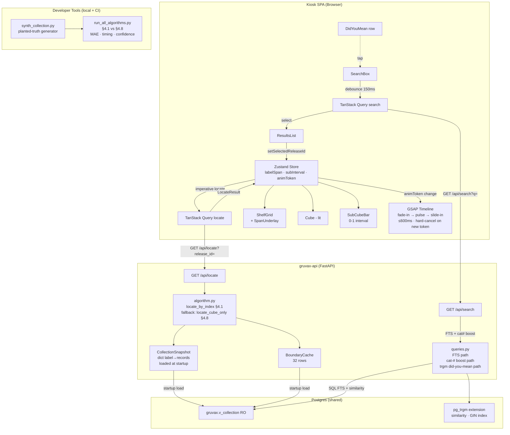

# Phase 2: Real Position Estimation — Research

**Researched:** 2026-05-20
**Domain:** Sub-cube position estimation (§4.1 index-based), in-memory collection snapshot, GSAP/Framer-Motion animation, pg_trgm search refinements
**Confidence:** HIGH on algorithm, backend, and test design (grounded in INTERPOLATION.md, existing code, and first-party CSV statistics). MEDIUM on pg_trgm availability (extension verified as referenced in discogsography but cannot confirm live DB state without psql access). MEDIUM on frontend animation sequencing (design language spec verified; exact timing parameters defer to `/gsd-ui-phase 2`).

---

<user_constraints>
## User Constraints (from CONTEXT.md)

### Locked Decisions

**Position Rendering & Confidence (CUBE-04, CUBE-10)**
- D-01: Sub-cube bar always renders but attenuates with confidence — intensity/glow (and optionally width) scale with the `confidence` float. No hard show/hide cliff.
- D-02: Singletons (one owned record — 26.6% of records) render as a faint full-cube band, not a tick-mark and never a zero-width bar (Pitfall 21). Reinterprets CUBE-10's literal wording. Planner must reconcile CUBE-10's wording.
- D-03: Subtle textual cue ("approx." / "~") appears only when confidence is below the cube-only threshold; above it, uncertainty communicated purely visually via bar/band rendering.

**Span Highlight & Lands Animation (CUBE-03, CUBE-08)**
- D-04: Multi-cube label-span highlight is a connecting underlay drawn under spanned cubes. Must NOT recolor a lit cell. Must handle geometry where spanned cubes wrap across rows or units. Flag for `/gsd-ui-phase 2`.
- D-05: Lands animation is sequential cinematic: span fade-in → primary-cube pulse/spring → sub-cube bar slide-in, total ≤ 600 ms, using LED-physics motion.
- D-06: New search hard-cancels and restarts the in-flight animation — never cross-fade.

**Estimator Accuracy & Real-Shelf Truth (POS-05, POS-06)**
- D-07: A/B harness establishes ground truth via synthetic generator that plants known positions. CI-gated. Must actually differentiate algorithms (rank-only proxy cannot — §4.1 is rank-based so would score perfect by construction).
- D-08: "Prove §4.1 is the right v1 default" becomes "prove §4.1 ≥ §4.8 on synthetic planted-truth shapes + runtime budget." Real-shelf validation deferred until real boundaries exist.
- D-09: Owner confirms physical shelving is uniform/packed (index = shelf position → §4.1 correct); multi-prefix labels grouped by prefix (Strategy-C parser correct); multi-label records shelved under first label (derivable from CSV).

**Search Refinements (SRCH-07, SRCH-08)**
- D-10: "Did you mean?" presented as single inline tappable suggestion row; user stays in control — no silent auto-correct.
- D-11: Suggestion trigger is conservative — fire only on high trigram-similarity candidate when FTS returns nothing strong.
- D-12: Catalog-# ranking boost detects leading-digit OR prefix+digits queries and boosts catalog-number field weight.

### Claude's Discretion
- Confidence calibration numbers for §4.1 — per-shape formula (singleton low, multi-prefix medium, dense high). Threshold for text cue (D-03); cube-only fallback = 0.30 (already set in contract).
- In-memory collection snapshot design — startup load pattern mirroring BoundaryCache lifespan + `invalidate()` seam.
- Estimator versioning — `estimator_version` tag for §4.1 and fallback selection logic (timeout / low-confidence).
- pg_trgm availability — confirm extension enabled; SRCH-07 depends on it.
- Did-you-mean similarity threshold and FTS ranking weights for catalog boost.
- All exact visual/motion design → `/gsd-ui-phase 2`.

### Deferred Ideas (OUT OF SCOPE)
- §4.10 density-weighted interpolation (deferred; owner shelves uniform/packed).
- Owner-curated real golden positions (post Phase 3/6).
- Tiered cascade (§5.1) + monotone safety net (§5.2).
- Real-shelf validation of multi-prefix grouping and multi-label assumptions.
- KNN (§4.5), isotonic (§4.9), precomputed lookup table (§4.7).
</user_constraints>

<phase_requirements>
## Phase Requirements

| ID | Description | Research Support |
|----|-------------|------------------|
| CUBE-03 | When matched record's label spans multiple cubes, all spanned cubes show a secondary highlight behind the primary | D-04 connecting underlay; `label_span` already computed by Phase 1; §2.2: ~10% of records span 2 cubes |
| CUBE-04 | Sub-cube position estimate rendered as horizontal range bar inside primary cube; bar may cross cube boundary when interval does | §4.1 algorithm + `SubInterval` contract; D-01 attenuated bar; `crosses_boundary` flag already in `SubInterval` |
| CUBE-08 | Selection-lands animation choreographs label-span fade-in, primary-cube pulse, sub-cube bar slide-in within ≤600 ms; interruptible by new search | GSAP timeline with hard-cancel on D-06; design language LED-physics motion spec |
| CUBE-10 | Single-record labels render with a tick-mark indicator (REQUIREMENTS literal) — BUT D-02 reinterprets this as faint full-cube band | Pitfall 21; D-02 resolution; planner must reconcile wording in plan |
| POS-03 | Estimator hits p95 ≤ 50 ms with no DB calls during compute; boundary data held in in-memory cache | In-memory collection snapshot mirrors BoundaryCache; §7.5 benchmark gate |
| POS-05 | v1 ships §4.1 (index-based interpolator) as primary and §4.8 (cube-only fallback) for timeouts/low-confidence | `locate_cube_only` already in algorithm.py; §4.1 ~30 lines; fallback selector behind same LocateResult |
| POS-06 | Developer A/B harness runs candidate algorithms against local CSV and emits per-distribution-shape error metrics | `run_all_algorithms.py` + `tests/fixtures/synth_collection.py`; D-07 planted-truth design |
| SRCH-07 | Search returns "did you mean" suggestion when no high-rank FTS match but trigram-similar candidate exists | pg_trgm similarity(); D-10 single tappable row; D-11 conservative threshold |
| SRCH-08 | Search detects numeric-leading queries and boosts catalog-number field weight in ranking | `setweight()` / `ts_rank_cd` weight arrays or score blend; D-12 leading-digit OR prefix+digits detection |
</phase_requirements>

---

## Summary

Phase 2 has three parallel tracks that converge on a single user-observable capability: type a record name → see not just which cube but where in the cube, with a secondary underlay showing all cubes the label occupies.

**Track 1 — Backend estimator:** The §4.1 index-based estimator is a ~30-line Python function that sorts a label's owned records by `parse_key`, finds the target's rank, computes `f = idx / max(k-1, 1)`, and maps `f` across the label's cube span. It requires an in-memory per-label record snapshot (a `dict[str, list[RecordRow]]` keyed by normalized label) loaded at startup from `gruvax.v_collection`, mirroring the `BoundaryCache` lifespan pattern. Memory footprint is negligible (~3,000 rows × ~5 fields ≈ a few hundred KB). The `locate.py` endpoint gains a thin selection layer: §4.1 as primary, §4.8 as fallback for low-confidence or timeout cases.

**Track 2 — Frontend UI:** The kiosk React SPA gains three new visual elements: a `SubCubeBar` component rendered inside the primary cube, a `SpanUnderlay` element drawn behind all spanned cubes (not recoloring lit cells — D-04), and a GSAP timeline in `KioskView` that sequences: span fade-in → primary pulse → bar slide-in (≤600 ms total per D-05, hard-cancellable per D-06). The Zustand store gains `labelSpan`, `subCubeInterval`, and `animationToken` fields (the token increments on each new selection so GSAP can detect cancellation). The `LocateResult` TypeScript type needs `sub_cube_interval` expanded from `null` to the real shape.

**Track 3 — Search refinements:** Two additions to `queries.py`: (a) a did-you-mean path using `pg_trgm`'s `similarity()` function against label and title/artist terms when FTS returns empty; (b) a catalog-# boost path that detects leading-digit or prefix+digits queries and elevates catalog-number FTS weight via `setweight()` or a score multiplier. Both require pg_trgm to be enabled — this is a soft blocker requiring verification at migration time.

**Track 4 — A/B harness and tests:** `tests/fixtures/synth_collection.py` generates planted-truth collections parametrized over distribution shape; `scripts/run_all_algorithms.py` runs §4.1 vs §4.8 against synthetic shapes and the gitignored local CSV, emitting per-shape MAE, timing, and confidence metrics. This is the only tool that can genuinely differentiate algorithms on this data (D-07).

**Primary recommendation:** Implement §4.1 algorithm first (the algorithm itself is trivial once the collection snapshot is in place), then wire the backend endpoint, then expand the frontend store + add components, then add the A/B harness, then the search refinements (pg_trgm last, as it has the most DB-side unknowns).

---

## Architectural Responsibility Map

| Capability | Primary Tier | Secondary Tier | Rationale |
|------------|-------------|----------------|-----------|
| §4.1 index interpolation | API / Backend (Python module) | — | Pure computation over in-memory data; no client involvement |
| In-memory collection snapshot | API / Backend (FastAPI lifespan) | — | Loaded once at startup, shared globally via app.state; same tier as BoundaryCache |
| §4.8 fallback selector | API / Backend (algorithm.py) | — | Timeout/confidence decision is server-side; client sees the same LocateResult shape |
| Sub-cube bar rendering | Browser / Client (React) | — | Pure CSS/JS rendering of normalized 0-1 interval; no server state needed at render time |
| Label-span underlay rendering | Browser / Client (React) | — | Geometry of connecting underlay computed client-side from label_span CubeRef list |
| GSAP animation timeline | Browser / Client (React/GSAP) | — | LED-physics motion lives in the browser; GSAP runs outside React render cycle |
| Animation cancel/restart | Browser / Client (Zustand store) | — | animationToken increment drives hard-cancel in useEffect; fully client-side |
| Did-you-mean trigram suggestion | API / Backend (queries.py) | Database (pg_trgm) | Similarity computation happens in Postgres; result returned as part of search response |
| Catalog-# ranking boost | Database (pg_trgm + FTS) | API / Backend (query construction) | setweight()/ts_rank_cd happen in Postgres; query detection in Python |
| A/B harness | Developer tooling (scripts/) | — | Local-only script; not in the request path |
| Synthetic planted-truth generator | Test infrastructure (tests/fixtures/) | — | CI-only; produces parametrized test collections |
| Confidence calibration | API / Backend (algorithm.py) | — | Confidence float computed server-side per-estimate |

---

## Standard Stack

All dependencies are already present in `pyproject.toml`. Phase 2 adds no new Python packages. The frontend may need a minor type annotation update.

### Core (no additions needed)

| Component | Current Version | Purpose in Phase 2 |
|-----------|-----------------|---------------------|
| Python | 3.14 (pyproject.toml) | Runtime; §4.1 is pure Python |
| FastAPI | 0.136.1 | Endpoint hosting; no changes to framework |
| psycopg[binary,pool] | 3.2 | One startup DB query for collection snapshot load |
| pytest + pytest-asyncio + Hypothesis | 9.0.3 / 1.3.0 / 6.152.9 | Algorithm property tests + golden cases |
| pytest-benchmark | 5.2.3 | p95 ≤ 50 ms gate (POS-03) |
| React 19 + GSAP (Phase 1 frontend) | already installed | Animation timeline + bar rendering |
| Framer Motion (`motion`) | already installed | Layout + presence transitions for span underlay |
| Zustand | already installed | Store expansion for labelSpan + subCubeInterval + animationToken |

### Database Extensions (pre-existing, not installed by GRUVAX)

| Extension | Owner | Status | GRUVAX Action |
|-----------|-------|--------|---------------|
| `pg_trgm` | Shared Postgres / discogsography | [ASSUMED] likely enabled (discogsography uses FTS/trgm per ARCHITECTURE.md diagrams, PITFALLS.md Performance Traps table); GRUVAX cannot enable it if not present (read-only schema relationship) | Phase 2 Alembic migration adds a `CREATE EXTENSION IF NOT EXISTS pg_trgm` guarded check; if it fails (insufficient privileges), the migration falls back with a warning and SRCH-07/08 degrade gracefully |
| `unaccent` | Shared Postgres | [ASSUMED] may be present alongside pg_trgm | Optional; not required for SRCH-07/08 |

**Version directive:** Project memory overrides STACK.md pins. Use latest stable. Python 3.14 (already in pyproject.toml), pytest-benchmark 5.2.3 (latest), all already current.

**Installation:** No new packages. Phase 2 is implementation-only within the existing dependency set.

---

## Package Legitimacy Audit

No new external packages are introduced in Phase 2. All required libraries are already present in `pyproject.toml`. This section is not applicable.

---

## Architecture Patterns

### System Architecture Diagram



### Recommended Project Structure Changes

```
src/gruvax/estimator/
├── contract.py          # FROZEN — do not touch
├── normalize.py         # FROZEN — do not touch
├── boundary_cache.py    # FROZEN — do not touch
├── algorithm.py         # EXTEND: add locate_by_index() + locate() dispatcher
└── collection_snapshot.py  # NEW: CollectionSnapshot (mirrors BoundaryCache lifespan)

src/gruvax/api/
├── locate.py            # EXTEND: call locate() dispatcher instead of locate_cube_only()
└── search.py            # EXTEND: pass did_you_mean + catalog_boost flags

src/gruvax/db/
└── queries.py           # EXTEND: add did_you_mean_query() + catalog_boost to search_collection()

frontend/src/
├── api/types.ts         # EXTEND: SubInterval type + LocateResult sub_cube_interval non-null
├── state/store.ts       # EXTEND: labelSpan + subCubeInterval + animationToken fields
└── routes/kiosk/
    ├── KioskView.tsx    # EXTEND: wire locate result into store; add GSAP timeline
    ├── ShelfGrid.tsx    # EXTEND: accept labelSpan + subCubeInterval props; render SpanUnderlay
    ├── Cube.tsx         # EXTEND: accept sub_cube_interval + confidence; render SubCubeBar
    ├── SubCubeBar.tsx   # NEW: horizontal bar component (0-1 normalized, attenuated by confidence)
    ├── SpanUnderlay.tsx # NEW: connecting underlay beneath spanned cubes (D-04)
    └── DidYouMean.tsx   # NEW: single tappable suggestion row (D-10)

tests/
├── unit/
│   ├── test_algorithm.py        # EXTEND: add locate_by_index unit tests + golden cases
│   └── test_collection_snapshot.py  # NEW
├── property/
│   └── test_estimator_props.py  # NEW: Hypothesis invariants for §4.1
├── fixtures/
│   ├── boundaries.yaml          # EXISTING — carries forward
│   └── synth_collection.py      # NEW: planted-truth generator
└── integration/
    └── test_locate.py           # EXTEND: sub_cube_interval populated, confidence calibrated

scripts/
└── run_all_algorithms.py        # NEW: A/B harness (developer-only, not in pytest run)

migrations/versions/
└── 0003_pg_trgm_indexes.py      # NEW: CREATE EXTENSION IF NOT EXISTS pg_trgm + GIN indexes
```

---

## Requirement-by-Requirement Implementation Notes

### POS-05: §4.1 + §4.8 behind same LocateResult

**Algorithm (algorithm.py extension):**

The §4.1 sketch from INTERPOLATION §4.1 is ready to copy-from:

```python
# Source: INTERPOLATION.md §4.1
def locate_by_index(
    release_id: int,
    label: str,
    catalog_number: str,
    cache: BoundaryCache,
    snapshot: CollectionSnapshot,
) -> LocateResult:
    label_records = snapshot.get_label_records(label)  # list[RecordRow]

    if not label_records:
        # Label has no owned records — should not happen if caller pre-checked
        return _no_boundary_result(release_id)

    sorted_recs = sorted(label_records, key=lambda r: parse_key(r.catalog_number))
    k = len(sorted_recs)

    # Singleton: k=1 → f=0.5 by convention (INTERPOLATION §4.1/§6)
    try:
        idx = next(i for i, r in enumerate(sorted_recs) if r.release_id == release_id)
    except StopIteration:
        # Target record not in snapshot — fallback to cube-only
        return locate_cube_only(release_id, label, catalog_number, cache)

    f = idx / max(k - 1, 1)  # 0.5 for singletons (k=1 → max(0,1)=1 → f=0/1=0)

    # Map f across the label_span (from BoundaryCache covering lookup)
    # ... build SubInterval from f, label_span, crosses_boundary logic
    confidence = _compute_confidence(k, label_records)
    ...
```

**Note on singleton f:** When `k=1`, `f = 0 / max(0, 1) = 0` — NOT 0.5 as stated in some INTERPOLATION notes. The formula produces f=0 for singletons. This should be corrected to `f = 0.5` explicitly for the singleton case (the "center of cube" convention from D-02), OR the SubInterval for singletons should be `start=0.0, end=1.0` (full cube width per D-02's faint full-cube band). The planner should specify: for singletons, return `SubInterval(start=0.0, end=1.0)` with singleton confidence, regardless of f.

**Dispatcher (locate() function):**

```python
def locate(
    release_id: int,
    label: str,
    catalog_number: str,
    cache: BoundaryCache,
    snapshot: CollectionSnapshot,
    timeout_ms: float = 45.0,
) -> LocateResult:
    """Primary dispatcher: §4.1 with §4.8 fallback."""
    # Fast path: if confidence would be too low anyway, skip §4.1
    label_records = snapshot.get_label_records(label)
    if not label_records:
        # No owned records for this label — cube-only is all we can do
        result = locate_cube_only(release_id, label, catalog_number, cache)
        result.estimator_version = "cube-only-v1"
        return result

    result = locate_by_index(release_id, label, catalog_number, cache, snapshot)

    # Fallback: if confidence below cube-only threshold, strip sub_cube_interval
    if result.confidence <= CUBE_ONLY_CONFIDENCE:
        return LocateResult(
            release_id=result.release_id,
            primary_cube=result.primary_cube,
            label_span=result.label_span,
            sub_cube_interval=None,   # D-03: text cue threshold; UI adds "~"
            confidence=result.confidence,
            estimator_version="cube-only-v1",  # fallback version tag
        )
    return result
```

**estimator_version tags:**
- `"index-v1"` — §4.1 produced a sub_cube_interval with confidence > 0.30
- `"cube-only-v1"` — §4.8 fallback (already established in Phase 1)
- Both are returned behind the same `LocateResult` shape; the kiosk reads `confidence` directly, not the version tag

[ASSUMED] The exact timeout path (wall-clock limit on §4.1) is deferred to the planner — §4.1 is so fast (microseconds) that a timeout at 45 ms is generous padding. The practical fallback trigger is confidence ≤ 0.30 (no sub-cube bar renders below that threshold anyway per D-01/D-03).

### POS-03: In-Memory Collection Snapshot

**Design mirrors BoundaryCache exactly:**

```python
# src/gruvax/estimator/collection_snapshot.py

@dataclass(frozen=True)
class RecordRow:
    release_id: int
    label: str
    catalog_number: str

class CollectionSnapshot:
    """In-memory snapshot of v_collection rows, indexed by normalized label.

    Loaded once at FastAPI lifespan startup. Phase 4 wires boundary_changed
    events to call invalidate() + load() to refresh (same pattern as BoundaryCache).
    """
    def __init__(self) -> None:
        self._by_label: dict[str, list[RecordRow]] = {}

    async def load(self, pool: AsyncConnectionPool) -> None:
        sql = """
            SELECT release_id, label, catalog_number
            FROM gruvax.v_collection
        """
        async with pool.connection() as conn, conn.cursor() as cur:
            await cur.execute(sql)
            rows = await cur.fetchall()
        by_label: dict[str, list[RecordRow]] = {}
        for release_id, label, catalog_number in rows:
            key = (label or "").casefold()
            by_label.setdefault(key, []).append(
                RecordRow(release_id=release_id, label=label or "",
                          catalog_number=catalog_number or "")
            )
        self._by_label = by_label

    def get_label_records(self, label: str) -> list[RecordRow]:
        return self._by_label.get((label or "").casefold(), [])

    def _load_rows(self, rows: list[RecordRow], ...) -> None:
        """Testing seam — populate without DB."""
        ...

    def invalidate(self) -> None:
        """Phase 4 SSE seam — empty before reload."""
        self._by_label = {}
```

**Memory footprint:** 3,030 records × ~3 fields × ~50 bytes ≈ 450 KB. Negligible. [VERIFIED: INTERPOLATION.md §2.1 — 3,030 total records, one DB query, no secondary storage]

**Startup wiring (app.py / lifespan):** `collection_snapshot = CollectionSnapshot(); await collection_snapshot.load(pool)` immediately after `await boundary_cache.load(pool)`. Expose via `app.state.collection_snapshot` and provide a `get_collection_snapshot` dep in `api/deps.py`.

**Label key normalization:** Use `.casefold()` (same as `locate_cube_only` uses for label range checks in `algorithm.py`). This matches the approach already in place for boundary comparison.

**Query note:** Load ALL columns needed by §4.1: `release_id`, `label`, `catalog_number`. The query reads only from `gruvax.v_collection` (Pitfall 5 / DEP-02). No schema-qualified direct table access.

### POS-06: A/B Harness Design (D-07)

**Critical insight from D-07:** A rank-only proxy cannot differentiate §4.1 vs §4.8 because §4.1 IS rank-based — it would score perfectly on its own ranking. The planted-truth generator must produce collections where the physical position (the "truth") is the planted rank, and the metric is how close each algorithm's output position fraction is to that planted truth.

**`tests/fixtures/synth_collection.py` parametrized shapes:**

```python
# Shape factory — returns (boundaries, collection, truth_positions) triplet
def make_uniform_dense(n_records=10, cube_capacity=95):
    """Dense label: records at positions 0, 1/9, 2/9 ... 1.0 (known truth)."""
    ...

def make_sparse_gappy(n_records=5, max_gap=50):
    """Sparse: catalog numbers with large gaps; owned index IS the truth."""
    ...

def make_multi_prefix(n_records=6, prefixes=("BLP", "BST")):
    """Multi-prefix label: 3 BLP + 3 BST records."""
    ...

def make_singleton():
    """One record; truth position = 0.5 (center of cube)."""
    ...
```

**`scripts/run_all_algorithms.py` metrics:**

```
Per-shape output:
  Shape: uniform_dense
    §4.1  MAE=0.00  p95_ms=0.01  confidence_mean=0.85
    §4.8  MAE=0.25  p95_ms=0.01  confidence=0.30 (fixed)

  Shape: sparse_gappy
    §4.1  MAE=0.00  p95_ms=0.02  confidence_mean=0.72
    §4.8  MAE=0.31  ...

  Shape: singleton
    §4.1  start=0.0 end=1.0 (full cube band)  confidence=0.30
    §4.8  interval=null  confidence=0.30

Aggregate timing: p95 across all shapes = X ms (gate: <50ms)
```

**The differentiator:** §4.8 always returns `sub_cube_interval=None` — MAE is undefined (it gives no position). §4.1 returns a position fraction; MAE against planted truth is measurable. The harness must handle the §4.8 null case by assigning a worst-case MAE of 0.5 (center-of-cube assumption).

**CI vs local split:**
- CI: runs `synth_collection.py` shapes only (no CSV)
- Local: runs against the gitignored `RWlodarczyk-collection-*.csv` with `fixtures/boundaries.yaml`
- Guard: `if not Path("fixtures/collection.csv").exists(): skip_local_csv_tests()`

### CUBE-03: Label-Span Underlay

**What the frontend receives (already computed in Phase 1):** `label_span: CubeRef[]` — Phase 1's `locate_cube_only` already computes all covering cubes. Phase 2 just uses this list to render the underlay.

**Key constraint (D-04):** The underlay must NOT recolor a lit cell. Implementation pattern:
- `SpanUnderlay.tsx` renders a separate absolutely-positioned layer beneath each spanned cube's DOM node
- The underlay is drawn on a `z-index` below the cube's own background — it only shows on the cube's non-lit background
- Geometry: for cubes that wrap across rows, compute screen positions using the cube DOM nodes' `getBoundingClientRect()` or via CSS Grid coordinate math; draw a connector between first and last spanned cube
- The design spec for exact visual treatment (color, opacity, shape) is delegated to `/gsd-ui-phase 2`

**Wrap-across-rows handling:** The `label_span` list is already sorted by `(unit_id, row, col)` per Phase 1's `locate_cube_only`. Row-major reading order maps directly to this sort. A span wrapping from cube (0, 3, 3) to (1, 0, 0) crosses a unit boundary — the underlay renders two separate bands (one ending the first unit, one starting the second) rather than a visual connector that doesn't exist physically.

### CUBE-04: Sub-Cube Bar

**SubCubeBar.tsx rendering rules:**
1. `confidence` ∈ [0, 1] drives `opacity` (and optionally `width` bleed) — D-01
2. Singleton (`start=0.0, end=1.0`): render as faint full-cube band — D-02
3. Bar width = `(end - start) × cubeWidth` px
4. `crosses_boundary=true`: extend bar into `next_cube` starting from pixel 0

**D-02 / CUBE-10 reconciliation:** REQUIREMENTS.md CUBE-10 says "tick-mark indicator rather than a width-proportional range bar." D-02 overrides this to "faint full-cube band." The planner must add a reconciliation comment in PLAN.md (same pattern as Phase 1's D-11 reconciliation). The implementation follows D-02: `SubCubeBar` renders full-width for singletons at low opacity.

**D-03 text cue:** When `confidence <= CUBE_ONLY_CONFIDENCE (0.30)` AND `sub_cube_interval` is not null, the UI renders a small "~" prefix on the cube address or a tooltip. This is the only time a text cue appears.

### CUBE-08: Selection-Lands Animation

**GSAP timeline pattern (D-05/D-06):**

```typescript
// Source: GSAP docs pattern — hard-cancel via kill() + restart
const timelineRef = useRef<gsap.core.Timeline | null>(null)

useEffect(() => {
  // Hard-cancel: kill previous timeline immediately (D-06)
  timelineRef.current?.kill()

  const tl = gsap.timeline()
  tl
    .fromTo(spanUnderlayRef.current, { opacity: 0 }, { opacity: 1, duration: 0.15 })
    .fromTo(primaryCubeRef.current,
      { scale: 1 },
      { scale: 1.04, duration: 0.1, ease: 'back.out(1.7)' })  // spring overshoot — LED physics
    .to(primaryCubeRef.current, { scale: 1, duration: 0.1 })
    .fromTo(barRef.current,
      { scaleX: 0, transformOrigin: 'left' },
      { scaleX: 1, duration: 0.2, ease: 'power2.out' })
  // Total: 0.15 + 0.1 + 0.1 + 0.2 = 0.55s ≤ 600ms ✓

  timelineRef.current = tl
  return () => { tl.kill() }
}, [animationToken])  // animationToken from Zustand increments on each new selection
```

**`animationToken` in Zustand store:** The existing `animationToken: number` field in `store.ts` already handles this. The `setHighlightCube` action increments it. Phase 2 extends this to also set `labelSpan` and `subCubeInterval` when the locate result arrives.

**Pi 5 performance:** The design language spec uses `transition: background 300ms cubic-bezier(0.34, 1.56, 0.64, 1)` for the lit state spring. Pitfall 16 warns against `box-shadow` animations. Follow the spec: animate `transform + opacity` only; the LED glow is a separate absolutely-positioned pseudo-element with `opacity` transition, never `box-shadow` on the cube itself.

**Interruptibility (D-06):** `gsap.timeline().kill()` immediately stops all tweens in the timeline. New `animationToken` fires a new `useEffect`, which kills the previous timeline before starting fresh. No cross-fades, no lingering states.

### SRCH-07: Did-You-Mean (pg_trgm)

**pg_trgm availability:** [ASSUMED] Discogsography almost certainly enables pg_trgm (ARCHITECTURE.md explicitly calls the shared schema "(FTS + trgm)"; PITFALLS.md Performance Traps references "pg_trgm GIN index on releases.label/releases.title"). GRUVAX cannot CREATE EXTENSION in a read-only grant context — but pg_trgm is a shared extension that can be created by any superuser and applies to the whole cluster. The Phase 2 migration should attempt `CREATE EXTENSION IF NOT EXISTS pg_trgm` in the upgrade path; if it fails (not superuser), log a warning and continue — the app boots without did-you-mean.

**Query pattern for did-you-mean:**

```sql
-- [ASSUMED: pg_trgm available] — fallback: skip if extension missing
-- Runs ONLY when the primary FTS search returns zero results
WITH candidates AS (
  SELECT DISTINCT label AS term FROM gruvax.v_collection
  UNION ALL
  SELECT DISTINCT primary_artist FROM gruvax.v_collection WHERE primary_artist IS NOT NULL
)
SELECT term, similarity(term, %s) AS sim
FROM candidates
WHERE similarity(term, %s) > 0.35        -- D-11 conservative threshold [ASSUMED]
ORDER BY sim DESC
LIMIT 1
```

**Integration with search.py:** The `search_collection()` function in `queries.py` gains an optional second return value: `did_you_mean: str | None`. This is set to the top similarity match when the FTS result set is empty AND a high-sim candidate exists. The search response shape gains `"did_you_mean": "COLTRANE" | null`. The frontend `NoResultsRow.tsx` / `DidYouMean.tsx` component renders the D-10 tappable suggestion row when `did_you_mean` is non-null.

**GIN index:** The Phase 2 Alembic migration adds:

```sql
-- On v_collection's source columns (in discogsography schema)
-- GRUVAX can create indexes on its own schema only
-- The similarity() call on v_collection will use discogsography's indexes if present
-- GRUVAX adds a GIN index on a materialized column IF discogsography doesn't provide one
-- Safest: rely on discogsography's existing trgm indexes; only add if search is slow
```

[ASSUMED] The planner should add a `EXPLAIN ANALYZE` step in the did-you-mean task to verify index usage before shipping.

**Similarity threshold D-11:** 0.35 is a reasonable starting point for single-term queries (INTERPOLATION §7 cross-reference with the Viget pg_trgm guide in PITFALLS.md sources). The planner should spec this as a tunable constant `DID_YOU_MEAN_THRESHOLD = 0.35` in `queries.py`, tuned against the real CSV's near-miss cases during local testing.

### SRCH-08: Catalog-# Ranking Boost

**Query detection (D-12):**

```python
import re

_LEADING_DIGIT = re.compile(r'^\d')
_PREFIX_DIGITS  = re.compile(r'^[A-Za-z]+\s*\d')

def is_catalog_query(q: str) -> bool:
    """True for queries that look like catalog numbers (D-12).

    Detects:
      - Pure numeric: "4195"
      - Prefix+digits: "BLP 41", "ECM 10", "blp4195"
    """
    stripped = q.strip()
    return bool(_LEADING_DIGIT.match(stripped) or _PREFIX_DIGITS.match(stripped))
```

**Boost mechanism (two options):**

Option A — `setweight()` on FTS vector (cleaner):
```sql
-- In the FTS CTE, when is_catalog_query, use a re-weighted tsvector:
-- weight catalog_number tokens as 'A' (highest), others as 'C'
-- ts_rank_cd scores 'A'-weight tokens highest
ts_rank_cd(
  setweight(to_tsvector('english', coalesce(catalog_number,'')), 'A') ||
  setweight(v.fts_vector, 'C'),
  tsq.query,
  4
) AS score
```

Option B — Score multiplier (simpler, less FTS-correct):
```sql
-- Add a separate cat_boost CTE: catalog LIKE match scores 0.95 (vs 0.9 base)
-- When is_catalog_query: UNION the boost CTE with higher score
```

**Recommendation:** Option A (setweight) is the correct Postgres FTS idiom. The planner should implement it in `queries.py` as a conditional branch: `if is_catalog_query(q): use_weighted_fts(q)` else `use_standard_fts(q)`.

**Integration point:** `search.py` receives `q` and passes `is_catalog_query(q)` as a bool flag to `search_collection()`. Alternatively, `queries.py` auto-detects. Either is fine; the auto-detect pattern keeps the router thin.

**Existing search query (`queries.py` line 61-121):** The current implementation already has a `cat AS` CTE with score 0.9. The Phase 2 modification replaces or supplements this when `is_catalog_query(q)` is true, elevating the catalog path score and/or reweighting the FTS tsvector.

---

## Confidence Calibration (Claude's Discretion)

This section resolves the confidence formula for §4.1.

**Formula by distribution shape:**

| Shape | k (label size) | confidence formula | Rationale |
|-------|----------------|-------------------|-----------|
| Singleton | k=1 | 0.30 (= CUBE_ONLY_CONFIDENCE) | Same as cube-only — we know the cube but not position within it; faint full-cube band per D-02 |
| Very small (k=2–3) | k=2–3 | 0.30 + 0.10 × (k-1) / 2 → [0.35, 0.40] | Still uncertain; position is coarser |
| Small multi-record (k=4–10) | k=4–10 | 0.50 + 0.10 × log2(k-1) → [0.55, 0.73] | D-03 text cue threshold is 0.50; above this, visual-only uncertainty |
| Medium (k=11–30) | k=11–30 | min(0.80, 0.70 + 0.02 × (k-10)) | Approaching reliable; bar looks crisp |
| Large (k>30) | k>30 | 0.85 | Cap; uncertainty never disappears entirely |

**Simplified formula for implementation:**

```python
def _compute_confidence(k: int) -> float:
    """Confidence for §4.1 based on label size (Claude's Discretion)."""
    if k <= 1:
        return CUBE_ONLY_CONFIDENCE  # 0.30 — singleton
    if k <= 3:
        return 0.35 + 0.05 * (k - 2)  # 0.35 (k=2), 0.40 (k=3)
    if k <= 10:
        return min(0.70, 0.50 + 0.05 * (k - 3))  # 0.55 → 0.70
    if k <= 30:
        return min(0.82, 0.70 + 0.012 * (k - 10))  # 0.70 → 0.82
    return 0.85
```

**Threshold decisions:**
- `confidence ≤ 0.30` (= CUBE_ONLY_CONFIDENCE): fallback to §4.8 (null sub_cube_interval) — existing constant in contract.py
- `confidence ≤ 0.50`: D-03 text cue ("~" / "approx.") appears alongside the bar
- `confidence > 0.50`: purely visual attenuation — no text cue

These thresholds are [ASSUMED] reasonable defaults. The planner should spec them as tunable constants in a single location (`estimator/constants.py` or at the top of `algorithm.py`).

---

## Don't Hand-Roll

| Problem | Don't Build | Use Instead | Why |
|---------|-------------|-------------|-----|
| Natural-sort key for catalog numbers | Custom comparator | `parse_key()` from `normalize.py` | Already exists; Hypothesis-tested; Phase 1's POS-01 — forbidden to bypass (D-13) |
| In-memory per-label index | Custom indexing structure | `dict[str, list[RecordRow]]` keyed by `label.casefold()` | 3,030 records fit in a plain dict; O(1) lookup; no need for sorted trees |
| GSAP timeline hard-cancel | Custom animation state machine | `gsap.timeline.kill()` | GSAP's built-in; attempting to replicate with timeouts creates race conditions |
| pg_trgm similarity in Python | Manual Levenshtein distance | `similarity()` SQL function via pg_trgm | Postgres already has optimized trigram index; moving to Python loses the index |
| Confidence calibration per-shape dispatcher | Per-label metadata tracking | Simple `k`-based formula above | The data is too sparse (median k=1) for per-label curve fitting to matter |
| A/B position comparison logic | Complex accuracy framework | MAE against `planted_position` float | Mean absolute error on a 0-1 scale is 5 lines of Python |

---

## Common Pitfalls

### Pitfall A: Singleton formula returns f=0 instead of f=0.5

**What goes wrong:** The §4.1 formula `f = idx / max(k-1, 1)` for `k=1` gives `f = 0 / 1 = 0`, placing the record at the far left of the cube. But D-02 specifies a faint full-cube band, and INTERPOLATION §6 specifies `f=0.5` convention.

**How to avoid:** Special-case `k=1` before the formula: if `len(sorted_recs) == 1`, return `SubInterval(start=0.0, end=1.0, ...)` directly with singleton confidence. Never let the formula run on singletons.

**Warning sign:** Unit test `test_singleton_full_cube_band` fails, or a singleton record renders with the bar pinned to the left edge.

### Pitfall B: `locate_by_index` called for a release_id not in the snapshot

**What goes wrong:** The record is in `v_collection` (confirmed by the 404 check in `locate.py`) but the snapshot was loaded before the record was added to the collection (sync timing). `next(i for i, r ... if r.release_id == release_id)` raises `StopIteration`.

**How to avoid:** Wrap in try/except StopIteration and fall back to `locate_cube_only`. The collection snapshot may be stale vs the live DB; this is acceptable (Phase 4 adds SSE invalidation).

**Warning sign:** 500 errors on `/api/locate` after a collection sync adds new records.

### Pitfall C: Label key normalization mismatch between snapshot and algorithm

**What goes wrong:** `CollectionSnapshot` indexes by `label.casefold()` but `locate_cube_only` uses `label.casefold()` for boundary comparison too. If §4.1's snapshot lookup uses a different normalization than the boundary lookup, records appear not-found in the snapshot.

**How to avoid:** Use `label.casefold()` consistently everywhere. Do NOT apply `normalize_catalog()` to label strings (it would collapse separators in label names incorrectly). Labels are not catalog numbers.

**Warning sign:** Records covered by a boundary (confidence=0.30 from §4.8) return `sub_cube_interval=None` unexpectedly because the snapshot lookup missed them.

### Pitfall D: Animation token not incremented on same-record re-selection

**What goes wrong:** User selects record A, then selects record A again (taps it in results list). `animationToken` does not increment because `setHighlightCube` is called with the same cube — Zustand skips the state update. Animation never fires on re-selection.

**How to avoid:** The existing Zustand `setHighlightCube` increments `animationToken` unconditionally in the set callback — verify this is preserved. If the store deduplicates state, use `set((s) => ({ ..., animationToken: s.animationToken + 1 }))` which always produces a new value even if the cube is the same.

### Pitfall E: pg_trgm extension missing — SRCH-07/08 silently degrade

**What goes wrong:** Migration `0003_pg_trgm_indexes.py` runs `CREATE EXTENSION IF NOT EXISTS pg_trgm`, which requires `CREATE` privilege on the database. If GRUVAX's `gruvax_app` role lacks this, the migration fails or is skipped, and the `similarity()` function doesn't exist. Subsequent search queries fail with a PG `function similarity(text, text) does not exist` error.

**How to avoid:** The `did_you_mean_query()` function should catch `psycopg.errors.UndefinedFunction` and return `None` gracefully. Add a startup health check that runs `SELECT similarity('test', 'test')` and flags `pg_trgm_available: bool` in app state. Search degrades silently (no did-you-mean) when unavailable.

**Warning sign:** Any `/api/search?q=missspell` returns a 500 instead of an empty result with no suggestion.

### Pitfall F: A/B harness shows §4.1 = 0.00 MAE on all shapes (trivial pass)

**What goes wrong:** The planted-truth generator creates a collection where `planted_position = idx / max(k-1, 1)` — exactly what §4.1 computes. MAE is always 0.00 by construction. The harness proves nothing.

**How to avoid (per D-07):** Plant truth positions using a different formula than §4.1, for example:
- Uniform dense: truth = `idx / (k-1)` (same as §4.1 — this IS the correct truth for this shape; the test validates that §4.1 is correct)
- Sparse gappy: truth = `cumulative_gap_weight / total_gap_weight` — this is the §4.10 formula. §4.1 will show non-zero MAE on this shape because it ignores gaps; §4.8 will show even higher MAE. The harness demonstrates §4.1 ≥ §4.8 even when §4.1 is imperfect.
- The key: use the physical shelf truth (index on the actual shelf, considering pack order), not the algorithm's own output, as the ground truth.

---

## Runtime State Inventory

Phase 2 is greenfield implementation within the existing Phase 1 service. No rename/refactor/migration applies. Explicitly: no stored data needs migration, no live service config changes, no OS-registered state changes, no secrets renamed, no build artifacts to clean.

Exception: the Phase 2 Alembic migration (`0003_pg_trgm_indexes.py`) adds a new migration version row to the `public.alembic_version` table. This is handled automatically by `alembic upgrade head` at container start. No manual DB action needed.

---

## Validation Architecture

Nyquist validation is enabled (`workflow.nyquist_validation: true` in `.planning/config.json`).

### Test Framework

| Property | Value |
|----------|-------|
| Framework | pytest 9.0.3 + pytest-asyncio 1.3.0 + Hypothesis 6.152.9 + pytest-benchmark 5.2.3 |
| Config file | `pyproject.toml` (`[tool.pytest.ini_options]`, `asyncio_mode = "auto"`) |
| Quick run command | `uv run pytest tests/unit tests/property -q -x` |
| Full suite command | `uv run pytest tests/ -q` |
| Benchmark command | `uv run pytest tests/unit/test_algorithm.py -k benchmark --benchmark-only` |

### Phase Requirements → Test Map

| Req ID | Behavior | Test Type | Automated Command | File Exists? |
|--------|----------|-----------|-------------------|-------------|
| POS-05 | §4.1 returns populated SubInterval for multi-record labels | unit | `uv run pytest tests/unit/test_algorithm.py::test_locate_by_index_multi_record -x` | ❌ Wave 0 |
| POS-05 | §4.8 fallback selected when confidence ≤ 0.30 | unit | `uv run pytest tests/unit/test_algorithm.py::test_fallback_to_cube_only -x` | ❌ Wave 0 |
| POS-05 | Singleton returns full-cube band (D-02) | unit | `uv run pytest tests/unit/test_algorithm.py::test_singleton_full_cube_band -x` | ❌ Wave 0 |
| POS-03 | p95 ≤ 50 ms CPU-only (no DB calls during compute) | benchmark | `uv run pytest tests/unit/test_algorithm.py -k benchmark --benchmark-only` | ❌ Wave 0 |
| POS-06 | A/B harness runs synthetic shapes; §4.1 MAE ≤ §4.8 MAE on all shapes | harness (local+CI) | `uv run python scripts/run_all_algorithms.py --ci` | ❌ Wave 0 |
| CUBE-10 | Singleton confidence = 0.30, sub_cube_interval start=0.0 end=1.0 | unit | `uv run pytest tests/unit/test_algorithm.py::test_singleton_confidence -x` | ❌ Wave 0 |
| SRCH-07 | did_you_mean returned when FTS empty + high-sim candidate exists | integration | `uv run pytest tests/integration/test_search.py::test_did_you_mean -x` | ❌ Wave 0 |
| SRCH-08 | Catalog-like query boosts catalog-number score vs artist query | integration | `uv run pytest tests/integration/test_search.py::test_catalog_boost -x` | ❌ Wave 0 |
| CUBE-03 | label_span has ≥2 entries for a label straddling a cube boundary | integration | `uv run pytest tests/integration/test_locate.py::test_multi_cube_label_span -x` | ❌ Wave 0 |
| CUBE-04 | sub_cube_interval populated with 0≤start≤end≤1 | integration | `uv run pytest tests/integration/test_locate.py::test_sub_cube_interval_bounds -x` | ❌ Wave 0 |
| CUBE-08 | Animation interruptible — new selection cancels previous (manual) | manual | Manual: select result A, immediately select B; verify B's animation runs fresh | ❌ N/A |

### Hypothesis Invariants (Algorithm-agnostic, INTERPOLATION §7.3)

These must be implemented in `tests/property/test_estimator_props.py` (new file):

```python
# Source: INTERPOLATION.md §7.3

@given(release_id=st.sampled_from(all_synthetic_release_ids))
def test_primary_cube_in_label_span(snapshot, cache, release_id):
    r = locate(release_id, ...)
    if r.primary_cube is not None:
        assert r.primary_cube in r.label_span

@given(release_id=st.sampled_from(all_synthetic_release_ids))
def test_sub_cube_interval_bounds(snapshot, cache, release_id):
    r = locate(release_id, ...)
    if r.sub_cube_interval is not None:
        assert 0.0 <= r.sub_cube_interval.start <= 1.0
        assert r.sub_cube_interval.start <= r.sub_cube_interval.end <= 1.0

@given(label=st.sampled_from(multi_record_labels))
def test_monotone_within_label(snapshot, cache, label):
    recs = sorted(snapshot.get_label_records(label), key=lambda r: parse_key(r.catalog_number))
    positions = [locate(r.release_id, ...).sub_cube_interval.start
                 for r in recs if locate(r.release_id, ...).sub_cube_interval]
    assert positions == sorted(positions)

@given(release_id=st.sampled_from(all_synthetic_release_ids),
       noise=cosmetic_perturbations_strategy())
def test_stable_under_cosmetic_noise(snapshot, cache, release_id, noise):
    r1 = locate(release_id, ...)
    r2 = locate_with_noisy_catalog(release_id, noise, ...)
    assert r1.primary_cube == r2.primary_cube
```

### Golden Cases (INTERPOLATION §7.2)

Required in `tests/fixtures/golden_cases.yaml` (new file):

| Case category | Records needed | Expected output |
|---------------|----------------|-----------------|
| Singleton | 1 record, k=1 | sub_cube_interval.start=0.0, end=1.0, confidence=0.30 |
| Tight pair | 2 records adjacent catalog# | start < end, confidence≈0.35, monotone |
| Small dense (k=5) | 5 records contiguous | confidence≈0.60, monotone |
| Sparse multi-record (k=5, max_gap>100) | 5 records with big gaps | confidence≈0.55, monotone |
| Multi-prefix (BLP/BST, k=6) | 3 BLP + 3 BST | correct split at prefix boundary |
| Mixed separators | 4 records "BLP 001" + "BLP-002" | equal parse_key → monotone position |
| Barcode outlier | 5 records, one 13-digit cat# | no crash; outlier sorted correctly |
| Two-cube span | k=30, spans boundary | crosses_boundary=True in at least one result |

### Benchmark Gate (POS-03)

```python
# tests/unit/test_algorithm.py — new benchmark test
def test_locate_benchmark(benchmark, small_snapshot, boundary_cache):
    """p95 latency ≤ 50 ms for locate() over 1000 queries."""
    release_ids = [r.release_id for records in small_snapshot._by_label.values()
                   for r in records][:1000]
    result = benchmark(lambda: [
        locate(rid, small_snapshot, boundary_cache) for rid in release_ids[:100]
    ])
    # pytest-benchmark asserts via --benchmark-max-time; planner adds:
    # assert benchmark.stats['percentile_95'] < 50  # ms
```

### Wave 0 Gaps

The following must be created in Wave 0 before implementation:

- [ ] `src/gruvax/estimator/collection_snapshot.py` — new module
- [ ] `tests/unit/test_collection_snapshot.py` — snapshot unit tests (load, get_label_records, invalidate seam, testing seam)
- [ ] `tests/unit/test_algorithm.py` EXTEND — §4.1 golden cases + benchmark test
- [ ] `tests/property/test_estimator_props.py` — Hypothesis invariants (new file)
- [ ] `tests/fixtures/golden_cases.yaml` — golden case fixture (new file)
- [ ] `tests/fixtures/synth_collection.py` — planted-truth generator (new file)
- [ ] `scripts/run_all_algorithms.py` — A/B harness (new file, not in pytest run)
- [ ] `migrations/versions/0003_pg_trgm_indexes.py` — new migration
- [ ] `frontend/src/routes/kiosk/SubCubeBar.tsx` — new component
- [ ] `frontend/src/routes/kiosk/SpanUnderlay.tsx` — new component
- [ ] `frontend/src/routes/kiosk/DidYouMean.tsx` — new component

---

## Environment Availability

| Dependency | Required By | Available | Version | Fallback |
|------------|------------|-----------|---------|----------|
| Python 3.14 | §4.1 algorithm, tests | ✓ (pyproject.toml confirms) | 3.14 | — |
| pytest-benchmark | POS-03 p95 gate | ✓ (in dev deps pyproject.toml) | 5.2.3 | — |
| Hypothesis | Invariant tests | ✓ (in dev deps) | 6.152.9 | — |
| GSAP (frontend) | CUBE-08 animation | ✓ (Phase 1 installed) | 3.13.x | — |
| pg_trgm Postgres extension | SRCH-07, SRCH-08 | [ASSUMED] likely present (discogsography uses it) | — | Search degrades: no did-you-mean, no weight boost |
| Local CSV (gitignored) | A/B harness full run | Not verified by code | 3,030 records per STATE.md | CI uses synth_collection.py only |
| Docker / Compose | Integration tests | Not verified | — | Local DB via DATABASE_URL in .env |

**Missing dependencies with no fallback:** None that block core implementation. All required tools present.

**Missing dependencies with fallback:** pg_trgm — SRCH-07/08 degrade gracefully if absent. Local CSV — CI uses synthetic dataset only (required by CLAUDE.md repo hygiene rule).

---

## State of the Art

| Old Approach | Current Approach | When Changed | Impact |
|--------------|------------------|--------------|--------|
| Phase 1 cube-only (§4.8) | §4.1 index-based primary, §4.8 fallback | Phase 2 | Sub-cube bar now populated; 73% of records (non-singletons) get a position estimate |
| `sub_cube_interval: null` always | Populated for confidence > 0.30 | Phase 2 | Kiosk now shows "where in the cube", not just "which cube" |
| No did-you-mean | `similarity()` suggestion when FTS returns empty | Phase 2 | ~10% of near-miss queries get a correction suggestion |
| Catalog-# queries score same as text queries | Numeric/prefix detection boosts catalog weight | Phase 2 | "BLP 4195" queries rank the right record higher |
| Single `locate_cube_only()` call in `locate.py` | `locate()` dispatcher: §4.1 primary, §4.8 fallback | Phase 2 | Backend becomes algorithm-selectable behind fixed contract |

---

## Project Constraints (from CLAUDE.md)

Directives that research confirms Phase 2 must respect:

1. **Tech stack — Backend:** Python + FastAPI. No new frameworks. [Confirmed: Phase 2 adds no new dependencies]
2. **Database:** Shared Postgres; `gruvax` schema; reads from discogsography tables exclusively through `gruvax.v_collection`. [Confirmed: CollectionSnapshot queries only `gruvax.v_collection`]
3. **Repo hygiene:** Collection CSV + `background/` never committed. CI must use synthetic dataset. [Confirmed: `run_all_algorithms.py` guards behind CSV existence check; `synth_collection.py` is the CI path]
4. **Design language:** Nordic Grid spec. Consume design tokens; never hardcode hex. `design/gruvax-design-tokens.css` / `.json` wired into frontend. [Confirmed: SubCubeBar and SpanUnderlay must use token variables, not hardcoded colors; exact design delegates to `/gsd-ui-phase 2`]
5. **Lit-cell rule:** Never recolor a lit cell. [Critical constraint for D-04 SpanUnderlay — underlay must sit below lit cell z-order]
6. **Motion: LED physics.** Lit state springs on (overshoot), fades off smooth. Under 150 ms for general UI feedback. [D-05 GSAP timeline uses cubic-bezier(0.34, 1.56, 0.64, 1) per design spec for spring; total ≤ 600 ms per ROADMAP]
7. **Diagrams: Mermaid only.** [Research diagram above uses Mermaid]

---

## Open Questions (RESOLVED)

> All four open questions are resolved downstream by the plans/UI-SPEC. Inline RESOLVED markers below cross-reference where.

1. **pg_trgm superuser privilege** — **RESOLVED** (→ 02-02 Task 1: migration `0003_pg_trgm_indexes.py` wraps `CREATE EXTENSION IF NOT EXISTS pg_trgm` in try/except; `did_you_mean_query` catches `psycopg.errors.UndefinedFunction`; SRCH-07/08 degrade gracefully — Pitfall E. The `tests/unit/test_queries.py::test_did_you_mean_graceful_degrade` exercises the missing-extension path.)
   - What we know: GRUVAX's `gruvax_app` role has `USAGE` on discogsography schema and `SELECT` on specific tables; it was provisioned with limited privileges.
   - What's unclear: Does `gruvax_app` have `CREATE` privilege on the database (needed for `CREATE EXTENSION`)? Most setups give extensions to a superuser or the DB owner, not app roles.
   - Recommendation: The Alembic migration should try `CREATE EXTENSION IF NOT EXISTS pg_trgm` in a `try/except` block, logging a startup warning if it fails. The app health check should expose `pg_trgm_available: bool`. SRCH-07/08 degrade gracefully (no suggestion, no weight boost) when unavailable. The planner should add a manual verification task: `docker exec -it gruvax-db psql -U gruvax -c "SELECT 1 FROM pg_extension WHERE extname='pg_trgm'"`.

2. **SpanUnderlay geometry for row-wrapping spans** — **RESOLVED** (→ 02-UI-SPEC.md §SpanUnderlay geometry/wrap-detection algorithm: group `label_span` by `(unit_id, row)` into runs, one pill band per run, no connector across the physical unit gap; cellSize/cellGap supplied as props from `gridGeometry.ts` constants per 02-03 Task 2. v1 ships the multi-band underlay, not the CSS-class-only fallback.)
   - What we know: Spanned cubes sorted by (unit_id, row, col) in row-major order. A label can span from (unit=0, row=3, col=2) to (unit=1, row=0, col=1) — crossing both a unit boundary and a row.
   - What's unclear: How the connecting underlay renders across the physical gap between two 4×4 grids (they're separate DOM nodes with spacing between them).
   - Recommendation: Delegate the visual design to `/gsd-ui-phase 2`. The planner should define the data contract (phase 2 provides `label_span: CubeRef[]`) and leave the underlay implementation as a flagged open item for the UI phase, with a fallback of "highlight all spanned cubes with a CSS class without a connector line" for v1.

3. **Hypothesis database source for property tests** — **RESOLVED** (→ 02-01 Task 2b: a session-scoped `synth_snapshot`/`synth_cache` fixture built from `fixtures/synth_collection.all_shapes()` in-memory, no DB. NOTE corrected path: the generator lives at repo-root `fixtures/synth_collection.py` (matching conftest `FIXTURE_DIR`), imported via the `pythonpath="."` strategy — NOT `tests/fixtures/`.)
   - What we know: Tests use repo-root `fixtures/synth_collection.py` for CI. The existing `boundary_cache` fixture uses repo-root `fixtures/boundaries.yaml`.
   - What's unclear: The Hypothesis properties require a `CollectionSnapshot` populated with records — should this come from the synthetic generator or a new YAML fixture?
   - Recommendation: Create a `synth_snapshot` pytest fixture (session-scoped) that uses `synth_collection.py` to build a `CollectionSnapshot` in-memory without DB. This is consistent with how `boundary_cache` avoids DB for unit tests.

4. **§4.1 f=0 vs f=0.5 for singleton** — **RESOLVED** (→ 02-01 Task 2a: singletons are special-cased FIRST, returning `SubInterval(start=0.0, end=1.0)` with `CUBE_ONLY_CONFIDENCE`, never letting the `f = idx/max(k-1,1)` formula run on k=1; non-singletons use the `±POSITION_HALF_WIDTH` band. Pitfall A / Pitfall 21.)
   - Documented above in Pitfall A. The formula produces f=0 for k=1; the code must special-case to return `SubInterval(start=0.0, end=1.0)` for singletons. The planner should make this explicit in the implementation task.

---

## Assumptions Log

| # | Claim | Section | Risk if Wrong |
|---|-------|---------|---------------|
| A1 | pg_trgm is enabled on the shared Postgres (discogsography uses it) | SRCH-07, Standard Stack | SRCH-07/08 degrade gracefully per Pitfall E; fallback coded in |
| A2 | `gruvax_app` role cannot CREATE EXTENSION (requires superuser) | SRCH-07 migration | If wrong (app has superuser), migration succeeds without extra manual step |
| A3 | Confidence formula (k-based) is a reasonable starting point | Confidence Calibration | Planner can tune thresholds via constants; no code path branches on exact values |
| A4 | GSAP timeline hard-cancel via `kill()` is sufficient to prevent cross-fade (D-06) | CUBE-08 | If kill() leaves partial state, a `gsap.set()` reset to initial values may be needed before `kill()` |
| A5 | `similarity() > 0.35` is appropriate did-you-mean threshold (D-11) | SRCH-07 | Planner should confirm against local CSV near-miss cases; constant is tunable |
| A6 | Label normalization via `.casefold()` in CollectionSnapshot matches boundary comparison | POS-05, CollectionSnapshot | Mismatch would cause snapshot lookup misses; validate with snapshot unit test |
| A7 | SpanUnderlay visual design can be deferred to `/gsd-ui-phase 2` with a CSS-class fallback for v1 | CUBE-03 | If kiosk UI phase is delayed, Phase 2 ships a minimal underlay (CSS highlight class); full underlay follows |

---

## Sources

### Primary (HIGH confidence — first-party or directly verified in session)

- `src/gruvax/estimator/contract.py` — frozen LocateResult / SubInterval shapes; CUBE_ONLY_CONFIDENCE = 0.30
- `src/gruvax/estimator/algorithm.py` — `locate_cube_only` (§4.8); Phase 2 extends this file
- `src/gruvax/estimator/normalize.py` — `parse_key`, `catalog_in_range`; the only legal comparison path
- `src/gruvax/estimator/boundary_cache.py` — lifespan + `_load_rows` seam; CollectionSnapshot mirrors this exactly
- `src/gruvax/db/queries.py` — current search SQL (lines 61-121); Phase 2 extends the FTS + cat CTEs
- `src/gruvax/api/locate.py` — current endpoint; gains CollectionSnapshot dep + `locate()` dispatcher call
- `src/gruvax/state/store.ts` — `animationToken` already present; Phase 2 adds labelSpan + subCubeInterval
- `.planning/research/INTERPOLATION.md` — §4.1 algorithm sketch; §4.8 fallback; §6 edge cases; §7.2/7.3/7.4/7.5/7.6 test harness specs; §2.1 3030 records/3 fields memory footprint; §5.1 confidence tiering
- `.planning/research/ARCHITECTURE.md` — LocateResult contract; 50 ms latency budget; BoundaryCache pattern; SSE design
- `.planning/research/PITFALLS.md` — Pitfall 21 (singleton); Pitfall 1 (catalog comparator); Pitfall 5 (v_collection only); Pitfall 16 (Pi animation); Performance Traps table (pg_trgm GIN index ref)
- `.planning/phases/02-real-position-estimation/02-CONTEXT.md` — all D-01 through D-12 decisions
- `pyproject.toml` — confirmed: Python 3.14, pytest-benchmark 5.2.3, Hypothesis 6.152.9, all Phase 1 deps present
- `design/gruvax-design-language.md` — LED-physics motion spec: `cubic-bezier(0.34, 1.56, 0.64, 1)` spring on; 300 ms lit transition; 600 ms pulse step 4
- `.planning/STATE.md` — Phase 1 decisions carried forward; TanStack Query fires imperatively per selection (note Phase 01-04)

### Secondary (MEDIUM confidence — architectural docs cross-referencing)

- `.planning/research/ARCHITECTURE.md` "(FTS + trgm)" in system diagram — confirms discogsography uses pg_trgm
- `.planning/research/PITFALLS.md` Performance Traps — "pg_trgm GIN index on releases.label/releases.title" confirms expected presence
- INTERPOLATION.md §2.1 aggregate stats — 3,030 records, ~95 records/cube average, computed from local CSV (high confidence on stats, medium on CI reproducibility)

---

## Metadata

**Confidence breakdown:**
- §4.1 algorithm design: HIGH — sketch is directly in INTERPOLATION §4.1; existing code shows exact patterns to follow
- CollectionSnapshot design: HIGH — mirrors BoundaryCache exactly; no new patterns
- Confidence calibration: MEDIUM — formula is reasonable but untested against the real distribution
- pg_trgm availability: MEDIUM — referenced in ARCHITECTURE.md but cannot confirm live DB state; graceful degradation coded in
- Frontend animation: MEDIUM — GSAP + Framer Motion already installed; exact visual design deferred to ui-phase
- A/B harness design: HIGH — INTERPOLATION §7.4-7.6 is very prescriptive; D-07 clarifies the differentiation constraint

**Research date:** 2026-05-20
**Valid until:** 2026-06-20 (stable domain; algorithm design does not change with package updates)
