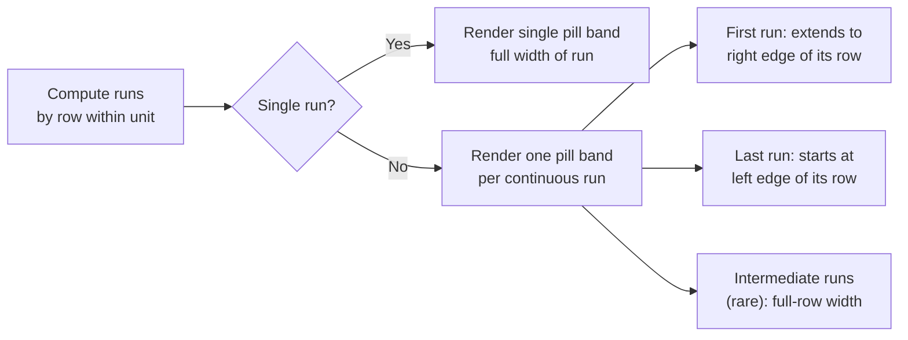
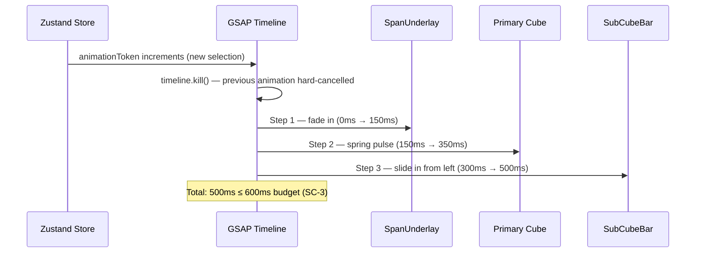

# Phase 2 — UI Design Contract

> Visual and interaction contract for Phase 2: Real Position Estimation.
> Generated by gsd-ui-researcher. Source of truth for gsd-planner, gsd-executor, and gsd-ui-auditor.

**Scope of this document:** Phase 2 adds four new kiosk UI elements on top of the Phase 1 grid: (1) the sub-cube position bar inside the primary cube, (2) the label-span connecting underlay beneath spanned cubes, (3) singleton faint-full-cube band rendering, and (4) the "Did you mean?" tappable suggestion row. It also governs the selection-lands animation choreography. Everything else (spacing, typography, color, component library) is inherited from the Phase 1 implementation and the Nordic Grid design language — confirmed, not re-decided.

---

## Design System

| Property | Value | Source |
|----------|-------|--------|
| Tool | none | Phase 1 confirmed: no shadcn, no component library |
| Preset | not applicable | No components.json found |
| Component library | none | Plain DOM + CSS Grid + Tailwind CSS 4.3 |
| CSS token source | `design/gruvax-design-tokens.css` | Wired in `frontend/src/main.tsx` |
| JS/TS token source | `design/gruvax-design-tokens.json` | Available for CSS-var references in GSAP |
| Icon library | inline SVG (no third-party icon lib) | Phase 1 pattern |
| Animation | GSAP 3.15 + Framer Motion (`motion`) 12.39 | Phase 1 installed |
| State | Zustand 5.0 | Phase 1 installed |
| Build | Vite 8 | Phase 1 installed (overrides STACK.md pin per env directive) |

**shadcn gate result:** Not applicable. The Phase 1 frontend uses plain CSS with Nordic Grid design tokens — no shadcn, no component registry, no safety vetting required.

---

## Spacing Scale

All values reference `--gruvax-space-*` tokens from `design/gruvax-design-tokens.css`. No hardcoded px values permitted in Phase 2 components.

| Token | CSS variable | Value | Phase 2 usage |
|-------|-------------|-------|---------------|
| `space-1` | `--gruvax-space-1` | 4px | Bar vertical inset from cube edge; address overlay offset (existing) |
| `space-2` | `--gruvax-space-2` | 8px | Underlay vertical padding; did-you-mean row internal padding |
| `space-3` | `--gruvax-space-3` | 12px | Did-you-mean row icon gap |
| `space-4` | `--gruvax-space-4` | 16px | Did-you-mean row horizontal padding (matches result-row existing) |
| `space-5` | `--gruvax-space-5` | 24px | Shelf area internal padding (existing — carry forward) |
| `space-6` | `--gruvax-space-6` | 32px | Shelf-to-shelf gap (existing — carry forward) |

**Exceptions:**
- Sub-cube bar height: 8px (2× `space-1`). Not a named scale token but derives from it.
- Touch target floor: 44px minimum for the did-you-mean tappable row (meets WCAG 2.5.5). Achieved by `min-height: 44px` on the row element.
- Underlay vertical thickness: 12px (`space-3`), centered vertically within the bottom third of each spanned cube. See §Span Underlay Geometry below.

---

## Typography

All values are pre-established by the Nordic Grid three-font type system. Carry forward from Phase 1 `kiosk.css`.

| Role | Font family | CSS var | Size | Weight | Line height | Usage in Phase 2 |
|------|-------------|---------|------|--------|-------------|-----------------|
| Address overlay | Barlow Condensed | `--gruvax-font-display` | 12px (`--gruvax-text-caption`) | 700 | `--gruvax-leading-tight` (1.1) | Existing cube address — carry forward |
| Body (did-you-mean heading) | Space Grotesk | `--gruvax-font-ui` | 16px (`--gruvax-text-body`) | 400 | `--gruvax-leading-normal` (1.5) | "Did you mean COLTRANE?" label |
| Body small (did-you-mean action) | Space Grotesk | `--gruvax-font-ui` | 14px (`--gruvax-text-body-sm`) | 400 | `--gruvax-leading-normal` (1.5) | Tap-to-search instruction text |
| Low-confidence cue | Space Grotesk | `--gruvax-font-ui` | 11px (`--gruvax-text-label`) | 400 | `--gruvax-leading-tight` (1.1) | "~" / "approx." below-threshold indicator |
| Catalog number / position data | DM Mono | `--gruvax-font-mono` | 14px (`--gruvax-text-mono`) | 400 | `--gruvax-leading-normal` (1.5) | Any position readout if surfaced in future |

**Font weight constraint:** Exactly 2 weights in Phase 2 new elements: 400 (regular) and 700 (display labels). The 500 (medium) weight is used for the address overlay in existing code only — carry forward as-is, do not introduce additional weights.

**Heading rule:** No new h1/h2/h3 headings in Phase 2 kiosk elements. The did-you-mean row is an inline suggestion, not a section heading.

---

## Color

All color references use CSS custom properties. No hardcoded hex values permitted.

### 60/30/10 Role Map

| Role | Token | Hex | Usage |
|------|-------|-----|-------|
| Dominant (60%) | `--gruvax-white` | #FFFFFF | Page background, cube dim fill |
| Secondary (30%) | `--gruvax-off-white` | #F7F9FC | Shelf area, results list, cards |
| Accent (10%) | `--gruvax-yellow` | #FFDA00 | LED lit state, sub-cube bar fill, span underlay |
| Structural | `--gruvax-blue` | #0051A2 | Borders, wordmark, interactive text |
| Destructive | `--gruvax-error` | #C0392B | Error states (not used in Phase 2 new elements) |

**Accent reserved for (Phase 2 additions):**
- Sub-cube position bar fill (`--gruvax-yellow` at attenuated `opacity` per confidence)
- Span connecting underlay fill (`--gruvax-yellow-faint` = `rgba(255, 218, 0, 0.12)` at rest; `--gruvax-yellow-glow` = `rgba(255, 218, 0, 0.35)` on animation entry)
- Singleton faint full-cube band fill (`--gruvax-yellow-faint` at `opacity: 0.18`)
- Did-you-mean row: no yellow — uses `--gruvax-warning` (#E6A800) icon only (matching existing `no-results-row__icon` pattern)

### New Color Contracts (Phase 2 Only)

| Element | Property | Token | Rationale |
|---------|----------|-------|-----------|
| Sub-cube bar — high confidence (> 0.50) | `background` | `--gruvax-yellow` | LED lit yellow; confidence drives opacity 0.85→1.0 |
| Sub-cube bar — low confidence (≤ 0.50, > 0.30) | `background` | `--gruvax-yellow` at `opacity: 0.35 + confidence × 1.0` | Attenuated; below-threshold cue appears |
| Sub-cube bar border | `border` | none | No border on bar — pure fill strip |
| Singleton band | `background` | `--gruvax-yellow-faint` (`rgba(255,218,0,0.12)`) at `opacity: 0.18` | Reads "faint presence" without being lit-cell yellow |
| Span underlay at rest | `background` | `--gruvax-yellow-faint` | Structural connector below cubes; preserves lit-cell rule |
| Span underlay during animation | `opacity` 0 → `0.60` | — | Fades in; animation drives opacity, not color change |
| Did-you-mean icon | `color` | `--gruvax-warning` | Matches existing `no-results-row__icon` (#E6A800) |
| Did-you-mean suggestion text | `color` | `--gruvax-text-secondary` | Sentence case, readable body weight |
| Low-confidence "~" cue | `color` | `--gruvax-text-muted` | Subdued; not alarming |

### Accessibility Constraints (from design spec)

- Blue on white (`--gruvax-blue` on `--gruvax-white`): 7.2:1 — AAA. Safe for all primary text.
- Yellow on blue: ~3.1:1 — large text (18px+) or decoration only. The sub-cube bar and span underlay are decorative/positional elements, not text — yellow is safe.
- The "~" / "approx." low-confidence cue: 11px Space Grotesk, `--gruvax-text-muted` (#777777) on `--gruvax-white` (#FFFFFF) measures ~4.48:1 — effectively at the WCAG AA 4.5:1 boundary (do **not** restate this as 4.6:1). The cue is a **supplementary, redundant** mark: the same "low confidence / approximate" meaning is already carried by the bar's attenuated opacity (visual) and by `aria-label="approximate position"` (assistive tech), so the cue is not the sole carrier of information. It therefore satisfies the supplementary-text exemption rather than relying on the strict text-contrast threshold. If a future design-token revision tightens `--gruvax-text-muted`, this cue inherits it — keep consuming the token; never substitute a one-off hex here.
- Did-you-mean row: `--gruvax-text-secondary` (#555555) on `--gruvax-off-white` (#F7F9FC) = 7.1:1 (AAA).

---

## New Component Inventory

Three new React components and one extended component. All CSS references tokens only.

### SubCubeBar

**File:** `frontend/src/routes/kiosk/SubCubeBar.tsx`

**Purpose:** Horizontal strip inside the primary cube showing where in the cube the record sits. Driven by `sub_cube_interval` from `LocateResult`.

**Props contract:**
```typescript
interface SubCubeBarProps {
  interval: SubInterval          // {start: 0-1, end: 0-1, crosses_boundary: boolean, next_cube?: CubeRef}
  confidence: number             // 0.0-1.0; drives opacity + optional width attenuation
  isSingleton: boolean           // true when start===0.0 && end===1.0 (D-02)
}
```

**Visual spec:**

| Property | Value | Condition |
|----------|-------|-----------|
| Height | 8px | Always |
| Vertical position | Bottom 20% of cube interior (relative to cube height), inset `space-1` from bottom edge | Always |
| Width | `(end - start) × 100%` of cube width | Normal records |
| Width | `100%` of cube width | Singleton (`isSingleton === true`, D-02) |
| Left offset | `start × 100%` of cube width | Normal; 0% for singletons |
| Border radius | `var(--gruvax-radius-sm)` (4px) | Always |
| Background fill | `var(--gruvax-yellow)` | confidence > 0.50 |
| Background fill | `var(--gruvax-yellow)` | 0.30 < confidence ≤ 0.50 (opacity reduced) |
| Opacity | `0.35 + (confidence / 1.0) × 0.65` clamped to [0.35, 1.0] | Any confidence |
| Singleton opacity | `0.18` | `isSingleton === true` — deliberately faint (D-02) |
| `pointer-events` | `none` | Always — bar is non-interactive decoration |
| `z-index` | 1 (above cube background, below address overlay) | Always |

**Confidence → opacity mapping table:**

| confidence | opacity | Visual read |
|------------|---------|-------------|
| 0.30 (cube-only floor) | 0.55 | Barely visible; "~" cue appears |
| 0.35 | 0.58 | Very faint bar + cue |
| 0.40 | 0.61 | Faint bar + cue |
| 0.50 (text-cue threshold) | 0.68 | Moderate; cue disappears above this |
| 0.60 | 0.74 | Moderate-bright |
| 0.70 | 0.81 | Bright |
| 0.82 | 0.88 | Crisp |
| 0.85 | 0.90 | Full-bright (visual cap) |

**Crosses-boundary rendering:** When `interval.crosses_boundary === true`, the bar extends from `start × cubeWidth` to the right edge of the primary cube. The `next_cube` cube receives a companion bar from 0 to `end × cubeWidth` on its left edge. This companion bar is rendered as a separate `SubCubeBar` instance by `Cube.tsx` when it detects it is `next_cube` for the active interval. Confidence and opacity are identical to the primary bar.

**Low-confidence text cue (D-03):** When `confidence ≤ 0.50`, render a `<span>` with content `"~"` (tilde, not "approx.") positioned absolutely above the bar. Spec:
- Font: Space Grotesk 11px, weight 400 (`--gruvax-text-label`)
- Color: `--gruvax-text-muted`
- Position: `position: absolute; top: calc(-1 × space-3); left: space-1`
- Accessibility: `aria-label="approximate position"` on the parent container

**CUBE-10 / D-02 reconciliation note for planner:** REQUIREMENTS.md CUBE-10 says "tick-mark indicator rather than a width-proportional range bar." D-02 overrides this to "faint full-cube band." The planner must add a reconciliation comment in the PLAN.md. The implementation follows D-02: `SubCubeBar` renders full-width at `opacity: 0.18` for singletons, never a tick mark or zero-width bar.

---

### SpanUnderlay

**File:** `frontend/src/routes/kiosk/SpanUnderlay.tsx`

**Purpose:** A structural connecting band drawn UNDER all cubes in `label_span` that visually links them as one contiguous run. The primary lit cube sits on top — the underlay never recolors a lit cell (D-04, Nordic Grid lit-cell rule).

**Props contract:**
```typescript
interface SpanUnderlayProps {
  labelSpan: CubeRef[]         // Sorted by (unit_id, row, col) — already computed by Phase 1
  primaryCube: CubeRef         // The lit cube — underlay must not obscure its lit state
  /** Grid geometry data — needed to compute absolute screen positions */
  cellSize: number             // px — var(--gruvax-cell-size-xl) = 80
  cellGap: number              // px — var(--gruvax-cell-gap-xl) = 12
}
```

**z-order rule (D-04):** The underlay renders at `z-index: 0` (below cubes). Cubes sit at `z-index: 1`. The existing `.cube` CSS does not set `z-index`; Phase 2 adds `position: relative; z-index: 1` to `.cube` and `position: absolute; z-index: 0` to `.span-underlay__band`. This ensures the yellow lit cell is always visually above the underlay connector.

**Visual spec — underlay band:**

| Property | Value |
|----------|-------|
| Background | `var(--gruvax-yellow-faint)` = `rgba(255, 218, 0, 0.12)` |
| Border | `1px solid var(--gruvax-yellow-glow)` = `rgba(255, 218, 0, 0.35)` |
| Height | 12px (`--gruvax-space-3`) |
| Border radius | `var(--gruvax-radius-pill)` (9999px) — pill-shaped connector |
| Initial opacity | 0 (animated to target by GSAP) |
| Target opacity during animation | 0.60 |
| Resting opacity (after animation) | 0.60 |

**Geometry — single-row span:** When all `labelSpan` cubes are on the same row within the same unit, render one pill-shaped band. Its `left` starts at the left edge of the first spanned cube and its `right` ends at the right edge of the last spanned cube. The band is vertically centered in the bottom 30% of the cube row.

**Geometry — row-wrapping or unit-wrapping span:**



When cubes span from row 3 of unit 0 to row 0 of unit 1 (crossing unit boundary), render two separate bands: one ending at the last cube of unit 0 and one starting at the first cube of unit 1. No visual connector crosses the physical gap between units — they are physically separate shelves.

**Wrap detection algorithm:** Group `labelSpan` by `(unit_id, row)`. Each unique `(unit_id, row)` pair is one band segment. Sort cubes within each segment by `col`. The band spans from `col_min` to `col_max` within that row.

**Implementation pattern:** `SpanUnderlay` uses the shelf-grid container as its positioning parent (`position: relative` on `.shelf-area`). Each band is `position: absolute` computed from the grid's cell geometry. Use `cellSize` and `cellGap` props (derived from CSS tokens) rather than `getBoundingClientRect()` — this avoids layout thrashing and is stable on the Pi.

```
left  = unitColumnOffset + (col_min × (cellSize + cellGap))
width = (col_max - col_min) × (cellSize + cellGap) + cellSize
top   = unitRowOffset + (row × (cellSize + cellGap)) + (cellSize × 0.75)
```

Where `unitColumnOffset` and `unitRowOffset` are the pixel offsets of the unit's shelf-grid container within the shelf-area parent.

**Lit-cell protection:** The underlay band passes through the position of the lit (primary) cube. This is visually correct — the lit cell renders above the band (z-order), so the yellow LED fill reads at full saturation. The band contributes only to non-lit cells, reading as a faint structural hint. This is the intended design per D-04.

---

### DidYouMean

**File:** `frontend/src/routes/kiosk/DidYouMean.tsx`

**Purpose:** Inline tappable suggestion row rendered inside the no-results state when the search API returns a `did_you_mean` candidate (SRCH-07, D-10).

**Props contract:**
```typescript
interface DidYouMeanProps {
  suggestion: string           // Normalized suggestion term (e.g. "COLTRANE")
  onTap: (term: string) => void  // Fires the suggested query; caller sets it in SearchBox
}
```

**Position in the DOM:** Rendered as a second row below `NoResultsRow` inside the existing `.results-list__scroll` container. `NoResultsRow` (the "no results" message) renders first; `DidYouMean` renders immediately below it when `suggestion` is non-null.

**Visual spec:**

| Property | Value |
|----------|-------|
| Layout | Flex row, align-items center, gap `var(--gruvax-space-3)` |
| Min-height | 44px (touch target floor) |
| Padding | `var(--gruvax-space-2) var(--gruvax-space-4)` |
| Border-top | `1px solid var(--gruvax-border-faint)` |
| Background at rest | `var(--gruvax-off-white)` |
| Background on hover/active | `var(--gruvax-yellow-faint)` = `rgba(255,218,0,0.12)` |
| Transition | `background 150ms var(--gruvax-ease-standard)` |
| Cursor | `pointer` |
| Icon | Question-mark circle, 20×20, `color: var(--gruvax-warning)` |

**Copy spec (see also §Copywriting Contract below):**
- Suggestion text: Space Grotesk 16px, weight 400, `--gruvax-text-secondary`
- Suggestion term rendered in bold (weight 700): e.g. `Did you mean ` + `**COLTRANE**` + `?`
- Term is uppercase to match the Nordic Grid ALL CAPS label convention for record names
- Tap instruction: not rendered as separate text — the entire row is the tap target

**Accessibility:**
- `role="button"` on the row element
- `aria-label={`Search for ${suggestion}`}`
- `tabIndex={0}` + `onKeyDown` handling Enter/Space (keyboard accessible for admin mobile)
- No silent auto-correct: tapping always updates the visible search box content to the suggestion (D-10)

---

## Confidence → Bar Attenuation Mapping

This table resolves the "Claude's Discretion" item from 02-CONTEXT.md. Values are derived from the formula in 02-RESEARCH.md §Confidence Calibration.

| Record type | k (label size) | confidence | Bar opacity | Text cue? | Visual read |
|-------------|---------------|------------|-------------|-----------|-------------|
| Singleton | k=1 | 0.30 | 0.18 (full-width faint band) | No | "One record, scan the cube" |
| Very small (2 records) | k=2 | 0.35 | 0.58 | Yes ("~") | Faint narrow bar + tilde |
| Very small (3 records) | k=3 | 0.40 | 0.61 | Yes ("~") | Faint bar + tilde |
| Small (4 records) | k=4 | 0.55 | 0.71 | Yes ("~") | Moderate bar + tilde |
| Small (10 records) | k=10 | 0.70 | 0.81 | Yes ("~") | Bright bar + tilde |
| Medium (11 records) | k=11 | 0.70 | 0.81 | No | Bright bar, clean |
| Medium (20 records) | k=20 | 0.81 | 0.88 | No | Crisp bar |
| Medium (30 records) | k=30 | 0.82 | 0.88 | No | Crisp bar |
| Large (>30 records) | k>30 | 0.85 | 0.90 | No | Full-bright bar |

**Threshold constants (referenced as code constants, not magic numbers):**
- `CUBE_ONLY_CONFIDENCE = 0.30` — existing constant in `contract.py`; UI: bar renders as singleton band
- `TEXT_CUE_THRESHOLD = 0.50` — new constant; controls "~" cue visibility (D-03)
- Opacity formula: `Math.max(0.35, 0.35 + (confidence / 1.0) × 0.65)` for normal records

**Singletons:** Always render as full-width band at `opacity: 0.18`, regardless of the formula above. This is a special case that bypasses the opacity formula (D-02). The `isSingleton` boolean prop on `SubCubeBar` gates this.

---

## Interaction & Motion Contract

### Selection-Lands Animation (CUBE-08, D-05)

The animation fires when a new `animationToken` is detected in the Zustand store. It runs as a GSAP timeline in a `useEffect` inside `KioskView.tsx`. Hard-cancel on new token (D-06).

**Choreography — sequential steps:**



**Per-step timing budget:**

| Step | Element | Start | Duration | Easing | CSS var |
|------|---------|-------|----------|--------|---------|
| 1 | SpanUnderlay | 0ms | 150ms | `ease-out` (`--gruvax-ease-decelerate`) | `cubic-bezier(0.0, 0.0, 0.2, 1)` |
| 2a | Primary cube pulse (scale out) | 150ms | 100ms | `back.out(1.7)` (GSAP spring) | — |
| 2b | Primary cube settle (scale back) | 250ms | 100ms | `--gruvax-ease-standard` | `cubic-bezier(0.4, 0.0, 0.2, 1)` |
| 3 | SubCubeBar slide-in (scaleX) | 300ms | 200ms | `power2.out` | — |

Total: 500ms end-to-end. 100ms headroom before the 600ms ceiling (SC-3 / D-05).

**GSAP hard-cancel pattern (D-06):**
```typescript
// useEffect dependency: [animationToken]
useEffect(() => {
  timelineRef.current?.kill()           // Hard-cancel — snap previous to final state
  gsap.set(spanUnderlayRef.current, { opacity: 0 })  // Reset before restart
  gsap.set(barRef.current, { scaleX: 0 })

  const tl = gsap.timeline()
  tl.fromTo(spanUnderlayRef.current,
    { opacity: 0 },
    { opacity: 0.60, duration: 0.15, ease: 'power2.out' })
  tl.fromTo(primaryCubeRef.current,
    { scale: 1 },
    { scale: 1.04, duration: 0.10, ease: 'back.out(1.7)' })
  tl.to(primaryCubeRef.current,
    { scale: 1, duration: 0.10, ease: 'power2.inOut' })
  tl.fromTo(barRef.current,
    { scaleX: 0, transformOrigin: 'left center' },
    { scaleX: 1, duration: 0.20, ease: 'power2.out' }, '-=0.10')

  timelineRef.current = tl
  return () => { tl.kill() }
}, [animationToken])
```

**New-search interruption (D-06):** When the user types a new character (triggering a new search), the Zustand `clearSearch()` or `setHighlightCube(null)` is called, which increments `animationToken`. The `useEffect` fires, calls `timeline.kill()`, snaps the old elements to initial state via `gsap.set()`, and begins the new animation. No cross-fade. No linger.

**Pi 5 performance constraints:**
- Animate `transform` and `opacity` only — compositor-layer properties. No `box-shadow` in GSAP tweens (Pitfall 16 / design spec).
- The LED glow (`--gruvax-shadow-led`) on the primary cube is driven by CSS data-state transition (existing `kiosk.css`), not GSAP. It fires on the lit state change independently and completes within the CSS `--gruvax-led-on-duration` (300ms).
- `will-change: transform, opacity` on SubCubeBar and SpanUnderlay elements for the duration of the animation; removed on cleanup.

**Singleton animation:** When `isSingleton === true`, Step 3 (bar slide-in) is replaced by: `SubCubeBar` cross-fades in at `opacity: 0 → 0.18` over 200ms. No `scaleX` slide (the full-width band doesn't read correctly with a left-to-right reveal).

---

## Copywriting Contract

All labels follow Nordic Grid voice and tone: labels ALL CAPS (Barlow Condensed 700, tracked wide); instructions sentence case (Space Grotesk 400); errors plain language, no jargon.

| Element | Copy | Font | Notes |
|---------|------|------|-------|
| Did-you-mean heading | `Did you mean `**`COLTRANE`**`?` | Space Grotesk 16px — suggestion term uppercase | D-10; term is uppercased in the UI regardless of API casing |
| Did-you-mean (no results context) | Renders below the existing "No results for [query]" row | — | No change to existing NoResultsRow copy |
| Low-confidence cue | `~` | Space Grotesk 11px, `--gruvax-text-muted` | Appears left of bar when confidence ≤ 0.50 (D-03) |
| Aria label for cue | `approximate position` | — | Screen reader only |
| Aria label for did-you-mean button | `Search for COLTRANE` | — | Dynamically built from suggestion |
| Singleton no-cue | No text cue rendered | — | Singleton's faint band communicates uncertainty visually (D-01) |
| Search box placeholder (unchanged) | `Search by artist, title, label, or catalog number…` | Carry forward from Phase 1 | No change |
| No results heading (unchanged) | `No records found` | Carry forward from Phase 1 | No change |
| No results body (unchanged) | `Try a different spelling or catalog number` | Carry forward from Phase 1 | No change |

**Destructive actions in Phase 2:** None. No destructive actions are introduced in Phase 2.

---

## Layout Changes

Phase 2 does not change the overall kiosk page layout. The additions are contained within existing DOM nodes.

### DOM additions:

1. **`SpanUnderlay` inside `.shelf-area`:** Rendered as a sibling of `.shelf-section` elements, positioned absolutely within the `.shelf-area` container. Requires `position: relative` on `.shelf-area` (may already be set by Phase 1 `border-radius + overflow` context; verify and add if missing).

2. **`SubCubeBar` inside `.cube`:** Rendered as an absolutely-positioned child of `.cube`, beneath the `.cube__address` overlay. Requires no layout change to the cube — cubes already have `position: relative; overflow: hidden`.

3. **`DidYouMean` inside `.results-list__scroll`:** Rendered conditionally below `NoResultsRow` when `did_you_mean` is non-null in the search response. No layout change to the results list container.

---

## Zustand Store Extension Contract

| New field | Type | Initial value | Set by | Used by |
|-----------|------|--------------|--------|---------|
| `labelSpan` | `CubeRef[]` | `[]` | `setLocateResult()` on locate API response | `ShelfGrid` (passes to `SpanUnderlay`); `KioskView` GSAP timeline |
| `subCubeInterval` | `SubInterval \| null` | `null` | `setLocateResult()` | `Cube` (passes to `SubCubeBar`) |
| `confidence` | `number` | `0` | `setLocateResult()` | `SubCubeBar` (opacity + text cue) |
| `animationToken` | `number` | `0` | Already exists in Phase 1 — carry forward | GSAP `useEffect` dependency |

New action: `setLocateResult(result: LocateResult)` — sets `primaryCube`, `labelSpan`, `subCubeInterval`, `confidence`, and increments `animationToken` atomically in one `set()` call. Replaces the Phase 1 `setHighlightCube()` call in the locate response handler.

---

## TypeScript Type Extension

**`frontend/src/api/types.ts`** — extend `LocateResult` and add `SubInterval`:

```typescript
export interface SubInterval {
  start: number               // 0.0-1.0 normalized
  end: number                 // 0.0-1.0 normalized; ≥ start
  crosses_boundary: boolean
  next_cube?: CubeRef         // Present when crosses_boundary === true
}

export interface LocateResult {
  release_id: number
  primary_cube: CubeRef | null
  label_span: CubeRef[]
  sub_cube_interval: SubInterval | null  // was: null always in Phase 1; now populated
  confidence: number
  generated_at: string
  estimator_version: string
}

export interface SearchResponse {
  items: SearchResult[]
  took_ms: number
  did_you_mean: string | null  // NEW: suggestion term or null (SRCH-07)
}
```

---

## Registry Safety

| Registry | Blocks Used | Safety Gate |
|----------|-------------|-------------|
| shadcn official | none | not applicable (no shadcn) |
| Third-party | none | not applicable |

No third-party component registries are used in Phase 2. All new components are hand-authored within the existing plain-CSS + Tailwind + GSAP pattern.

---

## Component Summary (Phase 2 New Elements)

| Component | File | Requirement | Key constraint |
|-----------|------|-------------|----------------|
| `SubCubeBar` | `frontend/src/routes/kiosk/SubCubeBar.tsx` | CUBE-04, CUBE-10, D-01, D-02, D-03 | Opacity driven by confidence; singleton = full-width faint band |
| `SpanUnderlay` | `frontend/src/routes/kiosk/SpanUnderlay.tsx` | CUBE-03, D-04 | z-index below cubes; never recolors lit cell; handles row/unit wrap |
| `DidYouMean` | `frontend/src/routes/kiosk/DidYouMean.tsx` | SRCH-07, D-10 | Single tappable row; no auto-correct; 44px touch target |
| `Cube` (extended) | `frontend/src/routes/kiosk/Cube.tsx` | CUBE-04 | Accepts `subInterval + confidence`; renders `SubCubeBar` + optional companion bar |
| `ShelfGrid` (extended) | `frontend/src/routes/kiosk/ShelfGrid.tsx` | CUBE-03 | Accepts `labelSpan`; renders `SpanUnderlay` |
| `KioskView` (extended) | `frontend/src/routes/kiosk/KioskView.tsx` | CUBE-08, D-05, D-06 | Owns GSAP timeline; hard-cancel on animationToken |

---

## Decision Traceability

| Decision | Source | Visual Contract |
|----------|--------|----------------|
| Bar always renders, attenuated by confidence | D-01 (CONTEXT.md) | Opacity formula `0.35 + confidence × 0.65`; never hidden |
| Singleton = faint full-cube band, not tick-mark | D-02 (CONTEXT.md); reinterprets CUBE-10 | `SubCubeBar isSingleton=true`: width 100%, opacity 0.18; planner must reconcile wording |
| "~" cue only below 0.50 confidence | D-03 (CONTEXT.md); threshold resolved by researcher | `TEXT_CUE_THRESHOLD = 0.50` |
| Underlay sits UNDER lit cells (z-order) | D-04 (CONTEXT.md); lit-cell rule (design spec) | `.cube { z-index: 1 }`, `.span-underlay__band { z-index: 0 }` |
| Sequential animation ≤ 600ms, LED physics | D-05 (CONTEXT.md); ROADMAP SC-3 | 500ms budget; spring ease for pulse |
| Hard-cancel on new search, no cross-fade | D-06 (CONTEXT.md) | `timeline.kill()` + `gsap.set()` reset in animationToken useEffect |
| Did-you-mean: single tappable row, no auto-correct | D-10 (CONTEXT.md) | `DidYouMean` row below NoResultsRow; tapping sets query in SearchBox |
| Confidence calibration numbers | Researcher discretion | Table in §Confidence → Bar Attenuation Mapping |
| TEXT_CUE_THRESHOLD = 0.50 | Researcher discretion (D-03 delegates exact value) | Applied in `SubCubeBar` and confirmed in backend `algorithm.py` |

---

## Checker Sign-Off

- [ ] Dimension 1 Copywriting: PASS
- [ ] Dimension 2 Visuals: PASS
- [ ] Dimension 3 Color: PASS
- [ ] Dimension 4 Typography: PASS
- [ ] Dimension 5 Spacing: PASS
- [ ] Dimension 6 Registry Safety: PASS

**Approval:** pending

---

## Implementation Reconciliation (Phase 2 build, 2026-05-20)

The following changes were made during live operator review **after** the initial
build and supersede the spec text above. They are the authoritative current
behavior; the earlier sections are retained for design-history context.

| Spec said | Shipped | Why |
|-----------|---------|-----|
| Sub-cube bar: **horizontal** 8px strip at cube bottom, `--gruvax-yellow` fill, opacity `max(0.35, 0.35 + conf×0.65)` | **Tall vertical band** (~92% cube height) at the horizontal position; **IKEA blue** on the lit cube, yellow on dim companion cubes; opacity `max(0.30, 0.30 + conf×0.30)` (~0.30–0.60) | A record stands vertically in the bin (12″ in ~13″), so position reads better as a line. Yellow-on-yellow was invisible on the lit cube → blue, matching the existing blue address label. Original opacity read as a heavy/"ugly" block. |
| Bin ID (`.cube__address`): small label, top-left corner | **Large, centered, very-transparent (0.22) watermark**, behind the bar (z-index 0) | Operator preference; removes the bar/label corner collision by making the ID a faint background mark the bar can overlap. (Phase-1 element, adjusted here.) |
| Did-you-mean tap: "sets the search query" | Tap sets `store.query` **and** triggers the corrected search (SearchBox is now controlled by `store.query`) | The original implementation set a store field nothing read, so the tap did nothing. |
| (unspecified) results dropdown dismissal | Dropdown collapses on explicit selection (tap/Enter); reopens on the next query | Auto-select-top kept the list open over the grid after a pick. |
| (unspecified) native `type=search` clear button | Native webkit clear button hidden; only the app's single clear-X shows | Browser rendered a duplicate gray ×. |
| (unspecified) shelf-area layout | Kallax units tile max 2 per row, centered in the bounding box | Operator preference for the multi-unit grid. |

**Status:** Task 4 on-Pi human-verify checkpoint **approved 2026-05-20**. See `02-03-SUMMARY.md` → Post-Checkpoint Refinements for commit SHAs (`a010d05`, `d41f6a5`, `c1cc8f1`, `43e691e`).

---

*Phase: 02-real-position-estimation*
*UI-SPEC created: 2026-05-20*
*Reconciled with implementation: 2026-05-20*
*Design system: Nordic Grid v1.0 — tokens in `design/gruvax-design-tokens.css` / `.json`*
