# Phase 3: Admin Loop (PIN + Manual Entry + Undo) — Research

**Researched:** 2026-05-20
**Domain:** Server-side PIN auth, session management, boundary CRUD with audit history, diff-preview + undo, kiosk fill-level and cube-contents reveal
**Confidence:** HIGH on auth/session/CSRF/migration patterns (anchored to existing code + ARCHITECTURE.md). HIGH on boundary CRUD / change-set logic. HIGH on fill-level + midpoint algorithm (reuses Phase 2 code already on disk). MEDIUM on frontend admin component specifics (delegated to `/gsd:ui-phase 3`).

---

<user_constraints>
## User Constraints (from CONTEXT.md)

### Locked Decisions

**D-01:** PIN is 4-digit numeric, Argon2id-hashed (`passlib[argon2]`) in `gruvax.settings` DB table under key `auth.pin_hash`. Numeric-only keeps the kiosk fallback a 10-key keypad (Pitfall 4). PIN never logged even at DEBUG. Verification uses `secrets.compare_digest` on the hash.

**D-02:** First PIN provisioned via bootstrap CLI (`gruvax set-pin`) that Argon2id-hashes the PIN into `gruvax.settings.auth.pin_hash`. Resolves the long-carried open question. Plaintext never touches `.env` or git; re-runnable to rotate.

**D-03:** All four safety affordances ship in this phase: (a) failed-attempt lockout / login rate-limit, (b) Change PIN in Settings (requires current PIN, revokes all other sessions), (c) Lock button (re-shows PIN without ending session), (d) hard session cap (force re-PIN after max lifetime regardless of activity).

**D-04:** Session = 10-minute idle sliding window + visible 60-second countdown. Uncommitted edits preserved in Zustand `pendingChangeSet` — timeout never loses in-progress work. Manual logout from any screen. Auth state = server-side `gruvax.admin_sessions` rows + signed HttpOnly session cookie + CSRF double-submit cookie (`SameSite=Strict`). SPA's `isLoggedIn` is a mirror learned via `GET /api/admin/session`.

**D-05:** `/admin/cubes` grid overview (read-only, fill levels) + focused per-cube editor (`/admin/cubes/:unit/:row/:col`) for first/last `(label, catalog#)`. Bulk reshuffle in Phase 6 only.

**D-06:** Two-step dependent autocomplete: pick label first (distinct labels in `v_collection`), then catalog# autocompletes scoped to that label's records. Source is exclusively `gruvax.v_collection`.

**D-07:** Phantom handling: block save, surface closest trigram near-misses as tappable suggestions, allow "use anyway" only behind explicit confirm. Save validation runs through POS-01 normalizer/comparator (`normalize.py`). Rejects `first > last`.

**D-08:** "Suggest midpoint" = inline button, always available when cube sits between two adjacent populated cubes. Walks collection-INDEX space, never catalog-string space (Pitfall 22). Editable, never auto-applied.

**D-09:** Pre-commit diff preview shows affected cubes on a mini Kallax grid + per-cube before/after boundary values + record-movement counts, computed from in-memory collection snapshot. No DB hit.

**D-10:** Mutations write `gruvax.boundary_history` grouped by `change_set_id` (append-only). One save action = one change-set. Multi-cube edits accumulate in `pendingChangeSet` client-side, then a single atomic `POST /api/admin/cubes/bulk`. Mutating POSTs carry an `Idempotency-Key`.

**D-11:** Revert granularity = whole change-set only. Revert restores each cube's prior value as a new inverse change-set (`source='revert'`), so the revert is itself undoable.

**D-12:** Revert conflict handling: when reverting an older change-set whose cubes were modified by a newer change-set, revert the non-conflicting cubes and SKIP + REPORT the conflicting ones. No silent clobber.

**D-13:** Fill level (CUBE-07) = records-in-range ÷ nominal cube capacity (admin Settings value). Computed from in-memory snapshot.

**D-14:** Cube tap (CUBE-09) → reverse-lookup side panel via `GET /api/cubes/{unit}/{row}/{col}`: cube's first/last boundary records + ~6–8 records evenly sampled + total count.

**D-15:** Reveal features (fill level + cube contents) are PUBLIC on the kiosk.

**D-16:** Tapping unset/empty cube shows "No records assigned to this cube yet"; if admin is logged in, offers one-tap shortcut into that cube's editor.

**D-17:** Kiosk boundary editing uses tap-to-pick lists with A–Z jump rail + digit-filtered catalog#s. No in-app letter board built. Mobile reuses same components with device keyboard.

**D-18:** Phase 3 Settings page contains only: Change PIN + nominal cube capacity + idle-timeout duration.

### Claude's Discretion

- Exact lockout policy numbers (attempt threshold, cooldown window), hard-cap duration (~30 min suggested), and idle default (10 min within 5–10 min range).
- Cookie/CSRF specifics (HttpOnly, `Secure`, `SameSite`, session-token entropy).
- Trigram near-miss query + similarity threshold — reuse Phase 2 `pg_trgm` did-you-mean path.
- Nominal cube capacity default (~90–100) and fill-level intensity mapping to design tokens.
- Evenly-sampled subset size (~6–8) and sampling method (index-stride).
- Alembic migration 0004 conventions.
- All visual/interaction design → `/gsd:ui-phase 3` within Nordic Grid design system.

### Deferred Ideas (OUT OF SCOPE)

- SSE cross-device live admin refresh + `admin_editing` soft-lock → Phase 4.
- CSV/YAML import + guided reshuffle wizard → Phase 6.
- `GET /api/admin/export/boundaries.yaml` → Phase 6.
- LED color/brightness/diagnostic settings + panic-off → Phase 5.
- Recently-pulled / privacy floors → Phase 4.
- Per-visitor PIN → v2.
- Per-cube partial revert → deferred (whole change-set is D-11).

</user_constraints>

<phase_requirements>
## Phase Requirements

| ID | Description | Research Support |
|----|-------------|------------------|
| ADMN-01 | Admin can log in via a single PIN (Argon2id-hashed in DB) on either mobile or kiosk | §Auth below: passlib[argon2] + bootstrap CLI + `require_admin` dependency |
| ADMN-02 | Admin session uses a sliding-window timeout (5–10 min idle); visible countdown in last 60 s | §Session Management: admin_sessions DB rows + cookie max_age refresh pattern |
| ADMN-03 | Admin can enter cube boundaries manually via form with autocomplete from collection | §Boundary CRUD: two-step dependent autocomplete from v_collection + POS-01 validation |
| ADMN-06 | All boundary saves validated against collection; mismatches flagged with trigram near-misses | §Validation: reuse Phase 2 `pg_trgm` did-you-mean pattern with similarity threshold |
| ADMN-07 | All boundary mutations show diff preview before commit | §Diff Preview: collection_snapshot movement count, no DB hit |
| ADMN-08 | Admin can log out manually from any screen | §Auth: POST /api/admin/logout revokes session row + clears cookie |
| ADMN-09 | Every boundary mutation recorded in append-only change log grouped by change-set; admin can revert by change-set | §Change-Set / Undo: boundary_history DDL + inverse change-set with conflict detection |
| ADMN-12 | Boundary entry UI can auto-suggest midpoint catalog# for a cube based on adjacent populated cubes | §Midpoint Suggestion: index-space walk via normalize.py + collection_snapshot |
| CUBE-07 | Each cube displays fill-level indicator computed from boundary range | §Fill Level: records_in_range / nominal_capacity from collection_snapshot |
| CUBE-09 | User can tap a cube to reveal what's in it (reverse-lookup side panel: first/last + representative subset) | §Cube Contents: GET /api/cubes/{unit}/{row}/{col} + index-stride sampling |

</phase_requirements>

---

## Summary

Phase 3 converts boundaries from a committed fixture into a maintained artifact. It delivers PIN auth with safety affordances, a boundary editor with validation, a pre-commit diff preview, append-only change-set history with one-tap undo, and two kiosk reveal features (fill level + cube contents). The vast majority of implementation decisions are locked in CONTEXT.md D-01..D-18 and the authoritative research documents; this document focuses on **how to implement them correctly** given the existing codebase.

The phase builds entirely on existing infrastructure: `normalize.py` (POS-01 comparator), `collection_snapshot.py` (fill counts, movement diff, contents sampling), `boundary_cache.py` (invalidate on commit), `pool.py` / `deps.py` (connection pool + dependency providers), and the Phase 2 `pg_trgm` did-you-mean query pattern. Frontend reuses `ShelfGrid` / `Cube` for the admin mini-grid diff preview and fill-level rendering. The new code surface is the `src/gruvax/auth/` module, `src/gruvax/api/admin/` router tree, migration `0004`, and the frontend `/admin/*` route tree.

Key non-obvious implementation points: the `gruvax set-pin` bootstrap CLI must operate on the DB (not `.env`) and be runnable before any admin session exists; rate-limiting on `/api/admin/login` should be applied via `slowapi` (already available on PyPI, OK per slopcheck) without a per-request DB query; the CSRF double-submit cookie pattern works with Starlette 1.0 but requires the CSRF cookie to be explicitly NOT HttpOnly; and `boundary_cache.invalidate()` must be called within the same async task as the DB commit to guarantee consistency before the 200 response is returned.

**Primary recommendation:** Follow the ARCHITECTURE.md admin endpoint table and DDL exactly. Build in vertical slices: auth → single-cube editor → diff preview → change-set history → undo → fill-level → cube contents.

---

## Architectural Responsibility Map

| Capability | Primary Tier | Secondary Tier | Rationale |
|------------|-------------|----------------|-----------|
| PIN verification + session creation | API/Backend | — | Auth never happens in the browser; session row is server-side truth |
| CSRF token generation + validation | API/Backend | Browser (reads non-HttpOnly cookie) | Double-submit pattern: server issues, browser echoes in header |
| Boundary validation (first ≤ last, phantom check) | API/Backend | — | POS-01 comparator lives in Python; DB trigram query for near-misses |
| Diff preview computation (record-movement counts) | API/Backend | — | collection_snapshot is server-side in-memory; no DB hit |
| Midpoint suggestion | API/Backend | — | Index-space walk over collection_snapshot |
| pendingChangeSet accumulation | Browser/Zustand | — | Client-side draft state; never reaches DB until commit |
| Idle countdown + Lock button | Browser | API (sliding-window refresh via GET /api/admin/session) | Timer is a React effect; server refreshes session expiry on each request |
| Change-set history + undo | API/Backend + Database | Browser (display) | Append-only boundary_history; inverse change-set is a DB write |
| Fill-level computation | API/Backend | — | collection_snapshot.get_label_records() per cube range; no DB |
| Cube contents sampling | API/Backend | — | Index-stride over v_collection query; public endpoint |
| Admin grid / editor / mini-grid diff UI | Browser | — | React + design tokens; kiosk and mobile share components |

---

## Standard Stack

### Core (already in pyproject.toml — no new Python packages needed beyond passlib[argon2])

| Library | Version | Purpose | Why Standard |
|---------|---------|---------|--------------|
| `passlib[argon2]` | 1.7.4 (PyPI latest) [VERIFIED: PyPI] | Argon2id PIN hashing | ARCHITECTURE.md + STACK.md prescribe this. `argon2-cffi` 25.1.0 is the underlying C library. passlib wraps it cleanly. |
| `itsdangerous` | 2.2.0 (PyPI latest) [VERIFIED: PyPI] | Signed session cookie / CSRF token | Bundled dependency of Starlette `SessionMiddleware`. Already transitive. |
| `starlette` | 1.0.0 (PyPI latest) [VERIFIED: PyPI] | `SessionMiddleware` + cookie helpers | Bundled with FastAPI 0.136.x. |
| `slowapi` | 0.1.9 (PyPI latest) [VERIFIED: PyPI] | Rate-limiting on `/api/admin/login` | Thin Limits-compatible wrapper around Starlette. ARCHITECTURE.md notes "slowapi middleware or hand-rolled bucket in Postgres." slowapi avoids the Postgres-per-request cost for a simple per-IP limit. |

**Note:** `passlib[argon2]` is NOT yet in `pyproject.toml`. It must be added. `slowapi` is also not present. All other auth libraries (`itsdangerous`, `starlette`) are transitive dependencies of the existing `fastapi` dependency.

**Version note (user memory override):** User memory says "prefer latest versions." passlib 1.7.4 is the PyPI latest and only major release. No newer version exists. argon2-cffi 25.1.0 is latest.

### Supporting (frontend — already in package.json)

| Library | Purpose | Notes |
|---------|---------|-------|
| `zustand` 5.x | `admin` store slice (`isLoggedIn`, `sessionExpiresAt`, `csrfToken`, `pendingChangeSet`) | Extend existing store.ts |
| `@tanstack/react-query` 5.x | Admin query keys + session polling | Already used for search/locate |
| `react-hook-form` 7.x | Boundary editor form state | STACK.md prescribes this |
| `zod` 3.x | Frontend schema validation (matches FastAPI Pydantic models) | STACK.md prescribes this |

### Alternatives Considered

| Instead of | Could Use | Tradeoff |
|------------|-----------|----------|
| `passlib[argon2]` | `argon2-cffi` directly | passlib provides a consistent verify/hash API and is already cited in all project docs; direct argon2-cffi works but requires more boilerplate |
| `slowapi` | Hand-rolled Postgres bucket | slowapi is stateless (in-process counter) so a restart resets the window — acceptable for home LAN; Postgres bucket survives restarts but adds a DB round-trip to every login |
| `SessionMiddleware` + signed cookie | JWT in Authorization header | JWT requires stateless token revocation (blocklist table) or short expiry; signed session cookie with server-side rows is simpler and revocation is trivial (`revoked_at`) |

**Installation (new packages only):**
```bash
uv add "passlib[argon2]" slowapi
```

---

## Package Legitimacy Audit

> slopcheck installed and run on 2026-05-20.

| Package | Registry | Age | slopcheck | Disposition |
|---------|----------|-----|-----------|-------------|
| `passlib` | PyPI | ~12 years (first release 2011) | [OK] | Approved |
| `slowapi` | PyPI | ~5 years | [OK] | Approved |
| `argon2-cffi` | PyPI | ~8 years | [OK] | Approved |
| `itsdangerous` | PyPI | ~12 years (Pallets project) | [OK] | Approved |
| `starlette` | PyPI | ~7 years | [OK] | Approved |

**Packages removed due to [SLOP] verdict:** none
**Packages flagged as [SUS]:** none

---

## Architecture Patterns

### System Architecture Diagram

```mermaid
flowchart TD
    subgraph Browser["Browser (kiosk or mobile)"]
        PIN["PIN entry (in-app keypad)"]
        AdminUI["Admin SPA /admin/*"]
        PendingCS["Zustand: pendingChangeSet"]
    end

    subgraph API["gruvax-api (FastAPI)"]
        Login["POST /api/admin/login\n(rate-limited, Argon2id verify)"]
        Session["GET /api/admin/session\n(sliding TTL refresh)"]
        Logout["POST /api/admin/logout"]
        require_admin["require_admin dep\n(cookie + CSRF check)"]
        CubeGet["GET /api/admin/cubes\n(fill levels)"]
        CubeEditor["PUT .../boundary\n(validate + save)"]
        Validate["POST .../validate\n(dry-run diff)"]
        Suggest["POST .../suggest\n(index-space midpoint)"]
        Bulk["POST /api/admin/cubes/bulk\n(atomic + Idempotency-Key)"]
        History["GET /api/admin/history"]
        Revert["POST .../revert\n(inverse change-set)"]
        Settings["GET/PUT /api/admin/settings"]
        SetPin["CLI: gruvax set-pin"]
        CubePublic["GET /api/cubes/{u}/{r}/{c}\n(public, fill + sample)"]
    end

    subgraph State["In-process State"]
        BCache["BoundaryCache\n(invalidated on commit)"]
        Snapshot["CollectionSnapshot\n(fill counts, movement diff)"]
    end

    subgraph DB["PostgreSQL gruvax schema"]
        AdminSess["admin_sessions"]
        Settings_DB["settings (auth.pin_hash, capacity, TTL)"]
        BHistory["boundary_history (append-only)"]
        CubeBounds["cube_boundaries"]
        IdempKeys["idempotency_keys"]
    end

    PIN --> Login
    Login -->|"session cookie + csrf cookie"| AdminUI
    AdminUI -->|"X-CSRF-Token"| require_admin
    require_admin --> CubeGet
    require_admin --> CubeEditor
    require_admin --> Validate
    require_admin --> Suggest
    require_admin --> Bulk
    require_admin --> History
    require_admin --> Revert
    require_admin --> Settings
    SetPin --> Settings_DB
    AdminUI --> PendingCS -->|"all cubes"| Bulk
    Validate --> Snapshot
    Suggest --> Snapshot
    CubeGet --> Snapshot
    CubeEditor -->|"invalidate"| BCache
    Bulk -->|"invalidate"| BCache
    Revert -->|"invalidate"| BCache
    CubeEditor --> BHistory
    Bulk --> BHistory
    Revert --> BHistory
    Bulk --> IdempKeys
    Login --> AdminSess
    Logout --> AdminSess
    Session --> AdminSess
    Settings --> Settings_DB
    CubeEditor --> CubeBounds
    Bulk --> CubeBounds
    Revert --> CubeBounds
    CubePublic --> Snapshot
    CubePublic --> CubeBounds
```



### Recommended Project Structure (new files for Phase 3)

```
src/gruvax/
├── auth/
│   ├── __init__.py
│   ├── pin.py              # hash_pin(), verify_pin() using passlib[argon2]
│   ├── sessions.py         # session row CRUD (create/get/refresh/revoke)
│   └── csrf.py             # generate_csrf_token(), verify_csrf_token()
├── api/
│   ├── deps.py             # ADD: require_admin(), get_admin_session()
│   └── admin/
│       ├── __init__.py
│       ├── router.py       # create_admin_router() imported in app.py create_app()
│       ├── login.py        # POST /api/admin/login, POST /api/admin/logout, GET /api/admin/session
│       ├── cubes.py        # GET/PUT /api/admin/cubes, /cubes/{u}/{r}/{c}/boundary, /cubes/validate, /cubes/suggest, /cubes/bulk
│       ├── history.py      # GET /api/admin/history, POST /api/admin/history/{id}/revert
│       └── settings.py     # GET/PUT /api/admin/settings (Phase 3 scope: pin + capacity + idle TTL)
├── api/
│   └── cubes.py            # EXTEND: add GET /api/cubes/{unit}/{row}/{col} public endpoint
migrations/versions/
└── 0004_admin_tables.py    # boundary_history, admin_sessions, settings, idempotency_keys

frontend/src/
├── state/store.ts          # ADD admin slice to GruvaxStore
├── api/
│   ├── client.ts           # ADD admin fetch wrappers
│   └── adminClient.ts      # admin-specific fetches with X-CSRF-Token header
└── routes/admin/
    ├── Login.tsx
    ├── Dashboard.tsx        # (admin home)
    ├── CubesGrid.tsx        # admin grid with fill levels
    ├── CubeEditor.tsx       # per-cube editor + autocomplete + midpoint
    ├── HistoryView.tsx      # change-set list + revert
    └── Settings.tsx         # Change PIN + capacity + idle TTL

scripts/
└── set_pin.py              # gruvax set-pin CLI entrypoint (registered in pyproject.toml)
```

---

## Pattern 1: Argon2id PIN Hash + Verification

**What:** `passlib[argon2]` with `CryptContext` configured for `argon2`. Verification uses `secrets.compare_digest` on the hashed value path (the hash itself is fixed-length, so `verify()` is already constant-time; `secrets.compare_digest` on the boolean result adds no extra protection but `passlib.verify()` is the correct call).

**Key rule:** PIN is NEVER logged. The login route logs `{"pin_attempt": "redacted"}` at INFO.

```python
# src/gruvax/auth/pin.py  [CITED: passlib.readthedocs.io + STACK.md]
from passlib.context import CryptContext

_ctx = CryptContext(schemes=["argon2"], deprecated="auto")

def hash_pin(pin: str) -> str:
    """Hash a 4-digit PIN using Argon2id. Store result in gruvax.settings."""
    return _ctx.hash(pin)

def verify_pin(pin: str, hashed: str) -> bool:
    """Constant-time verify. Returns False (not raises) on mismatch."""
    return _ctx.verify(pin, hashed)
```

**Bootstrap CLI pattern** (registered as `gruvax set-pin` in `pyproject.toml [project.scripts]`):

```python
# scripts/set_pin.py  [ASSUMED — pattern based on project conventions]
import asyncio, secrets, sys
from gruvax.db.pool import get_pool_context

async def _set_pin(pin: str) -> None:
    from gruvax.auth.pin import hash_pin
    if not pin.isdigit() or len(pin) != 4:
        sys.exit("PIN must be exactly 4 digits")
    h = hash_pin(pin)
    async with get_pool_context() as pool:
        async with pool.connection() as conn:
            await conn.execute(
                "INSERT INTO gruvax.settings (key, value, description, updated_at)"
                " VALUES ('auth.pin_hash', %s, 'Argon2id-hashed admin PIN', now())"
                " ON CONFLICT (key) DO UPDATE SET value = EXCLUDED.value, updated_at = now()",
                (f'"{h}"',)  # JSONB requires JSON-encoded string
            )
            await conn.commit()

def main() -> None:
    import getpass
    pin = getpass.getpass("Enter new PIN (4 digits): ")
    asyncio.run(_set_pin(pin))
```

---

## Pattern 2: Server-Side Sessions + Cookie + CSRF

**What:** Starlette `SessionMiddleware` is NOT used for token storage (its cookie is encrypted but not server-side revocable). Instead: generate a random session token UUID, store in `admin_sessions` DB row, issue it as a signed HttpOnly cookie via `itsdangerous.URLSafeSerializer`. Issue a separate non-HttpOnly CSRF cookie read by the SPA.

**Why not SessionMiddleware directly:** `SessionMiddleware` stores all state in the cookie (signed, not encrypted). Session cannot be revoked server-side without a blocklist. The ARCHITECTURE.md DDL prescribes server-side `admin_sessions` rows. Use `itsdangerous` for cookie signing directly.

```python
# src/gruvax/auth/sessions.py  [CITED: ARCHITECTURE.md §"Where does PIN auth state live?"]
import secrets, uuid
from datetime import datetime, timedelta, timezone
from itsdangerous import URLSafeSerializer
from fastapi import Request, Response

SESSION_COOKIE = "gruvax_session"
CSRF_COOKIE = "gruvax_csrf"

def _signer(secret_key: str) -> URLSafeSerializer:
    return URLSafeSerializer(secret_key, salt="session")

async def create_session(conn, response: Response, secret_key: str, idle_ttl_seconds: int, hard_cap_seconds: int = 1800) -> str:
    token = secrets.token_urlsafe(32)
    session_id = str(uuid.uuid4())
    now = datetime.now(timezone.utc)
    expires_at = now + timedelta(seconds=idle_ttl_seconds)
    hard_expires_at = now + timedelta(seconds=hard_cap_seconds)

    await conn.execute(
        "INSERT INTO gruvax.admin_sessions (id, created_at, last_seen_at, expires_at, hard_expires_at)"
        " VALUES (%s, %s, %s, %s, %s)",
        (session_id, now, now, expires_at, hard_expires_at)
    )
    await conn.commit()

    signed = _signer(secret_key).dumps(session_id)
    csrf_token = secrets.token_hex(32)

    response.set_cookie(SESSION_COOKIE, signed, httponly=True, samesite="strict", secure=False)
    # CSRF cookie: NOT HttpOnly so SPA can read it
    response.set_cookie(CSRF_COOKIE, csrf_token, httponly=False, samesite="strict", secure=False)
    return csrf_token

async def get_session_id(request: Request, secret_key: str) -> str | None:
    """Extract and verify signed session token. Returns session_id or None."""
    cookie = request.cookies.get(SESSION_COOKIE)
    if not cookie:
        return None
    try:
        return _signer(secret_key).loads(cookie)
    except Exception:
        return None
```

**`require_admin` dependency** (added to `deps.py`):

```python
# src/gruvax/api/deps.py — new addition  [CITED: ARCHITECTURE.md §Admin endpoints]
async def require_admin(request: Request, pool=Depends(get_pool)) -> dict:
    """Verify session cookie + CSRF token. Raises 401/403 on failure."""
    from gruvax.auth.sessions import get_session_id
    from gruvax.settings import settings

    session_id = await get_session_id(request, settings.SESSION_SECRET)
    if not session_id:
        raise HTTPException(status_code=401, detail="Not authenticated")

    # CSRF: mutating methods require X-CSRF-Token == gruvax_csrf cookie
    if request.method in ("POST", "PUT", "PATCH", "DELETE"):
        csrf_header = request.headers.get("X-CSRF-Token", "")
        csrf_cookie = request.cookies.get("gruvax_csrf", "")
        if not csrf_header or csrf_header != csrf_cookie:
            raise HTTPException(status_code=403, detail="CSRF check failed")

    async with pool.connection() as conn, conn.cursor() as cur:
        await cur.execute(
            "SELECT id, expires_at, hard_expires_at, revoked_at"
            " FROM gruvax.admin_sessions WHERE id = %s",
            (session_id,)
        )
        row = await cur.fetchone()
    if not row:
        raise HTTPException(status_code=401, detail="Session not found")
    session_id_db, expires_at, hard_expires_at, revoked_at = row
    now = datetime.now(timezone.utc)
    if revoked_at or now > expires_at or now > hard_expires_at:
        raise HTTPException(status_code=401, detail="Session expired")

    # Sliding window: refresh expires_at on every request
    async with pool.connection() as conn:
        await conn.execute(
            "UPDATE gruvax.admin_sessions SET last_seen_at = %s, expires_at = %s WHERE id = %s",
            (now, now + timedelta(seconds=settings.SESSION_TTL_SECONDS), session_id)
        )
        await conn.commit()
    return {"session_id": session_id}
```

---

## Pattern 3: Rate-Limiting Login with slowapi

**What:** `slowapi` provides a `Limiter` class that integrates with Starlette/FastAPI. Apply to `POST /api/admin/login` only.

```python
# src/gruvax/api/admin/login.py  [ASSUMED — slowapi pattern]
from slowapi import Limiter
from slowapi.util import get_remote_address

limiter = Limiter(key_func=get_remote_address)

@router.post("/api/admin/login")
@limiter.limit("5/5minutes")  # 5 attempts per 5 minutes per IP
async def login(request: Request, ...):
    ...
```

**Lockout policy (Claude's discretion):**
- 5 failed attempts per 5-minute window per IP → `429 Too Many Requests`
- `Retry-After` header set to remaining window seconds
- Reset on successful login (slowapi handles window expiry automatically)
- Hard lockout (20 failures in an hour) → NOT implemented via slowapi (stateless). For a home-LAN app where the only attacker is an accidental loop, the 5/5min window is sufficient. If stricter lockout is desired, a `login_attempts` counter column in `admin_sessions` (or a separate table) can be added, but this is over-engineering for the threat model.

**ARCHITECTURE.md cites:** "5 attempts per 5 minutes per IP, then exponential backoff. After 20 failures in an hour, block the IP for 24h" — the 20-failure block requires Postgres state; recommend implementing the 5/5min slowapi layer for Phase 3 and noting the 20-failure block as Phase 7 (Observability).

---

## Pattern 4: Alembic Migration 0004 — Admin Tables

**Conventions carried from existing migrations:**
- `alembic_version` lives in `public` schema (`version_table_schema="public"` in `env.py`)
- `search_path` set via `connect` event listener, NOT `execute()` inside `do_run_migrations` (prevents autobegin bug)
- All DDL via `op.execute()` with explicit constraint names

```python
# migrations/versions/0004_admin_tables.py  [CITED: ARCHITECTURE.md §Database Schema DDL]
revision = "0004"
down_revision = "0003"

def upgrade() -> None:
    # boundary_history — append-only audit + undo log
    op.execute("""
        CREATE TABLE gruvax.boundary_history (
            id              BIGSERIAL PRIMARY KEY,
            change_set_id   UUID NOT NULL,
            unit_id         SMALLINT NOT NULL,
            row             SMALLINT NOT NULL,
            col             SMALLINT NOT NULL,
            prev_first_label   TEXT,
            prev_first_catalog TEXT,
            prev_last_label    TEXT,
            prev_last_catalog  TEXT,
            prev_is_empty      BOOLEAN NOT NULL,
            new_first_label    TEXT,
            new_first_catalog  TEXT,
            new_last_label     TEXT,
            new_last_catalog   TEXT,
            new_is_empty       BOOLEAN NOT NULL,
            changed_by      TEXT NOT NULL DEFAULT 'admin',
            changed_at      TIMESTAMPTZ NOT NULL DEFAULT now(),
            source          TEXT NOT NULL
                CHECK (source IN ('manual', 'bulk', 'revert'))
        )
    """)
    op.execute("CREATE INDEX bh_changed_at_idx ON gruvax.boundary_history (changed_at DESC)")
    op.execute("CREATE INDEX bh_change_set_idx ON gruvax.boundary_history (change_set_id)")

    # admin_sessions
    op.execute("""
        CREATE TABLE gruvax.admin_sessions (
            id              UUID PRIMARY KEY,
            created_at      TIMESTAMPTZ NOT NULL DEFAULT now(),
            last_seen_at    TIMESTAMPTZ NOT NULL DEFAULT now(),
            expires_at      TIMESTAMPTZ NOT NULL,
            hard_expires_at TIMESTAMPTZ NOT NULL,
            client_label    TEXT,
            user_agent      TEXT,
            revoked_at      TIMESTAMPTZ
        )
    """)
    op.execute("""
        CREATE INDEX admin_sessions_expires_idx
            ON gruvax.admin_sessions (expires_at)
            WHERE revoked_at IS NULL
    """)

    # settings — key/value with JSONB
    op.execute("""
        CREATE TABLE gruvax.settings (
            key         TEXT PRIMARY KEY,
            value       JSONB NOT NULL,
            description TEXT,
            updated_at  TIMESTAMPTZ NOT NULL DEFAULT now()
        )
    """)
    # Seed Phase 3 settings defaults
    op.execute("""
        INSERT INTO gruvax.settings (key, value, description) VALUES
        ('cube.nominal_capacity', '95', 'Nominal LP capacity per Kallax cube for fill-level gauge'),
        ('session.idle_ttl_seconds', '600', 'Admin idle timeout in seconds (default 10 min)'),
        ('session.hard_cap_seconds', '1800', 'Hard admin session cap in seconds (default 30 min)')
    """)

    # idempotency_keys — 24h TTL enforced by application cleanup
    op.execute("""
        CREATE TABLE gruvax.idempotency_keys (
            key         TEXT PRIMARY KEY,
            response_json JSONB NOT NULL,
            created_at  TIMESTAMPTZ NOT NULL DEFAULT now()
        )
    """)
    op.execute("""
        CREATE INDEX idempotency_keys_created_idx
            ON gruvax.idempotency_keys (created_at)
    """)

def downgrade() -> None:
    op.execute("DROP TABLE IF EXISTS gruvax.idempotency_keys")
    op.execute("DROP TABLE IF EXISTS gruvax.settings")
    op.execute("DROP TABLE IF EXISTS gruvax.admin_sessions")
    op.execute("DROP TABLE IF EXISTS gruvax.boundary_history")
```

**Note on `hard_expires_at`:** ARCHITECTURE.md DDL shows only `expires_at` in `admin_sessions`. Phase 3 decisions (D-03d, D-04, Pitfall 23) require a hard cap independent of sliding TTL. The `hard_expires_at` column is added here; if there is concern about DDL drift, it can be stored as a setting and computed at session creation. Adding the column is cleaner.

---

## Pattern 5: Boundary Validation — Two-Step with Trigram Near-Miss

**What:** When admin saves a boundary value, the backend runs two checks before writing:
1. POS-01 comparator check: `parse_key(first) <= parse_key(last)` — rejects inverted boundaries.
2. `v_collection` existence check: both `(first_label, first_catalog)` and `(last_label, last_catalog)` must match a row in `v_collection`. If no match → query `pg_trgm` similarity to find near-misses.

**Trigram near-miss query** (reuses Phase 2 pattern from `queries.py`):

```python
# src/gruvax/db/queries.py — new admin query  [CITED: Phase 2 did_you_mean_query pattern]
BOUNDARY_TRGM_THRESHOLD = 0.40  # slightly higher than DID_YOU_MEAN_THRESHOLD=0.35

async def find_boundary_near_misses(pool, label: str, catalog: str, limit: int = 5):
    """Return closest v_collection matches when (label, catalog) is not found exactly."""
    sql = """
    SELECT label, catalog_number,
           similarity(lower(label), lower(%s)) * 0.5
           + similarity(lower(catalog_number), lower(%s)) * 0.5 AS sim
    FROM gruvax.v_collection
    WHERE similarity(lower(label), lower(%s)) > %s
       OR similarity(lower(catalog_number), lower(%s)) > %s
    ORDER BY sim DESC
    LIMIT %s
    """
    async with pool.connection() as conn, conn.cursor() as cur:
        await cur.execute(sql, (label, catalog, label, BOUNDARY_TRGM_THRESHOLD,
                                catalog, BOUNDARY_TRGM_THRESHOLD, limit))
        rows = await cur.fetchall()
    return [{"label": r[0], "catalog_number": r[1], "similarity": float(r[2])} for r in rows]
```

**Phantom override flow (D-07):**
1. Exact check fails → return `400` with `phantom: true` + `near_misses: [...]`
2. Client shows near-misses as tappable suggestions
3. User can tap a suggestion (fills form fields) OR check "Use anyway" → re-POST with `force: true`
4. `force: true` skips the existence check but still runs the POS-01 comparator check (can never skip first ≤ last)

---

## Pattern 6: Atomic Bulk Change-Set Commit with Idempotency

**What:** `POST /api/admin/cubes/bulk` receives a list of cube boundary updates + an `Idempotency-Key` header. Execution:

1. Check `idempotency_keys` table for key — if exists, return cached response immediately.
2. Validate all cubes (POS-01 + phantom check for any without `force: true`).
3. Begin a single DB transaction:
   a. For each cube: read current value from `cube_boundaries`, write new value.
   b. Write one `boundary_history` row per changed cube with a shared `change_set_id = uuid4()`.
   c. Write the idempotency key + response JSON.
4. Commit.
5. Call `boundary_cache.invalidate()` then `await boundary_cache.load(pool)` **within the same request handler** before returning — ensures next request to `/api/locate` sees fresh data.

**Critical ordering:** `invalidate()` + `load()` must run **after** the DB transaction commits and **before** the HTTP 200 response is returned. This guarantees consistency: a client that immediately calls `/api/locate` after `/api/admin/cubes/bulk` returns will see the new boundaries.

```python
# src/gruvax/api/admin/cubes.py (bulk endpoint sketch)  [ASSUMED]
@router.post("/api/admin/cubes/bulk")
async def bulk_update(
    request: Request,
    body: BulkUpdateRequest,
    pool=Depends(get_pool),
    cache: BoundaryCache = Depends(get_boundary_cache),
    snapshot: CollectionSnapshot = Depends(get_collection_snapshot),
    _admin=Depends(require_admin),
):
    idempotency_key = request.headers.get("Idempotency-Key")
    if idempotency_key:
        cached = await check_idempotency(pool, idempotency_key)
        if cached:
            return JSONResponse(cached)

    change_set_id = str(uuid.uuid4())
    async with pool.connection() as conn:
        async with conn.transaction():
            for update in body.updates:
                prev = await fetch_current_boundary(conn, update.unit_id, update.row, update.col)
                await write_boundary(conn, update)
                await write_history(conn, change_set_id, prev, update, source="bulk")
            if idempotency_key:
                response_data = {"change_set_id": change_set_id, "applied": len(body.updates)}
                await store_idempotency(conn, idempotency_key, response_data)

    # Invalidate and reload AFTER commit, BEFORE returning response
    cache.invalidate()
    await cache.load(pool)
    # CollectionSnapshot does NOT need reload here — it tracks records, not boundaries.
    # But if fill-level counts need to reflect new boundary definitions, the snapshot
    # is still valid (it holds records; boundary ranges are applied at query time).
    return {"change_set_id": change_set_id, "applied": len(body.updates)}
```

---

## Pattern 7: Inverse Change-Set Revert with Conflict Detection

**What:** `POST /api/admin/history/{change_set_id}/revert` reads all history rows for the given `change_set_id`, and for each cube:
1. Check if any *newer* `boundary_history` row exists for the same `(unit_id, row, col)` with a different `change_set_id`.
2. If yes → this cube is **conflicting** — skip, add to `skipped` report.
3. If no → write the `prev_*` values back to `cube_boundaries`, write a new `boundary_history` row with `source='revert'` and `change_set_id = new_uuid`.

All non-conflicting cubes are updated atomically in a single transaction. The response includes both `reverted` and `skipped` lists so the admin can see exactly what happened.

```python
# Conflict detection query  [CITED: ARCHITECTURE.md §Failure Modes]
async def has_newer_changes(conn, unit_id, row, col, original_changed_at) -> bool:
    """Return True if any history row for this cube postdates the target change-set."""
    await conn.cursor().execute(
        "SELECT 1 FROM gruvax.boundary_history"
        " WHERE unit_id=%s AND row=%s AND col=%s AND changed_at > %s LIMIT 1",
        (unit_id, row, col, original_changed_at)
    )
    return (await conn.cursor().fetchone()) is not None
```

---

## Pattern 8: Fill Level + Cube Contents from collection_snapshot

**Fill level (CUBE-07, D-13):**

```python
# In GET /api/admin/cubes or GET /api/cubes/{unit}/{row}/{col}  [CITED: collection_snapshot.py]
from gruvax.estimator.normalize import parse_key, catalog_in_range

def fill_level(boundary: BoundaryRow, snapshot: CollectionSnapshot, capacity: int) -> float:
    """Count records in boundary range; return fraction of nominal capacity."""
    if boundary.is_empty or boundary.first_label is None:
        return 0.0
    label_key = (boundary.first_label or "").casefold()
    records = snapshot.get_label_records(boundary.first_label)
    # Count records within [first_label, first_catalog] .. [last_label, last_catalog]
    count = 0
    for r in records:
        # Label must be within the boundary's label range (casefolded comparison)
        if r.label.casefold() < (boundary.first_label or "").casefold():
            continue
        if r.label.casefold() > (boundary.last_label or "").casefold():
            continue
        if r.label.casefold() == (boundary.first_label or "").casefold():
            if not catalog_in_range(r.catalog_number, boundary.first_catalog, None):
                # first_catalog is the lower bound for the first label
                if parse_key(r.catalog_number) < parse_key(boundary.first_catalog):
                    continue
        if r.label.casefold() == (boundary.last_label or "").casefold():
            if parse_key(r.catalog_number) > parse_key(boundary.last_catalog):
                continue
        count += 1
    return count / max(capacity, 1)
```

**Note:** The full label-range multi-label fill computation is more nuanced than a single `catalog_in_range` call because boundaries span label ranges, not just catalog ranges. The planner should scope a helper function `count_records_in_boundary(boundary, snapshot) -> int` that handles the label-ordered range check correctly, using `parse_key` for catalog comparison and `.casefold()` for label comparison (consistent with `collection_snapshot.py` conventions).

**Evenly-sampled cube contents (CUBE-09, D-14):**

```python
def sample_records(records_in_range: list, n: int = 7) -> list:
    """Return n evenly-sampled records from a sorted list (index-stride)."""
    if not records_in_range:
        return []
    if len(records_in_range) <= n:
        return records_in_range
    step = len(records_in_range) / n
    return [records_in_range[int(i * step)] for i in range(n)]
```

**Index-space midpoint suggestion (ADMN-12, D-08, Pitfall 22):**

```python
def suggest_midpoint(cube_a_last_record, cube_b_first_record, snapshot, label) -> RecordRow | None:
    """Return the record at the index midpoint between two adjacent cube boundaries.

    Walks collection-INDEX space (not catalog-string space) — Pitfall 22 remedy.
    The suggestion is always a real owned record.
    """
    records = sorted(snapshot.get_label_records(label), key=lambda r: parse_key(r.catalog_number))
    # Find indices of the two boundary anchor records
    try:
        i_a = next(i for i, r in enumerate(records) if r.release_id == cube_a_last_record.release_id)
        i_b = next(i for i, r in enumerate(records) if r.release_id == cube_b_first_record.release_id)
    except StopIteration:
        return None
    mid_idx = (i_a + i_b) // 2
    return records[mid_idx] if i_a < mid_idx < i_b else None
```

---

## Pattern 9: `GET /api/cubes/{unit}/{row}/{col}` — Public Cube Contents

**What:** Returns boundary first/last + total record count + ~6–8 evenly-sampled records. **Public** (no `require_admin`). Used by kiosk cube tap (CUBE-09).

```python
@router.get("/api/cubes/{unit_id}/{row}/{col}")
async def cube_contents(
    unit_id: int, row: int, col: int,
    pool=Depends(get_pool),
    cache: BoundaryCache = Depends(get_boundary_cache),
    snapshot: CollectionSnapshot = Depends(get_collection_snapshot),
    _settings_cache = Depends(get_settings_cache),  # to read nominal_capacity
):
    boundary = next((b for b in cache.get_boundaries()
                     if b.unit_id == unit_id and b.row == row and b.col == col), None)
    if boundary is None:
        raise HTTPException(status_code=404, detail="Cube not found")
    records_in_range = get_records_in_boundary(boundary, snapshot)
    return {
        "unit_id": unit_id, "row": row, "col": col,
        "first_label": boundary.first_label, "first_catalog": boundary.first_catalog,
        "last_label": boundary.last_label, "last_catalog": boundary.last_catalog,
        "is_empty": boundary.is_empty,
        "total_count": len(records_in_range),
        "sample_records": [{"release_id": r.release_id, "label": r.label,
                             "catalog_number": r.catalog_number}
                           for r in sample_records(records_in_range, n=7)],
        "fill_level": len(records_in_range) / nominal_capacity,
    }
```

---

## Pattern 10: Admin Zustand Store Slice

**What:** Extend `frontend/src/state/store.ts` with the admin slice described in ARCHITECTURE.md.

```typescript
// Extends GruvaxStore in store.ts  [CITED: ARCHITECTURE.md §State shape (Zustand store)]
admin: {
    isLoggedIn: boolean          // mirror — not source of truth
    sessionExpiresAt: number     // timestamp ms, drives countdown
    csrfToken: string | null     // read from gruvax_csrf cookie on login
    pendingChangeSet: ChangeSet | null  // accumulated edits, never hits DB until commit
}
```

**pendingChangeSet persistence:** Per Pitfall 7, persist `pendingChangeSet` in `localStorage` via Zustand's `persist` middleware so a Wi-Fi blip or tab reload does not lose in-progress boundary edits. On next admin login, show a "Continue your edit?" banner if a non-empty draft is present.

---

## Don't Hand-Roll

| Problem | Don't Build | Use Instead | Why |
|---------|-------------|-------------|-----|
| Argon2id hashing | Custom PBKDF2/bcrypt wrapper | `passlib[argon2]` | Battle-tested, handles params, migration, verify() is correct |
| Session cookie signing | Manual HMAC cookie | `itsdangerous.URLSafeSerializer` | Already a dep, standard Pallets library, resistant to timing attacks |
| Rate limiting | Per-request DB counter table | `slowapi` | In-process, zero DB round-trips for common case, handles reset |
| Catalog comparison in boundary validator | Raw string `==` or `<` | `parse_key()` from `normalize.py` | Pitfall 1: 35.6% of multi-record labels sort wrong under raw string comparison |
| Fill-level computation | DB COUNT query on every request | `collection_snapshot.get_label_records()` | No DB during compute; snapshot is already in memory (POS-03 pattern) |
| Idempotency | Re-run and hope | `idempotency_keys` table with JSON response cache | Prevents double-commit on flaky LAN Wi-Fi (Pitfall 7) |
| CSRF protection | Trust SameSite=Lax alone | Double-submit cookie + `X-CSRF-Token` header check | Pitfall 13: SameSite=Lax + home-LAN shared network is not enough |
| Record-movement diff computation | DB query for before/after counts | `collection_snapshot` + Python filter per new boundaries | Zero DB; instant; matches the in-memory truth the kiosk will see after cache reload |

---

## Common Pitfalls

### Pitfall A: `boundary_cache.invalidate()` called before DB commit

**What goes wrong:** The boundary cache is emptied before the transaction commits. If the commit fails (DB error), the cache stays empty until the next reload. Subsequent requests to `/api/locate` get empty boundaries and return `confidence: 0.0` for everything.

**Prevention:** Always invalidate + reload AFTER a successful `conn.commit()`. The pattern is:
```python
async with conn.transaction():
    # ... writes ...
    pass  # commit happens here on context exit
cache.invalidate()
await cache.load(pool)
```
Never invalidate inside the transaction.

### Pitfall B: `require_admin` holding a DB connection for SSE-adjacent endpoints

**What goes wrong:** If a future admin endpoint is SSE-based, the `require_admin` dep (which uses `pool.connection()`) will hold a connection for the SSE lifetime. Pitfall 10 from PITFALLS.md: pool exhaustion.

**Prevention:** `require_admin` should acquire a connection, do the session check, and release it immediately (using `async with pool.connection()` inside the dep, not returning it). The implementation sketch above follows this pattern — each `pool.connection()` call is an `async with` block.

### Pitfall C: Label comparison with `normalize_catalog()` instead of `.casefold()`

**What goes wrong:** `normalize_catalog()` collapses separators and treats labels like catalog numbers. Labels should only be casefolded, never separator-collapsed (`collection_snapshot.py` line 11: "labels are NOT catalog numbers and must NEVER be compared via `normalize_catalog()`").

**Prevention:** For label range checks in fill-level computation, use `label.casefold()` comparisons. For catalog range checks, use `parse_key()` / `catalog_in_range()`. Never mix.

### Pitfall D: Revert silently clobbering a newer change-set

**What goes wrong:** Admin reverts change-set from an hour ago; a newer edit to the same cube is silently overwritten. The `boundary_history` log captures both, but the on-shelf state no longer matches the last explicit edit.

**Prevention:** D-12 is exactly the conflict-aware skip+report pattern. Implementation must query for newer rows *before* writing the inverse. The conflict detection query uses `changed_at > original_changed_at` for the specific `(unit_id, row, col)`.

### Pitfall E: `idempotency_keys` table growing unbounded

**What goes wrong:** No TTL enforcement → table grows forever.

**Prevention:** On each `POST /api/admin/cubes/bulk` request, run a cleanup: `DELETE FROM gruvax.idempotency_keys WHERE created_at < now() - interval '24 hours'`. This is cheap (indexed on `created_at`) and keeps the table bounded without a background job.

### Pitfall F: CSRF cookie marked HttpOnly

**What goes wrong:** SPA cannot read `gruvax_csrf` cookie to add `X-CSRF-Token` header → every admin POST fails with 403.

**Prevention:** CSRF cookie explicitly NOT HttpOnly. Session cookie IS HttpOnly. These two cookies have different security properties by design (ARCHITECTURE.md + PITFALLS.md Security Mistakes table).

### Pitfall G: `passlib` PIN comparison using `==` instead of `verify()`

**What goes wrong:** `hash_pin(pin) == stored_hash` compares hash strings bytewise but does not handle Argon2's parameter evolution (scheme migration). More importantly, `passlib.verify()` is timing-safe; `==` comparison of hash strings may not be (though both are fixed-length, this is the correct semantic to use).

**Prevention:** Always use `_ctx.verify(pin, hashed)` from `passlib`. Never compare hash strings directly.

---

## Runtime State Inventory

This phase is a **feature addition** (not a rename/migration), but it introduces server-side session rows and a settings table that are new persistent state. The relevant inventory:

| Category | Items | Action Required |
|----------|-------|------------------|
| Stored data | `gruvax.settings` — seeded by migration 0004 with defaults; `auth.pin_hash` does NOT exist until `gruvax set-pin` is run | Run `gruvax set-pin` after migration before testing login |
| Live service config | None — no external service registration | None |
| OS-registered state | None | None |
| Secrets / env vars | `SESSION_SECRET` — new env var required in `settings.py` and `.env` / Docker Compose; must be a strong random value | Add to `settings.py`, generate with `secrets.token_urlsafe(32)` |
| Build artifacts | None | None |

**Nothing found in categories 2, 3, 5:** verified by inspection.

**Critical bootstrap sequence:**
1. `alembic upgrade head` (creates migration 0004 tables + seeds settings defaults)
2. `uv run gruvax set-pin` (sets `auth.pin_hash` in `gruvax.settings`)
3. Ensure `SESSION_SECRET` env var is set before starting the API

---

## Environment Availability

| Dependency | Required By | Available | Version | Fallback |
|------------|------------|-----------|---------|----------|
| `passlib[argon2]` | ADMN-01 PIN hashing | ✗ (not in pyproject.toml yet) | 1.7.4 + argon2-cffi 25.1.0 | None — required |
| `slowapi` | Rate-limited login | ✗ (not in pyproject.toml yet) | 0.1.9 | Hand-rolled in-process counter (adds code) |
| `itsdangerous` | Session cookie signing | ✓ (transitive via starlette) | 2.2.0 | None needed |
| `pg_trgm` PostgreSQL extension | Phantom near-miss query | ✓ (installed in migration 0003) | — | Degrade: return empty near-misses, allow force-save |
| Python 3.14 | Runtime | ✓ (pyproject.toml `requires-python = ">=3.14"`) | 3.14 | — |

**Missing dependencies with no fallback:** `passlib[argon2]` — must add to `pyproject.toml`.
**Missing dependencies with fallback:** `slowapi` — if omitted, hand-roll a simple in-process counter dict.

---

## Validation Architecture

> `workflow.nyquist_validation: true` in `.planning/config.json` — this section is required.

### Test Framework

| Property | Value |
|----------|-------|
| Framework | pytest 9.0.3 + pytest-asyncio 1.3.0 + hypothesis 6.152.9 |
| Config file | `pyproject.toml [tool.pytest.ini_options]` (exists) |
| Quick run command | `pytest tests/unit/ -q --tb=short -x` |
| Full suite command | `pytest tests/ -q --tb=short` |

### Phase Requirements → Test Map

| Req ID | Behavior | Test Type | Automated Command | File Exists? |
|--------|----------|-----------|-------------------|-------------|
| ADMN-01 | PIN login returns session cookie + CSRF cookie | integration | `pytest tests/integration/test_admin_auth.py::test_login_success -x` | ❌ Wave 0 |
| ADMN-01 | Wrong PIN returns 401 | unit | `pytest tests/unit/test_pin.py::test_verify_wrong_pin -x` | ❌ Wave 0 |
| ADMN-01 | 6th attempt in 5 min returns 429 | integration | `pytest tests/integration/test_admin_auth.py::test_rate_limit -x` | ❌ Wave 0 |
| ADMN-01 | CSRF missing on POST returns 403 | integration | `pytest tests/integration/test_admin_auth.py::test_csrf_missing -x` | ❌ Wave 0 |
| ADMN-01 | Session cookie is HttpOnly | integration | `pytest tests/integration/test_admin_auth.py::test_cookie_flags -x` | ❌ Wave 0 |
| ADMN-01 | CSRF cookie is NOT HttpOnly | integration | `pytest tests/integration/test_admin_auth.py::test_csrf_cookie_readable -x` | ❌ Wave 0 |
| ADMN-02 | Hard cap forces logout after 30 min of activity | unit | `pytest tests/unit/test_sessions.py::test_hard_cap_expired -x` | ❌ Wave 0 |
| ADMN-02 | Idle timeout revokes session | unit | `pytest tests/unit/test_sessions.py::test_idle_expired -x` | ❌ Wave 0 |
| ADMN-02 | Change PIN revokes all other sessions | integration | `pytest tests/integration/test_admin_auth.py::test_change_pin_revokes_sessions -x` | ❌ Wave 0 |
| ADMN-03 | Save with `first > last` (per POS-01 comparator) is rejected | unit | `pytest tests/unit/test_boundary_validation.py::test_first_gt_last -x` | ❌ Wave 0 |
| ADMN-03 | Save with phantom label/catalog (not in v_collection) is rejected with near-misses | integration | `pytest tests/integration/test_boundary_editor.py::test_phantom_blocked -x` | ❌ Wave 0 |
| ADMN-03 | Save with `force: true` bypasses phantom check but not comparator | integration | `pytest tests/integration/test_boundary_editor.py::test_phantom_force_save -x` | ❌ Wave 0 |
| ADMN-06 | Trigram near-misses returned for phantom catalog | integration | `pytest tests/integration/test_boundary_editor.py::test_near_misses_returned -x` | ❌ Wave 0 |
| ADMN-07 | Diff preview returns movement counts without DB write | integration | `pytest tests/integration/test_boundary_editor.py::test_validate_no_db_write -x` | ❌ Wave 0 |
| ADMN-07 | Record-movement count is correct for known boundary change | unit | `pytest tests/unit/test_diff_preview.py::test_movement_counts -x` | ❌ Wave 0 |
| ADMN-08 | Logout revokes session + clears cookie | integration | `pytest tests/integration/test_admin_auth.py::test_logout -x` | ❌ Wave 0 |
| ADMN-09 | Bulk save writes boundary_history with shared change_set_id | integration | `pytest tests/integration/test_change_set.py::test_bulk_writes_history -x` | ❌ Wave 0 |
| ADMN-09 | Idempotency-Key replay does not double-write history | integration | `pytest tests/integration/test_change_set.py::test_idempotency_key_replay -x` | ❌ Wave 0 |
| ADMN-09 | Revert writes inverse change-set with source='revert' | integration | `pytest tests/integration/test_change_set.py::test_revert_writes_inverse -x` | ❌ Wave 0 |
| ADMN-09 | Revert conflict: newer change-set causes skip+report, non-conflicting cubes revert | integration | `pytest tests/integration/test_change_set.py::test_revert_conflict_skip -x` | ❌ Wave 0 |
| ADMN-09 | Revert of a revert is itself undoable (history is append-only) | integration | `pytest tests/integration/test_change_set.py::test_revert_is_undoable -x` | ❌ Wave 0 |
| ADMN-12 | Midpoint suggestion walks index space, returns a real record | unit | `pytest tests/unit/test_midpoint.py::test_midpoint_is_real_record -x` | ❌ Wave 0 |
| ADMN-12 | Midpoint NOT suggested when no records exist between cube boundaries | unit | `pytest tests/unit/test_midpoint.py::test_midpoint_empty_range -x` | ❌ Wave 0 |
| ADMN-12 | Midpoint on a sparse label (large gaps) returns a record, never a phantom | property | `pytest tests/property/test_midpoint_property.py -x` | ❌ Wave 0 |
| CUBE-07 | Fill level = 0.0 for is_empty cube | unit | `pytest tests/unit/test_fill_level.py::test_empty_cube -x` | ❌ Wave 0 |
| CUBE-07 | Fill level > 1.0 possible for overstuffed cube | unit | `pytest tests/unit/test_fill_level.py::test_overstuffed -x` | ❌ Wave 0 |
| CUBE-07 | Fill level uses POS-01 comparator for catalog range (not raw string) | property | `pytest tests/property/test_fill_level_property.py -x` | ❌ Wave 0 |
| CUBE-09 | GET /api/cubes/{u}/{r}/{c} returns 404 for nonexistent cube | integration | `pytest tests/integration/test_cube_public.py::test_cube_not_found -x` | ❌ Wave 0 |
| CUBE-09 | Sample records are a subset of records in boundary range | unit | `pytest tests/unit/test_cube_contents.py::test_sample_subset -x` | ❌ Wave 0 |
| CUBE-09 | Evenly-sampled subset has correct size (≤ n, index-stride) | unit | `pytest tests/unit/test_cube_contents.py::test_sample_size -x` | ❌ Wave 0 |

**Property-based invariants (Hypothesis):**
- `test_fill_level_property.py`: `fill_level(boundary, snapshot, capacity) >= 0.0` for any valid boundary; count is monotone in capacity; label range check uses `.casefold()` not `normalize_catalog()`.
- `test_midpoint_property.py`: for any two adjacent cubes with records in-between, the midpoint suggestion is always an element of `snapshot.get_label_records(label)`; index of suggestion is strictly between indices of the two boundary records.
- `test_boundary_validation_property.py`: any boundary where `parse_key(first_catalog) > parse_key(last_catalog)` is rejected; any boundary where `first_label.casefold() > last_label.casefold()` is rejected.

### Sampling Rate

- **Per task commit:** `pytest tests/unit/ -q --tb=short -x`
- **Per wave merge:** `pytest tests/ -q --tb=short`
- **Phase gate:** Full suite green before `/gsd:verify-work`

### Wave 0 Gaps

- [ ] `tests/unit/test_pin.py` — hash + verify + wrong PIN unit tests
- [ ] `tests/unit/test_sessions.py` — session creation, expiry, hard cap, revocation logic
- [ ] `tests/unit/test_boundary_validation.py` — POS-01 comparator check for first ≤ last
- [ ] `tests/unit/test_diff_preview.py` — movement count computation from collection_snapshot
- [ ] `tests/unit/test_fill_level.py` — fill level computation cases
- [ ] `tests/unit/test_cube_contents.py` — sample_records index-stride logic
- [ ] `tests/unit/test_midpoint.py` — midpoint suggestion index-space walk
- [ ] `tests/integration/test_admin_auth.py` — login / logout / CSRF / rate-limit / cookie flags / Change PIN
- [ ] `tests/integration/test_boundary_editor.py` — phantom check / near-misses / force-save / validate
- [ ] `tests/integration/test_change_set.py` — bulk save / idempotency / revert / conflict / revert-of-revert
- [ ] `tests/integration/test_cube_public.py` — public cube contents endpoint
- [ ] `tests/property/test_fill_level_property.py` — Hypothesis invariants
- [ ] `tests/property/test_midpoint_property.py` — Hypothesis invariants
- [ ] `tests/property/test_boundary_validation_property.py` — Hypothesis invariants
- [ ] `tests/conftest.py` — add `admin_session` fixture (creates a session row + returns cookie header)
- [ ] Install: `uv add "passlib[argon2]" slowapi` + `uv add --dev types-passlib`

---

## Security Domain

> `security_enforcement` not set in config — treated as enabled.

### Applicable ASVS Categories

| ASVS Category | Applies | Standard Control |
|---------------|---------|-----------------|
| V2 Authentication | YES | `passlib[argon2]` Argon2id, `secrets.compare_digest` implicitly via `ctx.verify()`, rate-limit via `slowapi` |
| V3 Session Management | YES | Server-side `admin_sessions` rows + signed HttpOnly cookie + sliding TTL + hard cap + revocation on logout/PIN-change |
| V4 Access Control | YES | `require_admin` dependency on all `/api/admin/*` mutating routes; public cube endpoint has no auth |
| V5 Input Validation | YES | Pydantic models on all endpoints; `parse_key()` comparator for catalog numbers; `catalog_in_range()` for boundary checks |
| V6 Cryptography | YES | Argon2id (never MD5/SHA1 for passwords); `itsdangerous` HMAC-SHA1 for cookie signing; `secrets.token_urlsafe()` for CSRF and session tokens |

### Known Threat Patterns

| Pattern | STRIDE | Standard Mitigation |
|---------|--------|---------------------|
| PIN brute-force from LAN device | Spoofing | `slowapi` 5/5min per-IP limit; Argon2id makes each attempt expensive |
| CSRF — forged POST from compromised LAN device | Tampering | Double-submit cookie (`X-CSRF-Token` header + `gruvax_csrf` cookie) checked in `require_admin` |
| Session fixation | Spoofing | New UUID generated on each login; old session rows revoked on PIN change |
| PIN leaked via logs | Information Disclosure | Login route logs `pin_attempt: "redacted"` — never logs raw digits |
| Stale session after device loss | Elevation of Privilege | Hard session cap (30 min) + idle TTL (10 min) + Lock button |
| SQL injection in boundary forms | Tampering | All SQL uses `%s` parameterized placeholders (established in Phase 1/2, carried forward) |
| Phantom boundary committed silently | Tampering | Validation rejects non-`v_collection` values; `force: true` requires explicit user action |

---

## State of the Art

| Old Approach | Current Approach | When Changed | Impact |
|--------------|------------------|--------------|--------|
| `passlib` with bcrypt | `passlib[argon2]` with Argon2id | ~2020 (Argon2 won Password Hashing Competition 2015) | Argon2id is memory-hard; bcrypt is not — more resistant to GPU brute-force |
| JWT stateless sessions | Server-side session rows + signed cookie | Ongoing shift | Revocation is trivial (`revoked_at`); no token rotation complexity; right size for single-PIN app |
| `SameSite=Lax` + CORS as CSRF protection | Double-submit cookie (`SameSite=Strict` + `X-CSRF-Token` header) | Recommended since ~2021 | `SameSite=Lax` still allows top-level navigation POST; `Strict` + double-submit is more robust |

**Deprecated/outdated:**
- `SessionMiddleware` cookie-only sessions (state in cookie, no revocation): valid pattern but insufficient for this app's requirement to revoke sessions on PIN change. Not used for auth state.
- `bcrypt` for PIN hashing: works but inferior to Argon2id for new code.

---

## Assumptions Log

| # | Claim | Section | Risk if Wrong |
|---|-------|---------|---------------|
| A1 | `slowapi` 0.1.9 integrates cleanly with FastAPI 0.136.x / Starlette 1.0 | Pattern 3 | Would need hand-rolled in-process counter; minor refactor |
| A2 | `gruvax set-pin` CLI can use `get_pool_context()` directly (no FastAPI app needed) | Pattern 1 | Would need a minimal async main that sets up settings + pool; still works, slightly more boilerplate |
| A3 | `passlib[argon2]` Argon2id default params are appropriate for a 4-digit PIN on a home server | Pattern 1 | Default time=2, memory=65536, parallelism=2 is conservative; may be slow in tests — use `rounds=1` in test fixtures |
| A4 | `hard_expires_at` column added to `admin_sessions` (ARCHITECTURE.md DDL omits it) | Pattern 2 / Migration 0004 | If owner prefers to compute hard cap from a settings table value rather than storing in session row, the migration column can be dropped and the check becomes a settings lookup |
| A5 | Boundary fill level computed per-label by iterating `collection_snapshot` in Python is fast enough (<5ms per cube) | Pattern 8 | At 3,030 records grouped into ~1,215 labels, worst-case label iteration is O(50) records; this is negligible |
| A6 | The trigram near-miss threshold for boundary validation (0.40) is appropriate | Pattern 5 | Needs empirical tuning against real CSV; too low = too many false suggestions, too high = no suggestions for legitimate near-misses |

**If this table is accurate:** A3 and A6 are the highest-risk assumptions and should be validated early in implementation.

---

## Open Questions

1. **`passlib` maintenance status**
   - What we know: `passlib` 1.7.4 is the latest release; the library has not had a new release since 2020. `argon2-cffi` (the underlying C library) is actively maintained at 25.1.0.
   - What's unclear: Is `passlib` effectively in maintenance-only mode? Should the project use `argon2-cffi` directly or `pwdlib` (0.3.0, newer alternative)?
   - Recommendation: Use `passlib[argon2]` as prescribed in STACK.md/ARCHITECTURE.md for Phase 3. The project can migrate to `pwdlib` later with a one-function swap in `pin.py`. The PIN hash format (Argon2id PHC string) is forward-compatible.

2. **`slowapi` compatibility with Starlette 1.0**
   - What we know: `slowapi` 0.1.9 targets Starlette; Starlette 1.0 is a major version bump released April 2026.
   - What's unclear: Whether `slowapi` has been tested against Starlette 1.0 specifically.
   - Recommendation: Add a smoke test for the rate-limited login endpoint in Wave 0; if `slowapi` has compatibility issues, fall back to a simple `asyncio.Lock`-protected counter dict in `app.state`.

3. **Trigram near-miss threshold for boundary validation**
   - What we know: Phase 2 uses `DID_YOU_MEAN_THRESHOLD = 0.35` for search. Boundary validation needs a threshold that surfaces realistic near-misses without flooding the user.
   - What's unclear: 0.40 vs 0.35 — unclear without testing against the real CSV.
   - Recommendation: Start at 0.40, make it configurable in `gruvax.settings` as `boundary.near_miss_threshold`, and tune during manual testing.

4. **fill-level label boundary computation correctness for multi-label cubes**
   - What we know: A cube's boundaries are `(first_label, first_catalog)` to `(last_label, last_catalog)`. The fill level must count all records whose `(label, catalog#)` falls within this range using `parse_key` for catalog and `.casefold()` for label.
   - What's unclear: A cube boundary `first_label = "A"` / `last_label = "C"` spans all records with labels `A`, `B`, `C` within the catalog range for A and C. The exact semantics when `first_label != last_label` need careful implementation (any record with `label > first_label && label < last_label` is fully included; edge labels need catalog-range checks).
   - Recommendation: The planner should scope a `count_records_in_boundary()` helper as a named function with explicit test cases covering: same-label boundary, multi-label boundary, and label-range-only cube (no catalog filter needed for middle labels).

---

## Sources

### Primary (HIGH confidence)

- ARCHITECTURE.md (this repo) — DDL for `boundary_history`, `admin_sessions`, `settings`, `idempotency_keys`; admin endpoint surface; auth model; Zustand admin store slice; CSRF double-submit pattern; failure modes table [VERIFIED: codebase]
- PITFALLS.md (this repo) — Pitfalls 4, 5, 6, 11, 12, 13, 22, 23; Security Mistakes table; "Looks Done But Isn't" checklist [VERIFIED: codebase]
- STACK.md (this repo) — `passlib[argon2]`, Starlette `SessionMiddleware`, `itsdangerous`, rate-limiting options [VERIFIED: codebase]
- `src/gruvax/estimator/normalize.py` — `parse_key()`, `catalog_in_range()`, `compare_catalogs()` [VERIFIED: codebase]
- `src/gruvax/estimator/collection_snapshot.py` — `get_label_records()`, `invalidate()`, label casefold convention [VERIFIED: codebase]
- `src/gruvax/estimator/boundary_cache.py` — `invalidate()`, `load()` [VERIFIED: codebase]
- `src/gruvax/api/deps.py` — `get_pool`, `get_boundary_cache`, `get_collection_snapshot` dependency provider pattern [VERIFIED: codebase]
- `migrations/env.py` — Alembic async template, `version_table_schema="public"`, `connect` event listener pattern for `search_path` [VERIFIED: codebase]
- `migrations/versions/0001_create_schema.py` — `op.execute()` DDL pattern, named constraints, downgrade pattern [VERIFIED: codebase]
- PyPI registry — `passlib` 1.7.4, `slowapi` 0.1.9, `argon2-cffi` 25.1.0, `itsdangerous` 2.2.0, `starlette` 1.0.0 [VERIFIED: PyPI via pip index versions]
- slopcheck 0.6.1 — all 5 packages passed [OK] [VERIFIED: slopcheck run 2026-05-20]

### Secondary (MEDIUM confidence)

- INTERPOLATION.md §6 — edge cases for comparator; §4.1 index-space midpoint walk [VERIFIED: codebase]
- `src/gruvax/db/queries.py` — `pg_trgm` pattern, `%s` placeholder convention, `did_you_mean_query` structure [VERIFIED: codebase]
- CONTEXT.md D-01..D-18 — locked decisions [VERIFIED: codebase]

### Tertiary (LOW confidence)

- `slowapi` Starlette 1.0 compatibility — not verified against official changelog (Starlette 1.0 released April 2026, `slowapi` 0.1.9 released earlier) [ASSUMED]
- `passlib` Argon2id default parameters appropriateness — [ASSUMED] based on training knowledge; verify default `rounds`/`time_cost` in tests

---

## Metadata

**Confidence breakdown:**
- Auth patterns (Argon2id, session, CSRF, rate-limit): HIGH — anchored to ARCHITECTURE.md + existing code + PyPI-verified packages
- Migration 0004 DDL: HIGH — directly derived from ARCHITECTURE.md DDL + existing migration conventions in code
- Boundary CRUD / change-set / undo: HIGH — ARCHITECTURE.md prescribes the exact pattern; existing code shows the conventions
- Fill level + midpoint + cube contents: HIGH — reuses existing `normalize.py` and `collection_snapshot.py` (both on disk, verified)
- Frontend admin components: MEDIUM — visual design delegated to `/gsd:ui-phase 3`; state shape and fetch patterns are HIGH-confidence

**Research date:** 2026-05-20
**Valid until:** 2026-07-20 (stable libraries; Starlette 1.0 compatibility of `slowapi` should be re-verified if more than 30 days pass)
