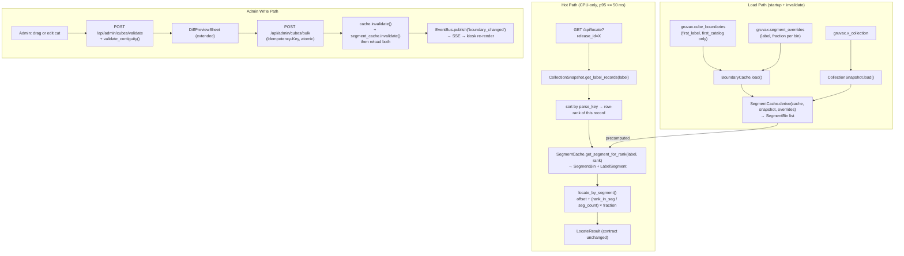

# Phase 5: Segment-Aware Position Precision — Pattern Map

**Mapped:** 2026-05-22
**Files analyzed:** 22 new/modified files
**Analogs found:** 22 / 22

---

## File Classification

| New/Modified File | Role | Data Flow | Closest Analog | Match Quality |
|-------------------|------|-----------|----------------|---------------|
| `src/gruvax/estimator/boundary_cache.py` | service | CRUD | self (refactor) | exact |
| `src/gruvax/estimator/segment_cache.py` | service | transform | `src/gruvax/estimator/boundary_cache.py` | role-match |
| `src/gruvax/estimator/algorithm.py` | service | request-response | self (refactor) | exact |
| `src/gruvax/estimator/boundary_math.py` | utility | transform | self (refactor) | exact |
| `src/gruvax/estimator/constants.py` | config | — | self (extend) | exact |
| `src/gruvax/api/admin/cubes.py` | controller | request-response | self (extend) | exact |
| `src/gruvax/api/admin/segments.py` | controller | request-response | `src/gruvax/api/admin/cubes.py` | exact |
| `src/gruvax/api/admin/validation.py` | utility | transform | self (extend) | exact |
| `migrations/versions/0005_segment_model.py` | migration | batch | `migrations/versions/0004_admin_tables.py` | exact |
| `fixtures/synth_collection.py` | utility | transform | self (extend) | exact |
| `fixtures/boundaries.yaml` | config | — | self (update) | exact |
| `tests/unit/test_segment_cache.py` | test | transform | `tests/property/test_estimator_props.py` | role-match |
| `tests/unit/test_segment_estimator.py` | test | request-response | `tests/property/test_estimator_props.py` | role-match |
| `tests/property/test_segment_props.py` | test | transform | `tests/property/test_estimator_props.py` | exact |
| `tests/integration/test_segment_api.py` | test | request-response | `tests/property/test_estimator_props.py` | role-match |
| `tests/integration/test_migrate_0005.py` | test | batch | `tests/property/test_estimator_props.py` | role-match |
| `frontend/src/routes/admin/CutPointEditor.tsx` | component | request-response | `frontend/src/routes/admin/CubeEditor.tsx` | exact |
| `frontend/src/routes/admin/SegmentEditorPanel.tsx` | component | request-response | `frontend/src/routes/admin/CubeEditor.tsx` | role-match |
| `frontend/src/routes/admin/SegmentStrip.tsx` | component | event-driven | `frontend/src/routes/kiosk/Cube.tsx` | role-match |
| `frontend/src/routes/admin/SegmentLegend.tsx` | component | request-response | `frontend/src/routes/admin/DiffPreviewSheet.tsx` | role-match |
| `frontend/src/routes/admin/RecordPickerSheet.tsx` | component | request-response | `frontend/src/routes/admin/CubeEditor.tsx` | exact |
| `frontend/src/routes/admin/DiffPreviewSheet.tsx` | component | request-response | self (extend) | exact |

---

## Architectural Flow



---

## Pattern Assignments

### `src/gruvax/estimator/boundary_cache.py` (service, CRUD — refactor)

**Analog:** `/Users/Robert/Code/public/GRUVAX/src/gruvax/estimator/boundary_cache.py` (self)

**Current `BoundaryRow` shape** (lines 22–37 — DROP `last_label` and `last_catalog` here):

```python
@dataclass(frozen=True)
class BoundaryRow:
    unit_id: int
    row: int
    col: int
    first_label: str | None
    first_catalog: str | None
    last_label: str | None      # DROPPED in Phase 5 — derived, never stored
    last_catalog: str | None    # DROPPED in Phase 5 — derived, never stored
    is_empty: bool
```

**Phase 5 target shape:**

```python
@dataclass(frozen=True)
class BoundaryRow:
    unit_id: int
    row: int
    col: int
    first_label: str | None    # the cut point
    first_catalog: str | None  # the cut point
    is_empty: bool
    # last_label and last_catalog are DERIVED from SegmentCache — not stored
```

**`load()` SQL pattern** (lines 57–73 — copy structure, drop last_* columns):

```python
async def load(self, pool: AsyncConnectionPool[AsyncConnection[object]]) -> None:
    async with pool.connection() as conn, conn.cursor() as cur:
        await cur.execute(
            "SELECT unit_id, row, col, first_label, first_catalog, is_empty"
            " FROM gruvax.cube_boundaries ORDER BY unit_id, row, col"
        )
        rows_raw = await cur.fetchall()
        self._rows = [BoundaryRow(*row) for row in rows_raw]  # type: ignore[misc]

    # Phase 5 addition: also load segment_overrides
    async with pool.connection() as conn, conn.cursor() as cur:
        await cur.execute(
            "SELECT unit_id, row, col, label, fraction"
            " FROM gruvax.segment_overrides"
        )
        overrides_raw = await cur.fetchall()
        self._overrides = {
            (int(r[0]), int(r[1]), int(r[2]), str(r[3])): float(r[4])
            for r in overrides_raw
        }
```

**`_load_rows` test seam** (lines 75–81 — copy exactly for `_load_rows` seam pattern; also add `_load_overrides`):

```python
def _load_rows(self, rows: list[BoundaryRow]) -> None:
    self._rows = list(rows)

def _load_overrides(self, overrides: dict[tuple[int, int, int, str], float]) -> None:
    self._overrides = dict(overrides)
```

**`invalidate()` pattern** (lines 87–99 — copy structure, add `_overrides` flush):

```python
def invalidate(self) -> None:
    self._rows = []
    self._overrides = {}  # Phase 5 addition
```

**Callsite impact — every construction of `BoundaryRow(...)` must drop `last_label`/`last_catalog`:**

- `fixtures/synth_collection.py` `_build_cache()` lines 41–52
- `api/admin/cubes.py` `_compute_movement_counts()` lines 518–527
- `tests/conftest.py` boundary fixture loader

---

### `src/gruvax/estimator/segment_cache.py` (service, transform — NEW)

**Analog:** `/Users/Robert/Code/public/GRUVAX/src/gruvax/estimator/boundary_cache.py`

**Mirror the module-level structure** (module docstring, `from __future__ import annotations`, TYPE_CHECKING guard, frozen dataclasses, single cache class):

**Imports pattern** (copy from `boundary_cache.py` lines 1–20):

```python
"""In-memory derived segment structure for the GRUVAX position estimator.

Derived from BoundaryCache (cut points) + CollectionSnapshot (per-label records).
Never stored in DB. Populated at startup and on every boundary_cache.invalidate().

Phase 5: SegmentCache is the seam where two-level interpolation reads segment
fractions. It is fully CPU-only — no DB access during derive() or lookup.
"""

from __future__ import annotations

from dataclasses import dataclass, field
from typing import TYPE_CHECKING

if TYPE_CHECKING:
    from gruvax.estimator.boundary_cache import BoundaryCache, BoundaryRow
    from gruvax.estimator.collection_snapshot import CollectionSnapshot
```

**Dataclass pattern** (mirror `BoundaryRow` frozen dataclass style from lines 22–37 of `boundary_cache.py`):

```python
@dataclass(frozen=True)
class LabelSegment:
    """One label's presence within a single bin."""
    label: str
    first_rank_in_label: int       # 0-indexed rank of first record in this bin
    last_rank_in_label: int        # 0-indexed rank of last record in this bin
    segment_count: int             # = last_rank - first_rank + 1; row-count, never arithmetic
    auto_fraction: float           # count-derived: segment_count / total_bin_count
    applied_fraction: float        # override ?? auto_fraction; see Pitfall 2 normalization
    offset_in_bin: float           # cumulative sum of applied_fractions of preceding segments
    is_override: bool
    continues: bool                # True if label continues into the next bin

@dataclass(frozen=True)
class SegmentBin:
    """One Kallax cube with its ordered list of label segments."""
    unit_id: int
    row: int
    col: int
    cut_label: str | None          # = BoundaryRow.first_label (the cut point)
    cut_catalog: str | None        # = BoundaryRow.first_catalog (the cut point)
    segments: tuple[LabelSegment, ...]  # ordered by global (label casefold, parse_key)
```

**Cache class pattern** (mirror `BoundaryCache` class structure from lines 40–99):

```python
class SegmentCache:
    def __init__(self) -> None:
        self._bins: list[SegmentBin] = []
        self._by_coord: dict[tuple[int, int, int], SegmentBin] = {}

    def derive(
        self,
        cache: BoundaryCache,
        snapshot: CollectionSnapshot,
        overrides: dict[tuple[int, int, int, str], float],
    ) -> None:
        """Populate from cut points + collection snapshot.
        Called after BoundaryCache.load() at startup and after every invalidate()+reload().
        Never called on the hot request path.
        """
        ...

    def _load_bins(self, bins: list[SegmentBin]) -> None:
        """Test seam: bypass derive() — mirrors BoundaryCache._load_rows()."""
        self._bins = list(bins)
        self._by_coord = {(b.unit_id, b.row, b.col): b for b in bins}

    def get_bin(self, unit_id: int, row: int, col: int) -> SegmentBin | None:
        return self._by_coord.get((unit_id, row, col))

    def get_bins_for_label(self, label: str) -> list[SegmentBin]:
        key = label.casefold()
        return [b for b in self._bins if any(s.label.casefold() == key for s in b.segments)]

    def get_segment_for_rank(
        self, label: str, rank: int
    ) -> tuple[SegmentBin, LabelSegment] | None:
        """Find the bin+segment where this label's record at `rank` lives."""
        key = label.casefold()
        for bin_ in self._bins:
            for seg in bin_.segments:
                if seg.label.casefold() == key:
                    if seg.first_rank_in_label <= rank <= seg.last_rank_in_label:
                        return bin_, seg
        return None

    def invalidate(self) -> None:
        """Mirror BoundaryCache.invalidate() — called alongside it."""
        self._bins = []
        self._by_coord = {}
```

**Override normalization (Pitfall 2 — must be inside `derive()`):**

```python
# Apply overrides; renormalize non-overridden segments to fill remaining space.
# Step 1: collect overridden fractions
# Step 2: remaining = 1.0 - sum(overridden fractions)
# Step 3: distribute remaining proportionally among non-overridden by raw count
# Step 4: assert abs(sum(applied_fractions) - 1.0) < 1e-6
```

**Label vs catalog comparison rule** (from `collection_snapshot.py` lines 71–73 and `boundary_math.py` lines 67–68):

```python
# Labels: always .casefold() — NEVER parse_key() (Pitfall C)
# Catalogs: always parse_key() — NEVER raw string (POS-01)
label_key = label.casefold()
sorted_by_catalog = sorted(recs, key=lambda r: parse_key(r.catalog_number))
```

---

### `src/gruvax/estimator/algorithm.py` (service, request-response — refactor)

**Analog:** `/Users/Robert/Code/public/GRUVAX/src/gruvax/estimator/algorithm.py` (self)

**Module docstring** (lines 1–21 — extend existing, add Phase 5 note):

```python
"""Phase 1 + Phase 5 position estimators for GRUVAX.

Phase 1: cube-only fallback (INTERPOLATION.md §4.8) — ``locate_cube_only``.
Phase 5: segment-aware two-level interpolation — ``locate_by_segment`` (replaces §4.1).
         ``locate_by_index`` is RETIRED. ``locate`` dispatcher updated.
         estimator_version = "segment-v1".
...
"""
```

**Imports pattern** (lines 23–44 — add `SegmentCache` import alongside existing):

```python
from __future__ import annotations

from gruvax.estimator.boundary_cache import BoundaryCache
from gruvax.estimator.collection_snapshot import CollectionSnapshot, RecordRow
from gruvax.estimator.constants import POSITION_HALF_WIDTH, compute_confidence
from gruvax.estimator.contract import (
    CUBE_ONLY_CONFIDENCE,
    NO_BOUNDARY_CONFIDENCE,
    CubeRef,
    LocateResult,
    SubInterval,
)
from gruvax.estimator.normalize import parse_key
from gruvax.estimator.segment_cache import SegmentCache  # Phase 5 addition
```

**`locate_cube_only()` signature change** (lines 47–52 — add `segment_cache` and `snapshot` params; remove `cache: BoundaryCache`):

```python
def locate_cube_only(
    release_id: int,
    label: str,
    catalog_number: str,
    segment_cache: SegmentCache,
    snapshot: CollectionSnapshot,
) -> LocateResult:
    """§4.8 fallback: find covering bin via SegmentCache (replaces old last_* range check).

    Coverage semantics (Phase 5 — last_* dropped from BoundaryRow):
      1. Get label records from snapshot; sort by parse_key; find row-rank.
      2. Call segment_cache.get_segment_for_rank(label, rank).
      3. A bin covers this record iff its unit_id/row/col match the returned SegmentBin.
    """
    label_records: list[RecordRow] = snapshot.get_label_records(label)
    sorted_recs = sorted(label_records, key=lambda r: parse_key(r.catalog_number))
    rank = next(
        (i for i, r in enumerate(sorted_recs) if r.release_id == release_id),
        None,
    )
    if rank is None:
        return LocateResult(
            release_id=release_id, primary_cube=None, label_span=[],
            sub_cube_interval=None, confidence=NO_BOUNDARY_CONFIDENCE,
        )
    # ... rest mirrors current locate_cube_only return logic (lines 103–121)
```

**New `locate_by_segment()` function** (replace `locate_by_index()` — copy its structural layout from lines 124–268):

```python
def locate_by_segment(
    release_id: int,
    label: str,
    catalog_number: str,
    segment_cache: SegmentCache,
    snapshot: CollectionSnapshot,
) -> LocateResult:
    """§4.1 replacement: two-level interpolation using SegmentCache.

    Single-segment bin degeneracy (D-02 regression invariant):
      When a bin has exactly one LabelSegment, the formula reduces to:
        offset=0, fraction=1.0 → f = rank / (k-1)
      which is exactly the retired §4.1 formula. Test this invariant explicitly.

    Algorithm:
      1. Get label records from snapshot; sort by parse_key (mirrors locate_by_index step 3).
      2. Find row-rank of this release_id (mirrors step 5 — fall back to cube-only if None).
      3. Call segment_cache.get_segment_for_rank(label, rank) → (bin, seg).
         If None → fall back to locate_cube_only result.
      4. offset = seg.offset_in_bin
      5. rank_in_segment = rank - seg.first_rank_in_label
      6. if seg.segment_count <= 1:
             f = offset + seg.applied_fraction * 0.5  # midpoint for singletons
         else:
             f = offset + (rank_in_segment / (seg.segment_count - 1)) * seg.applied_fraction
      7. start = max(0.0, f - POSITION_HALF_WIDTH)
         end   = min(1.0, f + POSITION_HALF_WIDTH)
      8. confidence = compute_confidence(len(sorted_recs))
         estimator_version = "segment-v1"
    """
```

**`locate()` dispatcher pattern** (lines 271–329 — update to call `locate_by_segment`):

```python
def locate(
    release_id: int,
    label: str,
    catalog_number: str,
    segment_cache: SegmentCache,   # replaces cache: BoundaryCache
    snapshot: CollectionSnapshot,
) -> LocateResult:
    """Dispatcher: segment-aware estimator with §4.8 cube-only fallback."""
    if not snapshot.get_label_records(label):
        result = locate_cube_only(
            release_id=release_id, label=label, catalog_number=catalog_number,
            segment_cache=segment_cache, snapshot=snapshot,
        )
        result.estimator_version = "cube-only-v1"
        return result

    result = locate_by_segment(
        release_id=release_id, label=label, catalog_number=catalog_number,
        segment_cache=segment_cache, snapshot=snapshot,
    )
    # Mirror lines 319–328: strip sub_cube_interval when confidence is too low
    if result.confidence <= CUBE_ONLY_CONFIDENCE:
        return LocateResult(
            release_id=release_id, primary_cube=result.primary_cube,
            label_span=result.label_span, sub_cube_interval=None,
            confidence=result.confidence, estimator_version="cube-only-v1",
        )
    return result
```

---

### `src/gruvax/estimator/boundary_math.py` (utility, transform — refactor)

**Analog:** `/Users/Robert/Code/public/GRUVAX/src/gruvax/estimator/boundary_math.py` (self)

**`count_records_in_boundary()` must be rewritten** (lines 113–129). After Phase 5, `BoundaryRow` has no `last_*` fields. Replace the function:

```python
def count_records_in_bin(bin_: "SegmentBin") -> int:
    """Count records in a bin using pre-derived LabelSegment.segment_count totals.

    Does NOT consult snapshot — counts come from SegmentCache's pre-derived values.
    Returns 0 for bins with no segments (is_empty).
    """
    return sum(seg.segment_count for seg in bin_.segments)
```

The old `get_records_in_boundary()` function (lines 37–110, which uses `last_label`/`last_catalog`) is **retired**. Record enumeration for the estimator now comes from `CollectionSnapshot.get_label_records()` with rank-based slicing via `SegmentCache`.

**`suggest_midpoint()` and `sample_records()`** (lines 132–222) are unchanged — they operate on `CollectionSnapshot` records and do not reference `BoundaryRow.last_*`.

---

### `src/gruvax/estimator/constants.py` (config — extend)

**Analog:** `src/gruvax/estimator/constants.py` (self — add one constant)

```python
# Phase 5: segment-aware estimator version string
SEGMENT_ESTIMATOR_VERSION: str = "segment-v1"
```

---

### `migrations/versions/0005_segment_model.py` (migration, batch — NEW)

**Analog:** `/Users/Robert/Code/public/GRUVAX/migrations/versions/0004_admin_tables.py`

**Module conventions** (lines 1–24 — copy exactly):

```python
"""Drop last_* columns from cube_boundaries; add segment_overrides table.

Revision ID: 0005
Revises: 0004
Create Date: 2026-05-22

Conventions (carried from 0001-0004):
- All DDL via op.execute() with explicit constraint/index names.
- downgrade() drops/restores in reverse with IF EXISTS guards.
- alembic_version in public; search_path via connect listener (env.py unchanged).
"""

from __future__ import annotations

from alembic import op

revision: str = "0005"
down_revision: str | None = "0004"
branch_labels: str | None = None
depends_on: str | None = None
```

**`upgrade()` pattern** (copy `op.execute()` style from `0004_admin_tables.py` lines 37–146):

```python
def upgrade() -> None:
    # 1. Drop derived columns (now computed by SegmentCache)
    op.execute("""
        ALTER TABLE gruvax.cube_boundaries
            DROP COLUMN IF EXISTS last_label,
            DROP COLUMN IF EXISTS last_catalog
    """)

    # 2. Relax constraint: a cube is valid with only first_* (cut-point model)
    op.execute("ALTER TABLE gruvax.cube_boundaries DROP CONSTRAINT IF EXISTS empty_or_complete")
    op.execute("""
        ALTER TABLE gruvax.cube_boundaries ADD CONSTRAINT cut_point_complete CHECK (
            is_empty
            OR (first_label IS NOT NULL AND first_catalog IS NOT NULL)
        )
    """)

    # 3. Extend boundary_history.source CHECK to include 'cut_insert'
    #    Keep existing last_* columns in boundary_history as nullable historical artifact.
    op.execute(
        "ALTER TABLE gruvax.boundary_history"
        " DROP CONSTRAINT IF EXISTS boundary_history_source_check"
    )
    op.execute("""
        ALTER TABLE gruvax.boundary_history
            ADD CONSTRAINT boundary_history_source_check
            CHECK (source IN ('manual', 'bulk', 'revert', 'cut_insert'))
    """)

    # 4. New segment_overrides table (keyed by (unit_id, row, col, label))
    op.execute("""
        CREATE TABLE gruvax.segment_overrides (
            unit_id     SMALLINT    NOT NULL
                            REFERENCES gruvax.units(id) ON DELETE RESTRICT,
            row         SMALLINT    NOT NULL,
            col         SMALLINT    NOT NULL,
            label       TEXT        NOT NULL,
            fraction    REAL        NOT NULL
                            CHECK (fraction > 0.0 AND fraction <= 1.0),
            updated_at  TIMESTAMPTZ NOT NULL DEFAULT now(),
            PRIMARY KEY (unit_id, row, col, label),
            FOREIGN KEY (unit_id, row, col)
                REFERENCES gruvax.cube_boundaries (unit_id, row, col) ON DELETE CASCADE
        )
    """)
```

**`downgrade()` pattern** (copy `IF EXISTS` guard style from `0004_admin_tables.py` lines 149–155):

```python
def downgrade() -> None:
    op.execute("DROP TABLE IF EXISTS gruvax.segment_overrides")
    op.execute(
        "ALTER TABLE gruvax.boundary_history"
        " DROP CONSTRAINT IF EXISTS boundary_history_source_check"
    )
    op.execute("""
        ALTER TABLE gruvax.boundary_history
            ADD CONSTRAINT boundary_history_source_check
            CHECK (source IN ('manual', 'bulk', 'revert'))
    """)
    op.execute("ALTER TABLE gruvax.cube_boundaries DROP CONSTRAINT IF EXISTS cut_point_complete")
    op.execute("""
        ALTER TABLE gruvax.cube_boundaries ADD CONSTRAINT empty_or_complete CHECK (
            is_empty
            OR (first_label IS NOT NULL AND first_catalog IS NOT NULL
                AND last_label IS NOT NULL AND last_catalog IS NOT NULL)
        )
    """)
    op.execute("""
        ALTER TABLE gruvax.cube_boundaries
            ADD COLUMN IF NOT EXISTS last_label   TEXT,
            ADD COLUMN IF NOT EXISTS last_catalog TEXT
    """)
```

---

### `src/gruvax/api/admin/segments.py` (controller, request-response — NEW)

**Analog:** `/Users/Robert/Code/public/GRUVAX/src/gruvax/api/admin/cubes.py`

**Imports + router pattern** (copy `cubes.py` lines 33–56 exactly, adjust tags):

```python
from __future__ import annotations

import logging
from typing import Any

from fastapi import APIRouter, Depends, Path, Request
from fastapi.responses import JSONResponse
from pydantic import BaseModel

from gruvax.api.deps import (
    get_boundary_cache,
    get_collection_snapshot,
    get_event_bus,
    get_pool,
    get_segment_cache,   # new dep
    require_admin,
)
from gruvax.estimator.boundary_cache import BoundaryCache
from gruvax.estimator.collection_snapshot import CollectionSnapshot
from gruvax.estimator.segment_cache import SegmentCache
from gruvax.events.bus import EventBus

logger = logging.getLogger(__name__)
router = APIRouter(tags=["admin-segments"])
```

**GET segment data endpoint** (copy `get_cube_boundary()` structure from `cubes.py` lines 180–213):

```python
@router.get("/cubes/{unit_id}/{row}/{col}/segments")
async def get_cube_segments(
    request: Request,
    unit_id: int = Path(ge=1),
    row: int = Path(ge=0),
    col: int = Path(ge=0),
    segment_cache: SegmentCache = Depends(get_segment_cache),
    _admin: dict[str, Any] = Depends(require_admin),
) -> dict[str, Any]:
    """Return derived segment data for one bin (no DB access — reads SegmentCache).

    Response: {segments: [{label, fraction, is_override, auto_fraction, continues, segment_count}]}
    HTTP 404 if no bin exists for the given coordinates.
    """
```

**Write endpoints** follow the `put_cube_boundary()` pattern (lines 216–374) — validate, write, `invalidate()`, `bus.publish()`. See Shared Patterns section for the exact invalidation sequence.

---

### `src/gruvax/api/admin/cubes.py` (controller, request-response — extend)

**Analog:** self — three specific sites to update.

**`BoundaryEdit` model** (lines 61–73 — drop `last_label`/`last_catalog` fields):

```python
class BoundaryEdit(BaseModel):
    unit_id: int
    row: int
    col: int
    first_label: str | None = None
    first_catalog: str | None = None
    # last_label and last_catalog REMOVED — derived by SegmentCache
    is_empty: bool = False
    force: bool = False
```

**`get_admin_cubes()` fill-level pattern** (lines 127–177 — replace `count_records_in_boundary(boundary_row, snapshot)` with `count_records_in_bin(segment_bin)`):

```python
# Replace (line 168):
count = count_records_in_boundary(boundary_row, snapshot)
# With:
seg_bin = segment_cache.get_bin(cube["unit_id"], cube["row"], cube["col"])
count = count_records_in_bin(seg_bin) if seg_bin else 0
```

**`_compute_movement_counts()` synthetic `BoundaryRow` site** (lines 509–528 — remove `last_label`/`last_catalog` from the constructor call):

```python
proposed = BoundaryRow(
    unit_id=edit.unit_id,
    row=edit.row,
    col=edit.col,
    first_label=edit.first_label,
    first_catalog=edit.first_catalog,
    # last_label and last_catalog removed — Phase 5 cut-point model
    is_empty=edit.is_empty,
)
```

**`validate_boundary` endpoint extension** (lines 377–492 — add contiguity check after phantom check):

```python
# Phase 5: after phantom check, before movement counts
contiguity_error = validate_contiguity(body.updates, segment_cache)
if contiguity_error:
    return JSONResponse(status_code=400, content={
        "type": "contiguity_violation",
        "message": contiguity_error,
    })
```

**`bulk_write_cubes` invalidation extension** (lines 813–822 — add `segment_cache` calls):

```python
cache.invalidate()
segment_cache.invalidate()   # Phase 5 addition
try:
    await cache.load(pool)
    segment_cache.derive(cache, snapshot, cache._overrides)  # Phase 5
finally:
    await bus.publish("boundary_changed", {...})
```

---

### `src/gruvax/api/admin/validation.py` (utility, transform — extend)

**Analog:** `/Users/Robert/Code/public/GRUVAX/src/gruvax/api/admin/validation.py` (self)

**Module structure** (copy lines 1–17 — same import style):

```python
"""POS-01 boundary order validation + Phase 5 contiguity validation.

validate_boundary_order: unchanged from Phase 3 — first <= last comparator.
validate_contiguity: new — rejects cuts that scatter a label across non-adjacent bins.
"""

from __future__ import annotations

from gruvax.estimator.normalize import parse_key
from gruvax.estimator.segment_cache import SegmentCache  # Phase 5
```

**`validate_boundary_order()` unchanged** (lines 21–57 — copy as-is).

**New `validate_contiguity()` function** (mirror `validate_boundary_order()` signature style — sync, no DB, returns `str | None`):

```python
def validate_contiguity(
    proposed_updates: list[Any],
    segment_cache: SegmentCache,
) -> str | None:
    """Return an error message iff any proposed cut-point set scatters a label
    across non-adjacent bins. Returns None when all labels remain contiguous.

    Rules (D-09):
      - A label spanning N adjacent bins: valid.
      - A label appearing in non-adjacent bins: rejected.
    """
    ...
    return None  # all labels contiguous
```

---

### `fixtures/synth_collection.py` (utility, transform — extend)

**Analog:** `/Users/Robert/Code/public/GRUVAX/fixtures/synth_collection.py` (self)

**`_build_cache()` must drop `last_label`/`last_catalog`** (lines 31–54):

```python
def _build_cache(
    label: str,
    first_cat: str,
    unit_id: int = 1,
    row: int = 0,
    col: int = 0,
) -> BoundaryCache:
    """Build a BoundaryCache with a single cube (cut-point model, Phase 5)."""
    rows = [
        BoundaryRow(
            unit_id=unit_id, row=row, col=col,
            first_label=label,
            first_catalog=first_cat,
            # last_label and last_catalog removed — Phase 5 cut-point model
            is_empty=False,
        )
    ]
    cache = BoundaryCache()
    cache._load_rows(rows)
    return cache
```

**New factory functions** (copy `make_uniform_dense()` structure from lines 79–97 for multi-label and straddle shapes):

```python
def make_multi_label_bin() -> tuple[BoundaryCache, SegmentCache, CollectionSnapshot]:
    """Two labels in one bin — tests segment derivation and two-level interpolation."""
    ...

def make_straddle() -> tuple[BoundaryCache, SegmentCache, CollectionSnapshot]:
    """One label spanning two adjacent bins — tests straddle resolution (D-08, D-09)."""
    ...
```

---

## Frontend Pattern Assignments

### `frontend/src/routes/admin/CutPointEditor.tsx` (component, request-response — NEW)

**Analog:** `/Users/Robert/Code/public/GRUVAX/frontend/src/routes/admin/CubeEditor.tsx`

**Imports pattern** (lines 26–38 of `CubeEditor.tsx` — copy structure):

```typescript
import { useCallback, useEffect, useMemo, useRef, useState } from 'react'
import { useParams, useNavigate } from 'react-router'
import { useQuery } from '@tanstack/react-query'
import {
  getUnitSegments,       // GET /api/admin/cubes/:u/:r/:c/segments
  validateCutPoint,      // POST /api/admin/cubes/validate (extended)
  createEditingHeartbeat,
} from '../../api/adminClient'
import { useAdminStore } from '../../state/adminStore'
```

**Route params pattern** (lines 155–165 of `CubeEditor.tsx` — copy exactly):

```typescript
export function CutPointEditor() {
  const { unit, row, col } = useParams<{ unit: string; row: string; col: string }>()
  const navigate = useNavigate()
  const { pendingChangeSet, setPendingChangeSet } = useAdminStore()
  const unitId = Number(unit)
  const rowNum = Number(row)
  const colNum = Number(col)
```

**TanStack Query fetch pattern** (lines 170–178 of `CubeEditor.tsx` — copy `useQuery` structure):

```typescript
const { data: segmentsData, isLoading } = useQuery({
  queryKey: ['admin', 'segments', unitId, rowNum, colNum],
  queryFn: () => getUnitSegments(unitId, rowNum, colNum),
})
```

**Editing heartbeat pattern** (lines 308–329 of `CubeEditor.tsx` — copy exactly):

```typescript
const heartbeat = useMemo(() => createEditingHeartbeat(), [])
const editingCubeIds = useMemo(
  () => [{ unit: unitId, row: rowNum, col: colNum }],
  [unitId, rowNum, colNum],
)
useEffect(() => {
  if (dirty) heartbeat.signal(editingCubeIds, true)
}, [fields, seededBoundary, heartbeat, editingCubeIds])
useEffect(() => {
  return () => heartbeat.signal(editingCubeIds, false)
}, [heartbeat, editingCubeIds])
```

**Add-to-pending pattern** (lines 357–399 of `CubeEditor.tsx` — copy `setPendingChangeSet` merge logic):

```typescript
function handleStageChanges() {
  const now = new Date().toISOString()
  const existing = pendingChangeSet
  if (existing) {
    const otherEdits = existing.edits.filter(
      (e) => !(e.unit_id === unitId && e.row === rowNum && e.col === colNum),
    )
    setPendingChangeSet({ ...existing, edits: [...otherEdits, newEdit] })
  } else {
    setPendingChangeSet({ id: crypto.randomUUID(), created_at: now, edits: [newEdit] })
  }
}
```

**Phantom warning pattern** (lines 469–509 of `CubeEditor.tsx` — copy `phantom-chip` + `near-miss-chip` + `USE ANYWAY` structure for the `RecordPickerSheet`):

```typescript
{hasPhantom && !force && (
  <div className="phantom-chip" role="alert">
    <span className="phantom-chip-icon" aria-hidden="true">!</span>
    <span className="phantom-chip-text">
      No match in collection. Did you mean one of these?
    </span>
    {nearMisses.slice(0, 3).map((nm) => (
      <button key={nm.release_id} type="button" className="near-miss-chip"
        onClick={() => applyNearMiss(nm)}>
        {nm.label} / {nm.catalog_number}
      </button>
    ))}
    <button type="button" className="phantom-force-btn"
      onClick={() => setForce(true)}>
      USE ANYWAY
    </button>
  </div>
)}
```

**Design token constraint** (from `CubeEditor.tsx` line 24 — non-negotiable):

```typescript
// Design tokens only — no hardcoded hex (CLAUDE.md constraint)
// All className references resolve to CSS rules using var(--gruvax-*) tokens
```

---

### `frontend/src/routes/admin/SegmentStrip.tsx` (component, event-driven — NEW)

**Analog:** `/Users/Robert/Code/public/GRUVAX/frontend/src/routes/kiosk/Cube.tsx`

**Component structure pattern** (lines 1–44 of `Cube.tsx` — typed interface + pure function component with `data-*` for CSS state):

```typescript
// Mirror: typed interface → pure function component → data-* attributes for CSS
interface Segment {
  label: string
  fraction: number        // 0–1; all segments in bin sum to 1.0
  isOverride: boolean
  autoFraction: number
  continues: boolean      // true = straddle fade + caption
}
interface SegmentStripProps {
  segments: Segment[]
  onDragSetOverride?: (index: number, newFraction: number) => void
  isReadOnly?: boolean    // true = mini variant (24px, no drag)
}
```

**DOM build constraint** (per UI-SPEC §B and `boundary-editing.md` — security + correctness):

```typescript
// Build drag handles with el() helper + strip.replaceChildren() on each render.
// The el() helper pattern creates elements via document.createElement() and sets
// properties safely via typed assignments — never via string concatenation into
// the DOM's raw content setter. This is a hard constraint from boundary-editing.md.
const grip = el('div', { className: 'drag-handle', role: 'slider', ... })
strip.replaceChildren(...segments.map(renderSegment))
```

**Pointer-capture drag pattern** (from UI-SPEC §B):

```typescript
// Conserve sum between adjacent pair only; clamp at MIN = 0.05
handle.addEventListener('pointerdown', (ev) => {
  handle.setPointerCapture(ev.pointerId)
  const rect = strip.getBoundingClientRect()
  const left  = sumFractions(segs, 0, i)
  const right = sumFractions(segs, 0, i + 2)
  const MIN   = 0.05

  const move = (ev: PointerEvent) => {
    let pos = (ev.clientX - rect.left) / rect.width
    pos = Math.max(left + MIN, Math.min(right - MIN, pos))
    segs[i].fraction   = pos - left
    segs[i + 1].fraction = right - pos  // sum conserved
    renderAll()
  }
  const up = () => {
    handle.removeEventListener('pointermove', move)
    handle.removeEventListener('pointerup', up)
    onDragSetOverride?.(i, segs[i].fraction)
  }
  handle.addEventListener('pointermove', move)
  handle.addEventListener('pointerup', up)
})
```

**Segment fill color** (from UI-SPEC §Color — cycle by index per bin, never hardcode):

```typescript
const SEGMENT_FILL_TOKENS = [
  '--gruvax-blue',
  '--gruvax-blue-light',
  '--gruvax-blue-dark',
] as const
// index % SEGMENT_FILL_TOKENS.length → token; reset per bin (not across bins)
```

---

### `frontend/src/routes/admin/SegmentLegend.tsx` (component, request-response — NEW)

**Analog:** `/Users/Robert/Code/public/GRUVAX/frontend/src/routes/admin/DiffPreviewSheet.tsx`

**Warning/status chip pattern** (lines 279–368 of `DiffPreviewSheet.tsx` — copy `role="alert"/"status"` + className-based styling for the AUTO/OVERRIDE/drift chips):

```typescript
{isDrifted && (
  <div className="override-chip override-chip--drifted" role="status">
    <AlertCircle size={14} aria-hidden="true" />
    OVERRIDE {Math.round(overrideFraction * 100)}% · auto now{' '}
    {Math.round(autoFraction * 100)}% · review
    <button type="button" className="resync-btn"
      onClick={() => onResync(segment.label, autoFraction)}>
      reset to {Math.round(autoFraction * 100)}%
    </button>
  </div>
)}
```

**Drift threshold constant** (from UI-SPEC §C — researcher discretion from D-03):

```typescript
const DRIFT_THRESHOLD = 0.03  // 3 percentage points
const isDrifted = Math.abs(overrideFraction - autoFraction) > DRIFT_THRESHOLD
```

---

### `frontend/src/routes/admin/RecordPickerSheet.tsx` (component, request-response — NEW)

**Analog:** `frontend/src/routes/admin/CubeEditor.tsx` — the `Autocomplete` sub-component (lines 66–153) is the direct source to extract into a standalone sheet.

**Two-step autocomplete pattern** (lines 215–228 of `CubeEditor.tsx` — copy `useQuery` + `enabled` guard):

```typescript
const { data: catalogsData } = useQuery({
  queryKey: ['admin', 'catalogs', chosenLabel],
  queryFn: () => getCatalogsForLabel(chosenLabel),
  enabled: chosenLabel.trim().length > 0,  // step 2 enabled only after step 1
  staleTime: 5 * 60_000,
})
```

**Bottom-sheet ARIA pattern** (from UI-SPEC §F):

```typescript
// role="dialog" aria-modal="true" aria-labelledby={headingId}
// Overlay scrim uses var(--gruvax-overlay-scrim) token
// Slide-up: CSS transition transform 250ms var(--gruvax-ease-decelerate)
```

**Duplicate/variant row display** (from UI-SPEC §F — "honesty rule" from `boundary-editing.md`):

```typescript
// Each picker row shows a secondary DM Mono 11px line for dupes/variants:
// "· 2nd copy" or "· remix"
// This is display-only — no data model change
```

---

### `frontend/src/routes/admin/SegmentEditorPanel.tsx` (component, request-response — NEW)

**Analog:** `frontend/src/routes/admin/CubeEditor.tsx`

**"PREVIEW CHANGES" CTA** (mirrors `CubeEditor.tsx` lines 613–624 — disabled until a change is staged):

```typescript
<button
  type="button"
  className="editor-btn-primary"
  onClick={() => void navigate('/admin/preview')}
  disabled={!hasChanges}
>
  PREVIEW CHANGES
</button>
```

**Panel layout** (mirrors `.cube-editor-body` layout structure — full-width sections):

```typescript
// Contains: SegmentStrip (88px, draggable) + SegmentLegend + PREVIEW CHANGES CTA
// Inline expand below bin card OR sub-route at /admin/cubes/:u/:r/:c/segments
```

---

### `frontend/src/routes/admin/DiffPreviewSheet.tsx` (component, request-response — EXTEND)

**Analog:** self — new diff-row renderers follow the existing `diff-cube-card` pattern (lines 298–367).

**New change-type rows** (copy the existing BEFORE/AFTER `<tr>` structure from lines 314–337):

```typescript
{changeType === 'cut_point' && (
  <tr>
    <td className="diff-field-label">CUT POINT</td>
    <td className="diff-field-value diff-field-before">
      {before?.first_label} · {before?.first_catalog}
    </td>
    <td className="diff-field-value">
      {edit.first_label} · {edit.first_catalog}
    </td>
  </tr>
)}
{orphanOverride && (
  <div className="diff-warning diff-warning--orphan" role="alert">
    Override removed: {orphanLabel} in BIN {binN} — label no longer in this bin.
  </div>
)}
```

---

### Tests (all new test files)

**Analog:** `/Users/Robert/Code/public/GRUVAX/tests/property/test_estimator_props.py`

**Session-scoped fixture pattern** (lines 26–42 — copy for all new test files):

```python
@pytest.fixture(scope="session")
def multi_label_bin_fixture():
    """Session-scoped multi-label bin cache + segment_cache + snapshot (no DB)."""
    return make_multi_label_bin()

@pytest.fixture(scope="session")
def straddle_fixture():
    return make_straddle()
```

**No-DB seam pattern** (the `_load_rows` / `_load_snapshot` / `_load_bins` pattern from `synth_collection.py` lines 30–73):

```python
cache = BoundaryCache()
cache._load_rows(rows)
snapshot = CollectionSnapshot()
snapshot._load_snapshot(by_label)
segment_cache = SegmentCache()
segment_cache._load_bins(bins)  # test seam added in Phase 5
```

**Hypothesis invariant test pattern** (lines 173–193 — copy `@given` + `@settings` structure):

```python
@given(release_id=st.integers(min_value=1, max_value=20))
@settings(max_examples=50, suppress_health_check=[HealthCheck.function_scoped_fixture])
def test_hypothesis_fractions_sum_to_one(release_id: int) -> None:
    cache, seg_cache, snapshot = make_multi_label_bin()
    for bin_ in seg_cache._bins:
        total = sum(seg.applied_fraction for seg in bin_.segments)
        assert abs(total - 1.0) < 1e-6
```

**D-02 regression invariant pattern** (must independently verify SegmentCache state before asserting estimator equality — Pitfall 5):

```python
def test_single_segment_bin_reproduces_v1_index(single_segment_fixture) -> None:
    cache, seg_cache, snapshot = single_segment_fixture
    bin_ = seg_cache._bins[0]
    # Assert SegmentCache correctness FIRST (Pitfall 5 — avoids vacuous pass)
    assert len(bin_.segments) == 1
    assert abs(bin_.segments[0].auto_fraction - 1.0) < 1e-9
    assert bin_.segments[0].first_rank_in_label == 0
    # THEN assert estimator equality
    result_v2 = locate_by_segment(release_id, label, catalog, seg_cache, snapshot)
    result_v1 = locate_by_index(release_id, label, catalog, cache, snapshot)
    assert abs(result_v2.sub_cube_interval.start - result_v1.sub_cube_interval.start) < 1e-6
```

---

## Shared Patterns

### Authentication (all new admin endpoints)

**Source:** `src/gruvax/api/admin/cubes.py` — every handler, e.g. line 133
**Apply to:** All routes in `segments.py` and new routes in `cubes.py`

```python
_admin: dict[str, Any] = Depends(require_admin)
```

### Parameterized SQL (all DB queries)

**Source:** `src/gruvax/api/admin/cubes.py` lines 145–153, 197–202
**Apply to:** All new SQL in `segments.py` and `cubes.py`

```python
# Always %s placeholders — never f-strings with user input (T-03-16)
await cur.execute(
    "SELECT unit_id, row, col, label, fraction FROM gruvax.segment_overrides"
    " WHERE unit_id = %s AND row = %s AND col = %s",
    (unit_id, row, col),
)
```

### Cache invalidation + SSE publish pipeline

**Source:** `src/gruvax/api/admin/cubes.py` lines 360–369 (single-cube) and lines 813–822 (bulk)
**Apply to:** All write endpoints in `segments.py`; extended in `cubes.py` bulk

```python
# Pattern: invalidate → reload → publish in finally (CR-01: never strand subscribers)
cache.invalidate()
segment_cache.invalidate()           # Phase 5 addition — always alongside cache
try:
    await cache.load(pool)
    segment_cache.derive(cache, snapshot, cache._overrides)  # Phase 5
finally:
    await bus.publish("boundary_changed", {
        "cube_ids": [...],
        "change_set_id": change_set_id,
    })
```

### POS-01 catalog comparison (all estimator and validation code)

**Source:** `src/gruvax/estimator/normalize.py` — `parse_key()` and `catalog_in_range()`
**Source:** `src/gruvax/api/admin/validation.py` lines 45–57
**Apply to:** `segment_cache.py` `derive()`, `algorithm.py` `locate_by_segment()`, `validation.py` `validate_contiguity()`

```python
# Labels: .casefold() ONLY (Pitfall C)
# Catalogs: parse_key() ONLY (POS-01 / T-01-04)
from gruvax.estimator.normalize import catalog_in_range, parse_key

label_key = label.casefold()
sorted_recs = sorted(recs, key=lambda r: parse_key(r.catalog_number))
```

### Design token usage (all frontend components)

**Source:** `frontend/src/routes/admin/CubeEditor.tsx` line 24, `DiffPreviewSheet.tsx` line 17
**Apply to:** All Phase 5 frontend components

```typescript
// Design tokens only — no hardcoded hex (CLAUDE.md constraint)
// All colors: var(--gruvax-*) from gruvax-design-tokens.css
// Wrong: style={{ background: '#0051A2' }}
// Correct: className="segment-strip" (CSS uses var(--gruvax-blue))
```

### Vanilla DOM for drag builds (SegmentStrip internals)

**Source:** `boundary-editing.md` build constraint (confirmed in UI-SPEC §B and §D)
**Apply to:** `SegmentStrip.tsx` drag-handle DOM building

```typescript
// Build strip children with el() helper + strip.replaceChildren() on each render.
// The el() helper wraps document.createElement() with typed property assignment.
// This is a hard constraint from boundary-editing.md (security + event-listener safety).
```

### Idempotency-Key on bulk commits (admin write)

**Source:** `src/gruvax/api/admin/cubes.py` lines 713–718; `DiffPreviewSheet.tsx` line 210
**Apply to:** All new bulk-style writes in `segments.py` (override sets)

```python
# Backend: check → execute → store inside same transaction (Pitfall 7)
idempotency_key = request.headers.get("Idempotency-Key")
if idempotency_key:
    cached = await check_idempotency(pool, idempotency_key)
    if cached is not None:
        return JSONResponse(content=cached)
```

---

## No Analog Found

All files have analogs in the codebase. No new dependencies are required.

---

## Pitfall Summary for Planner

The following pitfalls are verified against the live codebase and must be addressed in Wave 0 before any tests run:

| Pitfall | Affected Files | Required Action |
|---------|---------------|-----------------|
| **P1** `locate_cube_only` uses `b.last_label`/`b.last_catalog` | `algorithm.py` lines 89–98 | Rewrite coverage check to use `segment_cache.get_segment_for_rank()` |
| **P2** `BoundaryRow(...)` constructed with `last_*` fields | `fixtures/synth_collection.py` lines 41–52; `api/admin/cubes.py` lines 518–527; `tests/conftest.py` | Drop `last_label`/`last_catalog` from all `BoundaryRow(...)` call sites |
| **P3** `count_records_in_boundary()` uses `last_*` | `estimator/boundary_math.py` lines 37–129 | Retire `get_records_in_boundary()`; replace callers with `count_records_in_bin(SegmentBin)` |
| **P4** Fraction normalization with multiple overrides | `segment_cache.py` `derive()` | Apply overrides, renormalize non-overridden by raw count, assert sum == 1.0 within 1e-6 |
| **P5** D-02 regression invariant test is vacuous without SegmentCache state pre-check | `tests/property/test_segment_props.py` | Assert `len(bin.segments)==1`, `auto_fraction==1.0`, `first_rank==0` BEFORE comparing estimator outputs |
| **P6** Overflow on cut-insert near end of shelf | `segments.py` `post_insert_cut` | Count physical cubes; reject with `shelf_overflow` if the cascaded cut overflows the last cube |

---

## Metadata

**Analog search scope:** `src/gruvax/`, `frontend/src/routes/admin/`, `frontend/src/routes/kiosk/`, `migrations/versions/`, `tests/`, `fixtures/`
**Files read:** 22 source files across all layers
**Pattern extraction date:** 2026-05-22
