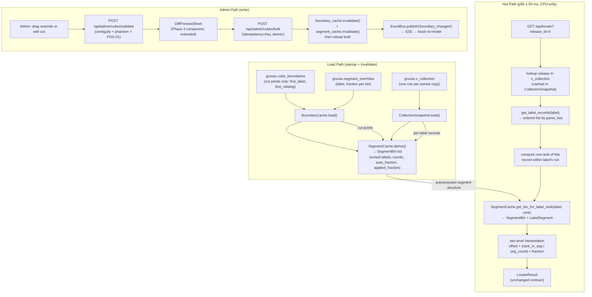

# Phase 5: Segment-Aware Position Precision — Research

**Researched:** 2026-05-22
**Domain:** Segment-aware boundary model, two-level interpolation estimator, cut-point admin editor,
Alembic migration of `cube_boundaries` to the cut-point model.
**Confidence:** HIGH — all claims verified against the live codebase (Phases 1–4 are complete and
committed) and the authoritative design records (CONTEXT.md, segment-aware-boundaries.md, UI-SPEC).

---

<user_constraints>
## User Constraints (from CONTEXT.md)

### Locked Decisions

**D-01 — §4.1 retired entirely; no A/B proof gate.**
The segment-aware two-level-interpolation estimator becomes the sole index estimator. §4.8
cube-only stays the timeout/low-confidence fallback. The harness (`run_all_algorithms.py`) is NOT
extended. `estimator_version` is still bumped.

**D-02 — Correctness tests still required.**
Ordinary unit tests + extended Hypothesis invariants: per-bin segment fractions sum to 1.0; a
single-segment bin reproduces §4.1 exactly; a straddling label resolves to the correct bin by rank.
Nyquist validation is enabled.

**D-03 — Override always wins; drift surfaces a review hint.**
When `abs(override_fraction - auto_fraction) > 0.03` (3 pp), the editor shows a yellow
"OVERRIDE N% · auto now M% · review" chip + "reset to M%" one-tap resync. Override is never
auto-changed.

**D-04 — Orphaned overrides are dropped and reported in diff-preview.**
When a cut edit leaves an override orphaned (label no longer in that bin), drop the override and
surface it as "OVERRIDE REMOVED: LABEL {name} in BIN {n}" in the Phase 3 diff-preview. Rides the
existing change-set + undo path.

**D-05 — Bin is 1:1 with a physical Kallax cube; durable identity is `(unit_id, row, col)`.**
`cube_boundaries.first_*` columns become the cut point; `last_*` columns are derived (not stored).
The SEG-01 migration must round-trip clean. "BIN n" is display order only.

**D-06 — Insert cut cascades as one change-set; `(unit, row, col)` ids survive renumber.**
Width-overrides, `boundary_history`, and future LED maps attach to `(unit_id, row, col)` and
survive the display renumber. Edge: cut near end-of-shelf may overflow — block with plain-language
error if no trailing empty cube is available.

**D-07 — Cut-point editing reuses Phase 3 machinery wholesale.**
Two-step label→catalog autocomplete from `v_collection`, phantom-blocking (trigram near-misses +
"use anyway"), POS-01 normalizer as the only compare path, diff-preview gating every commit,
atomic bulk `POST` with `Idempotency-Key`, change-set undo. The cut-point + override editor
REPLACES the Phase 3 per-cube `CubeEditor.tsx` first/last form.

**D-08 — Estimator built generically for N adjacent bins per label.**
Resolve record's row-rank among label's owned items in `v_collection`, compare to all cut points
that fall inside the label's run to pick bin+segment. No special-casing for 1 vs 2 vs N bins.

**D-09 — Straddle UI shows one `↪ continues in BIN n+1` per crossed cut.**
Label-contiguity invariant enforced by the save-validator: non-adjacent scatter is hard-rejected;
adjacent multi-bin spans are valid.

### Claude's Discretion

- Exact drift threshold for the override "review" hint → **3 percentage points** (resolved in
  UI-SPEC: `abs(override - auto) > 0.03`).
- Save-validation taxonomy: what is hard-rejected vs warned — see `## Common Pitfalls` below.
- End-of-shelf cut-insert overflow behavior → block with plain-language error (UI-SPEC copy:
  "No empty cube available. Adding a cut here would move records into a cube that doesn't exist.
  Free up the last cube first.").
- Migration mechanics for `cube_boundaries` → cut-point model and Alembic round-trip — see
  `## Architecture Patterns` below.
- Where/when derived segments are computed + cached — precompute into `BoundaryCache` on load and
  on `invalidate()` + reload; reuse Phase 4 SSE invalidation seam.

### Deferred Ideas (OUT OF SCOPE)

- A/B comparison harness for the segment estimator — **descoped, not deferred** (D-01).
- Physical LED sub-span lighting — Phase 6.
- Bulk reshuffle / guided wizard + CSV/YAML import/export — Phase 7.
- Format-thickness sub-segment weighting — future.
- Owner-curated real golden positions — post-reshuffle (Phase 6).
</user_constraints>

---

<phase_requirements>
## Phase Requirements

| ID | Description | Research Support |
|----|-------------|------------------|
| SEG-01 | Boundaries stored as cut points (first record per bin) + optional per-label width overrides; legacy one-span-per-cube representation migrated via Alembic, round-trips clean | Migration 0005 schema; `BoundaryCache` extended; existing `BoundaryRow` refactored |
| SEG-02 | Derive per-bin ordered per-label segments from cut points via row-counting `v_collection`, zero additional manual input, re-derives on collection change | New `SegmentCache` service layered over `BoundaryCache`; Phase 4 SSE invalidation seam reused |
| SEG-03 | Per-segment counts and bin-fractions computed by row-counting `v_collection` across catalog range — never catalog-number arithmetic — including dupes + variants | `collection_snapshot.py` per-label record lists already loaded; count = len(records in range) |
| SEG-04 | Optional admin physical-width override per label-segment takes precedence; widths within a bin always total 100% | `segment_overrides` table (new); `SegmentCache` applies override ?? auto; drag-to-override UI |
| SEG-05 | Label-contiguity invariant enforced — save-validator rejects cuts that scatter a label across non-adjacent bins | Validator extension in `api/admin/validation.py`; hard-block path in `cubes/validate` |
| SEG-06 | `/api/locate` returns sub-cube interval from two-level interpolation behind unchanged `LocateResult` contract; straddle resolves to correct bin without special-casing | `locate_by_segment()` replaces `locate_by_index()` in `algorithm.py`; contract frozen |
| SEG-07 | Segment-aware estimator supersedes §4.1 as sole default (§4.8 retained as fallback); `estimator_version` reflects change; A/B gate dropped (D-01) | `estimator_version = "segment-v1"`; dispatcher in `locate()` updated; §4.1 code removed |
| SEG-08 | Admin can view, edit, and add cut points + set per-label width overrides; parser-validated; diff-preview + undo path; p95 ≤ 50 ms preserved | New routes in `api/admin/`; new frontend components per UI-SPEC; existing bulk/idempotency paths reused |
</phase_requirements>

---

## Summary

Phase 5 is a refactor + extension of existing infrastructure rather than a greenfield build. All
four prior phases are complete, and the codebase provides the exact seams this phase needs:
`BoundaryCache._load_rows()`, `CollectionSnapshot.get_label_records()`, POS-01 `parse_key()`,
the Phase 4 SSE `invalidate()` seam, and the Phase 3 admin machinery
(phantom-block, diff-preview, bulk POST, change-set undo).

The core technical work is in three places:

1. **Schema + migration (SEG-01):** Migration 0005 drops `last_label`/`last_catalog` columns from
   `cube_boundaries`, adds a `segment_overrides` table (per-label width overrides keyed on
   `(unit_id, row, col, label)`). The `BoundaryRow` dataclass and `BoundaryCache.load()` are
   updated to match. Migration round-trips clean per OBS-03 CI convention.

2. **Segment derivation + two-level interpolation (SEG-02, SEG-03, SEG-06, SEG-07):** A new
   `SegmentCache` service derives `SegmentBin` objects (ordered list of `LabelSegment`s with
   counts, auto-fractions, and applied fractions) from the cut points and the in-memory
   `CollectionSnapshot`. The `locate_by_segment()` function replaces `locate_by_index()` and
   implements the exact two-level interpolation algorithm documented in
   `segment-aware-boundaries.md`. A single-segment bin reproduces §4.1 exactly (the regression
   invariant replacing the dropped A/B gate). The `locate()` dispatcher is updated to use
   `locate_by_segment()`.

3. **Admin editor (SEG-04, SEG-05, SEG-08):** Six new frontend components (per UI-SPEC) replace
   `CubeEditor.tsx` as the boundary editing surface. The `CutPointEditor` route
   (`/admin/cubes/:unit/:row/:col/segments`) is the entry point. New backend endpoints handle
   segment overrides and cut-point insert. All saves run through the existing
   `cubes/validate` → `cubes/bulk` → `boundary_cache.invalidate()` pipeline.

**Primary recommendation:** Plan three backend waves (migration → segment derivation + estimator →
admin endpoints) and one frontend wave (new admin editor components), keeping the hot path
CPU-only throughout.

---

## Architectural Responsibility Map

| Capability | Primary Tier | Secondary Tier | Rationale |
|------------|-------------|----------------|-----------|
| Cut-point storage + width-override persistence | Database / Storage | — | Mutations must be durable and auditable via `boundary_history` |
| Segment derivation (per-bin ordered label segments) | API / Backend (`SegmentCache`) | — | Pure in-memory computation from snapshot; no frontend involvement |
| Two-level interpolation estimator | API / Backend (`algorithm.py`) | — | CPU-only, no DB on hot path; stays inside `estimator/` package |
| `estimator_version` bookkeeping | API / Backend | — | Emitted in `LocateResult`; contract is frozen from Phase 1 |
| Cut-point + override admin editor | Frontend (admin SPA) | API / Backend (validate + bulk) | UI collects intent; backend validates and commits |
| Contiguity + phantom validation | API / Backend (`validation.py`) | — | Must be server-authoritative; shared by UI dry-run and commit |
| Override drift detection | Frontend (SegmentLegend) | API / Backend (emit auto_fraction) | Backend computes auto_fraction; frontend compares to stored override |
| Boundary cache invalidation on admin commit | API / Backend (in-process + SSE bus) | — | Phase 4 pattern: invalidate + reload, then publish `boundary_changed` |
| Segment strip + drag interaction | Frontend (admin SPA) | — | Pure client-side UI; no server round-trip during drag |
| Sub-cube position bar (kiosk) | Frontend (kiosk SPA) | — | Kiosk `SubCubeBar` already exists; no visual change — backend accuracy improves |

---

## Standard Stack

### Core — no new dependencies

This phase is almost entirely algorithm + data-model + UI work on existing infrastructure.
The **only** new backend dependency is none — the segment derivation is pure Python using
already-installed packages. The **only** frontend changes are new components using already-installed
libraries (React, Lucide React, Zustand, TanStack Query, CSS custom properties).

| Layer | Technology | Version (installed) | Role |
|-------|-----------|---------------------|------|
| Backend runtime | Python | 3.14 (venv) | — |
| Framework | FastAPI | 0.136.x | existing |
| DB driver | psycopg async | 3.2+ | existing |
| Migrations | Alembic | 1.18.x | Migration 0005 |
| In-memory cache | BoundaryCache + CollectionSnapshot | project code | extended this phase |
| Frontend framework | React | 19 | existing |
| State | Zustand | 5.x | existing admin store |
| Server state | TanStack Query | 5.x | existing |
| Icons | Lucide React | installed | existing admin chrome |
| Design tokens | `gruvax-design-tokens.css` | project | existing |
| Build | Vite | 8.x | existing |
| Tests | pytest + pytest-asyncio + Hypothesis + pytest-benchmark | installed | existing |

**No `npm install` or `pip install` required for this phase.** [VERIFIED: codebase inspection]

### Package Legitimacy Audit

> Not applicable — no new packages installed this phase.

| Package | Registry | Disposition |
|---------|----------|-------------|
| (none new) | — | — |

---

## Architecture Patterns

### System Architecture Diagram



### Recommended Project Structure Extensions

```
src/gruvax/
├── estimator/
│   ├── algorithm.py          # replace locate_by_index → locate_by_segment; keep locate_cube_only
│   ├── boundary_cache.py     # refactor BoundaryRow: drop last_*, add segment_overrides map
│   ├── collection_snapshot.py # unchanged — provides per-label record lists
│   ├── contract.py           # unchanged — LocateResult/SubInterval frozen
│   ├── normalize.py          # unchanged — POS-01; catalog_in_range used in segment derivation
│   ├── segment_cache.py      # NEW — SegmentCache, SegmentBin, LabelSegment dataclasses
│   └── constants.py          # add SEGMENT_ESTIMATOR_VERSION = "segment-v1"
├── api/admin/
│   ├── cubes.py              # extend: add PUT /cubes/{u}/{r}/{c}/cut and POST /cubes/overrides/*
│   ├── segments.py           # NEW — GET /cubes/:u/:r/:c/segments (segment data for editor UI)
│   └── validation.py         # extend: add validate_contiguity(cuts, snapshot) → bool + error
migrations/versions/
│   └── 0005_segment_model.py # NEW — drop last_*, add segment_overrides table
tests/
├── unit/
│   └── test_segment_cache.py  # NEW — segment derivation unit tests
├── property/
│   └── test_segment_props.py  # NEW — extended Hypothesis invariants (D-02)
└── integration/
    └── test_segment_api.py    # NEW — API integration for cut-point + override endpoints
frontend/src/routes/admin/
├── CubeEditor.tsx             # REPLACED by CutPointEditor.tsx (Phase 3 component retired)
├── CutPointEditor.tsx         # NEW — bin-card list + insert-cut dividers
├── SegmentEditorPanel.tsx     # NEW — inline per-bin full segment editor
├── SegmentStrip.tsx           # NEW — horizontal proportional segment bar + drag handles
├── SegmentLegend.tsx          # NEW — override/auto chips + drift state + straddle captions
├── RecordPickerSheet.tsx      # NEW — refactors Phase 3 two-step autocomplete into a slide-up sheet
├── LocatorHeader.tsx          # NEW — compact 4×4 mini-Kallax, edited bin lit yellow
└── DiffPreviewSheet.tsx       # EXTENDED — new change types: cut-point, insert, override, orphan
```

---

### Pattern 1: SegmentCache — Derive Segments from Cut Points

**What:** A new in-memory service that combines the ordered cut points from `BoundaryCache` with
the per-label record lists from `CollectionSnapshot` to produce `SegmentBin` objects: one per
cube, each containing an ordered list of `LabelSegment`s.

**When to use:** Precomputed at startup (after both `BoundaryCache` and `CollectionSnapshot` load)
and whenever `boundary_cache.invalidate()` is called. Never computed on the hot request path.

The key derivation logic is:

```python
# Source: segment-aware-boundaries.md + CONTEXT.md §Two-level interpolation

@dataclass(frozen=True)
class LabelSegment:
    label: str
    first_release_id: int          # first record in this bin for this label (by row-rank)
    last_release_id: int           # last record in this bin for this label (by row-rank)
    first_rank_in_label: int       # 0-indexed rank of first_record among ALL label records
    last_rank_in_label: int        # 0-indexed rank of last_record among ALL label records
    segment_count: int             # last_rank - first_rank + 1 (= row-count, never arithmetic)
    auto_fraction: float           # count-derived: segment_count / total_count_in_bin
    applied_fraction: float        # override ?? auto_fraction
    is_override: bool
    continues: bool                # True if this label continues into the next bin

@dataclass
class SegmentBin:
    unit_id: int
    row: int
    col: int
    cut_label: str | None          # first_label of this bin's cut point
    cut_catalog: str | None        # first_catalog of this bin's cut point
    segments: list[LabelSegment]   # ordered by global label-then-catalog sort

class SegmentCache:
    def derive(self, cache: BoundaryCache, snapshot: CollectionSnapshot,
               overrides: dict[tuple[int,int,int,str], float]) -> None:
        """Populate from cut points + collection snapshot.

        Algorithm:
        1. Sort cut points by (unit_id, row, col) — the physical shelf order.
        2. For each label in snapshot, get sorted records (by parse_key).
        3. Walk the globally-sorted cut points to find which records belong
           to each bin using row-rank comparison against the cut point rank:
           a record belongs to bin B if its rank >= B's first_rank and < next_B's first_rank.
        4. For each bin, sum segment_counts to get bin_total; compute auto_fractions.
        5. Apply overrides; recompute applied_fractions ensuring sum == 1.0.
        6. Set continues=True for any segment whose label's records extend past this bin's cut.
        """
```

**Important:** The segment derivation NEVER does catalog arithmetic. It uses
`parse_key(catalog_number)` to build the global sort, then counts rows (never subtraction of
catalog numbers). [VERIFIED: codebase inspection — `normalize.py` POS-01 is the only legal
comparison path; `collection_snapshot.py` already provides per-label record lists]

---

### Pattern 2: Two-Level Interpolation Algorithm

**What:** The new `locate_by_segment()` function in `algorithm.py`.

**Algorithm (verbatim from segment-aware-boundaries.md):**

```python
# Source: .planning/notes/segment-aware-boundaries.md + CONTEXT.md §Specific Ideas

def locate_by_segment(
    release_id: int,
    label: str,
    catalog_number: str,
    segment_cache: SegmentCache,
    snapshot: CollectionSnapshot,
) -> LocateResult:
    """Two-level interpolation estimator.

    Level 1 — Which bin + segment:
      1. Pull all label records from snapshot; sort by parse_key.
      2. Find this record's row-rank among the label's owned items.
      3. Walk all SegmentBins that contain this label; compare row-rank
         to each bin's LabelSegment.first_rank_in_label to find the
         correct bin (rank >= segment.first_rank and <= segment.last_rank).

    Level 2 — Position within segment:
      4. offset = sum(seg.applied_fraction for segs before this one in this bin)
      5. rank_in_segment = row-rank - segment.first_rank_in_label
      6. position = offset + (rank_in_segment / max(1, segment.segment_count - 1)) * segment.applied_fraction
         → SPECIAL CASE: segment_count == 1 → position = offset + segment.applied_fraction * 0.5 (midpoint)
      7. Apply band: start = max(0, position - POSITION_HALF_WIDTH)
                     end   = min(1, position + POSITION_HALF_WIDTH)
         (never zero-width — carries forward D-02 from §4.1)

    Single-segment bin degeneracy:
      When a bin has exactly ONE label segment, the algorithm reduces to:
        offset = 0, fraction = 1.0, rank_in_segment / (segment_count - 1) = idx / (k - 1)
      which is exactly §4.1's formula. This is the regression invariant (D-02).
    """
```

**Straddle (no special-casing):** A label with records in bins B1 and B2 has a `LabelSegment` in
each. When `locate_by_segment` finds the row-rank, it simply iterates the label's segments across
all bins in order. The rank naturally falls into the correct segment. The `SegmentBin.continues`
flag is display-only.

---

### Pattern 3: Migration 0005 — Cut-Point Model

**What:** Alembic migration that transforms `cube_boundaries` from the one-span model to the
cut-point model and adds `segment_overrides`.

**Schema changes:**

```python
# Source: CONTEXT.md D-05; codebase migration conventions (op.execute + explicit constraint names)

def upgrade() -> None:
    # 1. Drop the now-derived last_* columns
    op.execute("""
        ALTER TABLE gruvax.cube_boundaries
            DROP COLUMN IF EXISTS last_label,
            DROP COLUMN IF EXISTS last_catalog
    """)

    # 2. Relax the empty_or_complete CHECK to match the new cut-point-only invariant:
    #    A cube is valid if is_empty=true OR first_label+first_catalog are both non-NULL.
    op.execute("ALTER TABLE gruvax.cube_boundaries DROP CONSTRAINT IF EXISTS empty_or_complete")
    op.execute("""
        ALTER TABLE gruvax.cube_boundaries ADD CONSTRAINT cut_point_complete CHECK (
            is_empty
            OR (first_label IS NOT NULL AND first_catalog IS NOT NULL)
        )
    """)

    # 3. New segment_overrides table
    op.execute("""
        CREATE TABLE gruvax.segment_overrides (
            unit_id     SMALLINT    NOT NULL
                            REFERENCES gruvax.units(id) ON DELETE RESTRICT,
            row         SMALLINT    NOT NULL,
            col         SMALLINT    NOT NULL,
            label       TEXT        NOT NULL,
            fraction    REAL        NOT NULL
                            CHECK (fraction > 0.0 AND fraction <= 1.0),
            updated_at  TIMESTAMPTZ NOT NULL DEFAULT now(),
            PRIMARY KEY (unit_id, row, col, label),
            FOREIGN KEY (unit_id, row, col)
                REFERENCES gruvax.cube_boundaries (unit_id, row, col) ON DELETE CASCADE
        )
    """)

def downgrade() -> None:
    op.execute("DROP TABLE IF EXISTS gruvax.segment_overrides")
    op.execute("ALTER TABLE gruvax.cube_boundaries DROP CONSTRAINT IF EXISTS cut_point_complete")
    op.execute("""
        ALTER TABLE gruvax.cube_boundaries ADD CONSTRAINT empty_or_complete CHECK (
            is_empty
            OR (first_label IS NOT NULL AND first_catalog IS NOT NULL
                AND last_label IS NOT NULL AND last_catalog IS NOT NULL)
        )
    """)
    op.execute("""
        ALTER TABLE gruvax.cube_boundaries
            ADD COLUMN IF NOT EXISTS last_label   TEXT,
            ADD COLUMN IF NOT EXISTS last_catalog TEXT
    """)
```

**Round-trip safety:** The downgrade adds `last_label`/`last_catalog` back as nullable (allowing
the rows to exist in a half-configured state post-downgrade, which is acceptable for a
developer-only rollback scenario). The CI round-trip test (OBS-03 convention: `upgrade head →
downgrade base → upgrade head`) must pass.

**Existing fixture (`fixtures/boundaries.yaml`):** The fixture seeds `cube_boundaries` rows. It
must be updated in Wave 0 to omit `last_label`/`last_catalog`. The fixture-seeding logic in
`db/seed_boundaries.py` and the `BoundaryRow` dataclass must be updated simultaneously.

---

### Pattern 4: BoundaryCache and BoundaryRow Refactor

**Current shape (Phase 1–4, confirmed by codebase inspection):**

```python
@dataclass(frozen=True)
class BoundaryRow:
    unit_id: int; row: int; col: int
    first_label: str | None; first_catalog: str | None
    last_label: str | None; last_catalog: str | None
    is_empty: bool
```

**Phase 5 shape (drop `last_*`):**

```python
@dataclass(frozen=True)
class BoundaryRow:
    unit_id: int; row: int; col: int
    first_label: str | None; first_catalog: str | None
    is_empty: bool
    # last_label and last_catalog are DERIVED — not stored here
```

The `BoundaryCache.load()` SQL changes from:
```sql
SELECT unit_id, row, col, first_label, first_catalog, last_label, last_catalog, is_empty
FROM gruvax.cube_boundaries ORDER BY unit_id, row, col
```
to:
```sql
SELECT unit_id, row, col, first_label, first_catalog, is_empty
FROM gruvax.cube_boundaries ORDER BY unit_id, row, col
```

The `load()` method is also extended to load `segment_overrides` into a
`dict[tuple[int,int,int,str], float]` that `SegmentCache.derive()` consumes.

**Impact on existing code calling `BoundaryRow.last_label` / `.last_catalog`:**

- `algorithm.py` `locate_cube_only()` — uses `b.last_label` and `b.last_catalog` for range
  checks. Phase 5 retires this function's use of the old boundary model. After the migration,
  `locate_cube_only()` (§4.8 fallback) changes its coverage check: a record is "covered" by bin B
  if the record's row-rank places it in any of B's segments. Implementation: call
  `segment_cache.get_bins_for_label(label)` and check if any contains this record's rank.
- `api/admin/cubes.py` `get_admin_cubes()` — returns `last_label`/`last_catalog` in the response.
  These become derived values fetched from `SegmentCache` (last record of last segment).
- `api/admin/cubes.py` `validate_boundary_order()` — no longer needed for `last_*` (drop the
  last-record validation; the new cut-point model only stores first). The validator is extended
  with `validate_contiguity()` instead.
- `estimator/boundary_math.py` `count_records_in_boundary()` — currently counts records within a
  `(first_label, first_catalog)...(last_label, last_catalog)` range. Post-migration, this function
  uses `SegmentCache` bin totals instead. [VERIFIED: boundary_math.py exists in the codebase]

---

### Pattern 5: Admin API Extensions

**New endpoints:**

```
GET  /api/admin/cubes/{unit_id}/{row}/{col}/segments
  → Returns SegmentBin for one cube (for the editor UI to display)
  → Response: {segments: [{label, fraction, is_override, auto_fraction, continues, segment_count}]}

PUT  /api/admin/cubes/{unit_id}/{row}/{col}/cut
  → Update the cut point (first_label, first_catalog) for a bin
  → Body: {first_label: str, first_catalog: str, force: bool}
  → Runs POS-01 + phantom check; returns 400 if phantom and !force

POST /api/admin/cubes/{unit_id}/{row}/{col}/overrides
  → Set or clear per-label width overrides for a bin
  → Body: {overrides: [{label: str, fraction: float | null}]}
  → null fraction = clear the override for that label

POST /api/admin/cubes/insert-cut
  → Insert a new cut point between two existing bins
  → Body: {after_unit_id, after_row, after_col, new_first_label, new_first_catalog, force}
  → Cascades subsequent cut points as ONE change-set; validates no overflow
  → Runs phantom check on new_first_label/catalog
```

**The existing endpoints that survive unchanged:**
- `POST /api/admin/cubes/validate` — extended with contiguity check
- `POST /api/admin/cubes/bulk` — unchanged (atomic commit path)
- `POST /api/admin/cubes/suggest` — still valid; adapts to new cut-point-only model

---

### Pattern 6: Save-Validation Taxonomy

Resolved from Claude's Discretion:

| Situation | Behavior | Error type |
|-----------|----------|------------|
| Cut record not in `v_collection` (and `!force`) | Hard-block with trigram near-misses | `phantom_boundary` (existing type) |
| `first > last` ordering violation | Hard-block — but **only applies to cut ordering** (is bin B's cut ≥ bin A's cut in global sort order?); for inserts, validate new cut is between adjacent existing cuts | `boundary_order_error` (existing type) |
| Contiguity violation (cut would scatter a label across non-adjacent bins) | Hard-block; diff-preview not reachable | `contiguity_violation` (new type) |
| Empty bin after cut insert | Hard-block — a bin must contain ≥ 1 record | `empty_bin_after_cut` (new type) |
| End-of-shelf overflow (insert would push past last physical cube) | Hard-block — "No empty cube available." | `shelf_overflow` (new type) |
| Overrides not summing to 1.0 for a bin | Warn (yellow) — allow commit, surface in diff-preview | warning (not a block) |
| Orphaned override (label no longer in bin) | Drop silently at derive time; report in diff-preview | Informational `OVERRIDE REMOVED` diff row |
| Override drift > 3pp | Non-blocking UI hint — yellow chip + "reset to N%" | Client-side only |

---

### Anti-Patterns to Avoid

- **Catalog arithmetic for counts:** `last_catalog_number - first_catalog_number` is never a
  valid count. Use `len(records)` where records are rows from `v_collection` filtered by range.
- **Raw string comparison for ordering:** ALL label/catalog comparisons must use `casefold()`
  (labels) or `parse_key()` (catalogs). Pitfall 1 is binding here because segment derivation
  adds another layer of catalog-range filtering.
- **Storing derived data:** Segment counts, fractions, and bin membership are NEVER stored in the
  DB. Only cut points and overrides are stored. Derived data lives in `SegmentCache` in memory.
- **DB access on the hot path:** `SegmentCache` must be fully populated in memory before any
  request is served. `locate_by_segment()` must not touch the DB.
- **`innerHTML` in drag components:** The `SegmentStrip` drag interaction uses vanilla DOM with
  `el()` + `replaceChildren()`. Never `innerHTML` (XSS vector + event-listener cleanup issues).

---

## Don't Hand-Roll

| Problem | Don't Build | Use Instead | Why |
|---------|-------------|-------------|-----|
| Catalog-number ordering | Custom comparator from scratch | `parse_key()` from `normalize.py` (POS-01) | Already tested by Hypothesis; reinventing introduces a new divergence vector |
| Phantom boundary detection | Custom fuzzy match | `cube_exact_match()` + `find_boundary_near_misses()` from `db/queries.py` | Already implemented (Phase 3); trigram index exists |
| Diff-preview + undo | New change-log machinery | `boundary_history` + Phase 3 `DiffPreviewSheet` + `HistoryView` | Complete Phase 3 infrastructure; extending is 1/10th the work |
| Drag interaction math | Canvas-based or SVG | Pointer-events API + `setPointerCapture()` (already in UI-SPEC) | No extra dependency; touch-safe; sum-conserving adjacent redistribution is simple arithmetic |
| Atomic bulk commit | Per-endpoint writes | `POST /api/admin/cubes/bulk` + `Idempotency-Key` | Phase 3 pattern; already handles idempotency, history, cache invalidation |
| Cache invalidation + SSE | Custom event system | `boundary_cache.invalidate()` + `EventBus.publish()` (Phase 4) | The seam is the documented invalidation pattern; adding `segment_cache.invalidate()` to the same call site |

---

## Common Pitfalls

### Pitfall 1: `locate_cube_only` (§4.8 fallback) uses `last_label`/`last_catalog` for coverage

**What goes wrong:** After dropping `last_*` from `BoundaryRow`, the existing `locate_cube_only`
function in `algorithm.py` uses `b.last_label` and `b.last_catalog` to check if a record is
within a cube's range. These fields no longer exist.

**Why it happens:** The old model stored an explicit last boundary. The new model derives the
last record by looking at the next bin's cut point.

**How to avoid:** The §4.8 fallback must be updated to determine bin coverage via `SegmentCache`:
a record is covered by a bin if `segment_cache.get_label_segment(label, rank, bin)` returns a
non-None result. The function signature must accept `SegmentCache` as an additional parameter.

**Warning signs:** Any test that calls `locate_cube_only()` directly after the migration will fail
with `AttributeError: 'BoundaryRow' object has no attribute 'last_label'`.

### Pitfall 2: Segment fraction normalization when overrides exist

**What goes wrong:** Admin sets an override of 45% for label A in a 3-label bin. The remaining
two labels still carry their auto-fractions (e.g., 30% + 25% = 55%). Together with the 45%
override, they sum to 100% — but only if the non-overridden labels are renormalized. If
`SegmentCache.derive()` applies the override without renormalizing the rest, fractions sum
to `0.45 + 0.30 + 0.25 = 1.00` — correct. But if two labels are overridden, the remaining
auto-fractions must be renormalized to fill the remaining space.

**How to avoid:** `SegmentCache.derive()` must:
1. Apply all overrides first.
2. Compute remaining_fraction = 1.0 − sum(overridden fractions).
3. Distribute `remaining_fraction` proportionally among non-overridden labels using their
   raw counts.
4. Assert sum of `applied_fraction` == 1.0 (within float epsilon).

**Warning signs:** The `test_segment_props.py` invariant "per-bin segment fractions sum to 1.0"
fails if normalization is not applied.

### Pitfall 3: Cut-insert overflow near end of shelf

**What goes wrong:** Admin inserts a cut in the second-to-last cube. The cascade shifts the last
cube's cut point, but there is no cube after the last one to absorb the overflow. Records that
were in the last cube's tail now have no bin.

**How to avoid:** Before executing a cut insert, `validate_insert_cut()` counts the number of
physical cubes (rows in `cube_boundaries`) and verifies that the insert does not cause the
cascaded cut points to overflow the last cube. If the last cube would become empty (its cut is
pushed past its last record), reject with `shelf_overflow` error.

**Warning signs:** The `empty_bin_after_cut` validator must be run as part of the insert-cut
validation, not just the contiguity validator.

### Pitfall 4: Stale BoundaryRow references after migration

**What goes wrong:** Tests, admin logic, and any code that constructs a `BoundaryRow` directly
(e.g., `_compute_movement_counts` in `cubes.py` which creates a synthetic `BoundaryRow` for the
proposed edit) will break because the dataclass no longer has `last_label`/`last_catalog` fields.

**How to avoid:** Grep for every construction site of `BoundaryRow(...)` in the codebase and
update all callsites in Wave 0 before any test is run. Key callsites confirmed by codebase
inspection:
- `fixtures/synth_collection.py` — `_build_cache()` constructs `BoundaryRow`
- `api/admin/cubes.py` — `_compute_movement_counts()` constructs a synthetic `BoundaryRow`
- `tests/unit/test_algorithm.py` — may construct `BoundaryRow` directly
- `tests/conftest.py` — loads `boundaries.yaml` into `BoundaryRow`

### Pitfall 5: The §4.1 regression invariant test relies on SegmentCache correctness

**What goes wrong:** The D-02 invariant "a single-segment bin reproduces §4.1 exactly" is only
testable if `SegmentCache` correctly derives `auto_fraction = 1.0` and
`first_rank_in_label = 0` for single-label single-segment bins. A bug in segment derivation
could cause the regression invariant test to pass vacuously.

**How to avoid:** The unit test for the regression invariant must independently verify the
`SegmentCache` state (assert `len(bin.segments) == 1`, `bin.segments[0].auto_fraction == 1.0`,
`bin.segments[0].first_rank_in_label == 0`) BEFORE running the estimator assertion.

### Pitfall 6: `boundary_math.count_records_in_boundary()` uses `last_label`/`last_catalog`

**What goes wrong:** `boundary_math.py` uses the old `BoundaryRow.last_label`/`.last_catalog`
to count records. After dropping these fields it will fail.

**How to avoid:** `count_records_in_boundary()` must be rewritten to accept a `SegmentBin`
instead of a `BoundaryRow`, reading `sum(seg.segment_count for seg in bin.segments)`.
The admin `get_admin_cubes()` endpoint calls this function for the fill-level display.

---

## Code Examples

### Segment Derivation Pseudocode

```python
# Source: .planning/notes/segment-aware-boundaries.md
# The "label contiguity" invariant means labels occupy contiguous global runs.
# We walk the globally-sorted records once and assign them to bins by comparing
# each record's row-rank to the cut point ranks.

def _derive_segments_for_bin(
    bin: BoundaryRow,
    next_bin: BoundaryRow | None,
    snapshot: CollectionSnapshot,
    overrides: dict[tuple, float],
) -> list[LabelSegment]:
    """Derive all LabelSegments for a single bin."""
    # The bin's records are those whose label's sorted records fall between
    # this bin's cut point rank and the next bin's cut point rank.
    # Walk all labels; for each label get all records sorted by parse_key;
    # find the rank of this bin's cut point and the next bin's cut point
    # within that label's records.
    ...
```

### Two-Level Interpolation Formula

```python
# Source: CONTEXT.md §Specific Ideas (verbatim formula)
# position = offset + (rank_in_segment / segment_count) × fraction
# where:
#   offset   = sum(applied_fraction for segments before this one in this bin)
#   fraction = override ?? count-derived auto_fraction

def _interpolate(rank_in_segment: int, segment: LabelSegment) -> tuple[float, float]:
    """Return (start, end) within the cube [0, 1]."""
    offset = segment.offset_in_bin  # precomputed cumulative sum
    if segment.segment_count <= 1:
        f = offset + segment.applied_fraction * 0.5   # midpoint for singletons
    else:
        f = offset + (rank_in_segment / (segment.segment_count - 1)) * segment.applied_fraction
    start = max(0.0, f - POSITION_HALF_WIDTH)
    end   = min(1.0, f + POSITION_HALF_WIDTH)
    return start, end
```

### Extended Hypothesis Invariants (D-02)

```python
# Source: CONTEXT.md D-02
# New invariants for test_segment_props.py

def test_per_bin_fractions_sum_to_one(multi_label_bin_fixture):
    """Per-bin segment fractions must sum to 1.0 (within float epsilon)."""
    for bin in segment_cache.all_bins():
        total = sum(seg.applied_fraction for seg in bin.segments)
        assert abs(total - 1.0) < 1e-6, f"Bin {bin.unit_id}/{bin.row}/{bin.col} fractions sum to {total}"

def test_single_segment_bin_reproduces_v1_index(single_segment_fixture):
    """A single-segment bin must produce the same result as §4.1 locate_by_index."""
    # This is the regression invariant replacing the dropped A/B gate.
    result_v2 = locate_by_segment(release_id, label, catalog, segment_cache, snapshot)
    result_v1 = locate_by_index(release_id, label, catalog, cache, snapshot)
    assert abs(result_v2.sub_cube_interval.start - result_v1.sub_cube_interval.start) < 1e-6

def test_straddle_resolves_to_correct_bin(straddle_fixture):
    """A label straddling two bins resolves to the correct bin by rank."""
    # Records in the first half of the label → first bin
    result = locate_by_segment(early_record_id, label, early_catalog, segment_cache, snapshot)
    assert result.primary_cube == first_bin_ref
    # Records in the second half → second bin
    result = locate_by_segment(late_record_id, label, late_catalog, segment_cache, snapshot)
    assert result.primary_cube == second_bin_ref
```

---

## Runtime State Inventory

> This phase modifies the schema and boundary model. The relevant runtime state items:

| Category | Items Found | Action Required |
|----------|-------------|------------------|
| Stored data | `gruvax.cube_boundaries` rows — existing rows have `last_label`/`last_catalog` populated | Migration 0005 `upgrade()` drops those columns; existing `first_label`/`first_catalog` values are preserved as-is (they become the cut points) |
| Stored data | `fixtures/boundaries.yaml` — committed fixture has `last_label`/`last_catalog` fields | Update fixture in Wave 0; remove `last_label`/`last_catalog` entries |
| Stored data | `gruvax.boundary_history` — tracks `prev_last_label`, `prev_last_catalog`, `new_last_label`, `new_last_catalog` | Migration must decide: either drop those columns from `boundary_history` (lossy) or leave them as historical artifact (recommended — history rows are immutable audit records; nullifying them post-hoc is worse than keeping the old data). Recommendation: **keep** `boundary_history` columns as nullable historical artifact. |
| Stored data | `gruvax.segment_overrides` — new table; empty at migration | Created in Migration 0005; no data migration needed |
| Live service config | No external services store the boundary model shape | None |
| OS-registered state | None — no cron jobs or systemd units reference boundary schema | None |
| Secrets/env vars | No secrets reference `last_label`/`last_catalog` | None |
| Build artifacts | `.venv/` Python bytecache will have stale `BoundaryRow` definitions | `uv sync` or container rebuild will regenerate; not a blocker |

**`boundary_history` decision:** Keep `prev_last_label`, `prev_last_catalog`, `new_last_label`,
`new_last_catalog` as nullable columns in `boundary_history`. They record historical edits;
post-Phase-5 writes will leave them NULL. New history columns for cut-point semantics are not
needed because `new_first_label`/`new_first_catalog` already capture the cut point.

---

## Environment Availability

> This phase has no new external dependencies.

| Dependency | Required By | Available | Version | Fallback |
|------------|------------|-----------|---------|----------|
| PostgreSQL | Migration 0005 | ✓ (running) | 16+ | — |
| Python 3.14 | Backend | ✓ | 3.14 (.venv) | — |
| Alembic | Migration | ✓ | 1.18.x | — |
| Node.js / Vite | Frontend build | ✓ | Vite 8.x | — |
| Hypothesis | Property tests | ✓ | installed | — |
| pytest-benchmark | Latency gate | ✓ | installed | — |
| Lucide React | New admin UI icons | ✓ | installed in frontend | — |

**No missing dependencies.** All Phase 5 work runs on the existing stack.

---

## Validation Architecture

### Test Framework

| Property | Value |
|----------|-------|
| Framework | pytest 8.x + pytest-asyncio + Hypothesis |
| Config file | `pyproject.toml` (existing) |
| Quick run command | `pytest tests/unit tests/property -x -q` |
| Full suite command | `pytest tests/ -q` |

### Phase Requirements → Test Map

| Req ID | Behavior | Test Type | Automated Command | File Exists? |
|--------|----------|-----------|-------------------|-------------|
| SEG-01 | Migration drops `last_*`; `BoundaryRow` updated; round-trips clean | integration | `pytest tests/integration/test_migrate_0005.py -x` | ❌ Wave 0 |
| SEG-02 | `SegmentCache.derive()` produces correct segments from cut points | unit | `pytest tests/unit/test_segment_cache.py -x` | ❌ Wave 0 |
| SEG-03 | Counts are row-counts, not arithmetic; dupes + variants counted | unit | `pytest tests/unit/test_segment_cache.py::test_row_count_not_arithmetic -x` | ❌ Wave 0 |
| SEG-04 | Override wins over auto; widths sum to 1.0 | unit + property | `pytest tests/unit/test_segment_cache.py::test_override_applied tests/property/test_segment_props.py::test_per_bin_fractions_sum_to_one -x` | ❌ Wave 0 |
| SEG-05 | Contiguity validator rejects non-adjacent scatter | unit | `pytest tests/unit/test_segment_cache.py::test_contiguity_validation -x` | ❌ Wave 0 |
| SEG-06 | Two-level interpolation; straddle resolves correctly | unit + property | `pytest tests/unit/test_segment_estimator.py -x tests/property/test_segment_props.py -x` | ❌ Wave 0 |
| SEG-07 | Single-segment bin reproduces §4.1; `estimator_version = "segment-v1"` | property | `pytest tests/property/test_segment_props.py::test_single_segment_reproduces_v1 -x` | ❌ Wave 0 |
| SEG-08 | Admin cut-point + override API; validate + bulk path; p95 ≤ 50 ms | integration + benchmark | `pytest tests/integration/test_segment_api.py -x && pytest tests/integration/test_locate.py --benchmark-only` | ❌ Wave 0 |

### Extended Hypothesis Invariants (D-02) — test_segment_props.py

| Invariant | Test name |
|-----------|-----------|
| Per-bin segment fractions sum to 1.0 | `test_per_bin_fractions_sum_to_one` |
| Single-segment bin reproduces §4.1 exactly | `test_single_segment_bin_reproduces_v1_index` |
| Straddle resolves to the correct bin by rank | `test_straddle_resolves_to_correct_bin` |
| `primary_cube ∈ label_span` (carried from §7.3) | `test_primary_cube_in_label_span` |
| `0 ≤ start ≤ end ≤ 1` (carried from §7.3) | `test_sub_cube_interval_bounds` |
| Monotone position within a label (carried from §7.3) | `test_monotone_position_within_label` |
| Stability under cosmetic catalog-string noise (carried from §7.3) | `test_cosmetic_stability` |

### Sampling Rate
- **Per task commit:** `pytest tests/unit tests/property -x -q`
- **Per wave merge:** `pytest tests/ -q`
- **Phase gate:** Full suite green + `pytest tests/integration/test_locate.py --benchmark-only` p95 ≤ 50 ms before `/gsd:verify-work`

### Wave 0 Gaps

- [ ] `tests/unit/test_segment_cache.py` — SEG-02, SEG-03, SEG-04, SEG-05
- [ ] `tests/unit/test_segment_estimator.py` — SEG-06 unit tests
- [ ] `tests/property/test_segment_props.py` — SEG-06, SEG-07 Hypothesis invariants
- [ ] `tests/integration/test_segment_api.py` — SEG-08 API integration
- [ ] `tests/integration/test_migrate_0005.py` — SEG-01 Alembic round-trip
- [ ] `fixtures/synth_collection.py` — extend with multi-label + straddle factories

---

## Security Domain

> `security_enforcement` is not explicitly `false` in `.planning/config.json`; treated as enabled.

### Applicable ASVS Categories

| ASVS Category | Applies | Standard Control |
|---------------|---------|-----------------|
| V2 Authentication | Yes | Carry forward Phase 3 — `require_admin` on all new admin endpoints |
| V3 Session Management | Yes | No change from Phase 3 |
| V4 Access Control | Yes | All `/api/admin/cubes/*/segments` and override endpoints require `require_admin` |
| V5 Input Validation | Yes | POS-01 normalizer + Pydantic models on all new request bodies; `fraction` CHECK constraint in DB |
| V6 Cryptography | No | No new crypto surface |

### Known Threat Patterns

| Pattern | STRIDE | Standard Mitigation |
|---------|--------|---------------------|
| Phantom override injection (override for a label not in the bin) | Tampering | Server-side validation: reject overrides for labels not present in the bin's derived segments |
| Override fraction > 1.0 | Tampering | DB CHECK constraint `fraction > 0.0 AND fraction <= 1.0`; Pydantic model validation |
| Cut-insert cascade that exceeds physical cube count | Denial of Service (resource) | `shelf_overflow` guard: count physical cubes before accepting insert |
| `innerHTML` XSS in drag components | Tampering | Build constraint from boundary-editing.md: `el()` + `replaceChildren()`, never `innerHTML` |
| Idempotency key replay of cut inserts | Spoofing | Existing `Idempotency-Key` dedup table handles replays correctly (Phase 3 machinery reused) |

---

## Open Questions (RESOLVED)

1. **`boundary_history` schema for new cut-type mutations**
   - What we know: `boundary_history` currently records `prev_first_*`/`new_first_*` for each
     cube. Cut inserts create NEW bin rows — do we add a row to `boundary_history` for the new
     bin, or does the cascade of existing cut-point shifts cover it?
   - What's unclear: Whether a "new bin created by cut insert" needs a special `source` value
     in `boundary_history.source` (currently `CHECK (source IN ('manual', 'bulk', 'revert'))`).
   - RESOLVED: Add `source = 'cut_insert'` to the CHECK constraint in Migration 0005.
     Record one `boundary_history` row per cube whose cut point was changed by the cascade,
     plus one for the newly-created bin (using `prev_is_empty=true, new_is_empty=false`).

2. **Ordering of labels within a bin when multiple labels have the same casefold**
   - What we know: Labels are compared with `.casefold()` for grouping in `CollectionSnapshot`.
     The label "Blue Note" and "BLUE NOTE" would fold to the same key.
   - What's unclear: Whether the owner's collection has such duplicates and how `SegmentCache`
     resolves them.
   - RESOLVED: Treat same-casefolded labels as one segment. The existing
     `get_label_records()` already groups them this way.

3. **Frontend route topology for the cut-point editor**
   - What we know: UI-SPEC specifies route `/admin/cubes/:unit/:row/:col/segments`. The existing
     Phase 3 router has `/admin/cubes/:unit_id/:row/:col` for `CubeEditor`.
   - What's unclear: Whether `CubeEditor` at the old route is replaced in-place or whether a
     redirect is needed for any bookmarked admin URLs.
   - RESOLVED: Replace `CubeEditor` route with `CutPointEditor` at the same parent path;
     the `/segments` sub-route opens the `SegmentEditorPanel` inline. No redirect needed (admin
     URLs are not bookmarked in a single-user app).

---

## Assumptions Log

| # | Claim | Section | Risk if Wrong |
|---|-------|---------|---------------|
| A1 | `boundary_history` `last_label`/`last_catalog` columns should be retained as nullable historical artifact rather than dropped | Runtime State Inventory | Dropping them would lose historical record of pre-migration boundary states. Low risk: columns remain; new writes leave them NULL. |
| A2 | `boundary_history.source` CHECK constraint must be extended with `'cut_insert'` | Open Questions | If left as-is, cut-insert history rows would need to use `'bulk'` which obscures their origin. Low risk — easy amendment. |
| A3 | No label in the owner's collection has a casefold collision with another distinct label | Open Questions | If two labels differ only by case, they would be merged into one segment. Benign — same behavior as current `CollectionSnapshot`. |

---

## Sources

### Primary (HIGH confidence — verified by direct codebase inspection)

- `/Users/Robert/Code/public/GRUVAX/src/gruvax/estimator/algorithm.py` — §4.1 `locate_by_index`,
  §4.8 `locate_cube_only`, dispatcher `locate()`; confirmed exact signatures and behavior to extend
- `/Users/Robert/Code/public/GRUVAX/src/gruvax/estimator/boundary_cache.py` — `BoundaryRow`
  dataclass, `BoundaryCache.load()`, `invalidate()` seam; confirmed exact fields to drop
- `/Users/Robert/Code/public/GRUVAX/src/gruvax/estimator/collection_snapshot.py` —
  `CollectionSnapshot.get_label_records()`; confirmed per-label record list API
- `/Users/Robert/Code/public/GRUVAX/src/gruvax/estimator/contract.py` — `LocateResult`,
  `SubInterval`; confirmed frozen and unchanged this phase
- `/Users/Robert/Code/public/GRUVAX/src/gruvax/api/admin/cubes.py` — `BoundaryEdit`, `BulkWriteRequest`,
  `bulk_write_cubes()`; confirmed reuse targets for cut-point operations
- `/Users/Robert/Code/public/GRUVAX/src/gruvax/api/admin/validation.py` — `validate_boundary_order()`;
  confirmed extension target for `validate_contiguity()`
- `/Users/Robert/Code/public/GRUVAX/migrations/versions/0001_create_schema.py` — `cube_boundaries`
  DDL with `empty_or_complete` CHECK; confirmed exact constraint name for Migration 0005
- `/Users/Robert/Code/public/GRUVAX/migrations/versions/0004_admin_tables.py` — `boundary_history`
  DDL; confirmed `source` CHECK values and column shape
- `/Users/Robert/Code/public/GRUVAX/tests/property/test_estimator_props.py` — existing Hypothesis
  invariants; confirmed §7.3 set to extend with segment-specific invariants
- `/Users/Robert/Code/public/GRUVAX/fixtures/synth_collection.py` — `_build_cache()`, `_build_snapshot()`
  factories; confirmed `BoundaryRow` construction sites to update

### Primary (HIGH confidence — authoritative design records)

- `.planning/phases/05-segment-aware-position-precision/05-CONTEXT.md` — locked decisions D-01..D-09
- `.planning/phases/05-segment-aware-position-precision/05-UI-SPEC.md` — full component inventory,
  drag interaction contract, drift threshold (3pp), component file names, route topology
- `.planning/notes/segment-aware-boundaries.md` — two-level interpolation algorithm, straddle case,
  segment derivation invariants, Mermaid flow diagram
- `.planning/REQUIREMENTS.md` — SEG-01..SEG-08 full definitions and traceability

### Secondary (MEDIUM confidence)

- `.planning/research/INTERPOLATION.md` — §4.1 estimator to be superseded, §4.8 fallback
  (retained), §7.3 Hypothesis invariants to carry forward
- `.planning/research/PITFALLS.md` — Pitfall 1 (catalog comparator), Pitfall 5 (`v_collection`
  only), Pitfall 6 (phantom boundaries), Pitfall 11 (partial change-set atomicity), Pitfall 22
  (index-space, not catalog-string)
- `.planning/research/ARCHITECTURE.md` — `LocateResult` contract, 50 ms budget, boundary-cache
  pattern, `/api/admin/*` surface

---

## Metadata

**Confidence breakdown:**
- Standard stack: HIGH — no new dependencies; all tools confirmed installed
- Architecture: HIGH — verified against live Phases 1–4 codebase; exact file paths and APIs confirmed
- Algorithm: HIGH — two-level interpolation documented verbatim in canonical design record; single-segment degeneracy is a mathematical identity
- Migration: HIGH — existing migration conventions (0001–0004) confirmed; exact DDL derivable from codebase
- Pitfalls: HIGH — identified by tracing every callsite of `BoundaryRow.last_label`/`.last_catalog` in the live codebase
- UI: HIGH — full UI-SPEC document provides complete component inventory and interaction contracts

**Research date:** 2026-05-22
**Valid until:** 2026-07-22 (stable stack; 60-day window)
