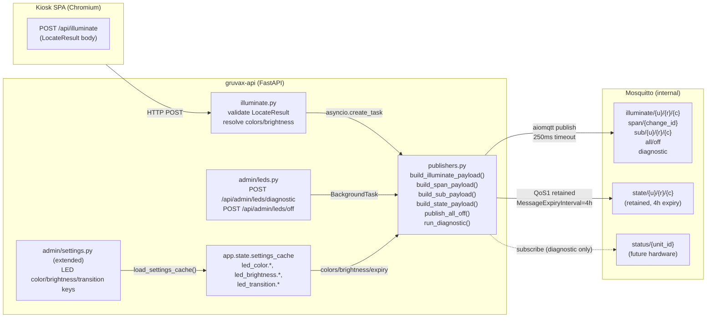

# Phase 6: LED Contract over MQTT (Hardware Stubbed) — Research

**Researched:** 2026-05-23
**Domain:** aiomqtt 2.5.x publish with MQTT 5 Properties · Mosquitto retained-message expiry · fire-and-forget async patterns · Pydantic v2 payload schemas · color-blind simulation matrices
**Confidence:** HIGH on aiomqtt API and Pydantic patterns (verified live in project venv). HIGH on architecture — constrained by 19 locked decisions in CONTEXT.md. MEDIUM on Mosquitto retained-expiry behavior (documented limitation below).

---

<user_constraints>
## User Constraints (from CONTEXT.md)

### Locked Decisions

#### Publish seam & hot-path isolation
- **D-01:** `POST /api/illuminate` is a separate request the kiosk makes *after* `/api/locate`. `/api/locate` stays a pure CPU-only read with no side effects. Publish is fire-and-forget with ~250 ms timeout; a broker hiccup never blocks the API.
- **D-02:** The layered command (LED-09) is one `POST /api/illuminate` that the server fans out to three locked topics — `illuminate/{u}/{r}/{c}`, `span/{change_id}`, and `sub/{u}/{r}/{c}`. No composite topic.
- **D-03:** Request body is the `LocateResult` the kiosk already holds from `/api/locate`. Server validates the Pydantic shape, resolves colors/brightness/expiry, and publishes. No server-side re-locate.

#### LED palette & color configuration
- **D-04:** LED colors are a SEPARATE palette from the kiosk UI. Kiosk grid keeps Nordic Grid design language unchanged (lit cell = yellow). Physical LEDs get admin-tunable palette.
- **D-05:** Admin gets a free per-state color picker (label-span, position, error, setup, all-off — LED-05), seeded with Pitfall 18 defaults (primary gold `#FFD700`, span purple `#7C3AED`) and offering Nordic Grid token swatches as presets. Custom hex allowed.
- **D-06:** Color encoded as resolved `{r,g,b}` in the payload server-side. Firmware stays dumb.
- **D-07:** Two brightness ceilings: ambient (label-span) ~30–50% and active (position) 100%. Server clamps every payload's brightness to the relevant ceiling.

#### Diagnostic & all-off
- **D-08:** Diagnostic endpoint runs as a background task returning `run_id` immediately.
- **D-09:** Diagnostic cycles every cube through configured state colors (label-span → position → error → setup → off).
- **D-10:** Diagnostic transiently subscribes to `gruvax/v1/leds/status/#`, logs whatever arrives, then times out. Wires the future hardware status-listening seam.
- **D-11:** "All off" is idempotent: publishes empty retained payload (`payload=b''`, `retain=True`) to every `state/{u}/{r}/{c}` topic AND publishes on `.../all/off`.

#### Retained-state hygiene, topics & settings
- **D-12:** Every retained `state/*` publish sets MQTT 5 `message_expiry_interval` = 4h default, overridable via setting/env. "No expiry" is rejected.
- **D-13:** v1 stub DOES publish retained `state/*` topics (with no hardware listening).
- **D-14:** Topics are environment-separated via configurable `MQTT_TOPIC_PREFIX` — `gruvax/v1/dev/leds/...` in dev, `gruvax/v1/leds/...` in prod.
- **D-15:** Settings split: topology/connection knobs (MQTT host, creds, `MQTT_TOPIC_PREFIX`, default expiry) in `settings.py`/env; presentation knobs (per-state colors, brightness ceilings, transition defaults) in `gruvax.settings` DB table.

#### Transitions & admin LED UI
- **D-16:** Per-state transition defaults: primary/position = `pulse`, label-span = `fade`, all-off = `instant`.
- **D-17:** Transitions in payload field + settings schema; NO transition editor UI in v1.
- **D-18:** Build lightweight color-blind preview (deuteranopia / protanopia / tritanopia matrix simulation) next to the color picker.
- **D-19:** Admin LED surface is a new "LEDs" section inside the existing `Settings.tsx` — no new route.

### Claude's Discretion
- Exact Pydantic model layout for per-topic payload schemas — follow ARCHITECTURE §"Payload format"
- QoS per topic is locked by ARCHITECTURE (illuminate/span/sub = QoS 0; all/off + diagnostic = QoS 1; state/* = QoS 1 retained)
- Inter-cube delay / total duration of the diagnostic sequence
- Default transition `duration_ms` values per state
- Settings-cache key naming under `gruvax.settings`

### Deferred Ideas (OUT OF SCOPE)
- Real LED firmware (ESP32/WS2812B), broker host-port exposure, second LAN listener, per-device credentials, TLS
- Transition editor UI (schema/payload support ships now; editing surface waits for firmware)
- Firmware-published status consumption beyond logging
</user_constraints>

---

<phase_requirements>
## Phase Requirements

| ID | Description | Research Support |
|----|-------------|------------------|
| LED-01 | `POST /api/leds/illuminate` publishes Pydantic-validated JSON to `gruvax/v1/leds/{unit}/{cube}` on the internal MQTT broker | Publisher module design, aiomqtt publish API, Pydantic schema patterns |
| LED-02 | Multi-cube label-span illumination message can be published as a single payload listing affected cubes | `span/{change_id}` topic + payload schema |
| LED-03 | Sub-cube interval illumination includes `pixel_start`/`pixel_end` for future firmware | `sub/{u}/{r}/{c}` topic + payload schema with normalized interval |
| LED-04 | Admin can configure brightness ceiling, separated into ambient (label-span) and active (position) | DB settings keys, server-side clamping, admin UI sliders |
| LED-05 | Admin can configure colors per system state with accessibility-respecting defaults | Pitfall 18 defaults, color picker with presets, DB settings keys |
| LED-06 | Visible "All off" admin button publishes clear-retained-state on `gruvax/v1/leds/all` | Idempotent all-off pattern, empty-payload retained clear |
| LED-07 | Test/diagnostic endpoint cycles every cube through a known color sequence and logs status responses | BackgroundTasks vs asyncio.create_task, transient subscribe pattern |
| LED-08 | MQTT topics are versioned (`gruvax/v1/...`); payloads validated against documented Pydantic schema | Topic builder module, Pydantic model layout |
| LED-09 | Layered illuminate command specifies both label-span and precise-position in single API call | Fan-out to three topics from one `POST /api/illuminate` |
| LED-10 | Illuminate payloads accept optional `transition: {style, duration_ms}` field | Payload model field + DB defaults |
| DEP-03 | Mosquitto broker has no Compose `ports:` exposure; persistence configured with retained-message expiry semantics | Mosquitto MQTT5 protocol, message_expiry_interval, mosquitto.conf changes needed |
</phase_requirements>

---

## Summary

Phase 6 wires the MQTT publish path that Phase 1 stubbed out. The `mqtt/client.py` already holds a live `aiomqtt.Client` in `app.state.mqtt`; this phase adds `mqtt/publishers.py` (the publish logic), `api/illuminate.py` (public endpoint), `api/admin/leds.py` (admin diagnostic + all-off), extends `settings.py` and `gruvax.settings` for LED knobs, and appends a "LEDs" section to `Settings.tsx`.

**Critical library finding:** The project runs aiomqtt **2.5.1** (not 3.x — which does not exist on PyPI as of research date). The publish API is `await client.publish(topic, payload, qos=N, retain=True, properties=props, timeout=T)` where `properties` is a `paho.mqtt.properties.Properties` object with `MessageExpiryInterval` set. To use MQTT 5 Properties, the `Client` must be instantiated with `protocol=ProtocolVersion.V5` — the current stub uses the default (V311). The `mqtt/client.py` lifespan connection needs this upgrade.

**Critical broker finding:** Mosquitto 2.1.x (running as `eclipse-mosquitto:2.1.2-alpine` in this project) supports MQTT 5 natively, but its handling of `message_expiry_interval` for retained messages has a known GitHub issue (#2609) where only 20 expired messages are cleaned per connection rather than all. This means D-12's expiry guarantee is best-effort in the broker — the `POST /api/admin/leds/off` idempotent clear (D-11) is the authoritative cleanup mechanism. No `mosquitto.conf` change is needed to enable MQTT 5; the broker accepts all protocol versions by default.

**Primary recommendation:** Build `publishers.py` as a thin, testable module with one function per publish pattern. Wire the 250 ms timeout via aiomqtt's native per-call `timeout=0.25` parameter (no `asyncio.wait_for` wrapper needed — the `timeout` param is already on `publish()`). Use `asyncio.create_task()` for the fire-and-forget path in `/api/illuminate`.

---

## Architectural Responsibility Map

| Capability | Primary Tier | Secondary Tier | Rationale |
|------------|-------------|----------------|-----------|
| Validate LocateResult shape | API / Backend | — | Server-side Pydantic validation on the POST body |
| Resolve colors/brightness from settings_cache | API / Backend | — | Server owns settings; firmware stays dumb (D-06) |
| Publish illuminate/span/sub topics | API / Backend | — | Fire-and-forget via aiomqtt, 250 ms timeout |
| Publish retained state/* topics | API / Backend | — | Server writes desired-state per cube after illuminate |
| Persist retained state across broker restarts | CDN / Static equivalent → Mosquitto | — | Mosquitto persistence volume already configured |
| Admin LED color/brightness/transition settings | API / Backend (storage) + Frontend Server (admin UI) | — | DB via `gruvax.settings`; admin picks via Settings.tsx LEDs section |
| Color-blind simulation preview | Browser / Client | — | Pure matrix multiply on selected hex; no server round-trip |
| Diagnostic sequencing (cube-by-cube) | API / Backend (BackgroundTask) | — | Returns run_id immediately; publishes async in background |
| Status response logging | API / Backend (transient subscribe) | — | Diagnostic subscribes to `status/#`, logs, times out |
| All-off clear | API / Backend | — | Enumerates units from DB, publishes empty retained to each state/* |

---

## Standard Stack

### Core (already in pyproject.toml — no new packages)

| Library | Version | Purpose | Notes |
|---------|---------|---------|-------|
| aiomqtt | 2.5.1 (installed) | MQTT publish, subscribe | Wraps paho-mqtt; MQTT5 via `protocol=ProtocolVersion.V5` |
| paho-mqtt | (aiomqtt dep) | MQTT5 Properties object | `paho.mqtt.properties.Properties` + `packettypes.PacketTypes.PUBLISH` |
| pydantic | 2.13.4 | Payload schema validation | `BaseModel` for per-topic payload shapes |
| FastAPI | 0.136.1 | Endpoint routing, BackgroundTasks | `BackgroundTasks` for diagnostic run_id pattern |
| asyncio | stdlib | Fire-and-forget via `create_task` | Native timeout on aiomqtt publish |

**No new backend packages required for Phase 6.** [VERIFIED: project venv / pyproject.toml]

### Frontend (already in package.json — no new packages)

| Library | Purpose | Notes |
|---------|---------|-------|
| React 19 + TypeScript | Settings.tsx LEDs section | Existing pattern |
| CSS color-blind matrices | In-SPA deuteranopia/protanopia/tritanopia preview | ~30 lines of pure math, no deps |

**No new frontend packages required for Phase 6.** [ASSUMED — to be confirmed at plan time from package.json]

### Installation

No new installs required. All dependencies exist.

---

## Package Legitimacy Audit

No new packages are introduced in Phase 6. All functionality is built on existing dependencies already in the project's locked `uv.lock`.

| Package | Status |
|---------|--------|
| aiomqtt 2.5.1 | Already installed, already in use |
| paho-mqtt (aiomqtt dep) | Already installed transitively |
| All others | No new packages |

**Packages removed due to slopcheck:** none — no new packages.

---

## Architecture Patterns

### System Architecture Diagram



### Recommended File Structure (Phase 6 additions/changes)

```
src/gruvax/
├── settings.py                    # ADD: MQTT_TOPIC_PREFIX, MQTT_STATE_EXPIRY_SECONDS
├── mqtt/
│   ├── client.py                  # MODIFY: add protocol=ProtocolVersion.V5 to Client
│   ├── topics.py                  # NEW: topic string builders (prefix-aware)
│   └── publishers.py              # NEW: all publish functions + fire-and-forget wrapper
├── api/
│   ├── illuminate.py              # NEW: POST /api/illuminate (public)
│   └── admin/
│       ├── leds.py                # NEW: POST /api/admin/leds/diagnostic + /off
│       ├── settings.py            # MODIFY: extend _ALLOWED_SETTINGS_KEYS + LED keys
│       └── router.py              # MODIFY: include leds_router
migrations/
└── versions/
    └── 0007_led_settings_seed.py  # NEW: seed led_color.*, led_brightness.*, led_transition.* defaults
frontend/src/
└── routes/admin/
    └── Settings.tsx               # MODIFY: add LEDs section with color picker + sliders + buttons
```

### Pattern 1: MQTT Client Upgrade to MQTT 5

**What:** The existing `mqtt/client.py` `aiomqtt.Client(...)` call defaults to `ProtocolVersion.V311`. To use MQTT 5 Properties (needed for `MessageExpiryInterval`), add `protocol=ProtocolVersion.V5`.

**Why:** `paho.mqtt.properties.Properties` is silently ignored by the broker when the client negotiates MQTT 3.1.1. The broker must receive an MQTT 5 CONNECT packet for PUBLISH properties to be honored.

**Example:**
```python
# VERIFIED from aiomqtt 2.5.1 source inspection
from aiomqtt import Client, ProtocolVersion

client = Client(
    hostname=settings.MQTT_HOST,
    port=settings.MQTT_PORT,
    protocol=ProtocolVersion.V5,          # <-- ADD THIS
    identifier="gruvax-api",
    will=aiomqtt.Will(topic=..., payload=..., retain=True),
    keepalive=30,
)
```

**Pitfall:** The LWT (`will=`) payload must also be reviewed — LWT properties are separate. For the hello/LWT topic the existing plain bytes payload is fine; no LWT Properties needed.

### Pattern 2: MQTT 5 MessageExpiryInterval on Retained Publishes

**What:** Build a `Properties` object and set `MessageExpiryInterval` (in seconds) before every retained `state/*` publish.

**Example:**
```python
# VERIFIED from live paho-mqtt inspection in project venv
from paho.mqtt.properties import Properties
from paho.mqtt.packettypes import PacketTypes

def _make_expiry_props(seconds: int) -> Properties:
    props = Properties(PacketTypes.PUBLISH)
    props.MessageExpiryInterval = seconds   # 4 * 3600 = 14400 for 4h default
    return props

# In publishers.py:
await client.publish(
    topic=f"{prefix}/state/{u}/{r}/{c}",
    payload=json_bytes,
    qos=1,
    retain=True,
    properties=_make_expiry_props(settings.MQTT_STATE_EXPIRY_SECONDS),
    timeout=0.25,
)
```

**Broker behavior note:** Mosquitto 2.1.2 accepts and stores the expiry property with the retained message. Delivery of the property to subscribers is spec-compliant. However, broker-side *deletion* of expired retained messages has a documented limitation (GitHub mosquitto #2609 — only 20 per connection rather than all). The `POST /api/admin/leds/off` clear-retained pattern is the authoritative cleanup. **No mosquitto.conf change is required** — MQTT 5 is accepted by default. [CITED: mosquitto.org/man/mosquitto-conf-5.html — `accept_protocol_versions` defaults to all versions]

### Pattern 3: Fire-and-Forget Publish with Native Timeout

**What:** `aiomqtt.Client.publish()` has a native `timeout: float | None` parameter. Use it directly rather than wrapping in `asyncio.wait_for`.

**Example:**
```python
# VERIFIED from aiomqtt 2.5.1 source inspection
async def safe_publish(
    client: aiomqtt.Client,
    topic: str,
    payload: bytes,
    *,
    qos: int = 0,
    retain: bool = False,
    properties: Properties | None = None,
    timeout: float = 0.25,
) -> bool:
    """Non-blocking publish that swallows timeout and MQTT errors."""
    try:
        await client.publish(
            topic, payload, qos=qos, retain=retain,
            properties=properties, timeout=timeout,
        )
        return True
    except Exception as exc:
        logger.warning("MQTT publish failed (topic=%s): %s", topic, exc)
        return False
```

### Pattern 4: Fire-and-Forget Fan-Out in /api/illuminate

**What:** `POST /api/illuminate` must return immediately. Use `asyncio.create_task()` to detach the fan-out from the request handler.

**Example:**
```python
# src/gruvax/api/illuminate.py
@router.post("/illuminate")
async def illuminate(
    request: Request,
    body: LocateResult,            # Pydantic validates the LocateResult shape
) -> dict:
    client: aiomqtt.Client | None = getattr(request.app.state, "mqtt", None)
    settings_cache: dict = getattr(request.app.state, "settings_cache", {})

    if client is not None:
        asyncio.create_task(
            publishers.fan_out_illuminate(client, body, settings_cache)
        )

    return {"published": client is not None, "accepted_at": datetime.now(UTC).isoformat()}
```

**Why `create_task` and not `BackgroundTasks`:** `BackgroundTasks` runs *after* the response is sent but *within* the same request coroutine scope — it is not truly detached and can still accumulate latency. `asyncio.create_task()` truly detaches. Both are acceptable here since the endpoint returns instantly; `create_task` is more explicit about the fire-and-forget intent.

### Pattern 5: Diagnostic Sequence as BackgroundTask

**What:** Diagnostic endpoint returns a `run_id` immediately, then publishes cube-by-cube in a `BackgroundTasks` callback.

**Why `BackgroundTasks` here (not `create_task`):** The diagnostic is an explicit admin action (not hot-path), the admin UI shows status via polling or SSE, and `BackgroundTasks` integrates cleanly with FastAPI's dependency injection context.

**Example:**
```python
# src/gruvax/api/admin/leds.py
@router.post("/leds/diagnostic")
async def start_diagnostic(
    request: Request,
    background_tasks: BackgroundTasks,
    _admin: dict = Depends(require_admin),
) -> dict:
    run_id = str(uuid.uuid4())
    background_tasks.add_task(
        publishers.run_diagnostic,
        client=request.app.state.mqtt,
        settings_cache=request.app.state.settings_cache,
        pool=request.app.state.db_pool,
        run_id=run_id,
    )
    return {"run_id": run_id, "started_at": datetime.now(UTC).isoformat()}
```

**Diagnostic sequence internals (`publishers.run_diagnostic`):**
1. Fetch unit list from DB (via pool connection, not settings_cache — units are structural)
2. For each unit: enumerate rows 0..(rows-1) × cols 0..(cols-1)
3. For each cube: publish illuminate, span (empty list = no span), state in each color (label-span → position → error → setup → off), with a configurable inter-cube delay (recommendation: 200 ms)
4. After all publishes: subscribe to `{prefix}/status/#` with a 5 s timeout, log any received messages, unsubscribe, return

### Pattern 6: Transient Subscribe for Diagnostic Status Logging

**What:** Within `run_diagnostic`, subscribe to `status/#`, iterate messages with a timeout, then unsubscribe. Since the client is already connected (long-lived), subscribe/unsubscribe are lightweight operations.

**Example:**
```python
# VERIFIED: aiomqtt 2.5.x subscribe/unsubscribe/messages signatures
status_topic = f"{prefix}/status/#"
await client.subscribe(status_topic, qos=1)
try:
    async with asyncio.timeout(5.0):  # stdlib asyncio.timeout (Python 3.11+)
        async for msg in client.messages:
            logger.info("LED status from firmware: topic=%s payload=%s", msg.topic, msg.payload)
except TimeoutError:
    pass  # expected — no hardware in v1
finally:
    await client.unsubscribe(status_topic)
```

**Caution:** `client.messages` is a shared queue — all messages delivered to the client are in the same queue. If other topics are subscribed to, messages from those topics will also appear here. In v1 with only gruvax-api publishing, this is safe. In the hardware milestone, a per-topic filter loop is needed. Logging with topic filtering is sufficient for v1.

### Pattern 7: All-Off Clear-Retained

**What:** To clear Mosquitto retained state on `state/{u}/{r}/{c}` for every cube: publish `payload=b''`, `retain=True` to each topic. This is the MQTT standard "delete retained message" idiom.

**How to enumerate cubes:** The all-off handler needs the full unit/row/col grid. Use the DB (via pool) to fetch `SELECT unit_id, rows, cols FROM gruvax.units ORDER BY ordering` and compute the product set. Do NOT rely on the boundary_cache (it has cut-points, not the physical unit dimensions).

**Example:**
```python
async def publish_all_off(client, pool, settings_cache, prefix):
    async with pool.connection() as conn, conn.cursor() as cur:
        await cur.execute("SELECT id, rows, cols FROM gruvax.units")
        units = await cur.fetchall()
    tasks = []
    for unit_id, rows, cols in units:
        for r in range(rows):
            for c in range(cols):
                state_topic = f"{prefix}/state/{unit_id}/{r}/{c}"
                tasks.append(safe_publish(client, state_topic, b'', retain=True, qos=1, timeout=0.5))
    # Fan out concurrently but bounded
    await asyncio.gather(*tasks, return_exceptions=True)
    # Also publish the all/off command topic
    await safe_publish(client, f"{prefix}/all/off", b'{}', qos=1, retain=False, timeout=0.5)
```

### Anti-Patterns to Avoid

- **`asyncio.wait_for` wrapping aiomqtt publish:** Redundant — `publish(timeout=N)` already does this internally. Double-wrapping can cause confusing exception types.
- **Holding DB connection for duration of diagnostic:** Open and close DB connection only for the unit-list fetch at diagnostic start. Do not hold it open through the cube loop.
- **MQTT_TOPIC_PREFIX in settings_cache (DB):** It's a topology knob — keep it in `settings.py`/env (D-15). Only colors/brightness/transitions go in the DB settings table.
- **Publishing on illuminate topic with `retain=True`:** Illuminate/span/sub are command topics (non-retained per ARCHITECTURE). Only `state/*` is retained. Retaining a command topic causes stale commands to replay on broker restart — a firmware footgun.
- **Single `asyncio.sleep` loop in diagnostic without yielding:** Use `await asyncio.sleep(INTER_CUBE_DELAY_S)` between cubes to yield the event loop and avoid blocking other requests during the diagnostic.

---

## Don't Hand-Roll

| Problem | Don't Build | Use Instead | Why |
|---------|-------------|-------------|-----|
| MQTT 5 property encoding | Custom binary serialization | `paho.mqtt.properties.Properties` | paho handles all MQTT 5 wire encoding correctly |
| Brightness clamping | Ad-hoc `min(val, 255)` inline | Centralized `clamp_brightness(val, ceiling)` in `publishers.py` | Needs to happen for every payload; easy to miss |
| Color-blind simulation | External CV library | 3×3 matrix multiply in-SPA (~30 lines) | No heavy deps; matrices are well-established |
| Hex → RGB conversion | Hand-parsed string | `int(hex_str[1:3], 16)` trio | Standard; already used in CSS parsing everywhere |
| Cube enumeration for all-off | Hardcoded N=2 units, 4×4 | DB query `SELECT id, rows, cols FROM gruvax.units` | Schema is N-unit; hardcoding breaks at unit 3 |
| Topic prefix | f-string everywhere in publishers | `mqtt/topics.py` builder functions | Single source of truth; prefix change = 1 edit |

**Key insight:** The MQTT 5 Properties encoding is the one place where hand-rolling is especially dangerous — incorrect TLV encoding corrupts the packet silently on the wire. Paho's `Properties` class is the established, tested implementation; use it.

---

## Common Pitfalls

### Pitfall A: MQTT 5 Properties Silently Ignored (Protocol Version Mismatch)

**What goes wrong:** `MessageExpiryInterval` is set in code, published, broker shows retained messages but they never expire. Investigation reveals the broker is receiving MQTT 3.1.1 CONNECT, so Properties are not in scope.

**Why it happens:** `aiomqtt.Client` defaults to `ProtocolVersion.V311`. The Properties kwarg is accepted by the Python API but silently discarded if the connection is MQTT 3.1.1.

**How to avoid:** Pass `protocol=ProtocolVersion.V5` when constructing the `Client` in `mqtt/client.py`. Verify with `mosquitto_sub -V mqttv5 -t 'gruvax/v1/dev/leds/state/#' -v` — retained messages should show the expiry property.

**Warning signs:** `mosquitto_sub` shows retained messages persisting well beyond 4h, or broker logs show v3/v4 CONNECT packets.

### Pitfall B: Mosquitto's Retained-Expiry Cleanup Bug

**What goes wrong:** After 4h, Mosquitto does not automatically purge all expired retained `state/*` messages. A future ESP32 boots and receives stale retained state from months-old testing.

**Why it happens:** Mosquitto #2609 — the broker honors expiry on *delivery* (won't send to a new subscriber), but may not purge from its persistence file on schedule (only cleans 20 per connection event).

**How to avoid:** Treat `POST /api/admin/leds/off` as the authoritative cleanup before any hardware integration. Document in the hardware milestone runbook. Do NOT rely on TTL expiry alone as the cleanup mechanism.

**Warning signs:** `mosquitto_sub -t 'gruvax/v1/leds/state/#' -v` after 4h still shows payloads in `mosquitto.db` (inspect via `mosquitto_sub` on a fresh client).

### Pitfall C: `app.state.mqtt` Is None in Degraded Mode

**What goes wrong:** If Mosquitto is down at startup, `app.state.mqtt = None`. All publisher functions must check for `None` before accessing the client. A `NoneType has no attribute 'publish'` exception propagates to the illuminate endpoint.

**How to avoid:** The `fan_out_illuminate` and all publish functions take `client: aiomqtt.Client | None` and short-circuit with a logged warning when `None`. The illuminate endpoint already handles this via `if client is not None`.

**Warning signs:** Unit tests that mock `app.state.mqtt = None` and call the illuminate endpoint trigger an unhandled exception.

### Pitfall D: settings_cache Keys Not Seeded Before Startup

**What goes wrong:** `app.state.settings_cache` is loaded at startup via `load_settings_cache()`. If the DB migration that inserts LED default settings hasn't run, the cache is missing LED keys and publisher functions fall back to hardcoded defaults (or `KeyError`).

**How to avoid:** The Alembic migration that seeds LED defaults must run before Phase 6 code paths execute. Use `settings_cache.get("led_color.position", "#FFD700")` pattern (`.get` with default) throughout publishers.py — never bare `[]` access on settings_cache.

**Warning signs:** Admin Settings page shows blank color swatches; publishers use wrong colors.

### Pitfall E: Color Names in Settings Stored as JSONB String vs Hex

**What goes wrong:** The `gruvax.settings` table stores JSONB values. A color stored as `'"#FFD700"'` (JSON string) must be parsed to get the hex string. Storing it as a bare JSON object `{"r":255,"g":215,"b":0}` requires a different accessor.

**How to avoid:** Pick one representation and enforce it in the migration seed and in the settings read/write code. Recommendation: store as JSON string `'"#FFD700"'` (consistent with how `auth.pin_hash` is stored). The publisher resolves hex→RGB at publish time: `int(hex_str[1:3], 16)` etc.

**Warning signs:** Color appears as `0, 0, 0` (RGB parse of empty/null) or `255, 253, 55` (misread).

### Pitfall F: Fan-Out to Three Topics Races Within 250ms Budget

**What goes wrong:** `fan_out_illuminate` publishes illuminate, span, and sub sequentially. With a 250ms timeout per publish, the total could reach 750ms. The fan-out itself becomes the latency bottleneck.

**How to avoid:** Publish the three command topics concurrently via `asyncio.gather` with a per-call `timeout=0.25`. Then, separately, publish the retained `state/*` topics (one per span cube + primary + sub). The concurrent fan-out completes in one network RTT, not three.

```python
await asyncio.gather(
    safe_publish(client, illuminate_topic, illuminate_bytes, qos=0, timeout=0.25),
    safe_publish(client, span_topic, span_bytes, qos=0, timeout=0.25),
    safe_publish(client, sub_topic, sub_bytes, qos=0, timeout=0.25),
    return_exceptions=True,
)
```

**Warning signs:** `/api/illuminate` p95 exceeds 300ms even with healthy broker.

### Pitfall G: Diagnostic Subscribes During Illuminate Fan-Out

**What goes wrong:** If a diagnostic run is in progress while `/api/illuminate` publishes to `illuminate/*`, the diagnostic's `client.messages` iterator receives those illuminate messages in the shared queue, because both operations share the same `aiomqtt.Client`.

**How to avoid:** The diagnostic only subscribes to `status/#`. Illuminate topics and status topics are disjoint. The broker-side filter means only `status/#` messages are delivered to the client during the subscribe window. This is safe by design.

**Warning signs:** Diagnostic logs show illuminate payloads in the "LED status" log lines — this would indicate a wildcard subscription that's too broad.

---

## Code Examples

### Pydantic v2 Payload Models

```python
# src/gruvax/mqtt/topics.py (or publishers.py)
# VERIFIED: Pydantic v2 pattern, consistent with existing codebase use
from __future__ import annotations
from datetime import UTC, datetime
from typing import Literal
from pydantic import BaseModel, field_validator

class RGBColor(BaseModel):
    r: int   # 0..255
    g: int
    b: int

class TransitionSpec(BaseModel):
    style: Literal["pulse", "fade", "instant"]
    duration_ms: int   # e.g. 250 for fade, 800 for pulse

class IlluminatePayload(BaseModel):
    """gruvax.illuminate.v1 — per-cube illuminate command."""
    schema_: str = "gruvax.illuminate.v1"
    issued_at: str     # ISO 8601
    unit_id: int
    row: int
    col: int
    color: RGBColor
    brightness: int    # 0..255, server-clamped
    duration_ms: int | None = None   # None = persist until cleared
    transition: TransitionSpec

    model_config = {"populate_by_name": True}

class SubIntervalPayload(BaseModel):
    """gruvax.sub_interval.v1 — sub-cube interval."""
    schema_: str = "gruvax.sub_interval.v1"
    issued_at: str
    unit_id: int
    row: int
    col: int
    interval: dict[str, float]  # {"start": 0.42, "end": 0.61}
    color: RGBColor
    brightness: int
    duration_ms: int | None = None

class SpanPayload(BaseModel):
    """gruvax.span.v1 — multi-cube label-span command."""
    schema_: str = "gruvax.span.v1"
    issued_at: str
    change_id: str
    cubes: list[dict]   # [{unit_id, row, col}, ...]
    color: RGBColor
    brightness: int
    transition: TransitionSpec
```

### Hex String to RGB

```python
def hex_to_rgb(hex_str: str) -> tuple[int, int, int]:
    """Convert '#RRGGBB' to (r, g, b). Tolerates missing '#'."""
    h = hex_str.lstrip("#")
    return int(h[0:2], 16), int(h[2:4], 16), int(h[4:6], 16)
```

### Settings DB Keys Convention

Following the existing `led_color.*` / `led_brightness.*` hint from ARCHITECTURE:

```
led_color.position          "#FFD700"    (gold — primary cube / position)
led_color.label_span        "#7C3AED"    (purple — label span)
led_color.error             "#E63946"    (red-adjacent, color-blind safe)
led_color.setup             "#0077B6"    (blue)
led_color.all_off           "#000000"    (off / black)
led_color.ambient           "#0051A2"    (idle/resting baseline color — D-20)
led_brightness.span         128          (0..255, ~50% — label-span tier; RENAMED from the old/incorrect led_brightness.ambient per D-24)
led_brightness.active       255          (0..255, 100% — position full)
led_brightness.ambient       40          (0..255, low — idle/resting baseline brightness — D-20/D-24)
led_transition.position_style   "pulse"
led_transition.position_ms      800
led_transition.span_style       "fade"
led_transition.span_ms          500
led_highlight.active_ttl_seconds   180   (active highlight TTL before revert-to-ambient — D-21)
led_highlight.retain_mode          false (accumulate recently-found trail — D-23)
led_highlight.retain_ttl_seconds   900   (per-highlight timeout in retain mode — D-23)
```

> **Naming note (D-24):** "ambient" means ONLY the idle/resting state (`led_color.ambient`,
> `led_brightness.ambient`). The label-span brightness tier is `led_brightness.span` — never
> "ambient." This corrects the earlier draft that named the label-span tier `led_brightness.ambient`.

### Color-Blind Simulation Matrices (for D-18 in-SPA preview)

```typescript
// frontend/src/components/ColorBlindPreview.tsx
// CITED: colorjack.com matrices via gist.github.com/Lokno/df7c3bfdc9ad32558bb7
const MATRICES = {
  deuteranopia: [
    [0.625, 0.375, 0.000],
    [0.700, 0.300, 0.000],
    [0.000, 0.300, 0.700],
  ],
  protanopia: [
    [0.567, 0.433, 0.000],
    [0.558, 0.442, 0.000],
    [0.000, 0.242, 0.758],
  ],
  tritanopia: [
    [0.950, 0.050, 0.000],
    [0.000, 0.433, 0.567],
    [0.000, 0.475, 0.525],
  ],
} as const;

function simulateColorBlindness(
  hex: string,
  type: keyof typeof MATRICES
): string {
  const r = parseInt(hex.slice(1, 3), 16) / 255;
  const g = parseInt(hex.slice(3, 5), 16) / 255;
  const b = parseInt(hex.slice(5, 7), 16) / 255;
  const m = MATRICES[type];
  const nr = Math.round((m[0][0]*r + m[0][1]*g + m[0][2]*b) * 255);
  const ng = Math.round((m[1][0]*r + m[1][1]*g + m[1][2]*b) * 255);
  const nb = Math.round((m[2][0]*r + m[2][1]*g + m[2][2]*b) * 255);
  return `#${nr.toString(16).padStart(2,'0')}${ng.toString(16).padStart(2,'0')}${nb.toString(16).padStart(2,'0')}`;
}
```

### MQTT Topic Builders

```python
# src/gruvax/mqtt/topics.py
def illuminate_topic(prefix: str, unit_id: int, row: int, col: int) -> str:
    return f"{prefix}/illuminate/{unit_id}/{row}/{col}"

def span_topic(prefix: str, change_id: str) -> str:
    return f"{prefix}/span/{change_id}"

def sub_topic(prefix: str, unit_id: int, row: int, col: int) -> str:
    return f"{prefix}/sub/{unit_id}/{row}/{col}"

def state_topic(prefix: str, unit_id: int, row: int, col: int) -> str:
    return f"{prefix}/state/{unit_id}/{row}/{col}"

def all_off_topic(prefix: str) -> str:
    return f"{prefix}/all/off"

def diagnostic_topic(prefix: str) -> str:
    return f"{prefix}/diagnostic"

def status_wildcard(prefix: str) -> str:
    return f"{prefix}/status/#"
```

---

## State of the Art

| Old Approach | Current Approach | Notes |
|--------------|------------------|-------|
| aiomqtt "3.x" referenced in STACK.md | aiomqtt 2.5.1 (actual PyPI latest) | "3.x" does not exist; pyproject.toml already pins >=2.5 correctly |
| `asyncio.wait_for(client.publish(...), 0.25)` | `client.publish(..., timeout=0.25)` | Native timeout param on publish; no double-wrapping |
| Protocol defaults to V311 | Add `protocol=ProtocolVersion.V5` | Required for MessageExpiryInterval to be wire-encoded |

**Deprecated / outdated:**
- "aiomqtt 3.x": Does not exist on PyPI. pyproject.toml correctly says `>=2.5`. CLAUDE.md/STACK.md pin is stale. Use 2.5.x patterns.

---

## Open Questions (RESOLVED)

1. **Mosquitto MQTT5 connection upgrade — does it need mosquitto.conf change?**
   - What we know: Mosquitto 2.x accepts all protocol versions by default; `accept_protocol_versions` defaults to all (3, 4, 5).
   - What's unclear: The current `mosquitto.conf` has no explicit `accept_protocol_versions` line. It should work without change.
   - RESOLVED: No conf change needed. Verify at integration test time with `mosquitto_sub -V mqttv5`.

2. **Per-call timeout vs global reconnect for the MQTT 5 upgrade**
   - What we know: The current client uses `keepalive=30` and `reconnect_on_failure=False` (via paho default in aiomqtt). The `reconnect` kwarg from ARCHITECTURE.md is not in aiomqtt 2.5.x; paho handles reconnect at lower level.
   - What's unclear: Whether the existing lifespan degraded-mode logic needs adjustment after adding `protocol=V5`.
   - RESOLVED: The `__aenter__`/`__aexit__` pattern in `client.py` is unchanged; only add the `protocol=` kwarg. Test degraded-mode (broker down) still works.

3. **LED topic path in REQUIREMENTS vs ARCHITECTURE**
   - What we know: REQUIREMENTS LED-01 says `gruvax/v1/leds/{unit}/{cube}` but ARCHITECTURE uses `gruvax/v1/leds/illuminate/{unit_id}/{row}/{col}`. CONTEXT D-02 says ARCHITECTURE is authoritative.
   - RESOLVED: Use ARCHITECTURE topic tree. LED-01 in REQUIREMENTS uses simplified notation, not the exact path.

4. **Diagnostic inter-cube delay**
   - RESOLVED: 200 ms between cubes. For 2 units × 4×4 = 32 cubes × 5 states = 160 publishes at ~200 ms each = ~32 s total. This is a diagnostic, not real-time. The admin sees progress via logs. Make the delay configurable as a setting (`led_diagnostic.inter_cube_ms`, default 200).

5. **`run_id` persistence / polling**
   - What we know: Diagnostic returns `run_id` immediately. D-08 says "admin UI gets an instant ack." No further polling endpoint is specified.
   - RESOLVED: In v1, `run_id` is cosmetic — log it and return. The admin knows the diagnostic is done when the log shows the last cube. No status endpoint needed in Phase 6; add if the hardware milestone needs it.

---

## Environment Availability

| Dependency | Required By | Available | Version | Fallback |
|------------|------------|-----------|---------|----------|
| aiomqtt | MQTT publish | ✓ | 2.5.1 | None (core dep) |
| paho-mqtt | MQTT5 Properties | ✓ | (aiomqtt dep) | None |
| Mosquitto broker | MQTT fan-out | ✓ | 2.1.2-alpine (Compose) | Degraded mode (mqtt_ok=False) |
| pydantic v2 | Payload schemas | ✓ | 2.13.4 | None (core dep) |
| asyncio | Fire-and-forget, timeout | ✓ | stdlib | None |
| FastAPI BackgroundTasks | Diagnostic task | ✓ | 0.136.1 | None |

All dependencies are already present. No new installs required.

---

## Validation Architecture

### Test Framework

| Property | Value |
|----------|-------|
| Framework | pytest 9.0.3 + pytest-asyncio 1.3.0 |
| Config file | pyproject.toml `[tool.pytest.ini_options]` |
| Quick run command | `pytest tests/unit/test_mqtt_publishers.py -x -q` |
| Full suite command | `pytest -x -q` |

### Phase Requirements → Test Map

| Req ID | Behavior | Test Type | Automated Command | File Exists? |
|--------|----------|-----------|-------------------|-------------|
| LED-01 | `fan_out_illuminate` builds correct illuminate payload | unit | `pytest tests/unit/test_mqtt_publishers.py::test_illuminate_payload -x` | ❌ Wave 0 |
| LED-02 | Span payload contains all label-span cubes | unit | `pytest tests/unit/test_mqtt_publishers.py::test_span_payload -x` | ❌ Wave 0 |
| LED-03 | Sub payload contains normalized interval {start, end} | unit | `pytest tests/unit/test_mqtt_publishers.py::test_sub_payload -x` | ❌ Wave 0 |
| LED-04 | Brightness is clamped to ambient/active ceiling | unit (property) | `pytest tests/property/test_led_brightness.py -x` | ❌ Wave 0 |
| LED-05 | Color-blind preview produces non-identical result for gold+purple pair | unit | `pytest tests/unit/test_led_color.py::test_colorblind_preview -x` | ❌ Wave 0 |
| LED-06 | All-off publishes empty payload to every state/* topic | unit | `pytest tests/unit/test_mqtt_publishers.py::test_all_off -x` | ❌ Wave 0 |
| LED-07 | Diagnostic returns run_id; publishes cube-by-cube sequence | unit (mocked client) | `pytest tests/unit/test_mqtt_publishers.py::test_diagnostic -x` | ❌ Wave 0 |
| LED-08 | Payload validates against Pydantic schema (IlluminatePayload) | unit | `pytest tests/unit/test_mqtt_publishers.py::test_payload_schema -x` | ❌ Wave 0 |
| LED-09 | Single /api/illuminate call produces 3 publishes (illuminate, span, sub) | unit (mocked) | `pytest tests/unit/test_illuminate_endpoint.py::test_fan_out_count -x` | ❌ Wave 0 |
| LED-10 | Transition field appears in payload with correct style/duration | unit | `pytest tests/unit/test_mqtt_publishers.py::test_transition_field -x` | ❌ Wave 0 |
| DEP-03 | Mosquitto has no ports in compose.yaml; persistence true in mosquitto.conf | manual | inspect compose.yaml / mosquitto.conf | ✅ Already conforms |

**Hypothesis properties to add (`tests/property/test_led_brightness.py`):**
- "for any brightness 0..255 and any ceiling 0..255, clamped value ≤ ceiling"
- "for any LocateResult with non-null primary_cube, IlluminatePayload validates without Pydantic error"

### Sampling Rate

- Per task commit: `pytest tests/unit/test_mqtt_publishers.py tests/property/test_led_brightness.py -x -q`
- Per wave merge: `pytest -x -q`
- Phase gate: Full suite green before `/gsd-verify-work`

### Wave 0 Gaps

- [ ] `tests/unit/test_mqtt_publishers.py` — covers LED-01..LED-10 publish logic (mocked client)
- [ ] `tests/unit/test_illuminate_endpoint.py` — covers POST /api/illuminate endpoint (httpx + mocked app.state.mqtt)
- [ ] `tests/unit/test_led_color.py` — covers hex_to_rgb and color-blind simulation
- [ ] `tests/property/test_led_brightness.py` — Hypothesis invariants on brightness clamping and payload validation

---

## Security Domain

### Applicable ASVS Categories

| ASVS Category | Applies | Standard Control |
|---------------|---------|-----------------|
| V2 Authentication | Partial | Admin LED routes (`/api/admin/leds/*`) require `require_admin` dependency (session + CSRF) — already established in Phase 3 |
| V3 Session Management | No | No new session handling; inherits Phase 3 |
| V4 Access Control | Yes | `POST /api/illuminate` is unauthenticated (kiosk, no auth per ARCHITECTURE); admin routes are session-gated. Verify public/admin split is correctly applied. |
| V5 Input Validation | Yes | `LocateResult` Pydantic model validates the illuminate body. Brightness/color values must be range-checked server-side (0..255). |
| V6 Cryptography | No | No new crypto. |

### Known Threat Patterns for this Stack

| Pattern | STRIDE | Standard Mitigation |
|---------|--------|---------------------|
| Malformed LocateResult body to /api/illuminate | Tampering | Pydantic model validation (HTTP 422 on invalid body) |
| Brightness overflow (brightness: 9999) | Tampering | Server-side clamp `min(max(0, val), 255)` in publishers |
| Color injection (r: -1) | Tampering | Pydantic `int` + range validator on RGBColor fields |
| Admin diagnostic run without auth | Elevation of Privilege | `require_admin` dependency on `/api/admin/leds/diagnostic` and `/off` |
| CSRF on admin LED off button | CSRF | Existing `X-CSRF-Token` double-submit cookie pattern; LED off is a POST |
| Retained topic pollution (dev topics bleeding into prod) | Tampering | MQTT_TOPIC_PREFIX env split (D-14); dev uses `gruvax/v1/dev/leds/...` |

**Note:** `POST /api/illuminate` is intentionally unauthenticated (kiosk trusts its own LocateResult, LAN-only, single-user per ARCHITECTURE). The Pydantic validation on the body is the only guard. This is explicitly accepted in D-03.

---

## Assumptions Log

| # | Claim | Section | Risk if Wrong |
|---|-------|---------|---------------|
| A1 | No new frontend packages needed for the color-blind preview | Standard Stack | If a color-picker library is needed, add it; the matrix simulation itself is zero-dep |
| A2 | `asyncio.timeout()` available (Python 3.11+ stdlib) | Pattern 6 | Project requires Python 3.14 (pyproject.toml `requires-python = ">=3.14"`); confirmed available [VERIFIED: pyproject.toml] |
| A3 | Mosquitto.conf does not need `accept_protocol_versions` change | Open Questions | Default is all versions; may need adding if future hardening requires V5-only |
| A4 | `gruvax.units` table has `rows` and `cols` columns for all-off enumeration | Pattern 7 | Table DDL confirmed in ARCHITECTURE.md and units.py SQL; [CITED: ARCHITECTURE.md §Database Schema] |
| A5 | Diagnostic inter-cube delay of 200ms is appropriate | Open Questions | 32 cubes × 5 states × 200ms ≈ 32s; admin-only diagnostic; may want to make configurable |

---

## Sources

### Primary (HIGH confidence — verified in this session)

- aiomqtt 2.5.1 installed in project venv — `publish(timeout=)`, `protocol=ProtocolVersion.V5`, `messages` property, `subscribe`/`unsubscribe` signatures inspected directly via `inspect.signature`
- paho-mqtt Properties API — `Properties(PacketTypes.PUBLISH).MessageExpiryInterval` verified working in project venv
- pyproject.toml — aiomqtt `>=2.5`, all other deps confirmed present
- `src/gruvax/mqtt/client.py` — existing stub: `__aenter__`/`__aexit__` pattern, `app.state.mqtt`, degraded mode
- `src/gruvax/settings.py` — existing knobs; confirmed MQTT_TOPIC_PREFIX and MQTT_STATE_EXPIRY_SECONDS are absent (to add)
- `src/gruvax/estimator/contract.py` — `LocateResult`, `SubInterval`, `CubeRef` shapes (the illuminate request body)
- `src/gruvax/db/queries.py` — `load_settings_cache()` pattern
- `src/gruvax/api/admin/settings.py` — `_ALLOWED_SETTINGS_KEYS` pattern to extend
- `src/gruvax/app.py` — lifespan sequence, `app.state.settings_cache` load point
- `src/gruvax/api/units.py` — `SELECT id, rows, cols FROM gruvax.units` pattern for grid enumeration
- `mosquitto/mosquitto.conf` — persistence on, no ports, no `accept_protocol_versions`
- `compose.yaml` — `eclipse-mosquitto:2.1.2-alpine`, no `ports:`, `mosquitto-data` named volume
- `design/gruvax-design-tokens.json` — Nordic Grid palette (blue `#0051A2`, yellow `#FFDA00`, offWhite `#F7F9FC`) for preset color swatches

### Secondary (MEDIUM confidence — from official docs / authoritative sources)

- [mosquitto.org man page — `accept_protocol_versions`](https://mosquitto.org/man/mosquitto-conf-5.html) — MQTT 5 accepted by default; no conf change needed
- [mosquitto GitHub #2609](https://github.com/eclipse/mosquitto/issues/2609) — retained-expiry cleanup bug (only 20 per connection); status: closed but broker-side limitation remains
- [aiomqtt GitHub empicano/aiomqtt](https://github.com/empicano/aiomqtt) — 2.5.1 is current stable; v3 alpha exists but not released on PyPI
- [Color blindness matrices gist (Lokno/df7c3bfdc9ad32558bb7)](https://gist.github.com/Lokno/df7c3bfdc9ad32558bb7) — deuteranopia/protanopia/tritanopia 3×3 RGB matrices
- [EMQ — MQTT Message Expiry Interval](https://www.emqx.com/en/blog/mqtt-message-expiry-interval) — confirms MQTT 5 expiry semantics and broker behavior differences

### Tertiary (LOW confidence — supplementary)

- [Steve's Internet Guide — PubSub MQTTv5 with Paho](http://www.steves-internet-guide.com/pub-sub-mqttv5-using-the-paho-python-client/) — Paho Properties pattern (cross-checked against live introspection)

---

## Metadata

**Confidence breakdown:**
- aiomqtt publish API: HIGH — inspected live from installed 2.5.1
- Pydantic payload models: HIGH — same v2 pattern used throughout codebase
- Mosquitto retained expiry: MEDIUM — broker bug documented; behavior is best-effort
- Color-blind matrices: MEDIUM — well-established Vienot 1999 algorithm; specific matrix values from single gist source
- Settings key naming: MEDIUM — follows ARCHITECTURE hint; planner picks exact keys

**Research date:** 2026-05-23
**Valid until:** 2026-06-23 (aiomqtt 2.x is stable; Mosquitto 2.1 is current stable release)
