# Phase 7: Wizards + Import/Export — Research

**Researched:** 2026-05-24
**Domain:** Admin boundary maintenance — guided wizard (setup + reshuffle), CSV/YAML import with diff preview, YAML export, LED/settings export+import; composition over existing Phase 3/5/6 admin endpoints
**Confidence:** HIGH — all critical claims verified directly from source code; no material gaps

---

<user_constraints>
## User Constraints (from CONTEXT.md)

### Locked Decisions

**D-01:** One wizard engine, two entry modes at `/admin/wizard`. Fresh setup seeds from empty/blank cubes; reshuffle pre-loads current cut points. Same step UI, validation, atomic commit, confirmation.

**D-02:** Wizard collects cut points only. Width overrides (SEG-04) are NOT touched by the wizard — they stay in Phase 5 BinWidthEditor.

**D-03:** Each wizard step reuses the Phase 5 `RecordPickerSheet` (two-step label→catalog autocomplete from `v_collection`, phantom-block + trigram "did you mean"). "This cube is empty / skip" sets `is_empty`.

**D-04:** Whole walk commits as ONE atomic `POST /api/admin/cubes/bulk` change-set, no partial commits (Pitfall 7). Carries `Idempotency-Key`. New Alembic migration 0007 extends `boundary_history.source` CHECK to add `'wizard'`, `'reshuffle'`, `'csv'`, `'yaml'`.

**D-05:** Reshuffle wizard persists in-progress state to `localStorage` after every confirmed step (JSON of cut points + empty flags keyed by `(unit,row,col)`). Nothing reaches DB until final atomic commit.

**D-06:** "Continue your reshuffle" banner on next admin login when draft exists. On resume, re-validate via `POST /api/admin/cubes/validate` against current `v_collection`.

**D-07:** Draft cleared on successful commit. Explicit "Discard draft" action. No time-based auto-expiry.

**D-08:** Import accepts both CSV and YAML (detected by extension/content), parsed into one internal cut-point model.

**D-09:** Import is full atomic replace-all: file is the complete desired cut-point set; absent cubes become empty. One `change_set_id`, fully revertible.

**D-10:** Schema entry = `(unit,row,col)` + cut point `(label, catalog)` or `is_empty` + optional per-label width overrides. Export captures FULL boundary state for lossless backup-restore. Overrides optional on import.

**D-11:** Import gated on validation: upload → `cubes/validate` runs every row → per-row errors with trigram "did you mean" → affected-cubes diff preview. Commit button disabled until zero errors. No partial state.

**D-12:** Boundaries export YAML only — `GET /api/admin/export/boundaries.yaml`. CSV is import-only.

**D-13:** LED/color settings export AND import are separate from boundaries, do not go through `boundary_history` / change-sets. Settings import validates via existing settings validators and applies via same PUT path.

**D-14:** Settings file covers LED/presentation keys only. `auth.pin_hash` and any secret are HARD-EXCLUDED. Import ignores/rejects unknown or `auth.*` keys.

**D-15:** Every wizard commit, CSV/YAML import, reshuffle ends with a confirmation naming the `change_set_id` + "Revert this change set" tap, reusing Phase 3 history/revert path.

### Claude's Discretion

- `cubes/bulk` cut-point shape: verify existing endpoint speaks Phase 5 cut-point representation
- End-of-shelf cut overflow in wizard: define behavior
- Exact CSV column layout and YAML nested schema
- Confirmation surface (inline toast vs dedicated screen)
- Wizard step navigation (back/skip, progress indicator, LocatorHeader)
- `Idempotency-Key` generation for wizard/import commits
- Where wizard + import entry points live in admin nav
- All visual/interaction polish → `/gsd-ui-phase 7`

### Deferred Ideas (OUT OF SCOPE)

- Versioned / named boundary snapshots ("Before Vegas haul")
- Animated cube-by-cube reshuffle preview
- JSON boundary export
- Width-override authoring inside the wizard
- Density-imbalance-driven reshuffle suggestion
- Automatic git commit / cloud-sync of boundary state
</user_constraints>

<phase_requirements>
## Phase Requirements

| ID | Description | Research Support |
|----|-------------|------------------|
| ADMN-04 | Admin can run a guided setup wizard that walks cube-by-cube and infers each boundary from a single point of transition | Wizard sends final cut-point list to `bulk_write_cubes` via existing `BulkWriteRequest`. Wizard draft persisted to localStorage via Zustand `persist`. `RecordPickerSheet` reusable from Phase 5. |
| ADMN-05 | Admin can upload a CSV/YAML seed file; system validates per-row and shows diff preview before atomic replace | Import parses into `BulkWriteRequest` shape, calls `validate_boundary` for dry-run diff, then `bulk_write_cubes` atomically. `pyyaml` already a dep. CSV via stdlib. |
| ADMN-10 | Reshuffle wizard guides admin through post-haul boundary updates and commits result as single atomic change-set | Same wizard engine (D-01), same bulk endpoint. Resume from localStorage draft, re-validate via `cubes/validate` on resume. |
| BAK-01 | Admin can export current cube boundaries to YAML/JSON on demand, matching the import schema | New `GET /api/admin/export/boundaries.yaml` endpoint. Already in ARCHITECTURE.md endpoint table, not yet implemented. Reads `cube_boundaries` + `segment_overrides`. |
| BAK-02 | Admin can export and import color/LED settings via the same schema (separate section) | New `GET /api/admin/export/settings.yaml` and `POST /api/admin/import/settings` endpoints. Reuse validated `PUT /api/admin/settings` path internally. Settings export covers exactly `_ALLOWED_SETTINGS_KEYS` from settings.py, minus `auth.*`. |
</phase_requirements>

---

## Summary

Phase 7 is composition-heavy over a mature, well-designed admin stack. The core boundary machinery (atomic bulk commit, idempotency, validation, contiguity enforcement, SegmentCache re-derive, SSE fan-out) already exists in `bulk_write_cubes` and `validate_boundary`. The wizard and import are primarily frontend orchestration layers that collect cut points, call the existing validate + bulk endpoints, and present the results.

**Critical verification result:** `bulk_write_cubes` in `src/gruvax/api/admin/cubes.py` was reworked in Phase 5 (per the `05-04` annotation) and NOW speaks the cut-point shape: `BoundaryEdit` carries only `first_label`, `first_catalog`, `is_empty` (no `last_*`). The wizard and import can commit through the existing bulk endpoint without any server changes to the request body shape. Migration 0005 already extended `boundary_history.source` to include `'cut_insert'`; migration 0007 extends it further to `'wizard'|'reshuffle'|'csv'|'yaml'`.

**Backend new work:** (1) `GET /api/admin/export/boundaries.yaml` — read boundaries + overrides, serialise to YAML; (2) import parse+validate endpoint or inline validation in the bulk route; (3) settings export + import endpoints; (4) migration 0007. All other backend logic is reuse.

**Frontend new work:** `/admin/wizard` route (two modes, localStorage draft, RecordPickerSheet reuse), `/admin/import` route (file upload, per-row diff, commit), export download buttons. Add `reshuffleDraft` slice to `adminStore.ts` alongside `pendingChangeSet`.

**Primary recommendation:** Follow D-04 — the wizard/import commit path is `POST /api/admin/cubes/bulk` as-is. Do not add a second bulk endpoint; just pass `source='wizard'|'reshuffle'|'csv'|'yaml'` (requires adding a `source` field to `BulkWriteRequest` or inferring from a query param — see Architecture Patterns).

---

## Architectural Responsibility Map

| Capability | Primary Tier | Secondary Tier | Rationale |
|------------|-------------|----------------|-----------|
| Wizard step input (cut point collection) | Frontend (admin SPA) | — | Pure client-side accumulation; nothing persists to DB until final commit |
| Wizard draft persistence | Browser localStorage | — | localStorage via Zustand persist; no DB until commit (D-05) |
| Wizard final commit | API / Backend | Browser | `POST /api/admin/cubes/bulk` with single `change_set_id`; no partial state in DB |
| Import file parsing | API / Backend | — | YAML/CSV parsed server-side (pyyaml + csv stdlib) to avoid shipping collection data to browser |
| Import diff preview | API / Backend | Frontend | `POST /api/admin/cubes/validate` returns movement counts; frontend renders mini-grid |
| Import atomic replace | API / Backend | — | Existing `bulk_write_cubes`, one change-set |
| Boundaries export | API / Backend | — | YAML serialisation of live boundary + overrides state |
| Settings export/import | API / Backend | — | Reads/writes `gruvax.settings` via existing validated PUT; never touches `boundary_history` |
| SEG-05 contiguity guard | API / Backend | — | `validate_contiguity` runs inside `validate_boundary` and on direct write paths |
| SC5 undo (change-set revert) | API / Backend + Frontend | — | Existing `history/{id}/revert`; frontend shows `change_set_id` + tap |
| Reshuffle resume banner | Frontend (admin SPA) | — | localStorage presence check on admin login, no server query needed |

---

## Standard Stack

### Core (all already in project)

| Library | Version | Purpose | Why Standard |
|---------|---------|---------|--------------|
| FastAPI | 0.136.x | Backend endpoint framework | Existing project standard |
| pyyaml | 6.0.3+ | YAML parse + emit for import/export | Already a declared dependency |
| csv (stdlib) | — | CSV parse for flat import | No dependency needed |
| psycopg | 3.2+ | Async Postgres driver | Existing project standard |
| Zustand `persist` | 5.x | localStorage-backed draft (already in adminStore.ts) | Existing pattern in project |
| React 19 | 19.x | Frontend component framework | Existing project standard |

### No New External Dependencies Required

Phase 7 introduces zero new Python packages and zero new npm packages. All required capabilities are already present:

- YAML: `pyyaml>=6.0.3` (in `pyproject.toml`) [VERIFIED: codebase]
- CSV: `csv` stdlib
- localStorage persistence: `zustand/middleware persist` (already used in `adminStore.ts`)
- Atomic bulk write: `bulk_write_cubes` in `cubes.py` [VERIFIED: codebase]
- Dry-run validate: `validate_boundary` in `cubes.py` [VERIFIED: codebase]
- Idempotency: `check_idempotency` / `store_idempotency` in `db/queries.py` [VERIFIED: codebase]
- Settings PUT: `update_settings` in `settings.py` [VERIFIED: codebase]

---

## Package Legitimacy Audit

No new packages to install. Phase 7 is composition-only.

| Package | Registry | Status | Note |
|---------|----------|--------|------|
| pyyaml | PyPI | Already installed | `pyproject.toml` dep |
| csv | stdlib | N/A | No install needed |
| zustand persist | npm | Already installed | Used in adminStore.ts |

**Packages removed due to slopcheck:** none
**Packages flagged as suspicious:** none

---

## Architecture Patterns

### System Architecture Diagram

```mermaid
flowchart TD
    subgraph Browser["Admin Browser (mobile / kiosk)"]
        WizardUI["Wizard route\n/admin/wizard\n(mode: setup | reshuffle)"]
        ImportUI["Import route\n/admin/import\n(file upload + diff preview)"]
        ExportBtn["Export buttons\n(boundaries.yaml, settings.yaml)"]
        LS["localStorage\nreshuffleDraft JSON\n(Zustand persist)"]
    end

    subgraph API["gruvax-api (FastAPI)"]
        ValidateEP["POST /cubes/validate\n(dry-run diff,\nno DB write)"]
        BulkEP["POST /cubes/bulk\n(atomic commit,\nIdempotency-Key)"]
        ExportBoundEP["GET /export/boundaries.yaml"]
        ExportSettEP["GET /export/settings.yaml"]
        ImportSettEP["POST /import/settings\n(validated PUT)"]
        HistoryEP["POST /history/{id}/revert\n(SC5 keystone)"]
    end

    subgraph DB["Postgres gruvax schema"]
        CubeBound["cube_boundaries\n(cut-point shape)"]
        SegOver["segment_overrides\n(optional overrides)"]
        BoundHist["boundary_history\nsource in\n'wizard'|'reshuffle'|\n'csv'|'yaml'|'revert'"]
        Settings["settings\n(led_color.*, led_brightness.*,\nled_highlight.*, cube.*)\nNEVER auth.pin_hash"]
        IdempKeys["idempotency_keys\n(24h TTL)"]
    end

    WizardUI -- "step confirmed: update draft" --> LS
    WizardUI -- "resume: load + re-validate" --> ValidateEP
    WizardUI -- "commit: crypto.randomUUID() key" --> BulkEP
    ImportUI -- "upload file (multipart)" --> ValidateEP
    ImportUI -- "commit after zero errors" --> BulkEP
    ExportBtn -- "download" --> ExportBoundEP
    ExportBtn -- "download" --> ExportSettEP
    ExportBtn -- "upload import" --> ImportSettEP

    ValidateEP -- "phantom + contiguity check" --> CubeBound
    BulkEP -- "atomic UPSERT + history row" --> CubeBound
    BulkEP -- "boundary_history write" --> BoundHist
    BulkEP -- "idempotency check+store" --> IdempKeys
    ExportBoundEP -- "read" --> CubeBound
    ExportBoundEP -- "read" --> SegOver
    ExportSettEP -- "read allowed keys" --> Settings
    ImportSettEP -- "validated upsert" --> Settings
```



### Recommended Project Structure (new files only)

```
src/gruvax/
├── api/admin/
│   ├── export.py          # NEW: GET /export/boundaries.yaml + GET /export/settings.yaml
│   ├── import_.py         # NEW: POST /import/boundaries (parse+validate+bulk) + POST /import/settings
│   └── router.py          # EDIT: register two new routers
├── io/
│   ├── boundary_yaml.py   # NEW: serialize/deserialize boundaries to/from the YAML schema
│   └── boundary_csv.py    # NEW: deserialize flat CSV to internal cut-point list
migrations/versions/
└── 0007_wizard_source_labels.py  # NEW: extend source CHECK
frontend/src/
├── routes/admin/
│   ├── Wizard.tsx         # NEW: setup + reshuffle wizard, two modes
│   └── Import.tsx         # NEW: file upload + diff preview + commit
├── state/
│   └── adminStore.ts      # EDIT: add reshuffleDraft slice (localStorage-backed)
└── api/
    └── adminClient.ts     # EDIT: add wizard/import/export calls
```

### Pattern 1: `bulk_write_cubes` Cut-Point Shape (VERIFIED)

`BulkWriteRequest` in `src/gruvax/api/admin/cubes.py` carries:

```python
# Source: src/gruvax/api/admin/cubes.py lines 113-124 [VERIFIED: codebase]
class BoundaryEdit(BaseModel):
    unit_id: int
    row: int
    col: int
    first_label: str | None = None
    first_catalog: str | None = None
    is_empty: bool = False
    force: bool = False  # True: skip phantom check

class BulkWriteRequest(BaseModel):
    updates: list[BoundaryEdit]
```

No `last_label` / `last_catalog` — these were removed in Phase 5 (migration 0005). The wizard and import pass exactly this shape. The existing endpoint is ready for Phase 7 use with ONE change: the `source` field. Currently `bulk_write_cubes` hard-codes `source="bulk"` on line 780. The wizard must commit with `source='wizard'` or `source='reshuffle'`; CSV import must use `source='csv'`; YAML import `source='yaml'`.

**Resolution:** Add an optional `source` field to `BulkWriteRequest` (defaulting to `'bulk'` for backward compat), or accept a query param, and pass it through to `write_history_row`. This is a minimal one-line change to the model + the write call inside the transaction.

```python
# Proposed minimal extension — add to BulkWriteRequest:
source: str = "bulk"  # caller sets 'wizard' | 'reshuffle' | 'csv' | 'yaml'
```

After migration 0007 adds the new values to the CHECK constraint, the history row write becomes:
```python
await write_history_row(conn, change_set_id, ..., source=body.source)
```

### Pattern 2: `validate_boundary` Response Shape (VERIFIED)

```python
# Source: src/gruvax/api/admin/cubes.py validate_boundary endpoint [VERIFIED: codebase]
# HTTP 200 (all valid):
{
    "valid": True,
    "results": [
        {
            "unit_id": int,
            "row": int,
            "col": int,
            "valid": True,
            "movement_counts": [
                {
                    "unit_id": int,
                    "row": int,
                    "col": int,
                    "records_before": int,
                    "records_after": int,       # currently same as before (dry-run approximation)
                    "delta": int,               # records_after - records_before
                    "fill_level_before": float,
                    "fill_level_after": float,
                }
            ]
        },
        ...
    ],
    "movement_counts": ...   # only populated when len(results)==1
}

# HTTP 400 — phantom boundary for a specific row:
{
    "type": "phantom_boundary",
    "phantom": True,
    "phantom_field": "first",
    "message": "No match in collection. Did you mean one of these?",
    "near_misses": [...],
    "movement_counts": [],
    "unit_id": int, "row": int, "col": int
}

# HTTP 400 — contiguity violation (all phantom checks passed):
{
    "type": "contiguity_violation",
    "message": "This cut would split {label} across non-adjacent bins...",
    "results": [...]
}
```

**IMPORTANT CAVEAT for import diff preview:** `_compute_movement_counts` currently returns `records_after == records_before` (an approximation because re-deriving SegmentCache requires actually committing). The frontend diff preview must document this limitation: movement counts show current fill levels, not post-import fill levels. This is accepted for v1 (the diff shows which cubes are changing, not precise before/after counts).

### Pattern 3: End-of-Shelf Cut Overflow (VERIFIED from `validation.py`)

`validate_shelf_overflow` in `src/gruvax/api/admin/validation.py` already handles this for the `insert-cut` endpoint. The wizard's cut-walk scenario (sequential assignment of all cubes in shelf order) does not use `insert-cut` — it builds the full proposed cut set and calls `bulk_write_cubes`. The overflow scenario for the wizard is different: a wizard that assigns cuts to all 32 cubes without leaving a trailing empty cube.

**Wizard overflow behavior (defined):**
The wizard walks cubes 1..N and assigns a cut point or `is_empty` to each. The wizard MUST validate the final proposed set via `POST /api/admin/cubes/validate` before enabling the commit button. If `validate_contiguity` rejects, the wizard shows the plain-language error per `_CONTIGUITY_MSG_TEMPLATE`. There is no "overflow" in the wizard's sense — the wizard is assigning CUT POINTS (one per cube), not inserting new cubes. There is no cascade; every existing cube receives a new value (or `is_empty`). The shelf physically has N cubes and the wizard writes to all N.

**The relevant edge:** The wizard UI should NOT allow the LAST physical cube to receive a cut point for a label that continues beyond the shelf (no physical space). Since `v_collection` is the authoritative ordered list and the last cube implicitly ends at "end of collection," the wizard correctly places the last cut wherever the owner says. No overflow guard is needed in the wizard itself. The `validate_boundary` call before commit is the safety net.

**Plain-language guidance for the wizard:** After the final cube, the walk ends. The system shows: "This is the last cube. Everything in your collection from this point forward goes here." No special error is needed.

### Pattern 4: Idempotency-Key Generation (VERIFIED)

From `adminClient.ts` lines 260-289:

```typescript
// Source: frontend/src/api/adminClient.ts adminBulkSave [VERIFIED: codebase]
export async function adminBulkSave(
  updates: CubeBoundaryEdit[],
  idempotencyKey: string,  // caller generates with crypto.randomUUID()
): Promise<CommitResponse>
```

The pattern is: caller generates a UUID via `crypto.randomUUID()` BEFORE the request; passes it as `Idempotency-Key` header; persists the same key alongside the pending draft in localStorage so retries reuse the same key. Backend deduplicates in `idempotency_keys` table (24h TTL, stored atomically inside the transaction).

**For wizard/import:** Generate `crypto.randomUUID()` when the user taps "Commit" (or when the draft is first created for reshuffle). Store in the `reshuffleDraft` / import state. Reuse on retry. Clear on successful commit.

```typescript
// Wizard commit pattern:
const key = reshuffleDraft.idempotencyKey ?? crypto.randomUUID()
// persist key in localStorage alongside draft
await adminBulkSave(updates, key)
// on success: clear draft + key from localStorage
```

The server-side dedup (lines 711-715 in `bulk_write_cubes`) returns the cached `{change_set_id, applied}` without re-writing on replay.

### Pattern 5: Alembic Migration 0007 (VERIFIED schema)

Current `boundary_history_source_check` constraint (from migration 0005):
```sql
-- Source: migrations/versions/0005_segment_model.py lines 63-75 [VERIFIED: codebase]
CHECK (source IN ('manual', 'bulk', 'revert', 'cut_insert'))
```

Migration 0007 must:
1. Drop the existing CHECK: `ALTER TABLE gruvax.boundary_history DROP CONSTRAINT IF EXISTS boundary_history_source_check`
2. Add extended CHECK: `CHECK (source IN ('manual', 'bulk', 'revert', 'cut_insert', 'wizard', 'reshuffle', 'csv', 'yaml'))`
3. `downgrade()` reverses back to the Phase 5 set (without the four new values).

The `alembic_version` table lives in `public` schema; `search_path` is set via a `connect` listener in `env.py` (confirmed from migration comments). Round-trip test: `alembic upgrade head && alembic downgrade 0006 && alembic upgrade head` — must complete cleanly.

### Pattern 6: Settings Export — Exact Key Namespace (VERIFIED)

From `settings.py` `_ALLOWED_SETTINGS_KEYS` frozenset:

```
# Source: src/gruvax/api/admin/settings.py lines 39-58 [VERIFIED: codebase]
Exportable (LED/presentation) keys:
  cube.nominal_capacity
  session.idle_ttl_seconds
  led_color.position
  led_color.label_span
  led_color.error
  led_color.setup
  led_color.all_off
  led_color.ambient
  led_brightness.span
  led_brightness.active
  led_brightness.ambient
  led_highlight.active_ttl_seconds
  led_highlight.retain_mode
  led_highlight.retain_ttl_seconds

HARD-EXCLUDED (NEVER exported):
  auth.pin_hash   (stored in gruvax.settings but absent from _ALLOWED_SETTINGS_KEYS)
  led_transition.* (D-17: fixed per-state defaults, not admin-editable)
```

The settings export reads exactly `_ALLOWED_SETTINGS_KEYS` from the DB. The settings import validates each incoming key against `_ALLOWED_SETTINGS_KEYS` (reject unknown or `auth.*` keys with 422). The existing `update_settings` PUT endpoint already enforces this whitelist — settings import calls it directly with the parsed YAML/JSON payload.

**Settings export shape:**
```yaml
# gruvax-settings.yaml — Phase 7 BAK-02 export
version: "1"
cube:
  nominal_capacity: 95
session:
  idle_ttl_seconds: 600
led_color:
  position: "#FFD700"
  label_span: "#7C3AED"
  error: "#E63946"
  setup: "#0077B6"
  all_off: "#000000"
  ambient: "#0051A2"
led_brightness:
  span: 128
  active: 255
  ambient: 40
led_highlight:
  active_ttl_seconds: 180
  retain_mode: false
  retain_ttl_seconds: 900
```

### Pattern 7: SEG-05 Contiguity on Wizard/Import Commit (VERIFIED)

`validate_boundary` (dry-run endpoint) runs `validate_contiguity` at Step 3 (lines 455-477 in `cubes.py`) AFTER all phantom checks pass. The wizard and import both call `validate_boundary` before committing; therefore SEG-05 is enforced on all wizard/import operations by construction. The bulk commit itself does NOT re-run `validate_contiguity` (it trusts the pre-commit validate call). This is the existing pattern for the admin cubes editor.

**Contiguity on `bulk_write_cubes` itself:** The bulk endpoint validates phantom checks but does NOT call `validate_contiguity` internally (lines 717-741 in `bulk_write_cubes`). The wizard/import MUST call `cubes/validate` before calling `cubes/bulk` — this is enforced by the UI (commit button gated on zero validate errors, D-11).

### Anti-Patterns to Avoid

- **Do not call `cubes/bulk` before `cubes/validate`:** The bulk endpoint skips contiguity checking. Always validate first, commit only after zero errors.
- **Do not hardcode the source label:** Pass `source` as a field from the frontend (e.g., `source: 'wizard' | 'reshuffle' | 'csv' | 'yaml'`) so history labels are correct from day one.
- **Do not read the real collection CSV in tests:** All import/export tests use synthetic cut-point data. The real CSV is gitignored.
- **Do not serialize `auth.pin_hash`:** The settings.py `_ALLOWED_SETTINGS_KEYS` frozenset excludes it; the export reads only from that set. Never add `auth.*` to the export query.
- **Do not auto-expire reshuffle drafts:** D-07 explicitly prohibits time-based expiry. Staleness is handled by D-06 re-validate-on-resume.

---

## Don't Hand-Roll

| Problem | Don't Build | Use Instead | Why |
|---------|-------------|-------------|-----|
| YAML parse/emit | Custom YAML parser | `pyyaml` (already dep) | Already dep; handles anchors, types, encoding edge cases |
| CSV parse | Custom CSV reader | `csv.DictReader` (stdlib) | Handles quoting, BOM, Windows line endings |
| Idempotency dedup | Client-side retry state only | `idempotency_keys` table pattern (already in queries.py) | Existing backend dedup survives browser reload |
| Contiguity validation | Re-implement in frontend | `POST /cubes/validate` server-side | Server is the authority; phantom check also runs |
| Phantom check | Frontend autocomplete trust | `POST /cubes/validate` (cubeexact_match) | v_collection is the ground truth; frontend can lie |
| Atomic replace | Per-cube sequential saves | `POST /cubes/bulk` (one transaction) | Pitfall 7: partial state is worse than no save |
| Undo for import | Custom rollback logic | `POST /history/{id}/revert` | Already exists; source label makes it legible |
| Settings write validation | Custom per-key parser | `PUT /api/admin/settings` (existing validators) | Color regex, brightness range, type checks already there |

**Key insight:** The wizard and import are frontend composition patterns; the backend validation, atomicity, and audit machinery is already in place. Fighting the existing infrastructure to "simplify" will reintroduce the bugs it was designed to prevent.

---

## Concrete Schemas

### CSV Import Schema

Flat CSV (import only — D-12 CSV is import-only):

```csv
unit_id,row,col,first_label,first_catalog,is_empty
1,0,0,Atlantic,SD 8001,false
1,0,1,Blue Note,BLP 4003,false
1,0,2,Columbia,CL 1041,false
1,0,3,,, true
1,1,0,Impulse,A-9,false
```

Rules:
- `is_empty=true` rows: `first_label` and `first_catalog` must be blank (or absent)
- `is_empty=false` rows: `first_label` and `first_catalog` are required
- Overrides are NOT expressible in CSV (flat shape cannot carry nested per-label fractions)
- Header row is required; order must match
- Missing rows for a cube address: treated as `is_empty=true` for that cube (full replace-all semantic, D-09)
- Synthetic test data example above uses made-up label/catalog values — NEVER use real collection CSV

### YAML Import/Export Schema

```yaml
# gruvax-boundaries.yaml — Phase 7 BAK-01 export / import
version: "1"
cubes:
  - unit_id: 1
    row: 0
    col: 0
    first_label: "Atlantic"
    first_catalog: "SD 8001"
    is_empty: false
    overrides:          # optional — absent = auto-derived fractions
      Atlantic: 0.45
      Blue Note: 0.55
  - unit_id: 1
    row: 0
    col: 1
    first_label: "Blue Note"
    first_catalog: "BLP 4003"
    is_empty: false
  - unit_id: 1
    row: 0
    col: 3
    is_empty: true
```

Rules:
- `version: "1"` field is required (forward-compat versioning hook)
- `cubes` list is the complete desired state; absent cube addresses become `is_empty`
- `overrides` map is keyed by label string, value is float (0.0, 1.0] — same semantics as `segment_overrides` table
- Round-trip identity invariant: `export(current_state)` → parse → `import` → `export` produces byte-for-byte identical YAML (modulo key ordering; use sorted keys in yaml.dump)
- Synthetic test data: generate with fixed addresses + well-known labels ("Atlantic", "Blue Note") using catalog numbers from a test fixture

### Internal Cut-Point Model (common to both parsers)

Both CSV and YAML parse into the same internal type before validation:

```python
# Proposed internal model in src/gruvax/io/boundary_yaml.py
from dataclasses import dataclass

@dataclass
class CutPointEntry:
    unit_id: int
    row: int
    col: int
    first_label: str | None
    first_catalog: str | None
    is_empty: bool
    overrides: dict[str, float]  # label -> fraction; empty dict on CSV/no-override

# Converts to BulkWriteRequest.updates (BoundaryEdit list) for commit
# Overrides are written separately via the segment_overrides write path
```

---

## Common Pitfalls

### Pitfall 1: `bulk_write_cubes` source column hardcoded to `'bulk'`

**What goes wrong:** Wizard and import commits appear in history as `'bulk'` instead of `'wizard'` / `'csv'` / `'yaml'`. The confirmation screen (SC5, D-15) says "Bulk update" not "Wizard setup — 32 cubes". History filtering breaks.

**Why it happens:** `write_history_row(conn, ..., source="bulk")` is hardcoded on line 780 of `cubes.py`.

**How to avoid:** Add `source: str = "bulk"` field to `BulkWriteRequest`; migration 0007 adds the new values to the CHECK; wizard/import pass `source='wizard'` etc. in the request body.

**Warning signs:** History view shows all multi-cube operations as "bulk"; UI cannot distinguish wizard from manual bulk.

### Pitfall 2: Draft survives re-auth but `csrfToken` does not

**What goes wrong:** Admin session expires mid-wizard. After re-login, the draft is restored from localStorage (correct, per D-05), but the Idempotency-Key stored alongside the draft is fine; however, if the wizard UI reads `csrfToken` stale from a cached state, the commit call returns 403.

**Why it happens:** `adminStore.ts` persists only `pendingChangeSet` (line 102). CSRF token is session-scoped and not persisted. On re-login, `setAdminLoggedIn` sets a fresh `csrfToken`. The wizard must read `csrfToken` at commit time from the live store, not from the draft.

**How to avoid:** `adminFetch` already reads `getCsrfToken()` at call time (line 48 adminClient.ts) — not from a closure. The wizard just calls `adminBulkSave` normally; CSRF is handled by the client. No special handling needed.

### Pitfall 3: Import replace-all silently clears cubes absent from the file

**What goes wrong:** Owner imports a partial boundaries.yaml (only 16 of 32 cubes). The other 16 become `is_empty`. The kiosk shows half the collection unlocatable.

**Why it happens:** D-09's "full atomic replace-all" semantic is correct but surprising if the owner edits a partial subset of cubes in YAML.

**How to avoid:** Import UI must prominently warn: "This file defines N cubes. The remaining M cubes will be set to empty." Show a count in the diff preview. The YAML export always exports ALL cubes (D-10/BAK-01) so a round-tripped export never loses data.

**Warning signs:** Import file has fewer rows than the current total cube count.

### Pitfall 4: YAML overrides write path not wired

**What goes wrong:** Import successfully writes cut points (via `bulk_write_cubes`) but the `overrides` dict in the YAML entries is silently ignored. Overrides that the owner backed up are lost on restore.

**Why it happens:** `BulkWriteRequest.updates` (`BoundaryEdit`) does not carry overrides — they are written via the separate `segment_overrides` table through `POST /cubes/{u}/{r}/{c}/overrides`. The import endpoint must issue a second write for overrides after the boundary commit.

**How to avoid:** Import endpoint logic: (1) parse YAML → CutPointEntries; (2) `bulk_write_cubes` for cut points; (3) for each entry with non-empty overrides, call the overrides write path with the same DB connection or a subsequent request. Both writes share a `change_set_id` for audit; only the boundary write goes through `boundary_history`. Overrides write goes through `segment_overrides` directly (there is no history table for overrides by design).

### Pitfall 5: `_compute_movement_counts` approximation misleads the import diff preview

**What goes wrong:** The diff preview shows "delta: 0" for every cube, even if the import would dramatically change fill levels. Owner assumes no change but actually moves hundreds of records.

**Why it happens:** `_compute_movement_counts` returns `records_after == records_before` (it cannot re-derive SegmentCache without committing — lines 511-515 in cubes.py). This is documented as "approximation; real diff computed post-commit."

**How to avoid:** Import diff preview UI must say: "Records before (approximate):" not "Records after import:". Show which cubes are CHANGING (different cut points) vs unchanged. The movement count is a rough fill indicator, not a precise before/after. This is acceptable for v1.

### Pitfall 6: PIN leaks into settings export

**What goes wrong:** Settings export includes `auth.pin_hash` in the YAML. Owner shares the file; attacker extracts the hash for offline cracking.

**Why it happens:** Export naively reads all rows from `gruvax.settings`.

**How to avoid:** Export reads ONLY `_ALLOWED_SETTINGS_KEYS` — the existing frozenset in `settings.py`. `auth.pin_hash` is not in that set. Verify with a unit test: `assert 'auth.pin_hash' not in exported_yaml`. This is the D-14 hard exclusion.

### Pitfall 7: Reshuffle draft `unit_id` clash across shelf configurations

**What goes wrong:** Draft stored as `{ "1/0/0": {...}, "2/0/0": {...} }`. Owner changes shelving unit configuration (rare but possible). Draft keys reference old `unit_id` values; on resume, the wizard loads stale draft into the wrong cubes.

**How to avoid:** Draft re-validate (D-06) calls `POST /cubes/validate` which checks phantom existence in `v_collection`. Invalid records will be flagged by the trigram "did you mean" flow. Additionally, draft should carry a `unit_count` field; if `GET /api/units` returns a different unit count on resume, display a warning and offer to discard.

---

## Runtime State Inventory

This is a composition phase with no renames, no migrations of stored data (beyond the source CHECK extension in migration 0007), and no external service reconfigurations. Not applicable.

Explicit check for each category:

| Category | Items Found | Action Required |
|----------|-------------|------------------|
| Stored data | `boundary_history.source` CHECK constraint is currently `('manual', 'bulk', 'revert', 'cut_insert')` | Migration 0007 ADD `'wizard'`, `'reshuffle'`, `'csv'`, `'yaml'` |
| Live service config | None — no external service config changes | None |
| OS-registered state | None | None |
| Secrets/env vars | None — no new secrets introduced | None |
| Build artifacts | None — no package renaming | None |

---

## Code Examples

### Wizard commit pattern (frontend)

```typescript
// Source: adminClient.ts adminBulkSave pattern + D-05 localStorage draft [VERIFIED: codebase]
// In Wizard.tsx commit handler:
const draft = useAdminStore(s => s.reshuffleDraft) // new slice
const idempKey = draft.idempotencyKey ?? crypto.randomUUID()

// Persist key with draft before commit (retry safety)
setReshuffleDraft({ ...draft, idempotencyKey: idempKey })

const updates: CubeBoundaryEdit[] = buildUpdatesFromDraft(draft)
const result = await adminBulkSave(updates, idempKey, 'wizard') // add source param

// On success:
setReshuffleDraft(null)  // clears localStorage draft
navigate(`/admin/history?highlight=${result.change_set_id}`)
```

### `bulk_write_cubes` source field extension (backend)

```python
# Source: src/gruvax/api/admin/cubes.py BulkWriteRequest [VERIFIED: codebase + proposed extension]
class BulkWriteRequest(BaseModel):
    updates: list[BoundaryEdit]
    source: str = "bulk"  # NEW: 'bulk' | 'wizard' | 'reshuffle' | 'csv' | 'yaml'

# In bulk_write_cubes, replace:
#   source="bulk"  →  source=body.source
# Line ~780 write_history_row call:
await write_history_row(conn, change_set_id, ..., source=body.source)
```

### YAML export (backend)

```python
# Source: design pattern for src/gruvax/api/admin/export.py [ASSUMED design]
import yaml
from fastapi.responses import Response

@router.get("/export/boundaries.yaml")
async def export_boundaries(
    pool: Any = Depends(get_pool),
    cache: BoundaryCache = Depends(get_boundary_cache),
    _admin: dict = Depends(require_admin),
) -> Response:
    # Read overrides from segment_overrides table
    async with pool.connection() as conn, conn.cursor() as cur:
        await cur.execute("SELECT unit_id, row, col, label, fraction FROM gruvax.segment_overrides")
        override_rows = await cur.fetchall()

    overrides_index: dict[tuple, dict[str, float]] = {}
    for uid, r, c, lbl, frac in override_rows:
        overrides_index.setdefault((uid, r, c), {})[lbl] = float(frac)

    cubes = []
    for b in sorted(cache.get_boundaries(), key=lambda b: (b.unit_id, b.row, b.col)):
        entry = {
            "unit_id": b.unit_id, "row": b.row, "col": b.col,
            "is_empty": b.is_empty,
        }
        if not b.is_empty:
            entry["first_label"] = b.first_label
            entry["first_catalog"] = b.first_catalog
            ovr = overrides_index.get((b.unit_id, b.row, b.col), {})
            if ovr:
                entry["overrides"] = dict(sorted(ovr.items()))
        cubes.append(entry)

    payload = yaml.dump(
        {"version": "1", "cubes": cubes},
        default_flow_style=False,
        allow_unicode=True,
        sort_keys=True,
    )
    return Response(
        content=payload,
        media_type="application/x-yaml",
        headers={"Content-Disposition": 'attachment; filename="boundaries.yaml"'},
    )
```

### Alembic migration 0007 (backend)

```python
# Source: pattern from migrations/versions/0005_segment_model.py [VERIFIED: codebase]
# migrations/versions/0007_wizard_source_labels.py

revision = "0007"
down_revision = "0006"

def upgrade():
    op.execute("ALTER TABLE gruvax.boundary_history DROP CONSTRAINT IF EXISTS boundary_history_source_check")
    op.execute("""
        ALTER TABLE gruvax.boundary_history
            ADD CONSTRAINT boundary_history_source_check
            CHECK (source IN ('manual', 'bulk', 'revert', 'cut_insert', 'wizard', 'reshuffle', 'csv', 'yaml'))
    """)

def downgrade():
    op.execute("ALTER TABLE gruvax.boundary_history DROP CONSTRAINT IF EXISTS boundary_history_source_check")
    op.execute("""
        ALTER TABLE gruvax.boundary_history
            ADD CONSTRAINT boundary_history_source_check
            CHECK (source IN ('manual', 'bulk', 'revert', 'cut_insert'))
    """)
```

### `adminStore.ts` — new reshuffle draft slice

```typescript
// Source: adminStore.ts pattern [VERIFIED: codebase + proposed extension]
// New fields to add to AdminStore interface:
reshuffleDraft: ReshuffleDraft | null
setReshuffleDraft: (draft: ReshuffleDraft | null) => void

// ReshuffleDraft type:
interface ReshuffleDraft {
  mode: 'setup' | 'reshuffle'
  completedSteps: number       // for "Continue your reshuffle — 14/32 done" banner
  cuts: Record<string, {      // key: `${unit_id}/${row}/${col}`
    first_label: string | null
    first_catalog: string | null
    is_empty: boolean
  }>
  idempotencyKey: string | null  // generate on first step; persist for retry safety
  startedAt: string              // ISO timestamp — for "started 3 hours ago" banner
}

// Extend the persist partialize to include reshuffleDraft:
partialize: (state) => ({
  pendingChangeSet: state.pendingChangeSet,
  reshuffleDraft: state.reshuffleDraft,   // ADD
}),
```

---

## State of the Art

| Old Approach | Current Approach | When Changed | Impact |
|--------------|------------------|--------------|--------|
| `cube_boundaries` stored `last_label`, `last_catalog` | Cut-point only: `first_label`, `first_catalog`, `is_empty` | Phase 5 / migration 0005 | Wizard collects only cut points; no "last" entry needed |
| `boundary_history.source` CHECK: `('manual','bulk','revert')` | `('manual','bulk','revert','cut_insert')` | Phase 5 / migration 0005 | Phase 7 extends to `('wizard','reshuffle','csv','yaml')` via migration 0007 |
| DiffPreviewSheet (removed in Phase 5 05-06) | `POST /cubes/validate` dry-run endpoint | Phase 5 | Phase 7 import diff preview uses this endpoint |
| `pendingChangeSet` in Zustand (Phase 3) | `pendingChangeSet` persisted to localStorage | Phase 3 | Phase 7 reshuffle draft extends same pattern |

**Deprecated/outdated:**
- `BoundaryEdit.last_label` / `last_catalog`: removed in Phase 5, never re-add.
- `DiffPreviewSheet` component: removed in Phase 5 05-06; import page renders its own diff grid reusing `CubesGrid`.

---

## Validation Architecture

### Test Framework

| Property | Value |
|----------|-------|
| Framework | pytest + pytest-asyncio + httpx + Hypothesis |
| Config file | `pyproject.toml` `[tool.pytest.ini_options]` |
| Quick run command | `just test` (or `pytest tests/ -x -q`) |
| Full suite command | `pytest tests/ --cov=gruvax` |

### Phase Requirements → Test Map

| Req ID | Behavior | Test Type | Automated Command | Notes |
|--------|----------|-----------|-------------------|-------|
| ADMN-04 | Wizard accumulates cut points, commits atomically via `cubes/bulk` | pytest-asyncio API test | `pytest tests/integration/test_wizard.py -x` | Synthetic 4-cube fixture |
| ADMN-04 | Wizard commit with `source='wizard'` appears in history view with correct label | pytest-asyncio API test | `pytest tests/integration/test_wizard.py::test_source_label -x` | Checks `boundary_history.source` |
| ADMN-05 | CSV import: parse → validate → commit → history row with `source='csv'` | pytest-asyncio API test | `pytest tests/integration/test_import.py::test_csv_import -x` | Synthetic CSV |
| ADMN-05 | YAML import: parse → validate → commit, round-trip identity | Hypothesis property test | `pytest tests/property/test_import_roundtrip.py -x` | `export → re-import → zero diff` |
| ADMN-05 | Partial import (16 of 32 cubes): remaining cubes become `is_empty` | pytest-asyncio API test | `pytest tests/integration/test_import.py::test_partial_import -x` | SC2 atomicity |
| ADMN-05 | Import with phantom row: validate returns 400, no partial state in DB | pytest-asyncio API test | `pytest tests/integration/test_import.py::test_phantom_row_rejected -x` | Pitfall 7 |
| ADMN-05 | Import with contiguity violation: validate rejects, no partial state | pytest-asyncio API test | `pytest tests/integration/test_import.py::test_contiguity_violation -x` | SEG-05 |
| ADMN-10 | Reshuffle wizard draft survives reload (localStorage → re-validate → commit) | Unit test (Zustand store) + API test | `pytest tests/unit/test_reshuffle_draft.py -x` | D-05/D-06 |
| ADMN-10 | Reshuffle commit with `source='reshuffle'` | pytest-asyncio API test | `pytest tests/integration/test_wizard.py::test_reshuffle_source -x` | D-04 |
| BAK-01 | Export YAML → re-import → zero diff (SC4 round-trip identity) | Hypothesis property test | `pytest tests/property/test_export_roundtrip.py -x` | Core acceptance criterion |
| BAK-01 | Export includes overrides when present | pytest-asyncio API test | `pytest tests/integration/test_export.py::test_overrides_in_export -x` | D-10 |
| BAK-02 | Settings export never contains `auth.pin_hash` | Unit test (always runs) | `pytest tests/unit/test_settings_export.py::test_no_pin_in_export -x` | D-14 hard exclusion |
| BAK-02 | Settings export includes all `_ALLOWED_SETTINGS_KEYS` | Unit test | `pytest tests/unit/test_settings_export.py::test_all_allowed_keys -x` | |
| BAK-02 | Settings import with unknown key: 422 returned, no DB write | pytest-asyncio API test | `pytest tests/integration/test_settings_import.py::test_unknown_key_rejected -x` | |
| BAK-02 | Settings import with `auth.*` key: rejected | pytest-asyncio API test | `pytest tests/integration/test_settings_import.py::test_auth_key_rejected -x` | Pitfall 12 / D-14 |
| SC2 | Idempotency: same Idempotency-Key replay returns cached response, no duplicate history row | pytest-asyncio API test | `pytest tests/integration/test_bulk.py::test_idempotency_replay -x` | Existing pattern; extend to wizard |
| SC2 | Failing row mid-import: ZERO partial state in DB | pytest-asyncio API test | `pytest tests/integration/test_import.py::test_atomicity -x` | Pitfall 7 |
| Migration 0007 | Round-trip: upgrade→downgrade→upgrade clean | pytest invoked shell | `alembic upgrade head && alembic downgrade 0006 && alembic upgrade head` | OBS-03 CI gate |

### Key Hypothesis Property Tests

```python
# tests/property/test_export_roundtrip.py
# SC4: export(state) → re-import → validate → zero diff
from hypothesis import given, strategies as st

@given(st.lists(
    st.fixed_dictionaries({
        'unit_id': st.integers(1, 2),
        'row': st.integers(0, 3),
        'col': st.integers(0, 3),
        'first_label': st.sampled_from(['Atlantic', 'Blue Note', 'Columbia', 'Impulse']),
        'first_catalog': st.text(min_size=1, max_size=20),
        'is_empty': st.booleans(),
    }),
    min_size=1,
    max_size=32,
    unique_by=lambda x: (x['unit_id'], x['row'], x['col'])
))
def test_export_reimport_zero_diff(synthetic_cuts):
    # 1. Write synthetic_cuts to DB (test transaction, rolled back after)
    # 2. Export to YAML
    # 3. Parse YAML back to internal model
    # 4. Assert identical cut-point set (modulo sort order)
    ...
```

```python
# tests/unit/test_settings_export.py::test_no_pin_in_export
def test_no_pin_in_export(exported_settings: dict):
    """PIN must never appear in settings export (D-14, Pitfall 12)."""
    assert 'auth.pin_hash' not in exported_settings
    assert 'auth' not in exported_settings
    for key in exported_settings:
        assert not key.startswith('auth.'), f"auth key in export: {key}"
```

### Sampling Rate

- **Per task commit:** `pytest tests/ -x -q -k "not hypothesis"` (fast, ~15s)
- **Per wave merge:** `pytest tests/ --cov=gruvax` (full, ~60s)
- **Phase gate:** Full suite green before `/gsd-verify-work`

### Wave 0 Gaps

- [ ] `tests/integration/test_wizard.py` — covers ADMN-04, ADMN-10 (source labels, atomic commit)
- [ ] `tests/integration/test_import.py` — covers ADMN-05 (CSV, YAML, phantom, contiguity, atomicity, partial-import)
- [ ] `tests/integration/test_export.py` — covers BAK-01 (YAML export, overrides included)
- [ ] `tests/integration/test_settings_import.py` — covers BAK-02 (unknown key reject, auth key reject)
- [ ] `tests/unit/test_settings_export.py` — covers D-14 hard exclusion (no pin_hash)
- [ ] `tests/property/test_export_roundtrip.py` — SC4 Hypothesis round-trip identity
- [ ] `tests/property/test_import_roundtrip.py` — YAML import round-trip (distinct from export roundtrip)

---

## Security Domain

### Applicable ASVS Categories

| ASVS Category | Applies | Standard Control |
|---------------|---------|-----------------|
| V2 Authentication | No | Existing Phase 3 admin session; no new auth surfaces |
| V3 Session Management | No | Existing sliding TTL + hard cap |
| V4 Access Control | Yes | `require_admin` (session + CSRF) on all new mutating endpoints |
| V5 Input Validation | Yes | pyyaml parse of uploaded files; key whitelist on settings import; `BoundaryEdit` Pydantic model |
| V6 Cryptography | No | No new crypto; PIN hash unchanged |

### Known Threat Patterns

| Pattern | STRIDE | Standard Mitigation |
|---------|--------|---------------------|
| Malicious YAML upload (YAML bomb / arbitrary tag) | Tampering | Use `yaml.safe_load()` (never `yaml.load()` without Loader); reject oversized uploads (max 200 cubes × ~100 bytes = ~20 KB; reject > 100 KB) |
| Settings import with `auth.pin_hash` key | Elevation of privilege | `_ALLOWED_SETTINGS_KEYS` whitelist + explicit `auth.*` key rejection in import endpoint (D-14) |
| CSV injection | Tampering | `csv.DictReader` handles quoting; values pass through `BoundaryEdit` Pydantic validation before any DB write |
| Double-commit on flaky Wi-Fi | Tampering (duplicate data) | `Idempotency-Key` header + `idempotency_keys` table dedup (existing pattern) |
| CSRF on import/export endpoints | CSRF | `require_admin` enforces double-submit CSRF on all POST/PUT endpoints; GET export is session-gated but CSRF-exempt (read-only) |

**`yaml.safe_load()` is mandatory.** The current codebase uses `pyyaml`; the import endpoint must call `yaml.safe_load(content)` not `yaml.load(content)`. Arbitrary YAML tags (`!!python/object`) are a remote code execution vector if `yaml.load()` is used with the default `Loader`.

---

## Environment Availability

Step 2.6 check (Python deps, no external services):

| Dependency | Required By | Available | Version | Fallback |
|------------|------------|-----------|---------|----------|
| pyyaml | YAML import/export | ✓ | 6.0.3+ (in pyproject.toml) | — |
| csv (stdlib) | CSV import | ✓ | Python stdlib | — |
| Zustand persist | localStorage draft | ✓ | Already used in adminStore.ts | — |
| `crypto.randomUUID()` | Idempotency-Key generation | ✓ | All modern browsers + Node.js 19+ | `uuid` npm package as fallback |

No missing dependencies.

---

## Assumptions Log

| # | Claim | Section | Risk if Wrong |
|---|-------|---------|---------------|
| A1 | `export.py` in `src/gruvax/api/admin/` does not yet exist (ARCHITECTURE.md lists it but the `ls` showed it absent from the current codebase) | Architecture Patterns | If it exists, planner must read it before creating tasks |
| A2 | The YAML export endpoint `GET /api/admin/export/boundaries.yaml` is not yet implemented | Architecture Patterns | If already implemented, tasks must adjust scope |
| A3 | The import endpoint does not yet exist | Architecture Patterns | Same as A2 |
| A4 | The `source` parameter extension to `BulkWriteRequest` is the minimal-impact approach; an alternative would be a new endpoint. The CONTEXT.md strongly implies reuse of `cubes/bulk`. | Pattern 1 | If stakeholder prefers a separate endpoint, refactor tasks |
| A5 | `_compute_movement_counts` approximation (records_after == records_before) is acceptable for v1 import diff preview | Common Pitfalls | If not acceptable, a more expensive diff (re-derive SegmentCache in-memory without committing) would be needed |

**If this table is empty:** It is not empty — A1-A5 are low-risk assumptions about files that were not in scope to read but follow clearly from the codebase evidence.

---

## Open Questions

1. **`export.py` existence**
   - What we know: `ls src/gruvax/api/admin/` shows the file does NOT exist yet (only `cubes.py`, `history.py`, `settings.py`, `segments.py`, `validation.py`, `leds.py`, `editing.py`, `labels.py`, `login.py`, `limiter.py`, `router.py`).
   - What's unclear: Whether any stub exists in `import_.py`.
   - Recommendation: Planner should create these as new files; no merge conflict risk.

2. **`source` field: request body vs query param**
   - What we know: Current `BulkWriteRequest` has no `source` field.
   - What's unclear: Whether adding it to the model body is preferred over a `?source=wizard` query param.
   - Recommendation: Add to the Pydantic model body (consistent with the rest of the request shape, easier to validate, easier to replay via idempotency).

3. **Overrides write during import: separate endpoint calls or direct DB writes**
   - What we know: Overrides are written via `POST /cubes/{u}/{r}/{c}/overrides` (segments.py); this writes to `segment_overrides` and re-derives SegmentCache.
   - What's unclear: Whether import should call that HTTP endpoint per-cube with overrides or write directly to `segment_overrides` in a batch.
   - Recommendation: Direct batch write in a single transaction for atomicity; call `segment_cache.invalidate()` + `derive()` once after all overrides are written (mirrors existing patterns in `set_bin_overrides`).

---

## Sources

### Primary (HIGH confidence — verified from codebase)

- `src/gruvax/api/admin/cubes.py` — `BulkWriteRequest`, `BoundaryEdit`, `bulk_write_cubes`, `validate_boundary`, `_compute_movement_counts` [VERIFIED: codebase]
- `src/gruvax/api/admin/segments.py` — `validate_shelf_overflow`, `validate_contiguity`, `build_proposed_cuts` patterns [VERIFIED: codebase]
- `src/gruvax/api/admin/validation.py` — `validate_contiguity`, `validate_shelf_overflow`, `_SHELF_OVERFLOW_MSG`, `_CONTIGUITY_MSG_TEMPLATE` [VERIFIED: codebase]
- `src/gruvax/api/admin/settings.py` — `_ALLOWED_SETTINGS_KEYS`, `update_settings`, key namespace [VERIFIED: codebase]
- `migrations/versions/0005_segment_model.py` — current `boundary_history_source_check` constraint definition [VERIFIED: codebase]
- `migrations/versions/0006_led_settings_seed.py` — LED settings key namespace confirmation [VERIFIED: codebase]
- `frontend/src/api/adminClient.ts` — `adminBulkSave` Idempotency-Key pattern, CSRF header pattern [VERIFIED: codebase]
- `frontend/src/state/adminStore.ts` — Zustand `persist` pattern, `pendingChangeSet` shape [VERIFIED: codebase]
- `src/gruvax/db/queries.py` — `check_idempotency`, `store_idempotency`, `cleanup_idempotency` [VERIFIED: codebase]
- `.planning/phases/07-wizards-import-export/07-CONTEXT.md` — locked decisions D-01 through D-15 [VERIFIED: planning artifacts]

### Secondary (MEDIUM confidence — authoritative project docs)

- `.planning/REQUIREMENTS.md` — ADMN-04, ADMN-05, ADMN-10, BAK-01, BAK-02 definitions [CITED: planning artifacts]
- `.planning/research/ARCHITECTURE.md` — endpoint table, route tree, Zustand store shape [CITED: planning artifacts]
- `.planning/research/PITFALLS.md` — Pitfall 7 (partial commit), Pitfall 12 (PIN), Pitfall 22 (index space) [CITED: planning artifacts]
- `.planning/notes/segment-aware-boundaries.md` — cut-point model, contiguity invariant [CITED: planning artifacts]

---

## Metadata

**Confidence breakdown:**
- `cubes/bulk` shape: HIGH — read source directly, confirmed Phase 5 removed `last_*`
- `validate_boundary` response schema: HIGH — read source directly, documented every field
- Migration 0007 pattern: HIGH — read 0005 migration; pattern is clear
- Settings key namespace: HIGH — read `_ALLOWED_SETTINGS_KEYS` frozenset directly
- Idempotency-Key pattern: HIGH — read both queries.py and adminClient.ts
- CSV/YAML schema proposals: MEDIUM — designed to match `BoundaryEdit` shape; round-trip property is testable
- Export endpoint design: MEDIUM — follows FastAPI Response pattern; `export.py` not yet created

**Research date:** 2026-05-24
**Valid until:** 2026-07-01 (stable stack; little risk of churn on a personal project)
