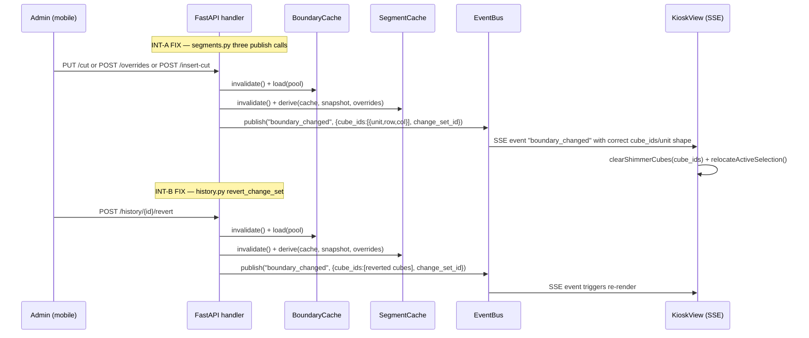

# Phase 10: Close Milestone Gaps — Research

**Researched:** 2026-05-25
**Domain:** Cross-phase integration repair + documentation traceability reconcile
**Confidence:** HIGH (all findings verified against current source code)

## Summary

Phase 10 closes exactly the two integration blockers and one documentation gap identified by
the v1.0 milestone audit. This is not a new-feature phase; every code change is a targeted
repair at a known seam with verified current line numbers.

**INT-A** is the simpler fix: three `boundary_changed` publish calls in `segments.py` use the
wrong payload field names (`cubes`/`unit_id` instead of `cube_ids`/`unit`). Every other
producer (`cubes.py`, `import_.py`) and the kiosk consumer (`KioskView.tsx`) already use the
correct shape. Renaming three dictionary keys (plus dropping the redundant top-level `type`
key) closes the blocker. The kiosk consumer should also be wrapped in try/catch per IN-02
so future payload drift degrades gracefully.

**INT-B** is the more substantive fix: `revert_change_set` in `history.py` reloads
`BoundaryCache` but never re-derives `SegmentCache` and never publishes `boundary_changed`.
The dependency injection pattern is already present in `cubes.py` and `segments.py` — wire
`get_segment_cache`, `get_collection_snapshot`, and `get_event_bus` into `revert_change_set`
and mirror the cache-invalidate + derive + publish pattern from `cubes.py:342-362`.

**Traceability reconcile** is a docs-only fix: 9 SEG rows and 1 CUBE-08 row in
`REQUIREMENTS.md` have stale `[ ]` + `Pending` status. The header count (81) and coverage
block (84) also disagree. The correct reconciled answer is 84 total requirements, 75
satisfied, 9 deferred — all in-scope numbers are confirmed by the audit.

**Primary recommendation:** Land all three items in one wave with one validation pass.
The code changes touch 2 Python files and 1 TypeScript file; the docs change touches 2
Markdown files. No schema changes, no new dependencies.

## Architectural Responsibility Map

| Capability | Primary Tier | Secondary Tier | Rationale |
|------------|-------------|----------------|-----------|
| SSE fan-out payload production | API / Backend | — | `bus.publish()` is called inside the FastAPI request handlers in `segments.py`; the payload shape is a server-side contract |
| SSE consumption + shimmer/relocate | Browser / Client | — | `KioskView.tsx` owns the `addEventListener('boundary_changed', ...)` handler |
| SegmentCache re-derivation after undo | API / Backend | — | `SegmentCache.derive()` is called in the handler's post-commit block; it reads from `BoundaryCache` + `CollectionSnapshot` (in-memory, no DB on hot path) |
| Traceability text in REQUIREMENTS.md | Documentation | — | Pure docs; no runtime component |

## Standard Stack

No new packages. All work uses the existing project stack:

| Layer | Existing Tool | Role in Phase 10 |
|-------|--------------|------------------|
| Python 3.13 | runtime | `history.py` change |
| FastAPI / `Depends()` | DI framework | wire new deps into `revert_change_set` |
| `SegmentCache.derive()` | segment computation | call after BoundaryCache reload in revert |
| `CollectionSnapshot` | in-memory snapshot | required arg to `derive()` |
| `EventBus.publish()` | SSE fan-out | publish `boundary_changed` after revert |
| React 19 / TypeScript | frontend | try/catch hardening in `KioskView.tsx` |
| pytest + pytest-asyncio | test runner | regression tests |
| ASGITransport + LifespanManager | integration test client | mirrors existing test pattern |
| uvicorn (live server) | SSE integration tests | mirrors `test_sse.py` pattern |

**Installation:** None required.

## Package Legitimacy Audit

No new packages are installed in this phase.

| Package | Registry | Disposition |
|---------|----------|-------------|
| (none) | — | N/A |

## Architecture Patterns

### System Architecture Diagram



### Recommended Project Structure

No new files or directories. Changes are targeted edits within:

```
src/gruvax/api/admin/
├── segments.py      ← INT-A: rename 3 publish payloads
└── history.py       ← INT-B: add 3 deps + post-commit re-derive + publish

frontend/src/routes/kiosk/
└── KioskView.tsx    ← INT-A hardening: try/catch around boundary_changed handler

.planning/
├── REQUIREMENTS.md  ← traceability: flip 9 SEG rows + CUBE-08 to Complete; fix count
└── ROADMAP.md       ← update traceability table count (73→84 in the intro paragraph)
```

### Pattern 1: Canonical `boundary_changed` Payload Shape

**What:** The correct shape used by every correct producer (`cubes.py`, `import_.py`).
**When to use:** Every `bus.publish("boundary_changed", ...)` call anywhere in the codebase.

```python
# Source: src/gruvax/api/admin/cubes.py:356-362 (verified current)
await bus.publish(
    "boundary_changed",
    {
        "cube_ids": [{"unit": unit_id, "row": row, "col": col}],
        "change_set_id": change_set_id,
    },
)
```

Key points:
- Top-level key is `cube_ids` (list), NOT `cubes`
- Each item uses `"unit"` (integer), NOT `"unit_id"`
- NO top-level `"type"` key (the EventBus wraps the event name separately)
- `change_set_id` may be `None` for override-only events (overrides don't have a change_set_id)

`ShimmerCube` type in TypeScript (source: `frontend/src/state/store.ts:9-13`, verified):
```typescript
export interface ShimmerCube {
  unit: number
  row: number
  col: number
}
```

### Pattern 2: SegmentCache Re-Derive After BoundaryCache Reload

**What:** The post-commit invalidate + reload + re-derive + publish block from `cubes.py`.
**When to use:** Every handler that mutates `cube_boundaries`.

```python
# Source: src/gruvax/api/admin/cubes.py:342-362 (verified current)
cache.invalidate()
try:
    await cache.load(pool)
    overrides: dict[tuple[int, int, int, str], float] = {}
    seg_bin_old = segment_cache.get_bin(unit_id, row, col)
    if seg_bin_old is not None:
        for seg in seg_bin_old.segments:
            if seg.is_override:
                overrides[(unit_id, row, col, seg.label)] = seg.applied_fraction
    segment_cache.invalidate()
    segment_cache.derive(cache, snapshot, overrides)
finally:
    await bus.publish(
        "boundary_changed",
        {
            "cube_ids": [{"unit": unit_id, "row": row, "col": col}],
            "change_set_id": change_set_id,
        },
    )
```

`SegmentCache.derive()` signature (source: `src/gruvax/estimator/segment_cache.py:95-99`, verified):
```python
def derive(
    self,
    cache: BoundaryCache,
    snapshot: CollectionSnapshot,
    overrides: dict[tuple[int, int, int, str], float],
) -> None:
```

**For `revert_change_set` (INT-B):** The overrides dict should be populated from
`segment_overrides` table (same approach as `segments.py::set_bin_overrides` lines 424-434
and `insert_cut` lines 670-681 — SELECT all rows from `gruvax.segment_overrides`). This is
because a revert can touch multiple cubes, and there is no single "old" SegmentCache bin to
read overrides from before invalidation. The `cube_ids` list to publish is the `reverted`
list — the cubes that were actually restored (not skipped due to conflict).

### Pattern 3: Dependency Injection in `history.py` (INT-B)

**What:** How cubes.py obtains `get_segment_cache` / `get_collection_snapshot` / `get_event_bus`.
**When to use:** Every handler that needs these app-state objects.

```python
# Source: src/gruvax/api/deps.py (all three providers verified)
from gruvax.api.deps import (
    get_boundary_cache,  # already in history.py
    get_collection_snapshot,  # ADD THIS
    get_event_bus,            # ADD THIS
    get_pool,                 # already in history.py
    get_segment_cache,        # ADD THIS
    require_admin,            # already in history.py
)
from gruvax.estimator.collection_snapshot import CollectionSnapshot  # ADD
from gruvax.estimator.segment_cache import SegmentCache              # ADD
from gruvax.events.bus import EventBus                               # ADD
```

The function signature of `revert_change_set` must add:
```python
async def revert_change_set(
    request: Request,
    change_set_id: str = Path(...),
    pool: Any = Depends(get_pool),
    cache: BoundaryCache = Depends(get_boundary_cache),
    segment_cache: SegmentCache = Depends(get_segment_cache),        # ADD
    snapshot: CollectionSnapshot = Depends(get_collection_snapshot), # ADD
    bus: EventBus = Depends(get_event_bus),                          # ADD
    _admin: dict[str, Any] = Depends(require_admin),
) -> JSONResponse:
```

### Pattern 4: KioskView SSE Hardening (IN-02)

**What:** Wrap the `boundary_changed` handler in try/catch to prevent a malformed payload
from propagating as an unhandled TypeError that silently terminates the event handler.

```typescript
// Source: current KioskView.tsx lines 239-258 (verified) — add try/catch
es.addEventListener('boundary_changed', (e: MessageEvent) => {
  try {
    const { cube_ids } = JSON.parse(e.data) as {
      cube_ids: ShimmerCube[]
      change_set_id: string
    }
    void queryClient.invalidateQueries({ queryKey: ['cubes'] })
    void queryClient.invalidateQueries({ queryKey: ['units'] })
    for (const c of cube_ids) {
      void queryClient.invalidateQueries({
        queryKey: ['cube-contents', c.unit, c.row, c.col],
      })
    }
    useGruvaxStore.getState().clearShimmerCubes(cube_ids)
    relocateActiveSelection()
  } catch (err) {
    console.error('[SSE] boundary_changed parse error — degrading gracefully', err)
  }
})
```

The same pattern applies to the `admin_editing` handler (lines 262-271) since it also
destructures `cube_ids`.

### Anti-Patterns to Avoid

- **Logging errors silently as console.log:** Use `console.error` so errors are
  visible in kiosk developer tools without triggering a full page crash.
- **Re-deriving SegmentCache inside the transaction:** `derive()` is CPU-only (no DB),
  but both `cache.load()` and the override SELECT need an async connection — these must
  run AFTER the `async with pool.connection() as conn, conn.transaction()` block has
  exited (Pitfall A).
- **Skipping the overrides SELECT in INT-B:** An undo may restore a bin that had
  admin-set width overrides. If overrides are not re-read from the DB, `segment_cache.derive()`
  will recalculate without them, silently dropping the owner's override configuration.
- **Publishing only when `reverted` is non-empty:** The `finally:` block must still
  publish even if `cache.load()` raises — this is the pattern from cubes.py. However, if
  `reverted` is empty (all cubes conflicted), publishing `cube_ids: []` is harmless
  and the kiosk will no-op correctly.

## Don't Hand-Roll

| Problem | Don't Build | Use Instead | Why |
|---------|-------------|-------------|-----|
| SSE payload shape negotiation | Custom versioning scheme | Fix the three key names at source | The contract is already agreed: cube_ids/unit is what every other producer and the consumer use |
| Custom override re-read | Separate override cache | Read from `gruvax.segment_overrides` table | This is exactly what `set_bin_overrides` and `insert_cut` already do |
| Manual event filtering | Publish only affected cubes with complex logic | Publish `reverted` list as `cube_ids` | The kiosk consumer invalidates per-cube queries by coordinate; passing only reverted cubes is correct and already the pattern |

**Key insight:** The fix for INT-B is 15-20 lines copied from cubes.py with two
substitutions: the `overrides` dict is populated from the DB table (not from a single
in-memory SegmentBin), and `cube_ids` is the `reverted` list (not a single cube coordinate).

## Runtime State Inventory

This phase does not rename any strings. No runtime state inventory required.

## Common Pitfalls

### Pitfall 1: `unit_id` vs `unit` in the cube item dict

**What goes wrong:** Fixing `cubes` → `cube_ids` at the list level but leaving `"unit_id"`
inside each item dict. The `ShimmerCube` TypeScript interface uses `unit` (not `unit_id`);
`c.unit` in the kiosk consumer will still be `undefined`.

**Why it happens:** The inner dict key looks like the Python parameter name, not the
wire contract.

**How to avoid:** The canonical item shape is `{"unit": unit_id, "row": row, "col": col}` —
`unit` not `unit_id`. Verify by checking `cubes.py:359` and `import_.py:559` after the fix.

**Warning signs:** `clearShimmerCubes` appears to work (store method is called) but the
kiosk grid doesn't clear the shimmer (coordinates don't match because `c.unit` is undefined).

### Pitfall 2: `type` key removal — confirm no consumer reads it

**What goes wrong:** Removing the `"type": "boundary_changed"` top-level key from segments.py
publishes would break a consumer that reads `event.type` instead of the SSE event name.

**Why it happens:** The old segments.py code added a redundant `type` key that no
documented consumer uses.

**How to avoid:** Verify `KioskView.tsx` only uses `e.data` (destructured `cube_ids`), never
reads a top-level `type` field from the parsed payload. Confirmed: `KioskView.tsx:240` parses
only `cube_ids` and `change_set_id` from the payload — `type` is not read anywhere in the
frontend. The correct producers (cubes.py, import_.py) already omit `type`. Safe to drop.

### Pitfall 3: INT-B — Pitfall A timing (cache mutation inside transaction)

**What goes wrong:** Calling `cache.invalidate()` or `segment_cache.derive()` inside the
`async with pool.connection() as conn, conn.transaction()` block.

**Why it happens:** It looks natural to update caches as part of the atomic write.

**How to avoid:** The invalidate + reload + derive block MUST run after the `async with`
block exits (Pitfall A is documented in `cubes.py:340-341`). The `finally:` for the publish
wraps only the cache-reload attempt.

**Warning signs:** Cache appears to hold data from before the revert.

### Pitfall 4: INT-B — empty `reverted` list edge case

**What goes wrong:** When all cubes in the change-set conflict (all skipped), `reverted`
is empty. If the publish is gated on `if reverted:`, no `boundary_changed` event is emitted
and the kiosk does not know the revert was attempted.

**How to avoid:** This is actually fine — emitting `cube_ids: []` or skipping entirely is
correct because nothing changed. The existing `history.py` code already gates cache reload
on `if reverted:` (line 193-195). Gate the segment re-derive + publish on the same condition.

### Pitfall 5: try/catch swallowing errors silently in KioskView

**What goes wrong:** Catching the parse error without logging, so a future payload shape
regression becomes invisible during debugging.

**How to avoid:** Always `console.error(err)` inside the catch block.

### Pitfall 6: Traceability count reconciliation

**What goes wrong:** Updating the traceability rows from `Pending` to `Complete` but not
fixing the header count or the ROADMAP.md traceability table intro.

**How to avoid:** The three locations that need updating are:
1. `REQUIREMENTS.md` header line (line 8): says "81 requirements" → correct to "84 requirements"
2. `REQUIREMENTS.md` coverage block (line 307): "84 total" is already correct → keep
3. `REQUIREMENTS.md` traceability intro (line 216): the intro paragraph doesn't state a count, so OK
4. `ROADMAP.md` traceability table intro paragraph (line 336): says "73 v1 requirements" → this is the original-v1 count before SEG added 8 and LED added 3; correct to "84 v1 requirements" OR add a note that 73 original + 11 added = 84.

The `[x]` checkbox changes needed in `REQUIREMENTS.md`:
- SEG-01 (line 51), SEG-02 (line 52), SEG-03 (line 53), SEG-04 (line 54),
  SEG-05 (line 55), SEG-06 (line 56), SEG-07 (line 57), SEG-08 (line 58): all `[ ]` → `[x]`
- CUBE-08 (line 32): already `[x]` in the requirements body — the audit's stale-Pending
  refers to the TRACEABILITY TABLE row (line 237), which says `Complete` already.

Wait — re-check: REQUIREMENTS.md line 237 `CUBE-08 | Phase 2 ... | Complete` — this row
IS already Complete in the traceability table. The stale-Pending is ONLY for SEG-01..08.
CUBE-08 is stale-Pending only in the v1 requirements body checkbox `[x]` at line 32 — which
is already ticked `[x]`. Conclusion: CUBE-08 traceability table row is already Complete;
the fix is SEG-01..08 rows only (traceability table lines 246-253, all say `Pending`).

## Code Examples

### INT-A Fix — segments.py put_bin_cut publish (lines 295-302, verified current)

Current (WRONG):
```python
await bus.publish(
    "boundary_changed",
    {
        "type": "boundary_changed",
        "change_set_id": change_set_id,
        "cubes": [{"unit_id": unit_id, "row": row, "col": col}],
    },
)
```

Fixed (matches cubes.py canonical shape):
```python
await bus.publish(
    "boundary_changed",
    {
        "cube_ids": [{"unit": unit_id, "row": row, "col": col}],
        "change_set_id": change_set_id,
    },
)
```

### INT-A Fix — segments.py set_bin_overrides publish (lines 438-445, verified current)

Current (WRONG):
```python
await bus.publish(
    "boundary_changed",
    {
        "type": "boundary_changed",
        "change_set_id": None,
        "cubes": [{"unit_id": unit_id, "row": row, "col": col}],
    },
)
```

Fixed:
```python
await bus.publish(
    "boundary_changed",
    {
        "cube_ids": [{"unit": unit_id, "row": row, "col": col}],
        "change_set_id": None,
    },
)
```

### INT-A Fix — segments.py insert_cut publish (lines 684-691, verified current)

Current (WRONG) — note `affected_cubes` is `list[dict[str, int]]` with `"unit_id"` keys:
```python
await bus.publish(
    "boundary_changed",
    {
        "type": "boundary_changed",
        "change_set_id": change_set_id,
        "cubes": affected_cubes,           # each item: {"unit_id": uid, "row": r, "col": c}
    },
)
```

Fixed — also rename `affected_cubes` items to use `"unit"`:
```python
# Change the append at line 663 to:
affected_cubes.append({"unit": uid, "row": r, "col": c})

# Then the publish becomes:
await bus.publish(
    "boundary_changed",
    {
        "cube_ids": affected_cubes,
        "change_set_id": change_set_id,
    },
)
```

### INT-B Fix — history.py revert_change_set post-commit block

After the `async with pool.connection() as conn, conn.transaction()` block (after line 183),
replace the current 2-line cache reload:

```python
# CURRENT (lines 193-195):
if reverted:
    cache.invalidate()
    await cache.load(pool)
```

With the full re-derive + publish pattern:

```python
if reverted:
    cache.invalidate()
    try:
        await cache.load(pool)
        # Re-read all overrides from DB (revert may affect multiple bins)
        overrides: dict[tuple[int, int, int, str], float] = {}
        async with pool.connection() as conn2:
            async with conn2.cursor() as cur:
                await cur.execute(
                    "SELECT unit_id, row, col, label, fraction"
                    " FROM gruvax.segment_overrides"
                )
                override_rows = await cur.fetchall()
        for uid_o, r_o, c_o, lbl_o, frac_o in override_rows:
            overrides[(int(uid_o), int(r_o), int(c_o), str(lbl_o))] = float(frac_o)
        segment_cache.invalidate()
        segment_cache.derive(cache, snapshot, overrides)
    finally:
        await bus.publish(
            "boundary_changed",
            {
                "cube_ids": [
                    {"unit": r["unit_id"], "row": r["row"], "col": r["col"]}
                    for r in reverted
                ],
                "change_set_id": new_change_set_id,
            },
        )
```

## State of the Art

| Old Approach | Current Approach | Impact |
|--------------|------------------|--------|
| `cubes`/`unit_id` keys in segments.py publishes | `cube_ids`/`unit` keys (matching every other producer) | Fixes INT-A TypeError in kiosk |
| BoundaryCache reload only after revert | BoundaryCache + SegmentCache reload + boundary_changed publish after revert | Fixes INT-B stale /api/locate + missing live kiosk update |

## Assumptions Log

All claims in this research were verified against current source code in this session. No
`[ASSUMED]` claims.

| # | Claim | Section | Risk if Wrong |
|---|-------|---------|---------------|
| — | (none) | — | — |

## Open Questions

1. **Should `change_set_id: None` be preserved for the overrides publish?**
   - What we know: `set_bin_overrides` doesn't create a history row (overrides are not
     in `boundary_history`), so `None` is semantically correct.
   - What's unclear: Does any consumer check for non-null `change_set_id`?
   - Recommendation: Keep `change_set_id: None` for the overrides publish — this matches
     cubes.py's bulk-write which always passes a UUID; the overrides endpoint is an edge
     case with no history ID. KioskView.tsx does not check the value.

2. **Should `admin_editing` handler also get try/catch in KioskView.tsx?**
   - What we know: The `admin_editing` handler at lines 262-271 also destructures `cube_ids`.
     It doesn't call `for (const c of cube_ids)` so a `cube_ids: undefined` is less likely
     to throw, but it passes `cube_ids` to Zustand's `setShimmerCubes`/`clearShimmerCubes`
     which expects `ShimmerCube[]` — if `cube_ids` is undefined, the Zustand reducers will
     receive `undefined` and silently store it.
   - Recommendation: Add try/catch to both `boundary_changed` AND `admin_editing` handlers
     for consistent defensive posture (IN-02 spirit).

## Environment Availability

No external dependencies. All tools already verified running from prior phases.

| Dependency | Required By | Available | Fallback |
|------------|------------|-----------|---------|
| Python 3.13 | `history.py` edit | Already running | — |
| pytest + pytest-asyncio | regression tests | Already in dev env | — |
| Node.js / TypeScript | `KioskView.tsx` edit | Already in dev env | — |

## Validation Architecture

### Test Framework

| Property | Value |
|----------|-------|
| Framework | pytest 8.x + pytest-asyncio (session loop) |
| Config file | `pyproject.toml` (`[tool.pytest.ini_options]`) |
| Quick run command | `uv run pytest tests/integration/test_segment_api.py tests/integration/test_change_set.py tests/integration/test_sse.py -x` |
| Full suite command | `uv run pytest tests/` |

### Phase Requirements → Test Map

| Req ID | Behavior | Test Type | Automated Command | File Status |
|--------|----------|-----------|-------------------|-------------|
| SEG-07/SEG-08 (INT-A payload) | `PUT /cut` emits `cube_ids`/`unit` shaped payload | integration | `pytest tests/integration/test_segment_api.py::test_cut_publishes_correct_payload -x` | Wave 0 gap |
| SEG-08 (INT-A override payload) | `POST /overrides` emits `cube_ids`/`unit` payload | integration | `pytest tests/integration/test_segment_api.py::test_overrides_publishes_correct_payload -x` | Wave 0 gap |
| SEG-07 (INT-A insert-cut payload) | `POST /insert-cut` emits `cube_ids`/`unit` payload | integration | `pytest tests/integration/test_segment_api.py::test_insert_cut_publishes_correct_payload -x` | Wave 0 gap |
| ADMN-09 (INT-B segment re-derive) | After revert, `/api/locate` returns fresh sub-cube positions (SegmentCache updated) | integration | `pytest tests/integration/test_change_set.py::test_revert_rederives_segment_cache -x` | Wave 0 gap |
| RTM-01 (INT-B SSE publish) | After revert, `boundary_changed` is published with reverted cubes | integration | `pytest tests/integration/test_change_set.py::test_revert_publishes_boundary_changed -x` | Wave 0 gap |
| IN-02 (KioskView hardening) | Malformed SSE payload does not propagate as uncaught TypeError | unit (frontend) | `vitest run` or manual browser inspection | Manual-only |

### Test Design Notes

**INT-A payload shape test pattern** (mirrors `test_sse.py::test_boundary_changed_latency`):

```python
# Capture the event payload by subscribing to the EventBus directly
# OR by using the live uvicorn approach from test_sse.py.
# For pure payload verification without a live server, use dependency_overrides
# to capture bus.publish() calls.
#
# Recommended approach: use a SpyEventBus that records published events.
# This avoids the uvicorn complexity for what is a unit-level payload contract.

class SpyEventBus:
    def __init__(self):
        self.published = []
    async def publish(self, event: str, payload: dict) -> None:
        self.published.append((event, payload))

# In test: override get_event_bus, call the endpoint, assert published[0][1]
# has cube_ids and unit (not cubes/unit_id).
```

**INT-B re-derive test pattern**:
- After a bulk write (creates change_set_id), verify `/api/locate` returns a position
- Revert the change_set_id
- Verify `/api/locate` returns a DIFFERENT position (SegmentCache was re-derived)
- This requires the integration test client with full LifespanManager (app caches load at startup)
- The shared dev DB means the test must restore fixture state after mutating (same pattern
  as `test_segment_api.py` which re-seeds via `load_boundaries()` in the module fixture)

**INT-B SSE publish test pattern**:
- Mirror the `test_boundary_changed_latency` pattern from `test_sse.py` — use a live
  uvicorn server, open an SSE stream, then POST the revert, assert `boundary_changed` appears
  in the stream with `cube_ids` containing the reverted cube coordinates
- OR use a SpyEventBus override — simpler for CI

**Shared-state reset requirement** (from MEMORY.md integration test harness context):
- `test_change_set.py` module fixture does NOT re-seed boundaries (unlike `test_segment_api.py`)
- New tests for INT-B that mutate boundaries must either: (a) restore the fixture state at
  teardown, or (b) use cubes that are not depended on by other tests (e.g. a cube in row 3
  that no other test uses as a reference)
- The `_reset_login_rate_limit_global` autouse fixture in `conftest.py` handles the rate
  limiter automatically — no per-module reset needed

### Sampling Rate

- **Per task commit:** `uv run pytest tests/integration/test_segment_api.py tests/integration/test_change_set.py -x`
- **Per wave merge:** `uv run pytest tests/`
- **Phase gate:** Full suite green before `/gsd-verify-work`

### Wave 0 Gaps

The following test functions do not yet exist and must be created before or alongside the fixes:

- [ ] `tests/integration/test_segment_api.py::test_cut_publishes_correct_payload` — covers INT-A/SEG-07/SEG-08 for `PUT /cut`
- [ ] `tests/integration/test_segment_api.py::test_overrides_publishes_correct_payload` — covers INT-A for `POST /overrides`
- [ ] `tests/integration/test_segment_api.py::test_insert_cut_publishes_correct_payload` — covers INT-A/SEG-07/SEG-08 for `POST /insert-cut`
- [ ] `tests/integration/test_change_set.py::test_revert_rederives_segment_cache` — covers INT-B/ADMN-09
- [ ] `tests/integration/test_change_set.py::test_revert_publishes_boundary_changed` — covers INT-B/RTM-01

The `KioskView.tsx` try/catch is frontend code; verification is manual (no Vitest integration
test infrastructure exists in this project for SSE parsing edge cases).

## Security Domain

This phase makes no auth, session, or input-validation changes. The CSRF requirement is
already enforced by `require_admin` on all mutating segment/history endpoints — `revert_change_set`
already depends on `require_admin` (line 71 of `history.py`), so adding the three new dependencies
does not change the security surface.

No new ASVS categories apply. Existing controls carry forward unchanged.

## Sources

### Primary (HIGH confidence — verified against current source in this session)

- `src/gruvax/api/admin/segments.py` — lines 295-302 (put_bin_cut publish, WRONG), 438-445 (set_bin_overrides publish, WRONG), 684-691 (insert_cut publish, WRONG); imports at lines 55-66 (correct imports already present)
- `src/gruvax/api/admin/history.py` — lines 38 (import section, missing 3 deps), 65-72 (function signature, missing 3 deps), 191-195 (post-commit block, missing re-derive + publish)
- `src/gruvax/api/admin/cubes.py` — lines 342-362 (canonical reference re-derive + publish pattern for INT-B to mirror)
- `src/gruvax/api/admin/import_.py` — lines 555-562 (confirms canonical `cube_ids`/`unit` shape)
- `src/gruvax/api/deps.py` — all five dependency providers verified (get_pool, get_boundary_cache, get_collection_snapshot, get_segment_cache, get_event_bus); all read from `request.app.state`
- `src/gruvax/estimator/segment_cache.py` — line 95-99: `derive(self, cache, snapshot, overrides)` signature confirmed
- `frontend/src/routes/kiosk/KioskView.tsx` — lines 239-258: `boundary_changed` handler confirmed; destructures only `cube_ids` and `change_set_id`; no `type` key read
- `frontend/src/state/store.ts` — lines 9-13: `ShimmerCube = { unit, row, col }` confirmed
- `tests/integration/test_sse.py` — live uvicorn pattern confirmed for SSE tests
- `tests/integration/test_segment_api.py` — LifespanManager + boundaries re-seed pattern confirmed
- `tests/integration/test_change_set.py` — existing revert test structure confirmed
- `tests/conftest.py` — `_reset_login_rate_limit_global` autouse fixture confirmed; `db_pool` session scope confirmed
- `.planning/v1.0-MILESTONE-AUDIT.md` — INT-A, INT-B, traceability gap authoritative spec
- `.planning/REQUIREMENTS.md` — SEG-01..08 traceability rows (lines 246-253) all `Pending`; CUBE-08 traceability row (line 237) already `Complete`; header (line 8) says "81 requirements"; coverage block (line 307) says "84 total"

### Secondary (MEDIUM confidence)

- None — all research was against primary sources.

## Metadata

**Confidence breakdown:**
- INT-A fix locations: HIGH — verified current line numbers in segments.py
- INT-A canonical shape: HIGH — confirmed from cubes.py and import_.py + ShimmerCube type
- INT-B fix location: HIGH — verified current line numbers in history.py
- INT-B re-derive pattern: HIGH — cloned from cubes.py:342-362 with confirmed SegmentCache.derive() signature
- Dependency injection pattern: HIGH — deps.py fully read, pattern confirmed
- Traceability reconcile: HIGH — REQUIREMENTS.md lines 246-253 and line 8 verified
- CUBE-08 status: HIGH — traceability table line 237 is already `Complete`; only SEG-01..08 need flipping
- Test architecture: HIGH — existing test patterns confirmed from test_sse.py + test_segment_api.py + conftest.py

**Research date:** 2026-05-25
**Valid until:** Stable — Phase 10 scope is entirely within files verified in this session; no external dependencies.
