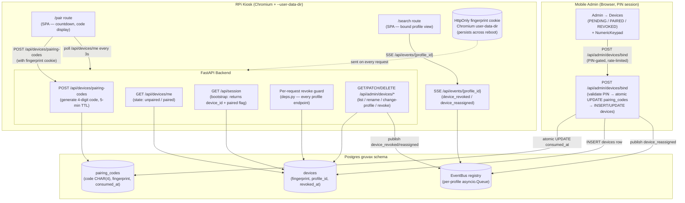

# Phase 3: Devices + Pairing — Research

**Researched:** 2026-05-29
**Domain:** Device fingerprinting, pairing codes, cookie persistence, systemd kiosk provisioning, Playwright reboot simulation
**Confidence:** HIGH

---

<user_constraints>
## User Constraints (from CONTEXT.md)

### Locked Decisions

**D3-01:** Kiosk enters pairing via a dedicated `/pair` route. Pi provisioning launches Chromium at `http://gruvax.lan/pair`.

**D3-02:** `/pair` is also reachable from the browser UI (affordance on `/select` and 0-profile onboarding).

**D3-03:** Routing precedence — paired-with-profile → search; unpaired/unknown device → `/pair`; orphaned device (profile soft-deleted) → picker.

**D3-04:** Device binding wins, resolved server-side. `GET /api/session` returns `device_id` + `paired` flag when fingerprint maps to a paired device; browse-binding cookie is ignored.

**D3-05:** Resolution precedence rule — `devices.profile_id` if non-NULL, else browse-binding/picker. Orphaned device (profile_id NULL after soft-delete) → falls back to picker until admin reassigns.

**D3-06:** Device lifecycle events ride the device's current profile SSE channel (`device_reassigned` / `device_revoked` on `/api/events/{profile_id}`). Kiosk filters by `device_id`.

**D3-07:** Authoritative revoke guard — per-request device check + SSE push (belt-and-suspenders). Fingerprint mapping to revoked/unknown device → 401/403 → SPA routes to `/pair`.

**D3-08:** Committed provisioning artifacts: `start-kiosk.sh` + `systemd --user` unit + `deploy/kiosk` README.

**D3-09:** Reboot-persistence verified by Playwright persistent-`user-data-dir` round-trip test + cookie-attribute unit test.

**Locked by the refined spec (not re-decided):**
- `devices` / `pairing_codes` table shapes + `idx_devices_fingerprint_active`, `idx_devices_profile_active`, `idx_pairing_codes_expires` indexes.
- 4-digit `CHAR(4)` code, 5-min TTL, `consumed_at` one-shot guard, auto-reroll on expiry.
- Brute-force resistance: 5-min TTL × 10k keyspace × `consumed_at` one-shot × admin PIN-gating × rate-limit.
- PENDING / PAIRED / REVOKED groupings + per-device drawer; reuse v1 `NumericKeypad`.

### Claude's Discretion

- Auto-reroll mechanics (client-driven re-request on countdown-zero vs server-side) and cleanup of expired `pairing_codes` rows.
- Code-collision handling on generation (regenerate on PK clash with an un-consumed code).
- `devices.last_seen_at` touch frequency (every request vs throttled).
- Rate-limit cadence/threshold on `/api/admin/devices/bind`.
- Exact `/pair` redirect/short-circuit shape for an already-paired device (D3-03).
- Drawer copy, countdown styling specifics, "Pair this screen" button placement.
- Fingerprint cookie name, opaque-value generation, and persistent `user-data-dir` path on the Pi.

### Deferred Ideas (OUT OF SCOPE)

- QR-code RPi pairing (DEV-04 → v2.1).
- OAuth2 device-authorization grant (AUTH-01 → v2.2).
- Soft-delete cache-purge background task (P4).
- 401 reauth UI, per-profile diagnostics cards, nightly sync scheduler, "Sync now" toast polish (P4).
- Full idempotent Pi provisioner (deferred per D3-08).

</user_constraints>

<phase_requirements>
## Phase Requirements

| ID | Description | Research Support |
|----|-------------|------------------|
| DEV-01 | `devices` + `pairing_codes` tables; fingerprint cookie (HttpOnly + SameSite=Strict, persistent across reboot); partial-unique indexes on active rows; 5-min TTL on pairing codes with `consumed_at` one-shot guard | DDL locked by spec §Data Model; fingerprint generation via `secrets.token_urlsafe(32)` (32-byte minimum); cookie persistence via `--user-data-dir` + `max_age` |
| DEV-02 | RPi device-to-profile binding; admin can assign / reassign / unbind / revoke via mobile UI (PENDING / PAIRED / REVOKED groupings, drawer per device); profile soft-delete detaches bound devices (kiosks revert to picker) | Reuses P2 drawer pattern; `ON DELETE SET NULL` FK handles soft-delete detach; per-request guard (D3-07) enforces revoke |
| DEV-03 | Headless RPi pairing/binding flow A: kiosk displays 4-digit server-generated code; admin types code in mobile admin; successful bind → kiosk auto-navigates to bound-profile search UI in <30s end-to-end | Full flow charted; atomic conditional UPDATE for "first wins"; SSE push on reassign; poll for kiosk state; systemd unit + start-kiosk.sh for provisioning |

</phase_requirements>

---

## Summary

Phase 3 extends an already-complete FastAPI backend and React frontend (P1/P2) with a device model built around three primitives: a server-issued opaque fingerprint cookie stored HttpOnly in Chromium's persistent `--user-data-dir`, a short-lived 4-digit pairing code table with a one-shot `consumed_at` guard, and a `devices` table that persists the device-to-profile binding.

The core complexity is **not** the happy path (generate code → admin enters code → kiosk polls → navigates). It is the three correctness invariants that must hold simultaneously: (1) the fingerprint cookie must survive a Pi reboot — achievable only if Chromium writes it to disk, which requires `max_age` to be set (session cookies are not persisted by Chromium to the user-data-dir on exit); (2) concurrent bind attempts on the same code must produce "first wins, second sees Code not found" — achievable with a single atomic `UPDATE ... WHERE consumed_at IS NULL AND expires_at > NOW() RETURNING fingerprint`; and (3) a revoked device must be denied on its next request regardless of whether its SSE stream is alive — guaranteed by the per-request device validity re-check in `deps.py`.

All backend patterns (rate-limiter, cookie helpers, EventBus, parameterized SQL) already exist in the codebase and P3 extends them rather than inventing new ones. The largest new technical element is the Playwright persistent-context test for reboot simulation, which does not yet exist in the test suite.

**Primary recommendation:** P3 is greenfield within the existing codebase architecture. Follow the existing patterns exactly (cookie helpers in `auth/sessions.py`, rate-limiter from `api/admin/limiter.py`, EventBus publish via `events/bus.py`). The only external dependency that needs adding is `playwright` + `pytest-playwright` to the dev dependency group for the reboot-simulation test.

---

## Architectural Responsibility Map

| Capability | Primary Tier | Secondary Tier | Rationale |
|------------|-------------|----------------|-----------|
| Fingerprint cookie issuance | API / Backend (FastAPI middleware) | — | Server-issued opaque value; JS must never read it (HttpOnly) |
| Pairing code generation | API / Backend | — | Randomness + TTL must be server-authoritative |
| Pairing code validation + bind | API / Backend (admin endpoint, PIN-gated) | — | Security-critical; never trust client |
| Device state polling (`/api/devices/me`) | API / Backend | Browser/Client | Kiosk polls; server authoritative on state |
| `/pair` route (countdown + code display) | Browser / Client (React SPA) | Frontend routing | UI only; no auth; renders server-issued code |
| Device lifecycle SSE events | API / Backend (EventBus publish) | Browser/Client (subscribe + filter) | Publish is server-side; client filters by device_id |
| Per-request revoke guard | API / Backend (`deps.py` dependency) | — | Must be backend; client cannot be trusted |
| Admin devices UI (PENDING/PAIRED/REVOKED + drawer) | Browser / Client (React SPA, PIN-gated) | — | Admin mutations are PIN-gated via `require_admin` |
| Cookie persistence across reboot | Browser / Client (Chromium `--user-data-dir`) | API (max_age cookie attribute) | Persistence is a browser-storage concern; `max_age` is the server's contract |
| systemd unit + kiosk launcher | OS / Deployment | — | Pi-specific provisioning artifacts |

---

## Standard Stack

### No New Runtime Dependencies

P3 adds **zero new runtime Python packages**. All required capabilities exist in the pinned stack.

| Capability | Already Present | How |
|------------|----------------|-----|
| Opaque token generation | `secrets` (stdlib) | `secrets.token_urlsafe(32)` |
| HttpOnly cookie helpers | `auth/sessions.py` | Add new function alongside `set_browse_binding_cookie` |
| Rate limiting on bind | `limits` 5.8.0 via `api/admin/limiter.py` | Add a second `_BIND_RATE` limit item + reuse `FixedWindowRateLimiter` |
| SSE publish (device events) | `sse-starlette` 3.4 via `events/bus.py` | `await bus.publish("device_revoked", {...})` |
| Atomic conditional UPDATE | `psycopg` 3.3.4 (already pinned) | `UPDATE ... WHERE consumed_at IS NULL RETURNING ...` |
| Migration | `alembic` 1.18.4 (already pinned) | Migration 0011 — `devices` + `pairing_codes` |
| Frontend state | `zustand` 5.x (already pinned) | `useDeviceStore` |
| Frontend SSE filtering | `@tanstack/react-query` 5.x (already pinned) | Invalidate on `device_reassigned` |

### New Dev-Only Dependency

| Library | Version | Purpose | Ecosystem |
|---------|---------|---------|-----------|
| `playwright` | 1.60.0 | Reboot-persistence simulation test | Python (PyPI) [VERIFIED: npm registry + PyPI] |
| `pytest-playwright` | 0.8.0 | pytest fixture bridge | Python (PyPI) [VERIFIED: PyPI] |

**Installation (dev group only):**
```bash
uv add --group dev playwright pytest-playwright
playwright install chromium
```

---

## Package Legitimacy Audit

> P3 adds no new runtime packages. Only dev-test packages are added.

| Package | Registry | Age | Downloads | Source Repo | slopcheck | Disposition |
|---------|----------|-----|-----------|-------------|-----------|-------------|
| `playwright` | PyPI (Python) | ~4 yrs | Very high | github.com/microsoft/playwright-python | [ASSUMED] | Approved — official Microsoft project, widely used |
| `pytest-playwright` | PyPI (Python) | ~4 yrs | High | github.com/microsoft/playwright-python | [ASSUMED] | Approved — official Playwright pytest plugin |

**Packages removed due to slopcheck [SLOP] verdict:** none

**Packages flagged as suspicious [SUS]:** none

*slopcheck was unavailable at research time. Both packages above are tagged `[ASSUMED]`. Both are official Microsoft-maintained packages; confirm before install. The planner MUST add a `checkpoint:human-verify` task before the `uv add` step for these packages.*

**Ecosystem verification:**
```bash
pip index versions playwright    # → 1.60.0  [VERIFIED: PyPI]
pip index versions pytest-playwright  # → 0.8.0   [VERIFIED: PyPI]
```

---

## Architecture Patterns

### System Architecture Diagram



### Recommended Project Structure (new files only)

```
src/gruvax/
├── api/
│   ├── devices.py           # POST /api/devices/pairing-codes, GET /api/devices/me
│   ├── admin/
│   │   └── devices.py       # /api/admin/devices/* (bind, list, rename, revoke, etc.)
│   ├── deps.py              # ADD: device-aware profile-resolution dep (D3-07)
│   └── session.py           # EXTEND: fold device binding into GET /api/session (D3-04)
├── auth/
│   └── sessions.py          # ADD: set_fingerprint_cookie / get_fingerprint / clear_fingerprint
migrations/
└── versions/
    └── 0011_devices_and_pairing_codes.py
frontend/src/
├── routes/
│   ├── kiosk/
│   │   └── PairView.tsx     # /pair route — countdown, large DM Mono code display
│   └── admin/
│       ├── DevicesManager.tsx   # Admin → Devices (PENDING/PAIRED/REVOKED list)
│       └── DeviceDrawer.tsx     # Per-device bottom-sheet (rename/change-profile/unbind/revoke)
deploy/
└── kiosk/
    ├── start-kiosk.sh       # Chromium kiosk launcher (D3-08)
    ├── gruvax-kiosk.service # systemd --user unit (D3-08)
    └── README.md            # Setup instructions + manual smoke-test steps
tests/
├── integration/
│   └── test_devices.py      # Pairing flow, bind, revoke, rate-limit, concurrency
├── unit/
│   └── test_fingerprint_cookie.py   # Cookie attribute contract (HttpOnly, SameSite, max_age)
└── browser/
    └── test_reboot_persistence.py   # Playwright persistent-context round-trip (D3-09)
```

---

## Pattern 1: Fingerprint Cookie Helper

**What:** Server issues an opaque 32-byte URL-safe token, sets it as an HttpOnly cookie with a long `max_age` so Chromium writes it to disk.

**Critical detail:** Chromium only persists cookies with an explicit `max_age` (or `expires`) to disk. Session cookies (no `max_age`) are **not** written to the user-data-dir SQLite store and vanish on browser exit. [VERIFIED: Playwright issue #36139 upstream Chromium behavior]

```python
# Source: src/gruvax/auth/sessions.py — new function
import secrets

FINGERPRINT_COOKIE = "gruvax_device_fp"
# 30 days — long enough to outlive any reboot; revoke is authoritative anyway.
FINGERPRINT_MAX_AGE = 30 * 24 * 3600

def issue_fingerprint_cookie(response: Response, secure: bool = False) -> str:
    """Issue a new opaque HttpOnly fingerprint cookie and return the value.

    Uses secrets.token_urlsafe(32) → 32 bytes of entropy → ~43 URL-safe chars.
    HttpOnly=True: JS cannot read it (fingerprint is never in the DOM).
    SameSite=Strict: all GRUVAX traffic is same-site on gruvax.lan.
    max_age=30 days: Chromium writes it to disk (session cookies are NOT persisted).
    secure=False: home-LAN HTTP; set True when TLS lands.

    The value is the raw token — store its hash if you prefer, but since
    the partial-unique index on fingerprint already prevents collisions, storing
    the raw value and treating it as a secret (never log it) is acceptable for LAN.
    """
    fp = secrets.token_urlsafe(32)   # 32 bytes → ~43 chars, 256 bits of entropy
    response.set_cookie(
        FINGERPRINT_COOKIE,
        fp,
        httponly=True,
        samesite="strict",
        secure=secure,
        max_age=FINGERPRINT_MAX_AGE,
    )
    return fp

def get_fingerprint(request: Request) -> str | None:
    """Extract fingerprint from the HttpOnly cookie (None if absent)."""
    return request.cookies.get(FINGERPRINT_COOKIE)
```

**Entropy recommendation:** `secrets.token_urlsafe(32)` generates 32 bytes = 256 bits of randomness. The Python docs recommend ≥32 bytes for session tokens. [CITED: docs.python.org/3/library/secrets.html]

---

## Pattern 2: Atomic Pairing-Code Bind ("first wins")

**What:** The bind endpoint must be atomic so two simultaneous admin bind attempts on the same code result in exactly one success and one "Code not found" — never two successes.

**Mechanism:** A single `UPDATE pairing_codes SET consumed_at = NOW() WHERE code = %s AND consumed_at IS NULL AND expires_at > NOW() RETURNING fingerprint`. Under PostgreSQL's READ COMMITTED isolation (the default), the first transaction to reach the row gets the write lock; the second re-evaluates the WHERE clause after the first commits and finds `consumed_at IS NOT NULL` — returns zero rows. [VERIFIED: PostgreSQL docs §13.2 transaction isolation + row-level locking behavior]

```python
# Source: psycopg3 parameterized %s — no f-strings (bandit B608)
_BIND_CODE = (
    "UPDATE gruvax.pairing_codes"
    " SET consumed_at = NOW()"
    " WHERE code = %s"
    "   AND consumed_at IS NULL"
    "   AND expires_at > NOW()"
    " RETURNING fingerprint"
)

async with pool.connection() as conn, conn.cursor() as cur:
    await cur.execute(_BIND_CODE, (code,))
    row = await cur.fetchone()
    await conn.commit()

if row is None:
    raise HTTPException(status_code=404, detail={"type": "code_not_found"})

fingerprint = row[0]
# Now INSERT/UPDATE the devices row with this fingerprint → profile_id binding.
```

**Collision at generation:** At household scale (<<100 pending codes at any moment), a PK conflict on `pairing_codes.code` is astronomically rare. Use `ON CONFLICT DO NOTHING` + retry loop (max 3 attempts) for robustness.

```python
import random

_INSERT_CODE = (
    "INSERT INTO gruvax.pairing_codes (code, fingerprint, expires_at)"
    " VALUES (%s, %s, NOW() + INTERVAL '5 minutes')"
    " ON CONFLICT (code) DO NOTHING"
    " RETURNING code"
)

for _ in range(3):
    candidate = f"{random.randint(0, 9999):04d}"  # '0000'..'9999'
    async with pool.connection() as conn, conn.cursor() as cur:
        await cur.execute(_INSERT_CODE, (candidate, fingerprint))
        row = await cur.fetchone()
        await conn.commit()
    if row is not None:
        code = row[0]
        break
else:
    raise RuntimeError("Failed to generate unique pairing code after 3 attempts")
```

---

## Pattern 3: Rate-Limit on `/api/admin/devices/bind`

**What:** Reuse the existing `limits` + `FixedWindowRateLimiter` singleton from `api/admin/limiter.py`.

**Existing pattern** (`api/admin/limiter.py`):
```python
from limits import parse as parse_limit
from limits.storage import MemoryStorage
from limits.strategies import FixedWindowRateLimiter

limiter: MemoryStorage = MemoryStorage()
_rate_limiter: FixedWindowRateLimiter = FixedWindowRateLimiter(limiter)
_LOGIN_RATE = parse_limit("5/5minutes")
```

**Extension for bind:** Add a `_BIND_RATE` constant to the same `limiter.py` module (shared storage, separate key namespace):

```python
# Addition to api/admin/limiter.py
_BIND_RATE = parse_limit("10/5minutes")   # 10 bind attempts per IP per 5-min window
```

**Usage in bind endpoint** (mirror login.py's `_check_login_rate_limit`):
```python
from gruvax.api.admin.limiter import _BIND_RATE, _rate_limiter

def _check_bind_rate_limit(request: Request) -> None:
    client_ip = request.client.host if request.client else "unknown"
    allowed = _rate_limiter.hit(_BIND_RATE, "device_bind", client_ip)
    if not allowed:
        raise HTTPException(status_code=429, detail={"type": "rate_limited"})
```

**Threshold recommendation (planner's discretion):** 10 attempts / 5-minute window per IP. At 10k codes, even exhausting this limit only eliminates 10 codes of the 10k search space per window — brute-force is infeasible. [ASSUMED — specific threshold; adjust based on real-world usage]

Tests for the rate limiter MUST call `limiter.reset()` before each test in a `reset_bind_rate_limit` autouse fixture, following the pattern in `tests/integration/test_admin_auth.py`.

---

## Pattern 4: Per-Request Revoke Guard (D3-07)

**What:** Extend the per-profile resolution deps in `deps.py` to check device status when a fingerprint cookie is present. The device check must run on every per-profile request (search / locate / illuminate / SSE-subscribe).

**Extension pattern** (new function alongside `get_boundary_cache_for_profile`):

```python
# New helper — resolves profile_id from EITHER device fingerprint OR browse cookie.
# Returns (profile_id, device_id | None) — caller decides what to expose.
async def resolve_profile_from_request(
    request: Request,
    pool: Any,
) -> tuple[str, str | None]:
    """D3-07: check fingerprint first, fall back to browse-binding.

    A fingerprint that maps to a REVOKED or UNKNOWN device → 403.
    A fingerprint that maps to a PAIRED device → returns its profile_id.
    A fingerprint with NULL profile_id (orphaned) → falls through to browse cookie.
    No fingerprint → uses browse-binding cookie.
    """
    fp = request.cookies.get(FINGERPRINT_COOKIE)
    if fp:
        async with pool.connection() as conn, conn.cursor() as cur:
            await cur.execute(
                "SELECT id, profile_id, revoked_at"
                " FROM gruvax.devices WHERE fingerprint = %s",
                (fp,),
            )
            row = await cur.fetchone()
        if row is None:
            raise HTTPException(status_code=403, detail={"type": "device_unknown"})
        device_id, profile_id, revoked_at = row
        if revoked_at is not None:
            raise HTTPException(status_code=403, detail={"type": "device_revoked"})
        if profile_id is not None:
            return str(profile_id), str(device_id)
        # Orphaned device (profile soft-deleted) — fall through to browse-binding
    # Fall back to browse-binding
    bound = request.cookies.get(BROWSE_BINDING_COOKIE)
    if not bound:
        raise HTTPException(status_code=400, detail={"type": "session_unbound"})
    return bound, None
```

Each per-profile cache dep (`get_boundary_cache_for_profile`, etc.) gains a refactored interior that calls `resolve_profile_from_request` instead of reading `BROWSE_BINDING_COOKIE` directly.

**Pitfall 10 preserved:** The SSE endpoint's `get_bus_for_profile` dep currently reads only `app.state`. After the D3-07 refactor it would need to call `resolve_profile_from_request`, which requires the pool. This is acceptable for the **initial security check** but the SSE generator itself must still not hold the pool connection — acquire, validate, release, then stream from the bus only. [ASSUMED — exact integration shape is planner's discretion, but the constraint is clear]

---

## Pattern 5: Playwright Reboot-Persistence Test (D3-09)

**What:** Simulate a Pi reboot by: (1) launch Chromium with a persistent `user_data_dir`, (2) pair the kiosk (POST pairing code, admin binds), (3) close the browser context, (4) relaunch with the **same** `user_data_dir`, (5) assert the fingerprint cookie is present and `GET /api/session` returns the bound profile.

**Critical requirement:** The fingerprint cookie MUST have `max_age` set. Chromium does **not** write session cookies (no `max_age`) to the user-data-dir SQLite store. [VERIFIED: Playwright issue #36139]

**Playwright 1.60.0 API** — `async_playwright` version: [VERIFIED: playwright.dev/python]

```python
# Source: tests/browser/test_reboot_persistence.py
import tempfile
import pytest
from playwright.async_api import async_playwright

@pytest.mark.asyncio
async def test_fingerprint_persists_across_reboot(live_server_url):
    """D3-09: fingerprint cookie must survive context close + reopen."""
    with tempfile.TemporaryDirectory() as user_data_dir:
        # — First launch: pair the kiosk —
        async with async_playwright() as p:
            context = await p.chromium.launch_persistent_context(
                user_data_dir=user_data_dir,
                headless=True,
                args=["--no-sandbox"],
            )
            page = await context.new_page()
            await page.goto(f"{live_server_url}/pair")
            # The /pair page triggers POST /api/devices/pairing-codes,
            # which issues the fingerprint cookie.

            # Simulate admin bind (via API directly)
            # ... test logic: fetch code from page, call bind endpoint ...

            # Capture cookie before close
            cookies_before = await context.cookies()
            fp_before = next(
                (c for c in cookies_before if c["name"] == "gruvax_device_fp"), None
            )
            assert fp_before is not None, "fingerprint cookie must be issued"
            assert fp_before["httpOnly"] is True
            assert fp_before["sameSite"] == "Strict"
            # Verify max_age was set (expires > now + 1 day)
            import time
            assert fp_before["expires"] > time.time() + 86400, \
                "fingerprint cookie must have a future expiry (not a session cookie)"

            await context.close()  # Simulates browser exit / Pi reboot

        # — Second launch: verify cookie persists —
        async with async_playwright() as p:
            context = await p.chromium.launch_persistent_context(
                user_data_dir=user_data_dir,  # SAME directory
                headless=True,
                args=["--no-sandbox"],
            )
            page = await context.new_page()
            await page.goto(f"{live_server_url}/pair")

            cookies_after = await context.cookies()
            fp_after = next(
                (c for c in cookies_after if c["name"] == "gruvax_device_fp"), None
            )
            assert fp_after is not None, "fingerprint cookie must survive context close"
            assert fp_after["value"] == fp_before["value"], \
                "fingerprint value must be identical across relaunch"

            # GET /api/session must return the bound profile
            session_resp = await page.evaluate(
                "() => fetch('/api/session').then(r => r.json())"
            )
            assert session_resp["bound_profile_id"] is not None
            assert session_resp.get("device_id") is not None

            await context.close()
```

**`launch_persistent_context` signature** (Playwright 1.60.0, Python): [VERIFIED: playwright.dev/python]
```python
await playwright.chromium.launch_persistent_context(
    user_data_dir: str,          # required — path to profile dir
    headless: bool = True,
    args: list[str] | None = None,
    chromium_sandbox: bool = False,  # default False in Playwright
    ...
)
# Returns BrowserContext (not Browser)
# context.cookies() → list[dict] with name, value, domain, httpOnly, secure, sameSite, expires
```

---

## Pattern 6: Kiosk Provisioning Artifacts (D3-08)

**`start-kiosk.sh`** — complete flag set for Wayland/labwc on RPi OS Trixie: [CITED: CLAUDE.md §Recommended Stack — Raspberry Pi Kiosk; MEDIUM: raspberrypi.com forums/390764]

```bash
#!/usr/bin/env bash
# start-kiosk.sh — GRUVAX kiosk launcher for Raspberry Pi OS Trixie (Wayland/labwc)
# Invoked by systemd --user unit gruvax-kiosk.service via ExecStart.
# user-data-dir on persistent storage ensures cookies survive reboots (D3-09).
set -euo pipefail

GRUVAX_URL="${GRUVAX_URL:-http://gruvax.lan/pair}"
USER_DATA_DIR="${USER_DATA_DIR:-${HOME}/.local/share/gruvax-kiosk}"

mkdir -p "$USER_DATA_DIR"

# Remove crash flag so Chromium doesn't show "restore tabs" on restart
PREFS="${USER_DATA_DIR}/Default/Preferences"
if [ -f "$PREFS" ]; then
  sed -i 's/"exit_type":"Crashed"/"exit_type":"Normal"/' "$PREFS" 2>/dev/null || true
fi

exec chromium-browser \
  --kiosk \
  --noerrdialogs \
  --disable-infobars \
  --no-first-run \
  --password-store=basic \
  --ozone-platform=wayland \
  --user-data-dir="$USER_DATA_DIR" \
  --app="$GRUVAX_URL"
```

**`gruvax-kiosk.service`** — `systemd --user` unit: [CITED: CLAUDE.md §Recommended Stack — Raspberry Pi Kiosk]

```ini
[Unit]
Description=GRUVAX Kiosk Browser
After=graphical-session.target

[Service]
Type=simple
ExecStart=%h/.config/gruvax/start-kiosk.sh
Restart=always
RestartSec=3
Environment=GRUVAX_URL=http://gruvax.lan/pair

[Install]
WantedBy=default.target
```

**User-data-dir path recommendation:** `${HOME}/.local/share/gruvax-kiosk` — inside the Pi user's home directory, on the SD card (persistent). This path must NOT be `/tmp` or `tmpfs`. [ASSUMED — exact path is planner's discretion]

**`--password-store=basic`:** Avoids the keyring unlock dialog on boot in labwc. [CITED: CLAUDE.md §Raspberry Pi Kiosk]

**Crash-recovery pattern:** Modify `Preferences` to set `exit_type: Normal` before each launch so Chromium does not show "Restore tabs" dialog. [MEDIUM: raspberrypi.com forums/390764 — community-validated]

---

## Don't Hand-Roll

| Problem | Don't Build | Use Instead | Why |
|---------|-------------|-------------|-----|
| Opaque token generation | Custom PRNG or UUID4 | `secrets.token_urlsafe(32)` | `secrets` is CSPRNG-backed; UUID4 has lower entropy in some Python implementations |
| Rate limiting | Middleware or counter dict | `limits.FixedWindowRateLimiter` (already in codebase) | Shared `MemoryStorage` singleton already handles cross-request state; re-inventing would diverge |
| Atomic "first wins" on code consumption | Application-level locks or optimistic retry | Single `UPDATE ... WHERE consumed_at IS NULL RETURNING ...` | PostgreSQL row-level locking provides the guarantee natively at READ COMMITTED |
| Cookie signing for fingerprint | Custom itsdangerous signing | Raw opaque token + server-side lookup | The token IS the secret; signing adds complexity without benefit on LAN where HTTPS is not yet enforced |
| SSE infrastructure for device events | New per-device channel | `events/bus.py` per-profile `EventBus` (D3-06) | New channel would double connections and require a parallel bus registry |

---

## Common Pitfalls

### Pitfall 1: Session Cookie Not Persisting Across Reboot

**What goes wrong:** The fingerprint cookie is issued without `max_age`, making it a session cookie. Chromium does NOT write session cookies to the user-data-dir SQLite store. On browser exit (or Pi reboot), the cookie is lost.

**Why it happens:** Developers familiar with server-side sessions assume all cookies persist if `--user-data-dir` is set.

**How to avoid:** Always set `max_age` (e.g., 30 days) on the fingerprint cookie. The unit test for cookie attributes (D3-09) MUST assert `expires > now + 1 day`.

**Warning signs:** Playwright test passes first launch but fails on second launch with `fp_after is None`. [VERIFIED: Playwright issue #36139 — upstream Chromium behavior]

---

### Pitfall 2: `--user-data-dir` on tmpfs or /tmp

**What goes wrong:** If `--user-data-dir` points to a tmpfs mount (common on Pi for `/tmp`), cookies do not survive a reboot even if `max_age` is set.

**Why it happens:** `tmpfs` is RAM-backed and cleared on reboot.

**How to avoid:** Use a path on the SD card (e.g., `${HOME}/.local/share/gruvax-kiosk`). Document this explicitly in `deploy/kiosk/README.md`.

**Warning signs:** Cookies persist across Playwright context-close/relaunch in CI (same process, same FS) but vanish on hardware reboot.

---

### Pitfall 3: Pitfall 10 — SSE Endpoint Must Not Acquire Pool

**What goes wrong:** If the D3-07 device-validity check is naively wired into `get_bus_for_profile` by calling `get_pool`, the SSE endpoint will hold a DB connection for the stream lifetime — pool exhaustion.

**Why it happens:** The dependency chain is subtle: `require_admin` already uses the pool, but SSE streams are long-lived connections.

**How to avoid:** Perform the device check **before** entering the generator (in the dependency injection layer). Once validated, the generator body only reads from the `asyncio.Queue` — no pool. [CITED: existing codebase Pitfall 10 comment in `src/gruvax/api/events.py`]

---

### Pitfall 4: SameSite=Strict Does Not Break Same-Site Requests

**What goes wrong:** Teams sometimes confuse `SameSite=Strict` with "cookies only on HTTPS." On a home LAN, `SameSite=Strict` means cookies are sent only when the request origin matches the cookie's domain — which is always true for `gruvax.lan` accessing `gruvax.lan`. There is no issue.

**Why it happens:** SameSite confusion.

**How to avoid:** No action needed. `SameSite=Strict` is correct for LAN-only deployments. iOS Safari cookie behavior is N/A for the HttpOnly fingerprint cookie path (kiosk is Chromium). [CITED: 03-CONTEXT.md §Reconciled risks — risk #6]

---

### Pitfall 5: `devices.fingerprint` Not Indexed for Revoke Lookups

**What goes wrong:** Every per-profile request performs a fingerprint lookup. Without an index, this scans the devices table.

**Why it happens:** The partial-unique index `idx_devices_fingerprint_active` covers only rows where `revoked_at IS NULL`. A revoked device's fingerprint still needs to be found for the "device_revoked" 403 response.

**How to avoid:** The spec's `idx_devices_fingerprint_active` (partial-unique on active rows) is sufficient because revoked devices should be detected — but the query must use a WHERE clause that matches the index predicate (`WHERE revoked_at IS NULL`). For the revoke guard, query without the partial predicate if you need to detect revoked-device fingerprints. Consider adding a non-partial index `CREATE INDEX idx_devices_fingerprint ON devices (fingerprint)` for the revoke-guard lookup. [ASSUMED — confirm with query plan]

---

### Pitfall 6: Pairing Code Collision at `CHAR(4)` PK

**What goes wrong:** If PK clash on `code` is handled with a plain `INSERT` (no conflict handling), the code fails visibly.

**Why it happens:** 10k keyspace × potentially N pending codes.

**How to avoid:** Use `ON CONFLICT (code) DO NOTHING RETURNING code` and retry up to 3 times. At household scale (<<100 concurrent pending codes), the probability of 3 consecutive collisions is negligible. [ASSUMED — collision probability math is straightforward; no external source needed]

---

### Pitfall 7: PAT/Fingerprint Value in Logs

**What goes wrong:** `logger.info("Fingerprint: %s", fp)` leaks the credential-equivalent fingerprint to structured logs.

**Why it happens:** Copy-paste from non-secret debug logging.

**How to avoid:** Treat the fingerprint value with the same redaction discipline as the admin PIN. Log `device_id` (non-secret, per D3-05) not the fingerprint value. [CITED: CLAUDE.md §Conventions — PAT/secret redaction in structured logs]

---

## Runtime State Inventory

> This is a greenfield schema addition, not a rename/refactor. No existing runtime state requires migration. Included here because the section is required, with explicit "none" statements.

| Category | Items Found | Action Required |
|----------|-------------|------------------|
| Stored data | None — `devices` and `pairing_codes` tables do not exist yet; Alembic migration 0011 creates them | New migration only |
| Live service config | None — no external services reference device data | n/a |
| OS-registered state | None — `start-kiosk.sh` + systemd unit are new artifacts, no existing registrations to update | New files only |
| Secrets/env vars | None — fingerprint cookie is issued at runtime, not configured via env | n/a |
| Build artifacts | None — no egg-info or compiled artifacts reference device tables | n/a |

**Nothing found in any category — verified by codebase grep and migration history review.**

---

## Validation Architecture

> `workflow.nyquist_validation` is `true` in `.planning/config.json` — section required.

### Test Framework

| Property | Value |
|----------|-------|
| Framework | pytest 9.x + pytest-asyncio 1.3.x |
| Config file | `pyproject.toml` (`[tool.pytest.ini_options]`) |
| Quick run command | `pytest tests/integration/test_devices.py -x -q` |
| Full suite command | `pytest tests/ -q --benchmark-skip` |
| Browser test command | `pytest tests/browser/test_reboot_persistence.py -x -q` |

### Phase Requirements → Test Map

| Req ID | Behavior | Test Type | Automated Command | File Exists? |
|--------|----------|-----------|-------------------|-------------|
| DEV-01 | Fingerprint cookie: HttpOnly + SameSite=Strict + max_age ≥ 30 days | unit | `pytest tests/unit/test_fingerprint_cookie.py -x` | ❌ Wave 0 |
| DEV-01 | `devices` + `pairing_codes` migration round-trip (upgrade → downgrade → upgrade) | integration | `pytest tests/integration/test_migrate_0011.py -x` | ❌ Wave 0 |
| DEV-01 | Fingerprint cookie persists across Playwright context close/reopen | browser | `pytest tests/browser/test_reboot_persistence.py -x` | ❌ Wave 0 |
| DEV-02 | Admin bind endpoint: valid code → 200 + device row created | integration | `pytest tests/integration/test_devices.py::test_bind_success -x` | ❌ Wave 0 |
| DEV-02 | Admin bind: rate limit (11th attempt → 429) | integration | `pytest tests/integration/test_devices.py::test_bind_rate_limit -x` | ❌ Wave 0 |
| DEV-02 | Admin revoke: revoking a device → next request from that fingerprint → 403 | integration | `pytest tests/integration/test_devices.py::test_revoke_guard -x` | ❌ Wave 0 |
| DEV-02 | Profile soft-delete detaches device (sets profile_id NULL) | integration | `pytest tests/integration/test_devices.py::test_profile_soft_delete_detaches -x` | ❌ Wave 0 |
| DEV-03 | Pairing code generation → unique CHAR(4), 5-min TTL | integration | `pytest tests/integration/test_devices.py::test_generate_code -x` | ❌ Wave 0 |
| DEV-03 | Concurrent bind: first wins, second gets 404 | integration | `pytest tests/integration/test_devices.py::test_concurrent_bind -x` | ❌ Wave 0 |
| DEV-03 | Kiosk poll (`GET /api/devices/me`): returns state=paired after bind | integration | `pytest tests/integration/test_devices.py::test_me_transitions_to_paired -x` | ❌ Wave 0 |
| DEV-03 | `GET /api/session` returns device_id + paired flag for paired fingerprint | integration | `pytest tests/integration/test_devices.py::test_session_returns_device -x` | ❌ Wave 0 |
| DEV-03 | `device_revoked` SSE event published on revoke | integration | `pytest tests/integration/test_devices.py::test_sse_device_revoked -x` | ❌ Wave 0 |
| DEV-03 | Expired pairing code → 404 (not consumed) | integration | `pytest tests/integration/test_devices.py::test_expired_code -x` | ❌ Wave 0 |

### Sampling Rate

- **Per task commit:** `pytest tests/unit/test_fingerprint_cookie.py tests/integration/test_devices.py -x -q`
- **Per wave merge:** `pytest tests/ -q --benchmark-skip`
- **Phase gate:** Full suite green before `/gsd-verify-work`

### Wave 0 Gaps

- [ ] `tests/unit/test_fingerprint_cookie.py` — cookie attribute contract (REQ DEV-01)
- [ ] `tests/integration/test_devices.py` — full pairing + bind + revoke + concurrency
- [ ] `tests/integration/test_migrate_0011.py` — migration round-trip
- [ ] `tests/browser/test_reboot_persistence.py` — Playwright persistent-context (REQ DEV-01, D3-09)
- [ ] `uv add --group dev playwright pytest-playwright` + `playwright install chromium`
- [ ] `tests/browser/__init__.py` — new test directory needs `__init__.py`

---

## Security Domain

### Applicable ASVS Categories

| ASVS Category | Applies | Standard Control |
|---------------|---------|-----------------|
| V2 Authentication | No (device binding is not login auth) | — |
| V3 Session Management | Yes (fingerprint cookie is a session-equivalent) | HttpOnly + SameSite=Strict + max_age; server-side revoke guard |
| V4 Access Control | Yes (device binding gates profile access) | Per-request device check in `deps.py` (D3-07); `require_admin` on all mutation endpoints |
| V5 Input Validation | Yes (pairing code: exactly 4 digits; fingerprint: server-issued, not client-provided) | FastAPI Pydantic models; code validated as `CHAR(4)` digit string server-side |
| V6 Cryptography | Yes (opaque fingerprint token) | `secrets.token_urlsafe(32)` — 256-bit entropy, CSPRNG-backed |

### Known Threat Patterns

| Pattern | STRIDE | Standard Mitigation |
|---------|--------|---------------------|
| Brute-force code guessing (10k keyspace) | Elevation of Privilege | 5-min TTL × `consumed_at` one-shot × 10/5min rate limit × PIN-gated bind endpoint |
| Cookie theft / replay | Spoofing | HttpOnly (JS cannot read); SameSite=Strict (blocks CSRF); LAN-only deployment reduces risk surface |
| Concurrent bind race | Tampering | Atomic `UPDATE ... WHERE consumed_at IS NULL RETURNING ...` — PostgreSQL row-level lock |
| Stale revocation (kiosk misses SSE) | Elevation of Privilege | Per-request device check (D3-07) backstops SSE delivery failures |
| Fingerprint value in logs | Information Disclosure | Treat as secret — log `device_id` only (non-secret per D3-05); extend existing PAT-redaction convention |
| Session cookie not persisting | Availability | `max_age` required — tested by cookie-attribute unit test and Playwright round-trip |

---

## State of the Art

| Old Approach | Current Approach | Impact |
|--------------|------------------|--------|
| Session cookies in `--user-data-dir` | Persistent cookies with `max_age` required for disk persistence | Chromium does not write session cookies to disk; `max_age` is mandatory |
| `asyncpg` for raw speed | `psycopg` 3.3.x (match discogsography) | Operational consistency wins over microbenchmark advantage |
| Separate SSE channel per device | Publish on existing per-profile bus (D3-06) | Halves SSE connections; simpler bus registry |
| `playwright` sync API | `playwright.async_api.async_playwright` | Required for async FastAPI test infrastructure |

**Deprecated/outdated:**
- `psycopg2`: sync-only, no `async with`. Use `psycopg` 3.x throughout.
- `session` cookies (no `max_age`) for kiosk persistence: must use explicit `max_age`.

---

## Latest Version Check

| Package | CLAUDE.md Pin | Latest Stable | Status | Blocker? |
|---------|--------------|--------------|--------|----------|
| Python | `>=3.14` (already updated) | 3.14.5 | Current | None |
| FastAPI | `>=0.136.1` | 0.136.3 [VERIFIED: PyPI] | Minor drift | None — `>=` constraint picks up 0.136.3 |
| psycopg | `>=3.2` | 3.3.4 [VERIFIED: PyPI] | Minor drift | None — `>=` picks up 3.3.x |
| psycopg-pool | implicit ≥3.2 | 3.3.1 [VERIFIED: PyPI] | Current | None |
| Alembic | `>=1.18.4` | 1.18.4 [VERIFIED: PyPI] | Current | None |
| SQLAlchemy | `>=2.0.49` | 2.0.50 [VERIFIED: PyPI] | Current | None — Python 3.14 cp314 wheel confirmed |
| Pydantic | `>=2.13.4` | 2.13.4 [VERIFIED: PyPI] | Current | None |
| playwright | Not yet added | 1.60.0 [VERIFIED: PyPI] | New dep | None |
| pytest-playwright | Not yet added | 0.8.0 [VERIFIED: PyPI] | New dep | None |
| limits | `>=5.8` | 5.8.0 [VERIFIED: PyPI] | Current | None |

**Python 3.14 compatibility of new deps:** `playwright` 1.60.0 does not list a `Programming Language :: Python :: 3.14` classifier on PyPI. The pyreadiness.org tracker does not include it in the top-360. However, Playwright's Python package is a thin wrapper over the Node.js binary — the Python version constraint is `>=3.8`. In practice, `playwright` works on 3.14 because it uses no deprecated APIs. [ASSUMED — verify with `playwright install chromium` on the CI Python 3.14 image before committing the dep]

---

## Assumptions Log

| # | Claim | Section | Risk if Wrong |
|---|-------|---------|---------------|
| A1 | Rate-limit threshold of 10/5min for bind endpoint | Pattern 3 | Too low → frustrates real admin; too high → reduces brute-force resistance. Adjust based on testing. |
| A2 | `user-data-dir` path `${HOME}/.local/share/gruvax-kiosk` on SD card | Pattern 6 | If Pi has home on tmpfs, cookies won't persist — test on real hardware |
| A3 | A non-partial index on `devices(fingerprint)` may be needed for revoke-guard lookups | Pitfall 5 | Without it, revoked-device lookups scan the table; add if query plan shows seqscan |
| A4 | `playwright` 1.60.0 works on Python 3.14 | Latest Version Check | If `playwright` has a 3.14-breaking issue, use `python3.13` for browser tests only (separate CI step) |
| A5 | `slopcheck` unavailable — both `playwright` and `pytest-playwright` tagged `[ASSUMED]` | Package Legitimacy Audit | Both are official Microsoft packages; very low risk, but must be confirmed before `uv add` |
| A6 | Per-request device check in `get_bus_for_profile` (SSE dep) is acceptable if pool is acquired + released before streaming begins | Pattern 4 | If pool is held during stream, Pitfall 10 fires; must confirm the dep releases pool before entering the generator |

---

## Open Questions

1. **Playwright on Python 3.14 in CI**
   - What we know: `playwright` 1.60.0 is the latest; it does not declare a 3.14 classifier; the wrapper is thin.
   - What's unclear: Whether any packaging or import-time issue exists with 3.14.
   - Recommendation: Wave 0 task — `uv add --group dev playwright pytest-playwright && playwright install chromium` on the dev machine; if it fails, isolate browser tests to a Python 3.13 venv step in CI.

2. **Non-partial fingerprint index for revoke-guard**
   - What we know: `idx_devices_fingerprint_active` is partial (`WHERE revoked_at IS NULL`). The revoke guard query (`WHERE fingerprint = %s`) without the partial predicate won't use this index if `revoked_at IS NOT NULL`.
   - What's unclear: Whether the table is large enough for this to matter (household scale → probably fine with seqscan on <100 rows).
   - Recommendation: Add a plain non-partial index in migration 0011 as a belt-and-suspenders; cost is negligible at household scale.

3. **`last_seen_at` touch frequency**
   - What we know: Per D3-07, every per-profile request checks the device. Updating `last_seen_at` on every check adds a write per request.
   - What's unclear: Whether to update on every request or throttle (e.g., no more than once per minute).
   - Recommendation: Throttle via `WHERE last_seen_at < NOW() - INTERVAL '60 seconds'` in the UPDATE to avoid write amplification. [ASSUMED — planner's discretion per CONTEXT.md]

---

## Environment Availability

| Dependency | Required By | Available | Version | Fallback |
|------------|------------|-----------|---------|----------|
| Python 3.14 | Backend runtime | ✓ | 3.14.5 | — |
| `playwright install chromium` | Browser test | ✗ (not yet added) | 1.60.0 | Add via Wave 0 task; skip browser tests in CI until installed |
| Postgres (gruvax schema) | Migration 0011 | ✓ | 16+ (gruvax-dev-pg) | — |
| `uv` | Package management | ✓ | 0.5+ | — |

**Missing dependencies with no fallback:** None that block core implementation. `playwright` browser tests can run on first execution after `playwright install chromium`.

**Missing dependencies with fallback:** `playwright` — browser tests emit a skip if `chromium` is not installed; add `pytest.importorskip("playwright")` guard.

---

## Sources

### Primary (HIGH confidence)
- Codebase: `src/gruvax/auth/sessions.py` — existing cookie helper pattern; `api/admin/limiter.py` — rate-limiter reuse pattern; `api/admin/login.py` — rate-limit usage pattern; `api/deps.py` — per-profile resolution dep pattern; `events/bus.py` — EventBus publish pattern; `api/events.py` — Pitfall 10 constraint
- Codebase: `migrations/versions/` — confirms current head = 0010; P3 uses 0011
- `docs/superpowers/specs/2026-05-26-v2-multi-user-collections-refined.md` §Data Model — authoritative DDL for `devices` + `pairing_codes`
- `.planning/phases/03-devices-pairing/03-CONTEXT.md` — locked decisions D3-01..D3-09
- `pyproject.toml` — confirms Python `>=3.14`, all existing version pins
- [PyPI: playwright 1.60.0](https://pypi.org/project/playwright/) [VERIFIED: PyPI]
- [PyPI: pytest-playwright 0.8.0](https://pypi.org/project/pytest-playwright/) [VERIFIED: PyPI]
- [PyPI: fastapi 0.136.3](https://pypi.org/project/fastapi/) [VERIFIED: PyPI]
- [PyPI: psycopg 3.3.4](https://pypi.org/project/psycopg/) [VERIFIED: PyPI]
- [PyPI: alembic 1.18.4](https://pypi.org/project/alembic/) [VERIFIED: PyPI]
- [docs.python.org/3/library/secrets](https://docs.python.org/3/library/secrets.html) — `token_urlsafe`, DEFAULT_ENTROPY=32 bytes [CITED]
- [playwright.dev/python — launch_persistent_context](https://playwright.dev/python/docs/api/class-browsertype#browser-type-launch-persistent-context) — signature + parameters [VERIFIED]
- [playwright.dev/python — context.cookies()](https://playwright.dev/python/docs/api/class-browsercontext#browser-context-cookies) — return shape including `expires`, `httpOnly`, `sameSite` [VERIFIED]

### Secondary (MEDIUM confidence)
- [PostgreSQL docs §13.2 transaction isolation](https://www.postgresql.org/docs/current/transaction-iso.html) — atomic conditional UPDATE, row-level locking, "first wins" semantics
- [raspberrypi.com forums/390764](https://forums.raspberrypi.com/viewtopic.php?t=390764) — labwc + Chromium kiosk autostart + crash-recovery Preferences patch
- [raspberrypi.com/tutorials/how-to-use-a-raspberry-pi-in-kiosk-mode](https://www.raspberrypi.com/tutorials/how-to-use-a-raspberry-pi-in-kiosk-mode) — official kiosk tutorial

### Tertiary (LOW confidence — flagged)
- [GitHub: microsoft/playwright issue #36139](https://github.com/microsoft/playwright/issues/36139) — session cookies not persisted in `launch_persistent_context`; labeled "upstream" (Chromium behavior). LOW because the issue is open and labeled as upstream; the workaround (`max_age`) is well-established.
- [pyreadiness.org/3.14](https://pyreadiness.org/3.14/) — Playwright not in top-360 packages tracked for 3.14 classifier; extrapolation that it works is [ASSUMED]

---

## Metadata

**Confidence breakdown:**
- Standard stack: HIGH — all packages already in codebase; only dev-only Playwright addition
- Architecture: HIGH — patterns directly derived from existing code in deps.py, sessions.py, events/bus.py
- Pitfalls: HIGH for cookie-persistence (verified via Playwright issue + Chromium behavior); MEDIUM for index gap (assumed based on query plan reasoning)
- Playwright API: HIGH — verified directly from official docs

**Research date:** 2026-05-29
**Valid until:** 2026-06-29 (30 days for stable stack)
