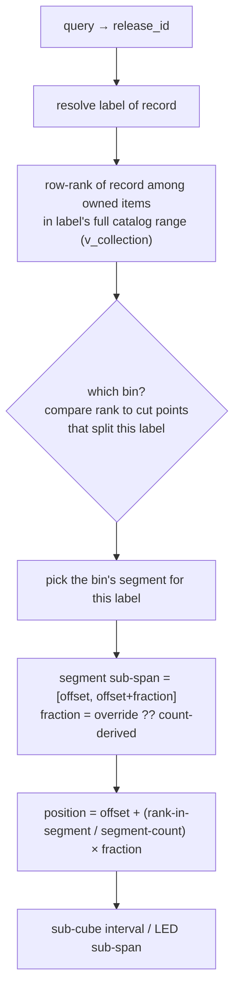

# Segment-Aware Boundary Model

## Problem with today's model

The current schema stores **one span per cube**: `(first_label, first_catalog) →
(last_label, last_catalog)`. The §4.1 estimator interpolates a record's position
by treating that whole cube-span as **uniform**. When a bin holds several labels
of different sizes, that smears the estimate — e.g. it would place a record from
the third label across the entire bin width.

## The new model: store cut points, derive everything else

A bin is not one span — it is an **ordered list of label-runs (segments)**:

```
bin 1: [A:001→A:342] [B:05→B:10] [C:37→C:49]
bin 2: [C:50→C:72]   [D:13→D:39c]
bin 3: [D:45a→D:83]  [E:0009→E:0034]
```

**Stored data (the only manual input):**
- The **cut point** of each bin — the *first record of the bin*. That single
  transition point, plus the globally-ordered collection, determines the bin's
  entire contents up to the next cut.
- **Optional physical-width overrides** per label-segment, for when the physical
  shelf width diverges from the count-derived fraction (box-set-heavy labels,
  thick gatefolds, etc.).

**Derived (never stored, never hand-entered):**
- Which labels live in each bin, and each label-segment's first/last record.
- Per-segment **counts** — by **row-counting `v_collection`** across the
  segment's catalog range. (See invariant #2 — this is NOT catalog arithmetic.)
- Per-label **fraction of the bin** — count-derived by default; the override
  wins when present.

This mirrors the spirit of the existing Phase-6/now-7 setup wizard ("the first
record of the next cube implies the last record of this cube") — it just derives
a *finer* structure from the same transition points.

## Invariants (learned the hard way in the explore session)

1. **Label contiguity.** Order is label-then-catalog, so a label occupies one
   contiguous *global* run. Once a bin moves past B into C, label B is finished —
   it can never reappear in a later bin. A label therefore lives in at most a set
   of **adjacent** bins (usually one; two if it straddles a single cut). Never
   scattered.

2. **Counts ≠ catalog arithmetic.** `C:49 − C:37` is **not** 12 records. The
   catalog space is sparse and irregular: duplicate owned copies, variant
   releases (a `37` and a `37-r` remix), and gaps. The true count is a **row
   count of owned items** in that catalog range. `gruvax.v_collection` is built
   on `collection_items` (one row per physically owned copy, each with its own
   `collection_item_id`), so dupes and variants are each counted correctly —
   provided the count comes from rows, never from subtracting numbers.

## Two-level interpolation (the locate algorithm)

To locate a record:

1. **Which bin + segment** — resolve the label, then the bin holding the
   relevant part of that label's run.
2. **Where in the bin** — the segment occupies a known fraction of the bin
   width, *offset by the labels before it*. Bin 1 example with A=45%, B=10%,
   C=rest: A owns 0–45%, B owns 45–55%, C owns 55–100%.
3. **Where in the segment** — interpolate the specific record by its **row-rank**
   among owned items in that label's catalog range, mapped onto the segment's
   sub-span.



### Straddle case falls out cleanly

When C spans bin 1 and bin 2, the **bin-2 cut point** partitions it:
`C:37..C:49` in bin 1's tail (55–100%), `C:50..C:72` in bin 2's head. To place
`C:60`, its rank puts it past the cut → bin 2's C-segment → interpolate within
bin 2's sub-span. The fraction is always **local to a bin**; no special-casing.

## Payoffs (all three drive this — goal is maximum location precision)

- **On-screen precision** — the sub-cube position bar is *right* even when 3
  labels share a bin (supersedes §4.1).
- **Physical LED precision** — when LEDs land (now Phase 6), light the exact
  linear sub-span a label/record occupies in a bin's strip. The physical-width
  override becomes load-bearing here.
- **Admin / shelf truth** — better fill-level bars, reveal-panel contents, and
  reshuffle math, so the owner *trusts* the map.

## Risks / open questions

- **Ordering parser is now load-bearing twice over.** The whole scheme depends
  on a correct total order over `(label, catalog_number)` where catalog# is a
  sparse string with variants. That is the existing POS-01 parser/comparator's
  job — segment derivation now depends on it too. Property tests must cover the
  variant/dupe cases (`37` vs `37-r`, multiple copies of one catalog#).
- **Override UX (→ sketch).** How the owner views/sets a bin's per-label split,
  *and edits/adds cut points*. Captured as a `/gsd:sketch` task.
- **Format-thickness refinement (future).** Within a segment, records are placed
  uniformly by rank. A later refinement could weight by `format` (2xLP, box set)
  for sub-segment thickness. Out of scope until the segment estimator proves
  insufficient.
- **Deferred but recommended:** extend Phase-2's `run_all_algorithms.py` A/B
  harness with the segment-aware estimator to prove it beats §4.1 on the real
  CSV before locking it in (mirrors POS-06). Not selected for capture in the
  explore session, but the discipline is on record here.

## Routing decision

- New **Phase 5: Segment-Aware Position Precision** — schema (cut points +
  overrides), derived-segment service, segment-aware estimator superseding §4.1,
  admin override + cut-point editor UI.
- **Sequencing:** lands *before* the LED phase, because LED sub-span precision
  depends on this model. Existing Phase 5 (LED) → 6, Phase 6 (Wizards) → 7,
  Phase 7 (Observability) → 8.
