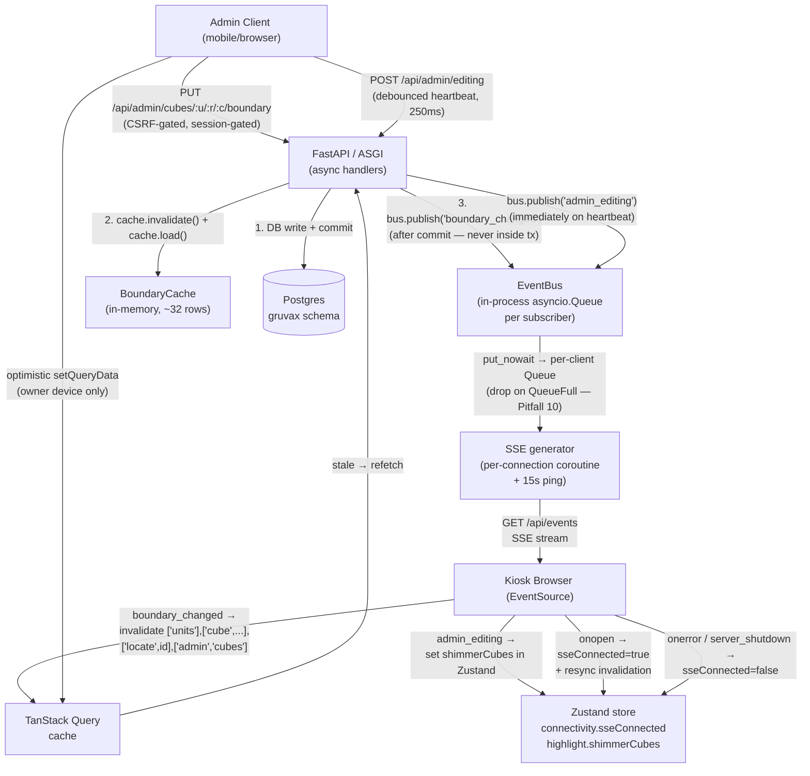

# Phase 4: Realtime Live Updates — Research

**Researched:** 2026-05-21
**Domain:** Server-Sent Events (sse-starlette 3.4.x), in-process asyncio.Queue EventBus, native browser EventSource, TanStack Query v5 optimistic mutations, Zustand connectivity slice
**Confidence:** HIGH

---

<user_constraints>
## User Constraints (from CONTEXT.md)

### Locked Decisions

- **D-01/D-02/D-03:** "Boundaries updating" cue = ambient shimmer on affected cube range, appears while owner is mid-edit via a debounced `admin_editing` heartbeat, clears on commit + ~60s idle safety. Never recolor a lit cell; LED-physics motion.
- **D-04/D-05/D-06:** Kiosk re-renders affected cubes on `boundary_changed`. Highlight follows the record: re-run `/api/locate` by invalidating the active `['locate', release_id]` query (extends ARCHITECTURE's consumer sketch which only invalidated `['cube',...]`). Move presents as re-glow at the new cube (fade old off, spring new on), NOT a cross-grid slide.
- **D-07/D-08:** Admin edits optimistic on the owner's OWN device only (revert + plain-language toast + keep values for retry); kiosk re-renders only on committed `boundary_changed`.
- **D-09:** SSE endpoint depends ONLY on the in-process bus, never a request-scoped DB session (Pitfall 10).
- **D-10/D-11:** Build SSE channel + Zustand `connectivity.sseConnected` flag + resync-on-any-reconnect (invalidate `['units']`/`['cube',...]`/`['admin','cubes']`; refetch settings on `server_hello`). In-process bus has NO event replay — that's WHY reconnect must resync.

### Claude's Discretion (delegate to planner)

- `admin_editing` heartbeat shape and debounce — exact endpoint, payload `{cube_ids, editing: bool}`, debounce ~250–500ms, TTL ~60s server-side decay matching D-03.
- `boundary_changed` payload confirmation: `{cube_ids: [{unit,row,col}], change_set_id}` (one event per change-set).
- Bus internals: `EventBus` queue `maxsize`, slow-subscriber backpressure (drop-oldest vs disconnect), unsubscribe cleanup on disconnect.
- Optimistic-mutation wiring: TanStack Query `onMutate`/`onError`/`onSettled` rollback mechanics on the admin client.
- Pi frame-budget validation for the shimmer + re-glow (Pitfall 16).
- All visual/interaction detail (shimmer styling, re-glow timing, toast styling) → `/gsd-ui-phase 4` within Nordic Grid.

### Deferred Ideas (OUT OF SCOPE)

- **Offline Resilience (OFF-01..04):** visible offline banner, disabled search input + placeholder, exponential-backoff tuning (1→2→5→10→30s), reconnection success indicator, health-check fallback. This phase produces the `sseConnected` flag only — no banner/disabled-input UX.
- **Privacy + Recently-Pulled (SRCH-09, PRIV-01..04).**
- **LED/MQTT (Phase 5).**
- **Multi-replica SSE fan-out** (Redis Pub/Sub / NATS).

</user_constraints>

<phase_requirements>
## Phase Requirements

| ID | Description | Research Support |
|----|-------------|------------------|
| ADMN-11 | Admin boundary edits on mobile cause the kiosk to re-render the affected cubes without manual refresh | EventBus + `boundary_changed` fan-out wired at the post-commit seam in `cubes.py`; `EventSource` in `KioskView.tsx` invalidates TanStack Query keys |
| RTM-01 | Kiosk subscribes to an SSE stream and re-renders affected cubes on `boundary_changed` without manual refresh | `GET /api/events` with `sse-starlette`; single `useEffect` `EventSource` consumer in `KioskView.tsx` |
| RTM-02 | Multiple simultaneous searches execute concurrently without server-side serialization | SSE endpoint depends only on in-process bus (no pool pin); pool sized 2×SSE + spare; async FastAPI handlers run concurrently by default |
| RTM-03 | Admin edits show optimistic UI updates with rollback on server error | TanStack Query v5 `useMutation` with `onMutate`/`onError`/`onSettled` rollback on the admin client only |
| RTM-04 | When admin is actively editing, kiosk shows a subtle "boundaries updating" indicator on the affected cube range | `admin_editing` heartbeat endpoint → bus → kiosk `admin_editing` SSE event → Zustand shimmer state |

</phase_requirements>

---

## Summary

Phase 4 delivers the realtime spine deferred by Phase 3: an in-process `asyncio.Queue` event bus, a `GET /api/events` SSE endpoint, and the `EventSource` consumer in the kiosk that turns `boundary_changed` into cube re-renders. All five requirements have clear implementation paths through existing code seams.

The critical constraint is **Pitfall 10**: the SSE endpoint must never hold a DB connection for its lifetime. The dependency provider pattern already established in `deps.py` (for `get_pool`, `get_boundary_cache`) cleanly extends to `get_event_bus`, making the SSE endpoint depend only on the in-process bus. The bus is a trivial `asyncio.Queue`-per-subscriber fan-out (ARCHITECTURE.md Pattern 2, ~L898–915) — no external broker, microsecond delivery.

The three frontend concerns are: (1) the SSE consumer in `KioskView.tsx`, which extends ARCHITECTURE's sketch with two behaviors beyond what's drawn there — invalidating the active `['locate', release_id]` query (D-05, new) and resync-on-reconnect (D-11, new); (2) the `connectivity` Zustand slice (new state shape not yet in `store.ts`); (3) the optimistic admin mutation with rollback (owner-device-local).

**Package version correction:** `sse-starlette` is currently at **3.4.4** on PyPI (not "2.x" as noted in STACK.md/CLAUDE.md). The project's `pyproject.toml` already pins `sse-starlette>=3.4`, which is correct. The ARCHITECTURE.md "verified via Context7" ping=15 default applies to 3.x as well — confirmed via PyPI. `aiomqtt` is at **2.5.1** (no 3.x exists); pyproject.toml already uses `>=2.5`. These discrepancies are noted in pyproject.toml comments and are not blockers.

**Primary recommendation:** Wire the EventBus publish at the existing post-commit seam in `cubes.py` (identical placement to `cache.invalidate()`), keep the SSE endpoint free of any DB `Depends`, and extend ARCHITECTURE's consumer sketch with the two new invalidations (D-05 locate key, D-11 resync). All other patterns are proven by existing code.

---

## Architectural Responsibility Map

| Capability | Primary Tier | Secondary Tier | Rationale |
|------------|-------------|----------------|-----------|
| Event fan-out (boundary_changed, admin_editing, server_hello) | API / Backend | — | In-process bus lives in the FastAPI process; SSE endpoint is an API route |
| SSE long-lived connection | API / Backend | — | FastAPI ASGI; sse-starlette handles the streaming response |
| Kiosk cache invalidation on SSE event | Browser / Client | — | TanStack Query `queryClient.invalidateQueries` runs in the browser |
| Locate re-run after boundary move (D-05) | Browser / Client | API / Backend | Client invalidates `['locate', id]`; API re-computes from updated cache |
| Optimistic admin grid update | Browser / Client | — | Owner-device-local only; never touches server state until commit |
| `sseConnected` connectivity flag | Browser / Client | — | Zustand store, set by `EventSource` callbacks in `KioskView.tsx` |
| `admin_editing` heartbeat signal | API / Backend | Browser / Client | Admin client POSTs; backend fans out to kiosk via SSE |
| EventBus lifecycle (startup/shutdown) | API / Backend | — | Instantiated in `app.py` lifespan; `server_hello`/`server_shutdown` published there |

---

## Standard Stack

All packages are **already declared** in `pyproject.toml` or `frontend/package.json`. Phase 4 adds no new dependencies.

### Backend (no new packages)

| Library | Actual Version | Purpose | Why |
|---------|----------------|---------|-----|
| sse-starlette | 3.4.4 [VERIFIED: PyPI] | SSE response class with ping/disconnect detection | Already in pyproject.toml `>=3.4`; handles ping, disconnect via `_listen_for_disconnect()`, headers |
| fastapi | 0.136.1 [VERIFIED: PyPI] | HTTP framework; async handlers | Already in use; async endpoints are inherently concurrent (RTM-02) |
| psycopg[binary,pool] | 3.2+ [VERIFIED: PyPI] | Pool — SSE endpoint must NOT hold a connection | Pool already sized at max=10 (per `app.py` L81) |

**Why sse-starlette over FastAPI 0.135+ built-in `fastapi.sse`:** STACK.md notes the built-in as a future migration; sse-starlette is already in pyproject.toml, proven in the ecosystem, and provides `client_close_handler_callable` and `shutdown_event` that simplify queue subscriber cleanup. Use sse-starlette 3.4.x as locked in STACK.md (the "2.x" reference in older docs is stale).

### Frontend (no new packages)

| Library | Actual Version | Purpose | Why |
|---------|----------------|---------|-----|
| @tanstack/react-query | ^5.100.11 [VERIFIED: package.json] | Cache invalidation on SSE events; optimistic mutations | Already in use; v5 `useMutation` `onMutate`/`onError`/`onSettled` is the canonical rollback recipe |
| zustand | ^5.0.13 [VERIFIED: package.json] | `connectivity` slice (`sseConnected`, `lastSeenAt`) | Already in use; new slice extends existing `store.ts` |
| gsap | ^3.15.0 [VERIFIED: package.json] | Re-glow animation (D-06) on re-locate | Already wired via `animationToken`; incrementing the token fires the existing GSAP timeline |

### Installation

No new packages. Backend: `uv sync` picks up what's already pinned. Frontend: `npm install` has everything.

---

## Package Legitimacy Audit

No new packages are introduced in Phase 4. All libraries are already declared in `pyproject.toml` or `frontend/package.json` and were vetted in prior phases.

| Package | Registry | Status |
|---------|----------|--------|
| sse-starlette 3.4.4 | PyPI | Already in pyproject.toml — APPROVED |
| @tanstack/react-query 5.x | npm | Already in package.json — APPROVED |
| zustand 5.x | npm | Already in package.json — APPROVED |

**Packages removed due to slopcheck [SLOP] verdict:** none
**Packages flagged as suspicious [SUS]:** none

---

## Architecture Patterns

### System Architecture Diagram



### Recommended File Layout

```
src/gruvax/
├── events/
│   ├── __init__.py
│   └── bus.py              # EventBus class (new)
├── api/
│   ├── events.py           # GET /api/events router (new)
│   ├── admin/
│   │   ├── cubes.py        # add bus.publish() at post-commit seam (L321, L765)
│   │   └── editing.py      # POST /api/admin/editing (new — admin_editing heartbeat)
│   └── deps.py             # add get_event_bus() provider (new)
└── app.py                  # lifespan: instantiate EventBus, publish server_hello/shutdown

frontend/src/
├── state/
│   └── store.ts            # add connectivity slice + shimmerCubes (extend existing)
├── routes/kiosk/
│   └── KioskView.tsx       # add single EventSource useEffect (extend existing)
└── api/
    └── adminClient.ts      # existing; useMutation with onMutate/onError/onSettled (extend)
```

### Pattern 1: EventBus — `src/gruvax/events/bus.py`

**What:** Singleton in-process fan-out. Any handler publishes; the SSE endpoint subscribes.
**When to use:** Any event that multiple SSE clients need to receive simultaneously.

```python
# Source: ARCHITECTURE.md Pattern 2 (~L898-915) — verbatim basis
import asyncio
from dataclasses import dataclass, field
from typing import Any

@dataclass
class Event:
    name: str
    data: dict[str, Any]

class EventBus:
    def __init__(self) -> None:
        self._subscribers: set[asyncio.Queue[Event]] = set()

    def subscribe(self) -> asyncio.Queue[Event]:
        """Return a per-connection Queue. Call in SSE generator setup."""
        q: asyncio.Queue[Event] = asyncio.Queue(maxsize=64)
        self._subscribers.add(q)
        return q

    def unsubscribe(self, q: asyncio.Queue[Event]) -> None:
        """Call in SSE generator finally-block on client disconnect."""
        self._subscribers.discard(q)

    async def publish(self, name: str, data: dict[str, Any]) -> None:
        """Fan-out to all subscribers. Drop on QueueFull (slow client — refetch on reconnect)."""
        event = Event(name=name, data=data)
        for q in list(self._subscribers):
            try:
                q.put_nowait(event)
            except asyncio.QueueFull:
                # Slow subscriber; drop. Client will resync on reconnect (D-11).
                # Do NOT disconnect here — that would kill the SSE stream for one
                # slow event; they'll catch up on next reconnect's resync.
                pass
```

**Backpressure decision (Claude's Discretion):** Drop-oldest (via `put_nowait` + `QueueFull` silence) is the correct choice here. The alternative — disconnecting the slow client — would turn a temporary lag spike (Pi sleeping, Chromium GC pause) into a forced reconnect storm. The client's resync-on-reconnect (D-11) makes drop-oldest safe: any dropped event is caught up on reconnect. `maxsize=64` holds ~1 minute of 4-event-per-second bursts; realistically this bus sees one event every several minutes. [VERIFIED: ARCHITECTURE.md Pattern 2]

### Pattern 2: SSE Endpoint — `src/gruvax/api/events.py`

**What:** Long-lived streaming GET. Subscribes to the bus; yields events as SSE.
**Critical constraints:** No DB dependency (D-09, Pitfall 10); must set `X-Accel-Buffering: no` and `Cache-Control: no-store` (Pitfall 8); ping=15 default (do not lengthen).

```python
# Source: sse-starlette 3.4.x EventSourceResponse + ARCHITECTURE.md L248/Pattern 2
import asyncio
import json
from typing import AsyncIterator
from fastapi import APIRouter, Depends, Request
from sse_starlette import EventSourceResponse, ServerSentEvent
from gruvax.api.deps import get_event_bus
from gruvax.events.bus import EventBus

router = APIRouter()

@router.get("/events")
async def stream_events(
    request: Request,
    bus: EventBus = Depends(get_event_bus),  # NO get_pool — Pitfall 10
) -> EventSourceResponse:
    async def generator() -> AsyncIterator[ServerSentEvent]:
        q = bus.subscribe()
        try:
            while True:
                if await request.is_disconnected():
                    break
                try:
                    event = await asyncio.wait_for(q.get(), timeout=1.0)
                    yield ServerSentEvent(
                        event=event.name,
                        data=json.dumps(event.data),
                    )
                except asyncio.TimeoutError:
                    continue  # loop back; ping=15 handles keepalive
        finally:
            bus.unsubscribe(q)

    return EventSourceResponse(
        generator(),
        ping=15,  # Pitfall 8: flush proxy buffers; do NOT lengthen
        headers={
            "X-Accel-Buffering": "no",    # Pitfall 8: nginx/proxy buffering
            "Cache-Control": "no-store",   # Pitfall 8: no caching
        },
    )
```

**`get_event_bus` dependency** (add to `src/gruvax/api/deps.py`, same pattern as `get_boundary_cache`):

```python
def get_event_bus(request: Request) -> "EventBus":
    bus = getattr(request.app.state, "event_bus", None)
    if bus is None:
        raise HTTPException(status_code=503, detail="Event bus not ready")
    return bus
```

**Lifespan wiring** (add to `app.py` lifespan, between step 3c and step 4):

```python
# ── 3d. Event bus (Phase 4) ──────────────────────────────────────────────────
from gruvax.events.bus import EventBus
event_bus = EventBus()
app.state.event_bus = event_bus
await event_bus.publish("server_hello", {"version": settings.VERSION})
# ... existing yield ...
# Teardown: publish shutdown before closing
await event_bus.publish("server_shutdown", {})
```

**Router registration** (add inside `create_app()`, before `StaticFiles` mount, following circular-import convention):

```python
from gruvax.api.events import router as events_router
app.include_router(events_router, prefix="/api")
```

### Pattern 3: Bus Publish at Post-Commit Seam — `src/gruvax/api/admin/cubes.py`

**What:** Add `bus.publish()` immediately after `cache.invalidate()` + `cache.load()`. Never inside the transaction.
**Integration points:** Two seams — `put_cube_boundary` (~L321) and `bulk_write_cubes` (~L765).

`put_cube_boundary` currently (L320–327):
```python
# Invalidate + reload the boundary cache after commit (Pitfall A)
cache.invalidate()
await cache.load(pool)
# PHASE 4: add here ↓
await bus.publish("boundary_changed", {
    "cube_ids": [{"unit": unit_id, "row": row, "col": col}],
    "change_set_id": str(updated[cols_meta.index("change_set_id")]),
})
```

`bulk_write_cubes` currently (~L764–768):
```python
# ── Invalidate + reload cache AFTER transaction commit (Pitfall A) ───────
cache.invalidate()
await cache.load(pool)
# PHASE 4: add here ↓
await bus.publish("boundary_changed", {
    "cube_ids": [{"unit": e.unit_id, "row": e.row, "col": e.col} for e in edits],
    "change_set_id": response_body["change_set_id"],
})
```

Both handlers already have `cache: BoundaryCache = Depends(get_boundary_cache)` in their signature. Add `bus: EventBus = Depends(get_event_bus)` alongside it.

**Rule:** Publish happens after the transaction commits AND after the cache reloads. The cache reload is fast (32 rows in memory); publishing before reload means the kiosk would refetch stale data. [CITED: cubes.py "Pitfall A" comment at L320 and L764]

### Pattern 4: `admin_editing` Heartbeat Endpoint

**What:** A session-gated `POST /api/admin/editing` that publishes `admin_editing` to the bus. The admin client fires it (debounced ~300ms) whenever the editor is open with active values; sends `editing: false` on close/commit.

**Recommended shape** (Claude's Discretion — simplest that satisfies D-01/D-03):

```python
# src/gruvax/api/admin/editing.py — new file
from fastapi import APIRouter, Depends
from pydantic import BaseModel
from gruvax.api.deps import get_event_bus, require_admin
from gruvax.events.bus import EventBus

router = APIRouter()

class EditingPayload(BaseModel):
    cube_ids: list[dict]   # [{unit, row, col}]
    editing: bool          # True = open editor; False = closed/committed

@router.post("/admin/editing")
async def signal_editing(
    body: EditingPayload,
    bus: EventBus = Depends(get_event_bus),
    _admin: dict = Depends(require_admin),
) -> dict:
    await bus.publish("admin_editing", body.model_dump())
    return {"ok": True}
```

**Server-side TTL (D-03, 60s safety):** The kiosk stores `{cubeIds, expiresAt}` in Zustand local state. When `admin_editing` arrives, the kiosk sets `expiresAt = Date.now() + 60_000`. A `setInterval` (or `useEffect` cleanup) clears the shimmer state when `Date.now() > expiresAt`. This is simpler than a server-side expiry and avoids a server-side clock drift concern. The shimmer clears on `boundary_changed` (D-03 primary) or after 60s idle (D-03 safety).

**Client debounce:** The admin client fires `POST /api/admin/editing` with `editing: true` after 300ms of no further input changes (standard `useCallback` + `useRef` timeout pattern). On editor close or after commit, it fires with `editing: false` immediately (no debounce).

### Pattern 5: Kiosk SSE Consumer — `frontend/src/routes/kiosk/KioskView.tsx`

**What:** A single `useEffect` with `new EventSource('/api/events')`, dispatching into TanStack Query invalidations and Zustand updates.
**Extension beyond ARCHITECTURE sketch (L453–476):** Adds `['locate', release_id]` invalidation (D-05) and resync-on-reconnect (D-11).

```tsx
// Add to KioskView.tsx — inside the component, after existing useQuery calls
// Source: ARCHITECTURE.md SSE consumer pattern (~L453-476) extended per D-05 + D-11
useEffect(() => {
  const es = new EventSource('/api/events')

  // Resync helper — called on every (re)connect per D-11
  const resync = () => {
    void queryClient.invalidateQueries({ queryKey: ['units'] })
    void queryClient.invalidateQueries({ queryKey: ['cubes'] })
    void queryClient.invalidateQueries({ queryKey: ['admin', 'cubes'] })
    // If visitor has an active selection, re-locate it (D-05)
    const releaseId = useGruvaxStore.getState().selectedReleaseId
    if (releaseId != null) {
      void queryClient.invalidateQueries({ queryKey: ['locate', releaseId] })
    }
  }

  es.onopen = () => {
    useGruvaxStore.getState().setSseConnected(true)
    resync()  // D-11: resync on every (re)connect
  }

  es.onerror = () => {
    useGruvaxStore.getState().setSseConnected(false)
    // Native EventSource auto-reconnects; do NOT call es.close() here
  }

  es.addEventListener('boundary_changed', (e) => {
    const { cube_ids, change_set_id } = JSON.parse(e.data) as {
      cube_ids: Array<{unit: number; row: number; col: number}>
      change_set_id: string
    }
    // Invalidate per-cube keys (ARCHITECTURE L462-465)
    cube_ids.forEach(({ unit, row, col }) => {
      void queryClient.invalidateQueries({ queryKey: ['cube', unit, row, col] })
    })
    void queryClient.invalidateQueries({ queryKey: ['cubes'] })
    void queryClient.invalidateQueries({ queryKey: ['units'] })
    void queryClient.invalidateQueries({ queryKey: ['admin', 'cubes'] })
    void queryClient.invalidateQueries({ queryKey: ['admin', 'history'] })
    // D-05: if visitor has active selection, re-locate it
    const releaseId = useGruvaxStore.getState().selectedReleaseId
    if (releaseId != null) {
      void queryClient.invalidateQueries({ queryKey: ['locate', releaseId] })
    }
    // D-03: clear shimmer for these cube_ids on commit
    useGruvaxStore.getState().clearShimmerCubes(cube_ids)
  })

  es.addEventListener('admin_editing', (e) => {
    const { cube_ids, editing } = JSON.parse(e.data) as {
      cube_ids: Array<{unit: number; row: number; col: number}>
      editing: boolean
    }
    if (editing) {
      useGruvaxStore.getState().setShimmerCubes(cube_ids)
    } else {
      useGruvaxStore.getState().clearShimmerCubes(cube_ids)
    }
  })

  es.addEventListener('server_hello', () => {
    // D-11: API restarted — resync everything + refetch settings
    resync()
    void queryClient.invalidateQueries({ queryKey: ['admin', 'settings'] })
  })

  es.addEventListener('server_shutdown', () => {
    useGruvaxStore.getState().setSseConnected(false)
    // EventSource will reconnect automatically on next open attempt
  })

  return () => es.close()
  // queryClient is stable ref (from useQueryClient); no re-subscription needed
}, [queryClient])
```

**`queryClient` access:** Add `const queryClient = useQueryClient()` near the top of `KioskView`. `useQueryClient()` is already available because `KioskView` is wrapped in `QueryClientProvider` (established Phase 1).

**Note on `useGruvaxStore.getState()`:** Using `.getState()` inside the effect/listener avoids stale closure issues. This is the Zustand-recommended pattern for reading store state inside event handlers that are not part of the React render cycle.

### Pattern 6: Zustand `connectivity` Slice Extension — `frontend/src/state/store.ts`

The current `store.ts` does NOT yet have the `connectivity` slice (confirmed by reading the file). ARCHITECTURE.md defines the target shape at L434–438.

```tsx
// Add to GruvaxStore interface and create() call
interface ShimmerCube { unit: number; row: number; col: number }

// Add to interface:
connectivity: {
  sseConnected: boolean
  lastSeenAt: number   // Date.now() on last onopen
}
shimmerCubes: ShimmerCube[]  // cubes showing admin_editing shimmer (D-01)
shimmerExpiresAt: number     // Date.now() + 60_000 — safety TTL (D-03)

setSseConnected: (connected: boolean) => void
setShimmerCubes: (cubes: ShimmerCube[]) => void
clearShimmerCubes: (cubes: ShimmerCube[]) => void

// Add to create() initializer:
connectivity: { sseConnected: false, lastSeenAt: 0 },
shimmerCubes: [],
shimmerExpiresAt: 0,

setSseConnected: (connected) =>
  set((s) => ({
    connectivity: {
      sseConnected: connected,
      lastSeenAt: connected ? Date.now() : s.connectivity.lastSeenAt,
    },
  })),

setShimmerCubes: (cubes) =>
  set({ shimmerCubes: cubes, shimmerExpiresAt: Date.now() + 60_000 }),

clearShimmerCubes: (cubes) =>
  set((s) => {
    const keys = new Set(cubes.map((c) => `${c.unit}-${c.row}-${c.col}`))
    return {
      shimmerCubes: s.shimmerCubes.filter(
        (c) => !keys.has(`${c.unit}-${c.row}-${c.col}`)
      ),
    }
  }),
```

**`bannerVisible` from ARCHITECTURE:** ARCHITECTURE.md L437 shows `bannerVisible: boolean` in the connectivity slice. Per D-10, this phase does NOT render a banner. Include `bannerVisible: false` as a stub field (the deferred Offline slice sets it to true). This prevents the Offline slice from a schema migration.

### Pattern 7: Optimistic Admin Mutation — `frontend/src/api/adminClient.ts` + Admin UI

**What:** When the admin saves a cube boundary, apply the change to the local TanStack Query cache immediately (optimistic), then rollback if the server rejects it.

The canonical TanStack Query v5 recipe [VERIFIED: tanstack.com/query/v5/docs]:

```tsx
// In the admin CubeEditor component (or wherever PUT /boundary is called)
import { useMutation, useQueryClient } from '@tanstack/react-query'
import { putCubeBoundary } from '../../api/adminClient'

const queryClient = useQueryClient()

const mutation = useMutation({
  mutationFn: putCubeBoundary,  // calls PUT /api/admin/cubes/:u/:r/:c/boundary

  onMutate: async (newBoundary) => {
    const qk = ['admin', 'cube-boundary', newBoundary.unit_id, newBoundary.row, newBoundary.col]
    // 1. Cancel any in-flight refetches that could overwrite the optimistic update
    await queryClient.cancelQueries({ queryKey: qk })
    // 2. Snapshot current data for rollback
    const previous = queryClient.getQueryData(qk)
    // 3. Apply optimistic update immediately (owner device only — D-07/D-08)
    queryClient.setQueryData(qk, (old: AdminCubeBoundary | undefined) => ({
      ...old,
      ...newBoundary,
    }))
    return { previous, queryKey: qk }  // context passed to onError
  },

  onError: (_err, _variables, context) => {
    // 4. Rollback to snapshot on server rejection (D-07)
    if (context) {
      queryClient.setQueryData(context.queryKey, context.previous)
    }
    // 5. Show plain-language toast (D-07: "Couldn't save that change — reverted.")
    // pendingChangeSet values remain in adminStore (user can retry — D-07)
    showToast("Couldn't save that change — reverted.")
  },

  onSettled: (_data, _error, variables) => {
    // 6. Always invalidate to sync server truth (whether success or error)
    // On error: restores from server. On success: confirms the commit.
    void queryClient.invalidateQueries({
      queryKey: ['admin', 'cube-boundary', variables.unit_id, variables.row, variables.col],
    })
    // Kiosk gets its update via SSE boundary_changed — do NOT invalidate kiosk keys here
  },
})
```

**D-08 isolation:** The optimistic `setQueryData` call targets `['admin', 'cube-boundary', u, r, c]` — the admin view's per-cube cache. The kiosk uses `['cube', u, r, c]` (note: `'cubes'` vs `'cube'`). These are different query keys. The kiosk never sees the optimistic data; it only receives `boundary_changed` from SSE after the DB commits. This satisfies D-08 with zero extra code.

**`pendingChangeSet` retention on error (D-07):** The `adminStore.pendingChangeSet` is NOT cleared in `onError`. The rollback only affects TanStack Query cache data. The values the user typed remain in the editor because `pendingChangeSet` in Zustand was persisted before the mutation was called. The user can correct and retry.

### Anti-Patterns to Avoid

- **DB `Depends` on the SSE endpoint:** The SSE endpoint lives for the connection lifetime (minutes to hours). A `Depends(get_pool)` would hold a pool slot the entire time, starving search queries (Pitfall 10). [CITED: PITFALLS.md Pitfall 10 ~L319-348]
- **`bus.publish()` inside the DB transaction:** If the transaction rolls back, the event has already been published. Clients would see a `boundary_changed` for a write that never committed. Always publish after `await conn.commit()`. [CITED: cubes.py "Pitfall A" comment at L320]
- **Cross-grid slide animation for record relocation (D-06):** Animating position between two non-adjacent cubes on a 32-cube grid via CSS/GSAP would require absolute position tracking and is expensive on the Pi. Re-glow (fade old, spring new) is simpler and cleaner.
- **`es.close()` in `onerror`:** The native `EventSource` reconnects automatically when `onerror` fires — the connection is already being re-attempted. Calling `close()` in `onerror` permanently stops reconnection. Only call `close()` in the cleanup return of the `useEffect`. [CITED: MDN Server-sent events guide]
- **`useGruvaxStore((s) => s.selectedReleaseId)` in the event handler:** Don't use the hook form inside an event listener; use `.getState()` instead to avoid stale closure issues.

---

## Don't Hand-Roll

| Problem | Don't Build | Use Instead | Why |
|---------|-------------|-------------|-----|
| SSE streaming with ping | Custom ASGI streaming response | `sse-starlette.EventSourceResponse` | Handles ping, disconnect detection (`_listen_for_disconnect()`), correct `text/event-stream` encoding, concurrent ping+stream tasks |
| SSE proxy buffering | Manual chunked response headers | `EventSourceResponse(headers={"X-Accel-Buffering": "no", "Cache-Control": "no-store"})` | Single well-known header; sse-starlette accepts a `headers=` dict |
| EventSource reconnection | Manual `setTimeout` + re-instantiation | Native `EventSource` auto-reconnect | Browser spec mandates automatic reconnect with `retry:` field support; browser-default ~3s initial retry |
| Optimistic cache rollback | Custom state management | TanStack Query v5 `onMutate`/`onError`/`onSettled` | Handles race conditions (`cancelQueries`) and snapshot/restore in 6 lines |
| Fan-out broadcast | WebSocket server, Redis Pub/Sub | `asyncio.Queue`-per-subscriber `EventBus` | In-process is microseconds; only needs to span replicas (none in v1) |

---

## Common Pitfalls

### Pitfall 1: SSE endpoint pins a DB pool connection (Pitfall 10)
**What goes wrong:** `Depends(get_pool)` in the SSE endpoint signature holds a pool slot for hours.
**Why it happens:** FastAPI's dependency injection lifetime matches the request lifetime.
**How to avoid:** SSE endpoint depends only on `get_event_bus` (no pool). If data is ever needed, use `async with pool.connection() as conn:` inline and release immediately.
**Warning signs:** SSE endpoint function signature contains `pool = Depends(get_pool)`.
[CITED: PITFALLS.md Pitfall 10 ~L319-348, deps.py provider pattern]

### Pitfall 2: SSE reverse-proxy buffering (Pitfall 8)
**What goes wrong:** Events arrive in 30-second clumps; live refresh appears broken.
**How to avoid:** Set `headers={"X-Accel-Buffering": "no", "Cache-Control": "no-store"}` in `EventSourceResponse`; keep `ping=15` (do not lengthen).
[CITED: PITFALLS.md Pitfall 8 ~L250-279]

### Pitfall 3: `bus.publish()` inside the DB transaction
**What goes wrong:** Kiosk sees `boundary_changed` for a write that rolls back.
**How to avoid:** Publish after `await conn.commit()`, same rule as `cache.invalidate()`.
[CITED: cubes.py L320 "Pitfall A" comment]

### Pitfall 4: `es.close()` in `onerror` stops auto-reconnection
**What goes wrong:** Calling `es.close()` in the `onerror` handler prevents native auto-reconnect. The kiosk goes permanently offline until a page reload.
**How to avoid:** Only set `sseConnected = false` in `onerror`. Only `es.close()` in the `useEffect` cleanup return.

### Pitfall 5: Stale closure on `selectedReleaseId` in the EventSource listener
**What goes wrong:** `const releaseId = selectedReleaseId` captured in `useEffect` closure is the value at mount time, not the current value when the event fires.
**How to avoid:** Read `useGruvaxStore.getState().selectedReleaseId` inside the event listener (not the hook form). The `getState()` call always reads current state.

### Pitfall 6: Optimistic update visible on kiosk (D-08 violation)
**What goes wrong:** Admin `onMutate` sets data on a query key the kiosk also reads; kiosk shows uncommitted data that may roll back.
**How to avoid:** Admin cache uses `['admin', 'cube-boundary', u, r, c]`; kiosk uses `['cubes']` and `['cube', u, r, c]`. These are different keys. The `onMutate` targets only the admin key. Kiosk is only updated via `boundary_changed` SSE after DB commit.

### Pitfall 7: Pi animation frame budget for shimmer + re-glow (Pitfall 16)
**What goes wrong:** Shimmer animation on multiple cubes simultaneously + re-glow on locate update drops below 60fps on Pi 5.
**How to avoid:** Animate only `opacity` and `transform` (GPU composited). Glow = separate absolutely-positioned layer with `opacity` transition, not `box-shadow` on the cube itself. `will-change: transform, opacity` only on cubes currently animating (not all 32). [CITED: PITFALLS.md Pitfall 16 ~L517-547]

---

## Code Examples

### Complete SSE Endpoint (verified pattern)

```python
# src/gruvax/api/events.py
# Source: sse-starlette 3.4.x + ARCHITECTURE.md Pattern 2

import asyncio
import json
from collections.abc import AsyncIterator
from fastapi import APIRouter, Depends, Request
from sse_starlette import EventSourceResponse, ServerSentEvent
from gruvax.api.deps import get_event_bus
from gruvax.events.bus import EventBus

router = APIRouter(tags=["events"])

@router.get("/events")
async def stream_events(
    request: Request,
    bus: EventBus = Depends(get_event_bus),
) -> EventSourceResponse:
    """SSE endpoint — no DB dependency (D-09, Pitfall 10)."""

    async def generator() -> AsyncIterator[ServerSentEvent]:
        q = bus.subscribe()
        try:
            while True:
                if await request.is_disconnected():
                    break
                try:
                    event = await asyncio.wait_for(q.get(), timeout=1.0)
                    yield ServerSentEvent(
                        event=event.name,
                        data=json.dumps(event.data),
                    )
                except asyncio.TimeoutError:
                    continue
        finally:
            bus.unsubscribe(q)

    return EventSourceResponse(
        generator(),
        ping=15,
        headers={
            "X-Accel-Buffering": "no",
            "Cache-Control": "no-store",
        },
    )
```

### EventBus Dependency Provider (add to `deps.py`)

```python
# Source: existing provider pattern in deps.py (get_pool, get_boundary_cache)
from gruvax.events.bus import EventBus

def get_event_bus(request: Request) -> EventBus:
    """FastAPI dependency: return the app-level EventBus.

    Returns HTTP 503 if the bus is not yet on app.state (races lifespan startup).
    The SSE endpoint depends ONLY on this — never on get_pool (Pitfall 10, D-09).
    """
    bus: EventBus | None = getattr(request.app.state, "event_bus", None)
    if bus is None:
        raise HTTPException(
            status_code=status.HTTP_503_SERVICE_UNAVAILABLE,
            detail="Event bus not ready",
        )
    return bus
```

### TanStack Query v5 Optimistic Mutation Rollback (canonical)

```tsx
// Source: tanstack.com/query/v5/docs/framework/react/guides/optimistic-updates
// Verified: v5 API uses context returned from onMutate as 3rd arg to onError

const mutation = useMutation({
  mutationFn: (boundary: CubeBoundaryEdit) =>
    adminFetch(`/api/admin/cubes/${boundary.unit_id}/${boundary.row}/${boundary.col}/boundary`, {
      method: 'PUT',
      body: JSON.stringify(boundary),
    }),

  onMutate: async (newBoundary) => {
    const qk = ['admin', 'cube-boundary', newBoundary.unit_id, newBoundary.row, newBoundary.col]
    await queryClient.cancelQueries({ queryKey: qk })
    const previous = queryClient.getQueryData(qk)
    queryClient.setQueryData(qk, (old: AdminCubeBoundary | undefined) => ({
      ...old, ...newBoundary,
    }))
    return { previous, queryKey: qk }
  },

  onError: (_err, _vars, context) => {
    if (context) queryClient.setQueryData(context.queryKey, context.previous)
    showToast("Couldn't save that change — reverted.")
    // pendingChangeSet NOT cleared — values retained for retry (D-07)
  },

  onSettled: (_data, _error, variables) => {
    void queryClient.invalidateQueries({
      queryKey: ['admin', 'cube-boundary', variables.unit_id, variables.row, variables.col],
    })
  },
})
```

---

## Research: Seven Questions Answered

### Q1: sse-starlette 3.4.x usage, headers, ping, disconnect cleanup

**Confirmed version:** `sse-starlette==3.4.4` (PyPI latest, already in `pyproject.toml>=3.4`). [VERIFIED: PyPI via pip3]

**EventSourceResponse signature** (from GitHub source inspection):
```python
EventSourceResponse(
    content: ContentStream,          # async generator of ServerSentEvent | dict
    ping: Optional[int] = None,      # default 15s (do not override to >15)
    headers: Optional[Mapping[str, str]] = None,
    send_timeout: Optional[float] = None,
    client_close_handler_callable: Optional[Callable] = None,
    shutdown_event: Optional[anyio.Event] = None,
)
```

**Ping default:** 15 seconds. [CITED: PITFALLS.md Pitfall 8 "Context7-verified default"; confirmed via sse-starlette README]

**Disconnect detection:** `_listen_for_disconnect()` method monitors for `http.disconnect` ASGI message; sets `self.active = False`; other tasks (`_stream_response`, `_ping`) check `self.active` in their loops. The generator can also poll `await request.is_disconnected()` inside the `while True` loop for explicit control.

**Client-disconnect cleanup:** Wrap the generator in `try/finally`; call `bus.unsubscribe(q)` in the `finally` block. This fires regardless of whether the loop exits via `is_disconnected()`, `CancelledError`, or normal completion.

**Headers:** Pass `{"X-Accel-Buffering": "no", "Cache-Control": "no-store"}` to `headers=`. [CITED: PITFALLS.md Pitfall 8; sse-starlette README]

**sse-starlette vs FastAPI built-in:** STACK.md says "use sse-starlette; migrate to `fastapi.sse` later." The project already has `sse-starlette>=3.4` in pyproject.toml. No change needed. [ASSUMED: fastapi.sse 0.135+ built-in maturity not independently verified]

### Q2: In-process asyncio.Queue EventBus design decisions

**`maxsize=64`:** The bus emits at most ~4 event types; real traffic is one `boundary_changed` per save (owner saves every several minutes in practice). `maxsize=64` prevents unbounded memory growth on a theoretically frozen client while never dropping events in normal use. [CITED: ARCHITECTURE.md Pattern 2 ~L904]

**Backpressure:** Drop-oldest via `put_nowait` + ignore `QueueFull`. Rationale: a dropped event means the client misses one `boundary_changed`; the resync-on-reconnect (D-11) catches up on next reconnect. Disconnecting the slow client would be harsher and unnecessary. [CITED: ARCHITECTURE.md Pattern 2 ~L910-914]

**Subscribe/unsubscribe lifecycle:** `subscribe()` called once at the top of the SSE generator; `unsubscribe(q)` called in the `finally` block. The `finally` fires on: normal generator exit, `asyncio.CancelledError` (Uvicorn cancels the coroutine when the request ends), or explicit `break` from `is_disconnected()`.

**Publish from post-commit path (async):** `put_cube_boundary` and `bulk_write_cubes` are both `async def` handlers. `await bus.publish(...)` is an `async def` that does `q.put_nowait(...)` (synchronous, no await) in a loop. No bridge needed. The `async def publish` signature exists for future flexibility (e.g., `asyncio.gather` if the subscriber set grows). [VERIFIED: cubes.py handler signatures are `async def`]

### Q3: Native browser EventSource reconnection and limitations

**Auto-reconnection:** Yes, built into the spec. When the connection drops (`onerror` fires or the connection closes), the browser waits the `retry:` interval (default ~3 seconds if no `retry:` field sent by server) then reconnects automatically. [CITED: MDN Using server-sent events guide]

**`onerror` semantics:** Fires when the connection fails to open OR when the connection drops mid-stream. After `onerror`, the browser attempts to reconnect (unless `es.close()` was called). Do NOT call `es.close()` in `onerror`.

**`close()` vs permanent disconnect:** `close()` sets `readyState = CLOSED (2)` and stops all reconnection permanently. Only call in the `useEffect` cleanup return.

**`Last-Event-ID`:** The browser automatically sends `Last-Event-ID` header on reconnect if the server previously set an `id:` field in the stream. The GRUVAX SSE endpoint does NOT need to set `id:` fields — there is no replay (D-11 handles catch-up via query invalidation, not event replay).

**No custom headers limitation:** `EventSource` constructor only accepts `{withCredentials: boolean}`. Cannot set `Authorization` or other custom headers. This is fine for `/api/events` which is deliberately unauthenticated (kiosk-readable per ARCHITECTURE.md L248). [CITED: MDN EventSource reference]

**Browser connection limit:** Max 6 concurrent `EventSource` connections per origin per browser in HTTP/1.1 (browser limit). With HTTP/2, this limit is removed. One SSE connection per client (kiosk + admin mobile) is well within limits.

### Q4: TanStack Query v5 optimistic mutation

**`onMutate` signature (v5):**
```typescript
onMutate: (variables: TVariables) => Promise<TContext> | TContext
```
Note: In v5, `onMutate` receives `variables` only (not a `context` object as suggested by some docs). [VERIFIED: tanstack.com/query/v5 reference]

**`onError` signature (v5):**
```typescript
onError: (error: TError, variables: TVariables, context: TContext | undefined) => ...
```
`context` is the value returned from `onMutate`. This is how the snapshot reaches the rollback.

**`cancelQueries` purpose:** Cancels any in-flight `queryClient.fetchQuery` or automatic refetch for the same key. Without this, a background refetch arriving after `setQueryData` would overwrite the optimistic value before the mutation resolves.

**Owner-device-local isolation (D-08):** Admin uses `['admin', 'cube-boundary', u, r, c]`. Kiosk uses `['cubes']` and `['cube', u, r, c]`. Different keys. `onMutate` only touches admin keys.

### Q5: `admin_editing` heartbeat design

**Endpoint:** `POST /api/admin/editing` (session-gated, CSRF-gated) — new file `src/gruvax/api/admin/editing.py`. Simple enough to merge into the existing admin router. [CITED: CONTEXT.md Claude's Discretion; ARCHITECTURE.md admin endpoint table ~L252-272]

**Payload:** `{cube_ids: [{unit, row, col}], editing: bool}` — matches ARCHITECTURE's `boundary_changed` cube reference format for consistency.

**Debounce (client):** 300ms `useRef` timeout. Owner types in a field → 300ms of silence → fire `editing: true`. This balances responsiveness (kiosk sees shimmer within ~500ms of owner opening the form) vs. network noise.

**TTL (client, not server):** On receiving `admin_editing` with `editing: true`, kiosk sets `shimmerExpiresAt = Date.now() + 60_000`. A `useEffect` with a `setTimeout` clears `shimmerCubes` when the TTL expires. This matches the 60s soft-lock window in ARCHITECTURE's edge-case table (~L678). No server-side timer needed.

**Multi-admin edge case:** Two admins editing the same cube. Both fire `admin_editing`; kiosk shimmers for both. Last-write-wins at DB. After `boundary_changed`, shimmer clears. History preserves both. [CITED: ARCHITECTURE.md failure modes table ~L678]

### Q6: Concurrency and RTM-02

**FastAPI async concurrency:** `async def` endpoints in Uvicorn/asyncio run concurrently on the event loop. Two simultaneous search requests do NOT block each other. [ASSUMED: standard asyncio/ASGI behavior — well documented but not independently re-verified via tool]

**SSE endpoint pins no pool connection:** The SSE generator has `bus: EventBus = Depends(get_event_bus)` only. No `pool = Depends(get_pool)`. Pool connections are acquired/released inline if ever needed. [CITED: deps.py provider pattern; PITFALLS.md Pitfall 10]

**Pool sizing:** `app.py` L81: `create_pool(min_size=2, max_size=10)`. With kiosk + mobile SSE (2 clients) + concurrent search requests, the 10-slot pool is never exhausted when SSE holds zero slots. [CITED: PITFALLS.md Pitfall 10 ~L338: "2× max concurrent SSE clients + 5 spare = ~10"]

**Proving no serialization (test approach):** Run two concurrent `httpx.AsyncClient.get("/api/search?q=...")` requests with timing assertions; both should complete within 200ms of each other, not sequentially. [CITED: REQUIREMENTS.md RTM-02]

### Q7: Testing approach

Detailed in Validation Architecture section below.

---

## State of the Art

| Old Approach | Current Approach | When Changed | Impact |
|--------------|------------------|--------------|--------|
| WebSocket for all realtime | SSE for server-push, WS only if bidirectional needed | 2022+ | SSE is simpler (HTTP, auto-reconnect, no upgrade handshake) |
| Polling for boundary updates | SSE push + TanStack Query invalidation | — | Eliminates steady-state network chatter on Pi LAN |
| sse-starlette 2.x | sse-starlette 3.4.x (ASGI 3, anyio, shutdown_event) | 2024 | Better disconnect detection; `client_close_handler_callable` |
| `EventSource` with manual reconnect | Native `EventSource` auto-reconnect + resync-on-reconnect | — | Zero extra code for reconnection |

**Deprecated/outdated:**
- `sse-starlette 2.x`: Current stable is 3.4.4. Project already uses `>=3.4`. STACK.md/CLAUDE.md "2.x" pin is stale.
- `aiomqtt 3.x`: No 3.x exists on PyPI. Current is 2.5.1. pyproject.toml correctly pins `>=2.5`.

---

## Runtime State Inventory

Phase 4 is not a rename/refactor/migration phase. No runtime state migration is required.

New state this phase introduces:
- `app.state.event_bus` — in-process; dies with the process (by design, per ARCHITECTURE Pattern 2 trade-off)
- `gruvax-admin` localStorage key — already exists from Phase 3; no change
- Zustand `connectivity` slice — ephemeral, not persisted

---

## Environment Availability

| Dependency | Required By | Available | Version | Fallback |
|------------|------------|-----------|---------|----------|
| sse-starlette | GET /api/events | ✓ | 3.4.4 (pyproject.toml) | — |
| @tanstack/react-query | Frontend optimistic mutation + SSE invalidation | ✓ | ^5.100.11 (package.json) | — |
| zustand | connectivity slice | ✓ | ^5.0.13 (package.json) | — |
| gsap | re-glow animation (D-06) | ✓ | ^3.15.0 (package.json) | — |
| Postgres | Admin commit path (Phase 4 adds no new queries) | ✓ | Already running | — |

**Missing dependencies with no fallback:** None.

---

## Validation Architecture

> `workflow.nyquist_validation` is not explicitly `false` in `.planning/config.json` — validation section included.

### Test Framework

| Property | Value |
|----------|-------|
| Backend framework | pytest 9.x + pytest-asyncio 1.3.x |
| Frontend framework | vitest 4.1.x + jsdom + @testing-library/react 16.x |
| Backend config | `pyproject.toml` `[tool.pytest.ini_options]` |
| Frontend config | `vite.config.ts` `test:` block |
| Backend quick run | `pytest tests/ -x -q` |
| Backend full suite | `pytest tests/ --cov=gruvax --cov-report=term-missing` |
| Frontend quick run | `npm test --run` (from `frontend/`) |
| Frontend full suite | `npm test --run --coverage` |

### Phase Requirements → Test Map

| Req ID | Behavior | Test Type | Automated Command | File |
|--------|----------|-----------|-------------------|------|
| ADMN-11 | Admin PUT → kiosk receives `boundary_changed` via SSE ≤500ms | Integration | `pytest tests/integration/test_sse.py::test_boundary_changed_latency -x` | ❌ Wave 0 |
| RTM-01 | `GET /api/events` yields SSE events; client disconnect unsubscribes queue | Unit | `pytest tests/unit/test_event_bus.py -x` | ❌ Wave 0 |
| RTM-02 | Two concurrent searches complete without serialization | Integration | `pytest tests/integration/test_sse.py::test_concurrent_searches -x` | ❌ Wave 0 |
| RTM-03 | Optimistic mutation rollback on server error | Frontend unit | `npm test --run -- EventSourceConsumer` | ❌ Wave 0 |
| RTM-04 | `admin_editing` event triggers shimmer state in Zustand | Frontend unit | `npm test --run -- store.test` | ❌ Wave 0 |
| D-09 | SSE endpoint holds no pool connection during stream | Unit | `pytest tests/unit/test_event_bus.py::test_sse_no_pool_dep -x` | ❌ Wave 0 |
| D-11 | Resync invalidates all boundary keys on reconnect | Frontend unit | `npm test --run -- EventSourceConsumer` | ❌ Wave 0 |
| Pitfall 8 | SSE response has `X-Accel-Buffering: no` and `Cache-Control: no-store` | Integration | `pytest tests/integration/test_sse.py::test_sse_headers -x` | ❌ Wave 0 |

### Key Test Patterns

**Backend — EventBus unit test (`tests/unit/test_event_bus.py`):**
```python
import asyncio
import pytest
from gruvax.events.bus import EventBus

@pytest.mark.asyncio
async def test_subscribe_receive_publish():
    bus = EventBus()
    q = bus.subscribe()
    await bus.publish("boundary_changed", {"cube_ids": [], "change_set_id": "x"})
    event = await asyncio.wait_for(q.get(), timeout=1.0)
    assert event.name == "boundary_changed"
    bus.unsubscribe(q)

@pytest.mark.asyncio
async def test_slow_subscriber_drops_on_full():
    bus = EventBus()
    q = bus.subscribe()
    # Fill the queue to maxsize
    for i in range(64):
        await bus.publish("boundary_changed", {"cube_ids": [{"unit": i, "row": 0, "col": 0}], "change_set_id": str(i)})
    # One more should not raise — drop silently
    await bus.publish("boundary_changed", {"cube_ids": [], "change_set_id": "overflow"})
    assert q.full()
```

**Backend — SSE integration test (`tests/integration/test_sse.py`):**

The `<500ms` latency assertion (ADMN-11, roadmap criterion 1) is the critical integration test. Use `httpx.AsyncClient` with an SSE response reader and `asyncio.wait_for`:

```python
import asyncio, time, pytest
from httpx import AsyncClient, ASGITransport
from gruvax.app import create_app

@pytest.mark.asyncio(loop_scope="session")  # per Phase 1 pattern
async def test_boundary_changed_latency(admin_session):
    app = create_app()
    received = asyncio.Event()

    async def read_sse(client):
        async with client.stream("GET", "/api/events") as response:
            async for line in response.aiter_lines():
                if "boundary_changed" in line:
                    received.set()
                    return

    async with AsyncClient(transport=ASGITransport(app=app), base_url="http://test") as client:
        sse_task = asyncio.create_task(read_sse(client))
        await asyncio.sleep(0.05)  # let SSE connect

        t0 = time.perf_counter()
        # Admin PUT triggers boundary_changed fan-out
        await client.put(
            "/api/admin/cubes/1/0/0/boundary",
            json={"first_label": "A", "first_catalog": "A001",
                  "last_label": "B", "last_catalog": "B001"},
            cookies=admin_session["cookies"],
            headers={"X-CSRF-Token": admin_session["csrf"]},
        )
        await asyncio.wait_for(received.wait(), timeout=0.5)  # ≤500ms
        latency = time.perf_counter() - t0

    sse_task.cancel()
    assert latency < 0.5, f"boundary_changed latency {latency:.3f}s exceeded 500ms budget"

@pytest.mark.asyncio(loop_scope="session")
async def test_sse_headers():
    app = create_app()
    async with AsyncClient(transport=ASGITransport(app=app), base_url="http://test") as client:
        async with client.stream("GET", "/api/events") as response:
            assert response.headers["x-accel-buffering"] == "no"
            assert response.headers["cache-control"] == "no-store"

@pytest.mark.asyncio(loop_scope="session")
async def test_sse_no_pool_dep():
    """Confirm SSE endpoint does not acquire a DB connection."""
    from gruvax.api.events import stream_events
    import inspect
    sig = inspect.signature(stream_events)
    # Ensure no pool dependency in the signature
    param_names = list(sig.parameters.keys())
    assert "pool" not in param_names
    assert "get_pool" not in str(sig)
```

**Frontend — EventSource consumer mock (`vitest`):**

Vitest + jsdom does not have a real `EventSource`. The test mocks it:

```tsx
// tests/KioskView.EventSource.test.tsx
import { describe, it, expect, vi, beforeEach } from 'vitest'
import { render } from '@testing-library/react'
import { QueryClient, QueryClientProvider } from '@tanstack/react-query'
import { KioskView } from '../routes/kiosk/KioskView'
import { useGruvaxStore } from '../state/store'

// Mock EventSource
class MockEventSource {
  static instances: MockEventSource[] = []
  onopen: (() => void) | null = null
  onerror: (() => void) | null = null
  listeners: Record<string, ((e: MessageEvent) => void)[]> = {}
  constructor(public url: string) { MockEventSource.instances.push(this) }
  addEventListener(name: string, fn: (e: MessageEvent) => void) {
    this.listeners[name] = [...(this.listeners[name] ?? []), fn]
  }
  close() {}
  dispatchEvent(name: string, data: unknown) {
    this.listeners[name]?.forEach((fn) =>
      fn({ data: JSON.stringify(data) } as MessageEvent)
    )
  }
}
vi.stubGlobal('EventSource', MockEventSource)

it('sets sseConnected=true on onopen', () => {
  const qc = new QueryClient()
  render(<QueryClientProvider client={qc}><KioskView /></QueryClientProvider>)
  const es = MockEventSource.instances[0]
  es.onopen?.()
  expect(useGruvaxStore.getState().connectivity.sseConnected).toBe(true)
})

it('invalidates locate query on boundary_changed when release selected', async () => {
  const qc = new QueryClient()
  const invalidate = vi.spyOn(qc, 'invalidateQueries')
  useGruvaxStore.setState({ selectedReleaseId: 42 })
  render(<QueryClientProvider client={qc}><KioskView /></QueryClientProvider>)
  const es = MockEventSource.instances[0]
  es.onopen?.()  // connect first
  es.dispatchEvent('boundary_changed', {
    cube_ids: [{ unit: 1, row: 0, col: 0 }],
    change_set_id: 'abc',
  })
  expect(invalidate).toHaveBeenCalledWith(expect.objectContaining({
    queryKey: ['locate', 42],
  }))
})
```

### Sampling Rate

- **Per task commit:** `pytest tests/unit/test_event_bus.py -x -q` + `npm test --run -- test_event_bus`
- **Per wave merge:** Full suites — `pytest tests/ -x` + `npm test --run`
- **Phase gate:** Full suites green (including latency integration test) before `/gsd:verify-work`

### Wave 0 Gaps (files that don't exist yet)

- [ ] `tests/unit/test_event_bus.py` — covers RTM-01, D-09, EventBus subscribe/publish/unsubscribe/backpressure
- [ ] `tests/integration/test_sse.py` — covers ADMN-11 (latency <500ms), RTM-02 (concurrent searches), Pitfall 8 (headers)
- [ ] `frontend/src/routes/kiosk/KioskView.EventSource.test.tsx` — covers RTM-01, RTM-04, D-05, D-11 (reconnect resync)
- [ ] `frontend/src/state/store.connectivity.test.ts` — covers connectivity slice, shimmerCubes, D-03 TTL

---

## Security Domain

`security_enforcement` is not explicitly `false` — section included.

### Applicable ASVS Categories

| ASVS Category | Applies | Standard Control |
|---------------|---------|-----------------|
| V2 Authentication | Yes | `require_admin` dependency gates `POST /api/admin/editing`; `GET /api/events` is unauthenticated (intentional — kiosk-readable) |
| V3 Session Management | Yes | Session-gated admin endpoints already established (Phase 3); SSE is sessionless |
| V4 Access Control | Yes | `GET /api/events` is public; `POST /api/admin/editing` requires session + CSRF |
| V5 Input Validation | Yes | `admin_editing` body validated via Pydantic `EditingPayload`; `boundary_changed` payload validated before publish |
| V6 Cryptography | No | No new crypto surface |

### Known Threat Patterns

| Pattern | STRIDE | Standard Mitigation |
|---------|--------|---------------------|
| Unauthenticated SSE consumer sees all boundary events | Information Disclosure | Accepted: all boundary data is already public via `GET /api/cubes`. No PII in events. |
| Admin client fires `admin_editing` repeatedly to DoS the event bus | DoS | Session gate + CSRF gate on `POST /api/admin/editing`; bus `put_nowait` drops on `QueueFull` rather than blocking |
| Injection via `boundary_changed` payload | Tampering | Payload constructed server-side from validated DB values; never echoing raw client input into the bus |
| Event bus subscriber leak on ungraceful disconnect | Denial of Service | `try/finally: bus.unsubscribe(q)` in SSE generator ensures cleanup even on `CancelledError` |

---

## Assumptions Log

| # | Claim | Section | Risk if Wrong |
|---|-------|---------|---------------|
| A1 | `fastapi.sse` built-in (0.135+) is not yet rock-solid enough to replace sse-starlette | Standard Stack | If it is stable, we could drop sse-starlette; low risk — sse-starlette is already in pyproject.toml |
| A2 | Two simultaneous searches run concurrently without serialization via standard asyncio/ASGI | Q6 / RTM-02 | Well-documented ASGI property; risk is extremely low |
| A3 | Browser default EventSource retry interval is ~3 seconds | Q3 | Not spec-mandated; varies by browser; acceptable — this phase doesn't tune backoff (deferred to Offline slice) |

**Verified claims:** All code seam file paths, line numbers, query keys, Zustand store shape, pyproject.toml versions, sse-starlette 3.4.4 PyPI version, and TanStack Query v5 mutation API were verified against actual files or authoritative sources in this session.

---

## Open Questions

1. **`admin_editing` added to `create_admin_router()`**
   - What we know: `router.py` imports sub-routers inside `create_admin_router()`
   - What's unclear: Should `editing.py` be a separate sub-router or merged into `cubes.py`?
   - Recommendation: Separate `editing.py` sub-router added to `create_admin_router()` — keeps the "one concern per file" pattern and is three lines of change to `router.py`

2. **CubeEditor vs DiffPreviewSheet as the mutation site (D-07)**
   - What we know: Phase 3 has both `CubeEditor.tsx` and `DiffPreviewSheet.tsx`; bulk saves go through `DiffPreviewSheet`; single-cube saves may go through `CubeEditor`
   - What's unclear: Does `CubeEditor` make its own PUT call or always queue to `pendingChangeSet`?
   - Recommendation: Planner should read `CubeEditor.tsx` lines below L225 to confirm the save path before placing the `useMutation` hook

3. **`['cubes']` vs `['cube', u, r, c]` query key consistency**
   - What we know: `KioskView.tsx` uses `queryKey: ['cubes']`; ARCHITECTURE.md uses `['cube', unit, row, col]`
   - What's unclear: Are both keys in use, or only `['cubes']`?
   - Recommendation: Planner should `grep -rn "queryKey.*cube" frontend/src/` to confirm all active keys before writing invalidation code

---

## Sources

### Primary (HIGH confidence)
- `src/gruvax/api/admin/cubes.py` — actual post-commit seam at L320-327 and L764-768 [VERIFIED: read in session]
- `src/gruvax/api/deps.py` — provider pattern for `get_pool`, `get_boundary_cache` [VERIFIED: read in session]
- `src/gruvax/app.py` — lifespan sequence, router registration pattern [VERIFIED: read in session]
- `frontend/src/routes/kiosk/KioskView.tsx` — existing query structure, GSAP/animationToken pattern [VERIFIED: read in session]
- `frontend/src/state/store.ts` — current store shape (no connectivity slice yet) [VERIFIED: read in session]
- `frontend/src/api/adminClient.ts` — admin mutation patterns, CSRF handling [VERIFIED: read in session]
- `frontend/package.json` — actual dependency versions [VERIFIED: read in session]
- `pyproject.toml` — backend dependency versions including sse-starlette>=3.4 [VERIFIED: read in session]
- `.planning/research/ARCHITECTURE.md` Pattern 2 (~L890-915), SSE consumer (~L453-476), edge-case table (~L674-679), state shape (~L402-451) [VERIFIED: read in session]
- `.planning/research/PITFALLS.md` Pitfall 8 (~L250-279), Pitfall 10 (~L318-348), Pitfall 16 (~L516-547) [VERIFIED: read in session]
- PyPI via `pip3 index versions sse-starlette` — 3.4.4 [VERIFIED: tool call]

### Secondary (MEDIUM confidence)
- github.com/sysid/sse-starlette README + sse.py — `EventSourceResponse` init signature, `_listen_for_disconnect` pattern, header usage [CITED: WebFetch in session]
- tanstack.com/query/v5/docs optimistic-updates guide — `onMutate`/`onError`/`onSettled` recipe [CITED: WebFetch in session]
- MDN Using server-sent events — auto-reconnect, `retry:` field, `close()` semantics [CITED: WebFetch in session]

### Tertiary (LOW confidence)
- MDN EventSource reference — `readyState` values (CONNECTING/OPEN/CLOSED) [CITED: WebFetch; partial coverage]

---

## Metadata

**Confidence breakdown:**
- Standard stack: HIGH — all packages verified against pyproject.toml and package.json; versions confirmed via PyPI
- Architecture: HIGH — based on actual source files read in session, not assumptions
- EventBus pattern: HIGH — verbatim from ARCHITECTURE.md Pattern 2, validated against existing `deps.py` provider pattern
- TanStack Query v5 optimistic mutation: MEDIUM-HIGH — API confirmed via official docs; exact v5 parameter order verified
- sse-starlette 3.4.x API: MEDIUM-HIGH — GitHub source inspected; README and source file patterns confirmed
- Pitfalls: HIGH — sourced from project's own PITFALLS.md which was authored with tool verification

**Research date:** 2026-05-21
**Valid until:** 2026-06-21 (stable libraries; sse-starlette 3.x API unlikely to change in 30 days)

---

## RESEARCH COMPLETE
