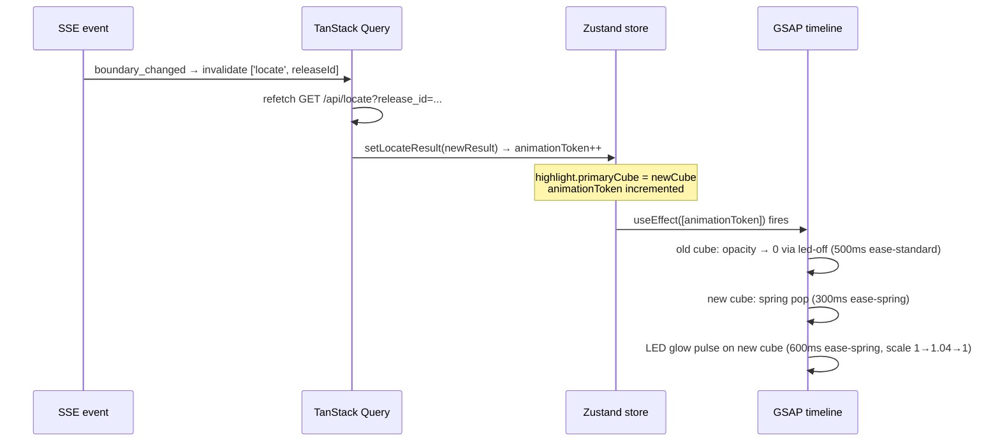

# Phase 4 — UI Design Contract: Realtime Live Updates

> Visual and interaction contract for the three new user-facing surfaces in Phase 4.
> Generated by gsd-ui-researcher. Verified by gsd-ui-checker.
>
> This phase is 90% backend/plumbing. Only three surfaces have new UI contracts:
> 1. "Boundaries updating" shimmer on affected cubes (RTM-04)
> 2. Re-glow when the visitor's highlight follows a relocated record (RTM-01 / D-04..06)
> 3. Optimistic rollback toast on the admin device (RTM-03 / D-07)
>
> All other surfaces (SSE connectivity flag, reconnect resync, admin_editing heartbeat) are
> pure logic with no visible UI this phase. The offline banner (OFF-01..04) is explicitly
> deferred to the next SPIDR slice.

---

## Design System

| Property | Value | Source |
|----------|-------|--------|
| Tool | none (no shadcn) | Existing project |
| Component library | none (hand-written DOM + CSS) | Existing project |
| Icon library | Lucide (already in use) | Existing project |
| Display font | Barlow Condensed 700/900 — Google Fonts | `design/gruvax-design-tokens.css` |
| UI body font | Space Grotesk 400/500/700 — Google Fonts | `design/gruvax-design-tokens.css` |
| Mono font | DM Mono 400/500 — Google Fonts | `design/gruvax-design-tokens.css` |
| Token contract | `design/gruvax-design-tokens.css` + `design/gruvax-design-tokens.json` | Locked — source of truth |

**No new design system artifacts.** Phase 4 extends existing token usage. No shadcn gate needed.

---

## Spacing Scale

Pre-populated from `design/gruvax-design-tokens.css`. No exceptions for this phase.

| Token | CSS Variable | Value | Usage in Phase 4 |
|-------|-------------|-------|-----------------|
| xs | `--gruvax-space-1` | 4px | Toast icon gap; shimmer overlay inset |
| sm | `--gruvax-space-2` | 8px | Toast internal padding top/bottom |
| md | `--gruvax-space-4` | 16px | Toast horizontal padding |
| lg | `--gruvax-space-5` | 24px | Toast bottom anchor offset from screen edge |
| xl | `--gruvax-space-6` | 32px | — |
| 2xl | `--gruvax-space-7` | 48px | — |
| 3xl | `--gruvax-space-8` | 64px | — |

**Exceptions:** None. The shimmer overlay has no padding of its own — it is absolutely positioned to match the cube bounds.

---

## Typography

Pre-populated from the Nordic Grid design system. Phase 4 adds no new type roles.

| Role | Font | CSS Variable | Size | Weight | Line Height | Usage |
|------|------|-------------|------|--------|-------------|-------|
| Toast body | Space Grotesk | `--gruvax-text-body-sm` | 14px | 400 | `--gruvax-leading-normal` (1.5) | Rollback toast message |
| Toast dismiss | Space Grotesk | `--gruvax-text-caption` | 12px | 500 | `--gruvax-leading-tight` (1.1) | "Dismiss" tap target label |

**Rules (from design spec, locked):**
- Barlow Condensed: display and ALL CAPS labels only. Not used in the toast (sentence-case copy).
- Space Grotesk: all toast body copy (sentence case, plain language).
- DM Mono: catalog numbers and data readouts only. Not used in Phase 4 new surfaces.

---

## Color

Pre-populated from `design/gruvax-design-tokens.css`. The 60/30/10 split is locked from prior phases.

| Role | CSS Token | Value | Usage |
|------|-----------|-------|-------|
| Dominant (60%) | `--gruvax-white` | `#FFFFFF` | Kiosk page background; toast background |
| Secondary (30%) | `--gruvax-off-white` | `#F7F9FC` | Shelf area; admin surface background |
| Accent (10%) | `--gruvax-yellow` | `#FFDA00` | Lit cells only; shimmer trace border only (see below) |
| Destructive | `--gruvax-error` | `#C0392B` | Not used in Phase 4 |

**Accent reserved for (Phase 4 additions):**
- Lit cell fill (unchanged from prior phases)
- Shimmer overlay trace border: `--gruvax-yellow-glow` (`rgba(255, 218, 0, 0.35)`) — the faintest visible yellow signal on the shimmer layer only
- Re-glow LED shadow on spring-on: `--gruvax-shadow-led` (unchanged from prior phases)

**Semantic additions (Phase 4):**
- Toast background: `--gruvax-white` (`#FFFFFF`)
- Toast border: `--gruvax-border-light` (`#C5DBF0`)
- Toast shadow: `--gruvax-shadow-md` (`0 4px 12px rgba(0, 81, 162, 0.12)`)
- Toast text: `--gruvax-text-secondary` (`#555555`)

---

## Surface 1: "Boundaries Updating" Shimmer (RTM-04 / D-01, D-02, D-03)

### What it is

An ambient animated overlay on the affected cube range, present while the owner has an editor open on their admin device. Triggered by `admin_editing` SSE events. No text. No icon. No tooltip. Disappears on `boundary_changed` commit or after 60s idle (client-side TTL).

### Visual specification

The shimmer is a **separate `<div>` layer** positioned absolutely to cover a cube's bounds, rendered as a sibling inside the existing `.cube` container. It does NOT replace or modify the cube's `data-state` attribute. The cube cell state system (dim / lit / hover / selected / empty) remains the canonical source of visual state.

```
.cube-shimmer-overlay {
  position: absolute;
  inset: 0;                                  /* covers the full cube face */
  z-index: 3;                                /* above sub-cube bar (z-1) and fill-bar (z-2) */
  border-radius: inherit;                    /* matches parent .cube border-radius */
  pointer-events: none;
  background: var(--gruvax-yellow-faint);    /* rgba(255, 218, 0, 0.12) */
  border: 1px solid var(--gruvax-yellow-glow); /* rgba(255, 218, 0, 0.35) */
  animation: shimmer-sweep 2000ms var(--gruvax-ease-standard) infinite;
  will-change: opacity;                      /* GPU-composited — Pi frame budget */
}

@keyframes shimmer-sweep {
  0%   { opacity: 0;    }
  40%  { opacity: 1;    }
  60%  { opacity: 1;    }
  100% { opacity: 0;    }
}
```

**Why opacity-only animation:** `opacity` and `transform` are GPU-composited on Chromium. Animating only `opacity` avoids layout recalculation and keeps the Pi 5 within the 16ms p95 frame budget (Pitfall 16). Do NOT animate `background`, `box-shadow`, or any layout-triggering property on the shimmer.

**Entry / exit:**
- Entry (when `admin_editing` arrives): shimmer `<div>` is mounted with `opacity: 0`; the `shimmer-sweep` animation starts immediately from keyframe 0%. No additional transition needed.
- Exit (when `boundary_changed` clears it OR 60s TTL fires): remove the shimmer `<div>` from the DOM. The cube underneath transitions according to its existing state rules.
- Exit timing: removal is immediate (0ms), not animated, because the `boundary_changed` event means the cube is about to transition to its updated state via TanStack Query refetch — adding an exit animation would produce visual noise on top of the LED physics.

### Composition with existing cube states

| Cube state at shimmer arrival | Shimmer behavior |
|------------------------------|-----------------|
| **dim** | Shimmer renders over `--gruvax-cell-dim` fill (`#D8E8F5`). Yellow-faint + yellow-glow border reads clearly against the cool blue. |
| **empty** | Shimmer renders over `--gruvax-cell-empty` fill (`#F2F2F2`). Same visual behavior as dim. |
| **lit (yellow)** | The shimmer's `--gruvax-yellow-faint` background (`rgba(255, 218, 0, 0.12)`) is nearly invisible over a solid `#FFDA00` lit cell. The `--gruvax-yellow-glow` border (`rgba(255, 218, 0, 0.35)`) is also nearly invisible against yellow fill. The effect is a barely-perceptible pulsing border edge — meeting the "never recolor a lit cell" constraint while preserving *some* shimmer signal on that cell. This is intentional and correct. The kiosk visitor will see the shimmer clearly on the non-lit neighbor cubes in the affected range, and dimly on the lit cube itself. |
| **hover** | Shimmer renders over hover fill. The hover state itself is transient (cleared if no pointer input); conflict is cosmetic and brief. |

**Constraint confirmed (from CONTEXT.md D-02 and design spec):** "Never recolor a lit cell." The shimmer uses only `rgba` colors at low opacity; it does NOT set `background` to a solid value, does NOT suppress `box-shadow: var(--gruvax-shadow-led)`, and does NOT interfere with the `data-state` attribute or the LED-physics CSS transitions on the parent `.cube`.

### React integration

```tsx
// In Cube.tsx — add shimmerActive prop:
interface CubeProps {
  // ... existing props ...
  /** True when this cube has an active admin_editing shimmer (RTM-04 / D-01) */
  shimmerActive?: boolean
}

// In the return JSX, inside the .cube div:
{shimmerActive && <div className="cube-shimmer-overlay" aria-hidden="true" />}
```

`shimmerActive` is derived in `ShelfGrid.tsx` (or `KioskView.tsx`) by checking whether the cube's `{unit_id, row, col}` key exists in `store.shimmerCubes`. The derivation is a simple `Set.has()` — no React state; reads directly from Zustand `.getState()` during render.

### Accessibility

- `aria-hidden="true"` on the shimmer overlay — it is purely decorative.
- No text alternative needed; the shimmer conveys ambient system state (not a critical user action).
- The kiosk is a passive public display; visitors are not expected to act on the shimmer.

### Pi frame budget

- Only `opacity` is animated. `will-change: opacity` is set on the shimmer element (not on the parent `.cube`).
- In a typical 32-cube deployment, up to 4–8 cubes may shimmer simultaneously (a partial row of one unit). Each is an independent CSS animation on a GPU-composited layer.
- The `shimmer-sweep` keyframe at 2000ms total duration runs at ~0.5 Hz — well under any frame-rate concern.
- `will-change` is declared permanently on `.cube-shimmer-overlay` (not toggled) because the element is mounted only when shimmering and unmounted when done, so the layer reservation is never "left on" spuriously.

---

## Surface 2: Re-Glow on Highlight-Follows-Record (RTM-01 / D-04, D-05, D-06)

### What it is

When a `boundary_changed` SSE event causes the visitor's actively-selected record to relocate to a new primary cube, the old cube's lit state fades off and the new cube springs on. This reuses the existing `animationToken` / GSAP mechanism — it is not a new animation system.

### Timing sequence



### Timing values (LED-physics, from token contract)

| Step | Duration | Easing | CSS Token |
|------|----------|--------|-----------|
| Old cube fade-off | 500ms | `cubic-bezier(0.4, 0.0, 0.2, 1)` | `--gruvax-led-off-duration` / `--gruvax-led-off-ease` |
| New cube spring-on | 300ms | `cubic-bezier(0.34, 1.56, 0.64, 1)` | `--gruvax-led-on-duration` / `--gruvax-led-on-ease` |
| LED glow pulse | 600ms | `cubic-bezier(0.34, 1.56, 0.64, 1)` | `--gruvax-duration-enter` / `--gruvax-ease-spring` |
| Total visible sequence | ~800ms | — | — |

**Difference from first-search highlight:** A normal first-search highlight runs the full Phase 2 sequence (all cells dim → matching shelf scrolls → cube springs on → glow pulse). The re-glow DOES NOT dim all cells first, DOES NOT scroll the shelf, and DOES NOT stagger. It goes directly: old cube fades, new cube springs on. The `locate` query result drives `setLocateResult`, which increments `animationToken` — the same GSAP effect hook in `KioskView.tsx` fires, but the *only* visual change is the old cube losing `data-state="lit"` and the new cube gaining it.

### No cross-grid slide

There is no animated line, arrow, or translate between old and new cube positions. The re-glow is two independent state transitions: fade-off at old position, spring-on at new position. This is both cheaper per-frame (no absolute position tracking) and clearer semantically ("it relocated" not "it flew").

### Implementation note

`store.ts` already has `setLocateResult` which increments `animationToken`. The `useEffect` in `KioskView.tsx` that runs the GSAP timeline already keys off `animationToken`. No new animation code is required — the re-glow is the natural result of `setLocateResult` being called again with a different `primary_cube`. The executor does not need to write new GSAP code for this surface; the existing mechanism handles it.

---

## Surface 3: Optimistic Rollback Toast (RTM-03 / D-07)

### What it is

An ephemeral toast notification shown on the admin device (mobile-first, kiosk fallback) when a boundary edit is rejected by the server and the optimistic update is reverted. The editor retains the attempted values for retry.

### Copy (locked from D-07 and voice/tone spec)

| Element | Copy | Voice rule |
|---------|------|-----------|
| Toast message | "Couldn't save that change — reverted." | Sentence case, plain language, no jargon |
| Dismiss label | "Dismiss" | Sentence case |

**Do not use:** "Error", "Failed", "Server error", "HTTP 4xx", or any technical identifier.
**Do not use ALL CAPS** for the toast message body (Barlow Condensed ALL CAPS is reserved for structural labels, not notifications).

### Visual specification

```
.toast {
  position: fixed;
  bottom: var(--gruvax-space-5);           /* 24px from screen bottom */
  left: 50%;
  transform: translateX(-50%);
  z-index: calc(var(--gruvax-z-admin) + 10); /* above admin chrome (z-50) */

  display: flex;
  align-items: center;
  gap: var(--gruvax-space-2);              /* 8px icon–text gap */

  background: var(--gruvax-white);
  border: 1px solid var(--gruvax-border-light);   /* #C5DBF0 */
  border-radius: var(--gruvax-radius-lg);          /* 12px */
  box-shadow: var(--gruvax-shadow-md);             /* blue-tinted shadow */
  padding: var(--gruvax-space-2) var(--gruvax-space-4); /* 8px 16px */

  min-width: 240px;
  max-width: min(400px, calc(100vw - 48px));  /* responsive, 24px margin each side */
}

.toast__icon {
  flex-shrink: 0;
  width: 16px;
  height: 16px;
  color: var(--gruvax-warning);            /* #E6A800 — caution, not error red */
}

.toast__message {
  font-family: var(--gruvax-font-ui);     /* Space Grotesk */
  font-size: var(--gruvax-text-body-sm);  /* 14px */
  font-weight: 400;
  color: var(--gruvax-text-secondary);    /* #555555 */
  line-height: var(--gruvax-leading-normal); /* 1.5 */
  flex: 1;
}

.toast__dismiss {
  flex-shrink: 0;
  font-family: var(--gruvax-font-ui);
  font-size: var(--gruvax-text-caption);  /* 12px */
  font-weight: 500;
  color: var(--gruvax-text-muted);        /* #777777 */
  background: transparent;
  border: none;
  cursor: pointer;
  padding: var(--gruvax-space-1);         /* 4px touch target padding */
  min-width: 44px;                        /* WCAG 2.5.5 touch target */
  min-height: 44px;
  display: flex;
  align-items: center;
  justify-content: center;
  border-radius: var(--gruvax-radius-sm);
  transition: color var(--gruvax-duration-fast) var(--gruvax-ease-standard);
}

.toast__dismiss:hover {
  color: var(--gruvax-text-secondary);
}
```

**Icon choice:** Lucide `AlertTriangle` (16×16) at `--gruvax-warning` (`#E6A800`). Caution yellow, not error red — the revert is a system action, not a user fault.

### Animation

```
/* Entry — slide up from below */
.toast {
  animation: toast-enter 200ms var(--gruvax-ease-decelerate) both;
}

@keyframes toast-enter {
  from { transform: translateX(-50%) translateY(16px); opacity: 0; }
  to   { transform: translateX(-50%) translateY(0);   opacity: 1; }
}

/* Exit — fade down */
.toast--exiting {
  animation: toast-exit 150ms var(--gruvax-ease-accelerate) both;
}

@keyframes toast-exit {
  from { transform: translateX(-50%) translateY(0);   opacity: 1; }
  to   { transform: translateX(-50%) translateY(16px); opacity: 0; }
}
```

**Only `transform` and `opacity` are animated** — GPU-composited, zero layout cost.

### Behavior / lifecycle

| Property | Value | Rationale |
|----------|-------|-----------|
| Auto-dismiss duration | 4000ms | Long enough to read; short enough not to linger. Starts from mount. |
| Dismiss on tap | Yes — immediately starts exit animation | Standard toast UX |
| Stacking | Show only the most recent; replace previous if a second rollback fires within the 4s window | Avoids toast pile-up during rapid edit/retry cycles |
| Editor state on show | `pendingChangeSet` values are NOT cleared (D-07). The form fields retain the attempted values so the owner can correct and retry immediately. | From D-07; no additional UI contract needed. |
| Placement | Bottom-center, above admin chrome z-index | Mobile-first; visible on both mobile and kiosk fallback |

### Admin-surface clarification

This toast appears **only on the admin device** (mobile or kiosk-admin view). The kiosk public view (KioskView) never shows this toast — it has no knowledge of the optimistic state that failed. The kiosk sees only committed `boundary_changed` events.

### Implementation note

No third-party toast library. A simple React component with `useState(visible)` + `useEffect` for the 4s auto-dismiss timer. The component is mounted into an existing portal or placed at the root of the admin route. The `showToast` function referenced in RESEARCH.md Pattern 7 is a Zustand action or a local `useState` in the admin route — either approach satisfies this contract.

---

## Deferred Surfaces (NOT in this phase)

The following surfaces are **explicitly out of scope** and must not be designed or built in Phase 4:

| Surface | Reason deferred |
|---------|----------------|
| Offline banner (OFF-01) | Next SPIDR slice; `sseConnected` flag is built but has no visible UI this phase |
| Disabled search input with offline placeholder (OFF-02) | Same deferred slice |
| Reconnection success indicator (OFF-04) | Same deferred slice |
| Recently-pulled list (SRCH-09) | Later SPIDR slice |
| LED brightness / color settings (LED-04, LED-05) | Phase 5 |

The `connectivity.sseConnected` Zustand flag introduced in this phase is a logic stub — it has no visual representation in Phase 4.

---

## Design System

| Property | Value |
|----------|-------|
| Tool | none |
| Preset | not applicable |
| Component library | none |
| Icon library | Lucide (existing) |
| Font | Barlow Condensed 700/900 + Space Grotesk 400/500/700 + DM Mono 400/500 |

---

## Registry Safety

| Registry | Blocks Used | Safety Gate |
|----------|-------------|-------------|
| shadcn official | none | not applicable |
| Third-party | none | not applicable |

No new dependencies are introduced in Phase 4 (confirmed by RESEARCH.md). No registry vetting required.

---

## Component Inventory

New CSS classes introduced by this phase:

| Class | File | Purpose |
|-------|------|---------|
| `.cube-shimmer-overlay` | `kiosk.css` | Shimmer overlay layer inside `.cube` |
| `@keyframes shimmer-sweep` | `kiosk.css` | 2s opacity pulse animation |
| `.toast` | `admin.css` | Rollback toast container |
| `.toast__icon` | `admin.css` | Warning icon slot |
| `.toast__message` | `admin.css` | Toast body copy |
| `.toast__dismiss` | `admin.css` | Dismiss button |
| `.toast--exiting` | `admin.css` | Exit animation state |
| `@keyframes toast-enter` | `admin.css` | Slide-up entry |
| `@keyframes toast-exit` | `admin.css` | Fade-down exit |

New React component:

| Component | File | Purpose |
|-----------|------|---------|
| `<RollbackToast>` | `frontend/src/routes/admin/RollbackToast.tsx` | Renders the D-07 rollback toast |

Modified React components:

| Component | Change |
|-----------|--------|
| `Cube.tsx` | Add `shimmerActive?: boolean` prop; render `.cube-shimmer-overlay` when true |
| `ShelfGrid.tsx` | Accept `shimmerCubes: Set<string>` prop; derive `shimmerActive` per cell |
| `KioskView.tsx` | Pass `shimmerCubes` from Zustand to `ShelfGrid`; mount SSE `EventSource` |
| `store.ts` | Add `connectivity`, `shimmerCubes`, `shimmerExpiresAt`, and their setters |

---

## Copywriting Contract

| Element | Copy | Voice Rule | Surface |
|---------|------|-----------|---------|
| Rollback toast | "Couldn't save that change — reverted." | Sentence case, plain language | Admin (mobile + kiosk fallback) |
| Toast dismiss | "Dismiss" | Sentence case | Admin |

**Empty states:** This phase introduces no new empty states. The shimmer has no empty state (it is either present or absent). The toast has no empty state.

**Error states:** The rollback toast IS the error state for RTM-03. No additional error copy is needed.

**Destructive actions:** No destructive actions in this phase. The rollback is a system-triggered revert, not a user-initiated delete.

---

## Checker Sign-Off

- [ ] Dimension 1 Copywriting: PASS
- [ ] Dimension 2 Visuals: PASS
- [ ] Dimension 3 Color: PASS
- [ ] Dimension 4 Typography: PASS
- [ ] Dimension 5 Spacing: PASS
- [ ] Dimension 6 Registry Safety: PASS

**Approval:** pending

---

*Phase: 04-realtime-live-updates*
*UI-SPEC generated: 2026-05-21*
*Sources: 04-CONTEXT.md (D-01..D-08, D-10), 04-RESEARCH.md (Pitfall 7 / Pi frame budget, Pattern 7 toast), design/gruvax-design-language.md (LED-physics, voice & tone, cell states), design/gruvax-design-tokens.css (all token references), frontend/src/routes/kiosk/kiosk.css (existing patterns), frontend/src/state/store.ts (animationToken mechanism)*
