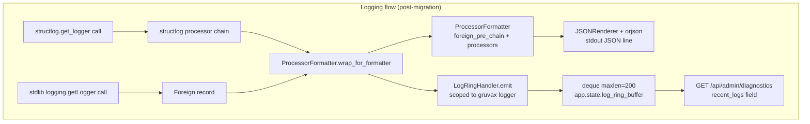
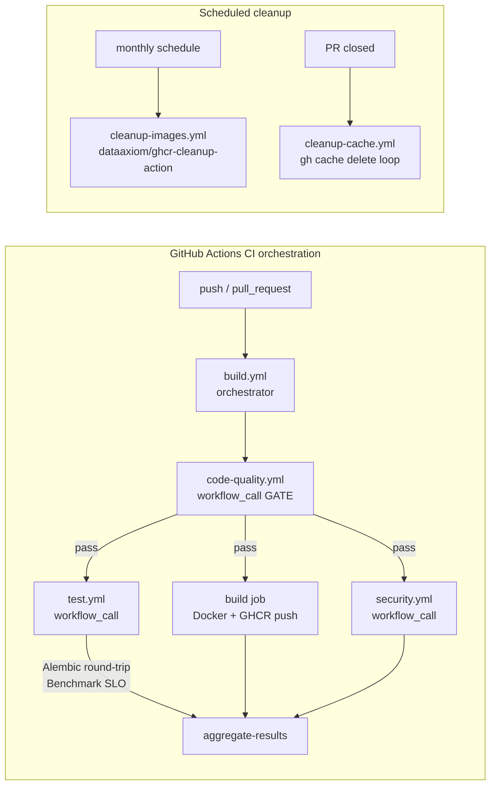
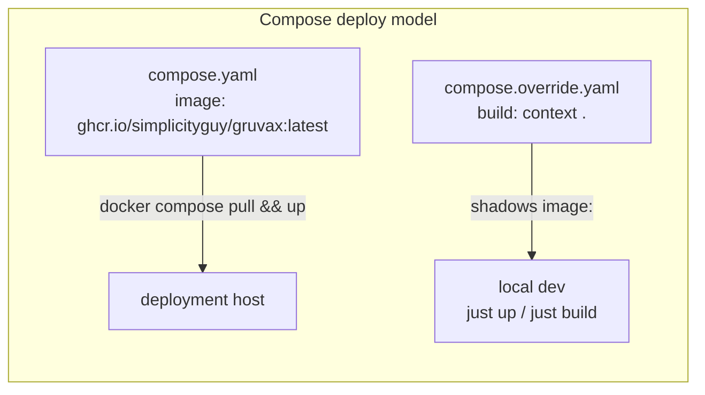

# Phase 9: Tooling and Docs Hardening - Research

**Researched:** 2026-05-25
**Domain:** Developer-experience tooling — structlog migration, GitHub Actions CI, pre-commit, dependabot, update script, docs refresh
**Confidence:** HIGH

---

<user_constraints>
## User Constraints (from CONTEXT.md)

### Locked Decisions

**D-01 — CI architecture:** discogsography-style `workflow_call` orchestration. Six named
workflows (`test`, `code-quality`, `security`, `build`, `cleanup-cache`, `cleanup-images`).
`code-quality` must pass before `test` and `build` run. Existing `.github/workflows/ci.yml`
is superseded; its hard gates (Alembic round-trip OBS-03, benchmark SLO SC5) are preserved
inside the new `test` workflow, not lost.

**D-02 — `code-quality` runs `pre-commit run --all-files`** as the single source of truth;
ruff/mypy/eslint are NOT duplicated as separate steps.

**D-03 — Full frontend coverage.** `code-quality` runs eslint + prettier `--check` +
`tsc --noEmit`; `build` builds the SPA; frontend tests run under `test`. Treated exactly
like backend.

**D-04 — Publish to GHCR.** `build` pushes `gruvax-api` image to `ghcr.io` on
push-to-main (SHA tag + `latest`). `cleanup-images` prunes old/untagged versions.

**D-05 — Pull-based deploy.** `compose.yaml` switches from `image: gruvax-api:local` + build
context to `image: ghcr.io/simplicityguy/gruvax:latest`. A `compose.override.yaml` keeps
the local `build:` context for dev.

**D-06 — Clean it all now.** Fix the 64 pre-existing ruff errors (now 69 as of Phase 8 run)
AND resolve all new infra-linter findings. Drop every `continue-on-error`. `code-quality` is
a true blocking gate.

**D-07 — Planner isolates the cleanup.** Ruff/lint cleanup into its own wave/plan, separate
from the workflow YAML scaffolding.

**D-08 — New `docs/ARCHITECTURE.md`** capturing Phase 1–8 design: data model +
`gruvax.v_collection` contract, `/api/*` + `/api/admin/*` surface, SSE realtime, segment/
cut-point boundary model, LED-over-MQTT contract, observability.

**D-09 — Refresh `README.md` + `CLAUDE.md`** to point at `docs/ARCHITECTURE.md` and
reflect final Phase 1–8 reality.

**D-10 — `lux` → generic prose + neutral placeholder.** No new runtime config introduced.
`nox` does NOT appear anywhere in GRUVAX docs — that half of the strip is a confirmed no-op.
Compose `lux` references are prose/comments only (all four occurrences verified — lines 15,
35, 56, 101 of `compose.yaml`). Generic freely.

### Claude's Discretion

- **structlog config fidelity:** right-sized processor chain; hard constraint is the
  `LogRingHandler` → `deque` on `app.state.log_ring_buffer` keeping the
  `{ts, level, logger, msg}` shape scoped to the `gruvax` logger.
- **dependabot ecosystems/dirs:** `pip` (`/`), `github-actions` (`/`), `docker` (`/` for
  Dockerfile), `npm` (`/frontend`). Weekly Monday, grouped, `SimplicityGuy` assignee.
  Drop `cargo`, multi-directory docker fan-out.
- **pre-commit hook set:** adapt disco's set; drop cargo hooks; add frontend hooks; frozen
  revs at current latest.
- **`cleanup-cache`:** mechanical adapt.
- **`scripts/update-project.sh`:** specialize down to one service.
- **`security` workflow:** adapt disco's security.yml right-sized (no Rust/Neo4j jobs).

### Deferred Ideas (OUT OF SCOPE)

- v2.0 multi-user collections
- Dedicated lint-debt phase (D-06 cleans it now)
- `mdformat` hook (disco disabled for CI/local inconsistency; GRUVAX skips too)
- External metrics/APM stack
</user_constraints>

---

## Summary

Phase 9 closes v1.x developer-experience debt. It is a **zero-product-behavior-change**
phase: the Core Value flow and every Phase 1–8 feature must behave identically after
this phase lands. There are seven scope items, all confirmed by reading the actual source
files.

The structlog migration is the highest-risk item: `src/gruvax/logging_config.py` currently
implements a `JsonFormatter` (stdout) and a `LogRingHandler` (in-memory deque on
`app.state.log_ring_buffer`, scoped to the `gruvax` logger). The `/admin/diagnostics`
endpoint reads this deque and expects the `{ts: float, level: str, logger: str, msg: str}`
shape. structlog's `ProcessorFormatter` routes both structlog-native and stdlib (foreign)
records through a shared chain; a modified `LogRingHandler` that reads `record.msg` as a
dict (for structlog-native records) or calls `record.getMessage()` (for stdlib foreign
records) preserves the shape exactly. This was verified by live code test.

The CI orchestration adapts discogsography's six-file pattern to a single-service shape:
no matrix, no change-detection, no list-sub-projects. The GHCR image path is
`ghcr.io/simplicityguy/gruvax` (repository lowercased: `SimplicityGuy/GRUVAX` →
`simplicityguy/gruvax`). The compose overlay split is straightforward. All four `lux`
references in `compose.yaml` are prose/comments — none are load-bearing.

The ruff debt is 69 errors (updated count from Phase 8), of which 48 are auto-fixable
(`--fix` + `--unsafe-fixes`); 21 require manual edits spread across 5 rule codes. Prettier
is not yet installed in the frontend; D-03 requires adding it.

**Primary recommendation:** Plan as three waves — (1) structlog migration + `LOG_LEVEL`
extension, (2) workflow scaffolding + dependabot + pre-commit + update script, (3) ruff
debt cleanup + docs refresh. structlog first because it is the most integration-sensitive;
ruff last because it is independent and benefits from the clean CI gate to verify.

---

## Architectural Responsibility Map

| Capability | Primary Tier | Secondary Tier | Rationale |
|------------|-------------|----------------|-----------|
| Structured JSON logging | API / Backend (`logging_config.py`) | stdout → container runtime | structlog formats, stdlib routes to handler |
| Log ring buffer | API / Backend (`app.state`) | Admin API (`diagnostics.py` reads) | In-memory, scoped to `gruvax` logger |
| CI quality gate | GitHub Actions (`code-quality.yml`) | pre-commit (runs inside the gate) | `workflow_call` gate pattern |
| Image publishing | GitHub Actions (`build.yml`) | GHCR registry | push-to-main → `ghcr.io/simplicityguy/gruvax:latest` |
| Local dev build | Docker Compose override (`compose.override.yaml`) | `build:` context (Dockerfile) | Override shadows registry image |
| Dependency freshness | dependabot + `update-project.sh` | `pre-commit autoupdate` | Automated PRs + manual script |
| Docs architecture | `docs/ARCHITECTURE.md` (new) | `README.md` + `CLAUDE.md` (refreshed) | New canonical reference, others point at it |

---

## Standard Stack

### New Dependencies (Python)

| Library | Version | Purpose | Why Standard |
|---------|---------|---------|--------------|
| structlog | 25.5.0 | Structured logging | Replaces `JsonFormatter`; disco's reference implementation. ProcessorFormatter bridges stdlib. [VERIFIED: PyPI] |
| orjson | 3.11.9 | Fast JSON serializer | Used as `JSONRenderer(serializer=orjson.dumps)` in structlog chain; 3–5x faster than stdlib json. [VERIFIED: PyPI] |

**slopcheck results:** structlog [OK], orjson [OK]

**New Dependencies (frontend — for D-03):**

| Library | Version | Purpose | When |
|---------|---------|---------|------|
| prettier | latest | Code formatter | Required by D-03: `prettier --check` in `code-quality`; not yet in `frontend/package.json` |

**Installation:**
```bash
# Backend
uv add structlog>=25.5.0 orjson>=3.11.9

# Frontend
npm --prefix frontend install --save-dev prettier
```

**Version verification:**
```
structlog: 25.5.0 (latest on PyPI 2026-05-25)
orjson: 3.11.9 (latest on PyPI 2026-05-25)
```

### GitHub Action SHAs (current latest — per "always latest versions" memory)

| Action | Tag | SHA | Use |
|--------|-----|-----|-----|
| `actions/checkout` | v6.0.2 | `de0fac2e4500dabe0009e67214ff5f5447ce83dd` | All workflows |
| `astral-sh/setup-uv` | v8.1.0 | `08807647e7069bb48b6ef5acd8ec9567f424441b` | Python workflows |
| `actions/setup-python` | v6.2.0 | `a309ff8b426b58ec0e2a45f0f869d46889d02405` | Python workflows |
| `actions/setup-node` | v6.4.0 | `48b55a011bda9f5d6aeb4c2d9c7362e8dae4041e` | frontend/test workflow |
| `actions/cache` | v5.0.5 | `27d5ce7f107fe9357f9df03efb73ab90386fccae` | pre-commit cache |
| `extractions/setup-just` | v4 | `53165ef7e734c5c07cb06b3c8e7b647c5aa16db3` | All workflows |
| `docker/login-action` | v4.2.0 | `650006c6eb7dba73a995cc03b0b2d7f5ca915bee` | build.yml |
| `docker/metadata-action` | v6.1.0 | `80c7e94dd9b9319bd5eb7a0e0fe9291e23a2a2e9` | build.yml |
| `docker/build-push-action` | v7.2.0 | `f9f3042f7e2789586610d6e8b85c8f03e5195baf` | build.yml |
| `docker/setup-buildx-action` | v4.1.0 | `d7f5e7f509e45cec5c76c4d5afdd7de93d0b3df5` | build.yml |
| `dataaxiom/ghcr-cleanup-action` | v1.2.0 | `374e2028c8fb93b7219f3771cd405fab95d3dec4` | cleanup-images.yml |

[VERIFIED: GitHub API for all SHAs above]

### pre-commit Hook Revs (current latest — verified via GitHub API)

| Hook repo | Tag/Rev | SHA |
|-----------|---------|-----|
| `pre-commit/pre-commit-hooks` | v6.0.0 | `3e8a8703264a2f4a69428a0aa4dcb512790b2c8c` |
| `python-jsonschema/check-jsonschema` | 0.37.2 | `943377262562a12b57292fc98fabd7dbf81451fe` |
| `astral-sh/ruff-pre-commit` | v0.15.14 | `0c7b6c989466a93942def1f84baf36ddfcd60c83` |
| `PyCQA/bandit` | 1.9.4 | `92ae8b82fb422a639f0ed8d99e96cea769594e08` |
| `hadolint/hadolint` | v2.14.0 | `4e697ba704fd23b2409b947a319c19c3ee54d24f` |
| `IamTheFij/docker-pre-commit` | v3.0.1 | `f626253b23de45412865c07fd076ff95d4cd77a7` |
| `rhysd/actionlint` | v1.7.12 | `914e7df21a07ef503a81201c76d2b11c789d3fca` |
| `adrienverge/yamllint` | v1.38.0 | `cba56bcde1fdd01c1deb3f945e69764c291a6530` |
| `shellcheck-py/shellcheck-py` | v0.11.0.1 | `745eface02aef23e168a8afb6b5737818efbea95` |
| `scop/pre-commit-shfmt` | v3.13.1-1 | `05c1426671b9237fb5e1444dd63aa5731bec0dfb` |

[VERIFIED: GitHub API for all SHAs above]

---

## Package Legitimacy Audit

| Package | Registry | slopcheck | Disposition |
|---------|----------|-----------|-------------|
| structlog | PyPI | [OK] | Approved |
| orjson | PyPI | [OK] | Approved |

**Packages removed due to slopcheck [SLOP] verdict:** none
**Packages flagged as suspicious [SUS]:** none

---

## Architecture Patterns

### System Architecture Diagram







### Recommended Project Structure

After this phase the new/changed files are:

```
.github/
  workflows/
    build.yml           # orchestrator (replaces ci.yml)
    code-quality.yml    # workflow_call GATE
    test.yml            # workflow_call — full test suite + SLO gates
    security.yml        # workflow_call
    cleanup-cache.yml   # PR-close trigger
    cleanup-images.yml  # monthly schedule
  dependabot.yml        # new
.pre-commit-config.yaml # new
.yamllint               # new (required by yamllint hook)
compose.yaml            # flip image: + genericize lux comments
compose.override.yaml   # new — local build context
docs/
  ARCHITECTURE.md       # new (D-08)
  runbook-fresh-host.md # refresh lux→<host> (D-10)
scripts/
  update-project.sh     # new (adapted from disco)
src/gruvax/
  logging_config.py     # replace JsonFormatter+LogRingHandler with structlog version
README.md               # refresh (D-09)
CLAUDE.md               # refresh Architecture section (D-09)
pyproject.toml          # add structlog + orjson deps; ruff fixes (D-06)
```

### Pattern 1: structlog processor chain for GRUVAX

**What:** Single-service structlog setup mirroring disco's `common/config.py` but without
the multi-service `service=` context binding, Neo4j/pika suppression, or file handler.

**When to use:** At lifespan startup, replacing the existing `app.py` lines 87–100.

```python
# Source: verified against structlog 25.5.0 source + disco common/config.py
import logging
import orjson
import structlog
from collections import deque
from typing import Any

def _orjson_serializer(obj: Any, **_kw: Any) -> str:
    return orjson.dumps(obj).decode()

def configure_logging(log_level: str, ring: deque[dict[str, Any]]) -> None:
    level = getattr(logging, log_level.upper(), logging.INFO)

    shared_processors: list[Any] = [
        structlog.contextvars.merge_contextvars,
        structlog.stdlib.add_log_level,
        structlog.stdlib.add_logger_name,
        structlog.stdlib.PositionalArgumentsFormatter(),
        structlog.processors.TimeStamper(fmt="iso", utc=True),
        structlog.processors.StackInfoRenderer(),
        structlog.processors.format_exc_info,
    ]

    structlog.configure(
        processors=[
            *shared_processors,
            structlog.stdlib.ProcessorFormatter.wrap_for_formatter,
        ],
        logger_factory=structlog.stdlib.LoggerFactory(),
        cache_logger_on_first_use=True,
    )

    console_handler = logging.StreamHandler()
    console_handler.setFormatter(
        structlog.stdlib.ProcessorFormatter(
            foreign_pre_chain=shared_processors,
            processors=[
                structlog.stdlib.ProcessorFormatter.remove_processors_meta,
                structlog.processors.dict_tracebacks,
                structlog.processors.JSONRenderer(serializer=_orjson_serializer),
            ],
        )
    )

    logging.basicConfig(level=level, handlers=[console_handler], force=True)

    # Ring buffer: scoped to gruvax logger only (same security constraint as before)
    logging.getLogger("gruvax").addHandler(LogRingHandler(ring, level=logging.INFO))

    # Suppress noisy third-party loggers (same as before)
    logging.getLogger("uvicorn.access").setLevel(logging.WARNING)
```

**Ring buffer integration (the critical seam):**

```python
# Source: verified by live code test (2026-05-25)
class LogRingHandler(logging.Handler):
    """Append {ts, level, logger, msg} dicts to the ring buffer.

    For structlog-native records, record.msg is a dict (the event dict
    pre-rendering). For stdlib foreign records, record.msg is a string.
    Both paths produce the same {ts, level, logger, msg} shape the
    diagnostics endpoint expects — preserving the existing contract exactly.
    """
    def __init__(self, ring: deque[dict[str, Any]], level: int = logging.INFO) -> None:
        super().__init__(level)
        self._ring = ring

    def emit(self, record: logging.LogRecord) -> None:
        try:
            # structlog-native records: record.msg is the event dict before rendering.
            # Extract 'event' key to get the human-readable message.
            if isinstance(record.msg, dict):
                msg = record.msg.get("event", "")
            else:
                msg = record.getMessage()
            self._ring.append({
                "ts": record.created,   # float, same as before
                "level": record.levelname,
                "logger": record.name,
                "msg": msg,
            })
        except Exception:
            self.handleError(record)
```

**Why this works:** structlog wraps its log calls into stdlib LogRecords via
`wrap_for_formatter`. When the record reaches handlers, `record.msg` is still the raw
event dict (Python dict). `ProcessorFormatter.format()` renders it to a JSON string for
stdout, but `LogRingHandler.emit()` fires before that rendering. By checking
`isinstance(record.msg, dict)`, we extract just the `event` key — producing the same
clean `msg` the diagnostics page already renders.

### Pattern 2: CI orchestration — right-sized single-service shape

**What:** The discogsography `build.yml` orchestrator stripped of change-detection,
matrix, and sub-project listing. Reduced to: gate `code-quality` → fan-out `test` +
`build` + `security` → aggregate.

```yaml
# Source: adapted from discogsography/.github/workflows/build.yml
name: Build

on:
  push:
    branches: [main]
  pull_request:
    branches: [main]

env:
  CI: true
  PYTHON_VERSION: "3.14"
  REGISTRY: ghcr.io

permissions:
  contents: read
  packages: write

jobs:
  run-code-quality:
    uses: ./.github/workflows/code-quality.yml
    secrets: inherit

  run-tests:
    needs: [run-code-quality]
    uses: ./.github/workflows/test.yml
    secrets: inherit

  run-security:
    needs: [run-code-quality]
    uses: ./.github/workflows/security.yml
    secrets: inherit
    permissions:
      contents: read
      security-events: write

  build:
    needs: [run-tests, run-security]
    runs-on: ubuntu-latest
    # ... GHCR push here (see build pattern below)
```

**Key differences from disco:**
- No `detect-changes` job (single service, always build)
- No `list-sub-projects` job
- No matrix in `build` job (one service = one image)
- GHCR image: `ghcr.io/simplicityguy/gruvax` (lowercased from `SimplicityGuy/GRUVAX`)

### Pattern 3: `test.yml` — preserve the Phase 8 hard gates verbatim

The Phase 8 `ci.yml` has two hard-fail gates that MUST survive into `test.yml`:

```yaml
# OBS-03: Alembic round-trip (lines 96-103 of ci.yml)
- name: Alembic round-trip
  run: |
    uv run alembic upgrade head
    uv run alembic downgrade base
    uv run alembic upgrade head

# SC5: Benchmark SLO gate (lines 108-117 of ci.yml)
- name: Benchmark SLO gate
  run: |
    uv run pytest \
      tests/unit/test_algorithm.py::test_locate_benchmark \
      tests/integration/test_search_benchmark.py::test_search_slo_benchmark \
      --benchmark-only --benchmark-json=benchmark.json -q
    uv run python scripts/check_benchmark.py benchmark.json
```

The `test.yml` also needs the same service container setup (postgres:18,
eclipse-mosquitto:2.1.2-alpine) and the synthetic-seed step that the Phase 8 `ci.yml`
already has. Copy those blocks verbatim.

### Pattern 4: `compose.override.yaml` — local build context

```yaml
# Source: standard Docker Compose override pattern [VERIFIED: Docker docs]
# compose.override.yaml — local dev: shadows the GHCR image with a local build
# Git-ignored from prod environments; committed for dev.
services:
  api:
    build:
      context: .
      dockerfile: Dockerfile
    image: gruvax-api:local  # local tag for dev, overrides compose.yaml's GHCR image
```

This follows Docker Compose's merge-on-key behavior: `compose.yaml` declares
`image: ghcr.io/...`; `compose.override.yaml` adds `build:` and overrides `image:` to a
local tag. `docker compose up --build` (used by `just up`) will build locally. `docker
compose pull && docker compose up` (prod deploy) ignores the override unless it is present.

### Pattern 5: `dependabot.yml` for GRUVAX

```yaml
# Source: adapted from discogsography/.github/dependabot.yml
version: 2
updates:
  - package-ecosystem: "github-actions"
    directory: "/"
    schedule: { interval: "weekly", day: "monday", time: "09:00", timezone: "America/Los_Angeles" }
    commit-message: { prefix: "ci", include: "scope" }
    labels: ["dependencies", "ci"]
    assignees: ["SimplicityGuy"]
    groups:
      actions: { patterns: ["*"] }

  - package-ecosystem: "docker"
    directory: "/"   # single Dockerfile at repo root
    schedule: { interval: "weekly", day: "monday", time: "09:00", timezone: "America/Los_Angeles" }
    commit-message: { prefix: "docker", include: "scope" }
    labels: ["dependencies", "docker"]
    assignees: ["SimplicityGuy"]

  - package-ecosystem: "npm"
    directory: "/frontend"
    schedule: { interval: "weekly", day: "monday", time: "09:00", timezone: "America/Los_Angeles" }
    commit-message: { prefix: "deps", include: "scope" }
    labels: ["dependencies", "javascript"]
    assignees: ["SimplicityGuy"]
    groups:
      npm-dependencies: { patterns: ["*"] }

  - package-ecosystem: "pip"
    directory: "/"
    schedule: { interval: "weekly", day: "monday", time: "09:00", timezone: "America/Los_Angeles" }
    commit-message: { prefix: "deps", prefix-development: "deps-dev", include: "scope" }
    labels: ["dependencies", "python"]
    assignees: ["SimplicityGuy"]
    groups:
      python-production: { dependency-type: "production", patterns: ["*"] }
      python-development: { dependency-type: "development", patterns: ["*"] }
      python-security: { applies-to: security-updates, patterns: ["*"] }
```

### Pattern 6: `.pre-commit-config.yaml` for GRUVAX

Adapted from discogsography: drop `cargo-fmt`, `cargo-clippy`; add frontend
ESLint/Prettier hooks; update all revs to current latest.

```yaml
# Source: adapted from discogsography/.pre-commit-config.yaml
# Key changes from disco:
#  - Drop cargo-fmt + cargo-clippy (no Rust in GRUVAX)
#  - shfmt targets: scripts/update-project.sh only (not the multi-script fan-out)
#  - Add frontend linting hooks (eslint, prettier via local hooks)
#  - All revs updated to current latest (see SHA table above)

repos:
  - repo: https://github.com/pre-commit/pre-commit-hooks
    rev: 3e8a8703264a2f4a69428a0aa4dcb512790b2c8c  # frozen: v6.0.0
    hooks:
      - id: check-added-large-files
      - id: check-executables-have-shebangs
      - id: check-json
      - id: check-merge-conflict
      - id: check-shebang-scripts-are-executable
      - id: check-toml
      - id: check-yaml
        args: [--unsafe]
      - id: detect-aws-credentials
        args: [--allow-missing-credentials]
      - id: detect-private-key
      - id: end-of-file-fixer
      - id: mixed-line-ending
      - id: trailing-whitespace
      - id: pretty-format-json
        args: [--autofix, --indent=2]

  - repo: https://github.com/python-jsonschema/check-jsonschema
    rev: 943377262562a12b57292fc98fabd7dbf81451fe  # frozen: 0.37.2
    hooks:
      - id: check-github-workflows
      - id: check-github-actions

  - repo: https://github.com/astral-sh/ruff-pre-commit
    rev: 0c7b6c989466a93942def1f84baf36ddfcd60c83  # frozen: v0.15.14
    hooks:
      - id: ruff
        args: [--fix]
      - id: ruff-format

  - repo: https://github.com/PyCQA/bandit
    rev: 92ae8b82fb422a639f0ed8d99e96cea769594e08  # frozen: 1.9.4
    hooks:
      - id: bandit
        args: [-x, "tests", -s, "B608"]

  - repo: https://github.com/hadolint/hadolint
    rev: 4e697ba704fd23b2409b947a319c19c3ee54d24f  # frozen: v2.14.0
    hooks:
      - id: hadolint

  - repo: https://github.com/IamTheFij/docker-pre-commit
    rev: f626253b23de45412865c07fd076ff95d4cd77a7  # frozen: v3.0.1
    hooks:
      - id: docker-compose-check
        files: ^compose\.yaml$  # GRUVAX uses compose.yaml not docker-compose.yml

  - repo: https://github.com/rhysd/actionlint
    rev: 914e7df21a07ef503a81201c76d2b11c789d3fca  # frozen: v1.7.12
    hooks:
      - id: actionlint
        args: ["-ignore", "SC2129"]

  - repo: https://github.com/adrienverge/yamllint
    rev: cba56bcde1fdd01c1deb3f945e69764c291a6530  # frozen: v1.38.0
    hooks:
      - id: yamllint
        args: [--strict, -c=.yamllint]

  - repo: https://github.com/shellcheck-py/shellcheck-py
    rev: 745eface02aef23e168a8afb6b5737818efbea95  # frozen: v0.11.0.1
    hooks:
      - id: shellcheck
        args: [--shell=bash, --severity=warning]

  - repo: https://github.com/scop/pre-commit-shfmt
    rev: 05c1426671b9237fb5e1444dd63aa5731bec0dfb  # frozen: v3.13.1-1
    hooks:
      - id: shfmt
        args: [--indent=2, --case-indent, --language-dialect=bash, --write,
               scripts/update-project.sh]  # single script only (not disco's multi-file list)

  # Local hooks
  - repo: local
    hooks:
      - id: mypy
        name: mypy
        entry: uv run mypy
        language: system
        types: [python]
        pass_filenames: false
        args: ["--strict", "src/gruvax/"]
      - id: eslint
        name: eslint
        entry: npm --prefix frontend run lint
        language: system
        files: '^frontend/src/.*\.(ts|tsx)$'
        pass_filenames: false
      - id: prettier
        name: prettier
        entry: npm --prefix frontend exec prettier -- --check src/
        language: system
        files: '^frontend/src/.*\.(ts|tsx|css)$'
        pass_filenames: false
      - id: tsc
        name: tsc (type check)
        entry: npm --prefix frontend exec tsc -- --noEmit
        language: system
        files: '^frontend/src/.*\.(ts|tsx)$'
        pass_filenames: false
```

**Note:** disco disables `mdformat` for CI/local inconsistency; GRUVAX omits it entirely.

### Pattern 7: `scripts/update-project.sh` (right-sized)

Disco's script is 58 KB and monorepo/sub-project-aware. GRUVAX's version is a single
Python service + frontend. Core structure to preserve:

```bash
#!/usr/bin/env bash
set -euo pipefail
# Usage: ./scripts/update-project.sh [--dry-run] [--major] [--skip-tests]
# Delegates to just wherever possible

# Python deps (uv)
just install          # uv sync --frozen → confirm env is clean first
uv lock --upgrade    # refresh uv.lock within existing floor constraints

# pre-commit hooks
uv run pre-commit autoupdate

# Frontend deps
npm --prefix frontend update

# Run tests post-update
just test

# Done — operator reviews git diff for surprising version jumps
```

Keep: `--dry-run`, `--major`, `--skip-tests` flags for parity with disco's interface.
Drop: sub-project iteration, Rust cargo update, Python version rewriting, pyproject.toml
floor synchronization (overkill for one package).

### Anti-Patterns to Avoid

- **Transplanting disco's entire `build.yml` verbatim:** The change-detection job and
  matrix are monorepo patterns that break for a single service (matrix with one service is
  just a slower single job). Strip both.
- **`continue-on-error: true` on any lint/check step:** D-06 and D-01 together mandate a
  true gate. No advisory steps allowed.
- **`mdformat` hook:** Disco disabled it due to CI/local inconsistency (`files were
  modified` in CI despite identical versions). Skip entirely in GRUVAX.
- **Separate eslint/prettier/tsc steps in `code-quality.yml`:** D-02 says `pre-commit
  run --all-files` is the single source of truth. Don't add separate steps.
- **Setting `record.msg` in the LogRingHandler:** Only read it; never modify the record.
  ProcessorFormatter needs the unmodified record for stdout rendering.

---

## Don't Hand-Roll

| Problem | Don't Build | Use Instead | Why |
|---------|-------------|-------------|-----|
| Structured JSON logging | Custom formatter | structlog + ProcessorFormatter | Handles stdlib/structlog bridge, exc_info, contextvars — all pre-built |
| orjson integration | Custom serializer | `orjson.dumps` as `JSONRenderer(serializer=...)` | One-liner; orjson handles all edge cases |
| GitHub Actions SHA pinning | Manual SHA lookup | Use verified SHAs from this document; `pre-commit autoupdate` for hooks | Already researched; don't repeat |
| GHCR image cleanup | Shell script | `dataaxiom/ghcr-cleanup-action` | Handles tagged/untagged distinctions, rate limits, pagination |
| pre-commit cache in CI | Custom cache step | `actions/cache` on `~/.cache/pre-commit` with `hashFiles('.pre-commit-config.yaml')` key | Standard pattern; avoids re-downloading every hook |

---

## Common Pitfalls

### Pitfall 1: LogRingHandler captures the JSON string instead of the clean event

**What goes wrong:** Without the `isinstance(record.msg, dict)` check, calling
`record.getMessage()` on a structlog-native record returns the full JSON string
(already rendered by ProcessorFormatter), not the human-readable event. The diagnostics
page then shows a JSON blob in the `msg` field instead of a readable message.

**Why it happens:** structlog wraps its log calls into stdlib LogRecords with `record.msg`
set to the event dict. After `ProcessorFormatter.format()` runs (on the stdout handler),
`record.msg` becomes a string. If `LogRingHandler.emit()` fires after rendering, it sees
the string.

**How to avoid:** Ensure `LogRingHandler` is attached BEFORE the ProcessorFormatter runs.
In practice, Python calls all handlers; each gets the original `record`. The dict check
`isinstance(record.msg, dict)` handles both cases correctly regardless of call order.

**Warning signs:** `recent_logs` entries in `/admin/diagnostics` show JSON objects in the
`msg` field (e.g., `{"event": "...", "level": "..."}`).

### Pitfall 2: Third-party log records leak into the ring buffer

**What goes wrong:** If `LogRingHandler` is attached to the root logger (not the `gruvax`
logger), psycopg connection-failure messages carrying the DSN may appear in
`/admin/diagnostics/recent_logs`.

**Why it happens:** The pre-Phase 9 code already has this scoped correctly (`gruvax`
logger only). The new `configure_logging()` function must preserve this.

**How to avoid:** Always `logging.getLogger("gruvax").addHandler(LogRingHandler(...))` —
never `logging.getLogger().addHandler(...)`.

### Pitfall 3: compose.override.yaml breaks prod deploy

**What goes wrong:** If `compose.override.yaml` is committed and present on the prod host,
`docker compose up` picks it up automatically and tries to build from source (which may not
be available or up-to-date on the host).

**How to avoid:** Add `compose.override.yaml` to `.gitignore`. Document in the runbook
that the override is for local dev only — the prod host should not have it. The planner
must add this to the `.gitignore` update task.

**Warning signs:** Prod `docker compose up` attempts to build the image instead of pulling.

### Pitfall 4: `workflow_call` with `secrets: inherit` requires callee to declare `on: workflow_call`

**What goes wrong:** The orchestrator `build.yml` uses `uses: ./.github/workflows/test.yml`;
if `test.yml` doesn't declare `on: workflow_call`, GitHub Actions rejects the workflow.

**How to avoid:** Each called workflow (`test.yml`, `code-quality.yml`, `security.yml`)
MUST have `on: workflow_call` as its trigger.

**Warning signs:** Actions error: "The workflow file is not intended to be called by
another workflow."

### Pitfall 5: GHCR image path case sensitivity

**What goes wrong:** GHCR paths are lowercased. `SimplicityGuy/GRUVAX` → image path is
`ghcr.io/simplicityguy/gruvax`. Using the original case in the workflow will cause a push
failure.

**Why it happens:** OCI registry spec requires lowercase image names.

**How to avoid:** In `build.yml`, set the image name via:
```yaml
- name: Set lowercase image name
  run: echo "IMAGE_NAME=$(echo '${{ github.repository }}' | tr '[:upper:]' '[:lower:]')" >> $GITHUB_ENV
```
This produces `simplicityguy/gruvax`. The full path is `ghcr.io/${{ env.IMAGE_NAME }}`.

### Pitfall 6: 69 ruff errors — not all auto-fixable

**Breakdown:**
- I001 (17): import sorting → `ruff --fix` auto-sorts
- F401 (17): unused imports → `ruff --fix` removes
- RUF002 (15): EN DASH in docstring → `ruff --fix` replaces with hyphen
- B905 (5): `zip()` without `strict=` → MANUAL — add `strict=True` or `strict=False`
- RUF003 (4): ambiguous comment chars → `ruff --fix`
- RUF005 (2): list concat style → `--unsafe-fixes` required
- UP037 (2): deprecated typing → `ruff --fix`
- RUF023 (1): `__slots__` sort → `ruff --fix`
- SIM118 (1): `.keys()` in `in` check → `ruff --fix`
- RUF059 (1): unused walrus variable → MANUAL (test refactor)
- C416 (1): unnecessary comprehension → `ruff --fix`
- B017 (1): `pytest.raises(Exception)` → MANUAL (use specific exception)
- E402 (1): module import not at top → MANUAL (test file structure)
- SIM105 (1): use `contextlib.suppress` → MANUAL (4 lines in `mqtt/lifecycle.py`)

**Total auto-fixable:** 48 (with `--fix --unsafe-fixes`)
**Manual:** 21 across 5 rule codes (B905×5, RUF059×1, B017×1, E402×1, SIM105×1)

The 21 manual fixes are straightforward code changes; none require design decisions. D-07
isolates this into its own plan/wave so the scaffolding wave can ship first.

### Pitfall 7: `docker-compose-check` hook targets wrong file name

**What goes wrong:** Disco's pre-commit hook targets `docker-compose.yml`. GRUVAX uses
`compose.yaml` (the modern preferred name). The default `files:` regex won't match.

**How to avoid:** Set `files: ^compose\.yaml$` on the `docker-compose-check` hook.

### Pitfall 8: `pretty-format-json --autofix` vs `--no-sort-keys`

**What goes wrong:** The `pretty-format-json` hook rewrites JSON files sorted by key,
which may reformat `tsconfig*.json` files unexpectedly and create noise.

**How to avoid:** Add `exclude: '^frontend/(tsconfig|package).*\.json$'` if needed after
first pre-commit run. Evaluate on first run; tsconfig files are rarely problematic.

---

## Ruff Error Detail — Wave Isolation

Per D-07, ruff cleanup is its own wave. Here is the exact mapping for the planner:

**Safe auto-fix (`just lint-fix` = `ruff --fix --unsafe-fixes`):**
- All 17 I001 (import ordering) — across ~8 files in `src/gruvax/api/admin/`
- All 17 F401 (unused imports) — primarily in router files + test files
- All 15 RUF002 (EN DASH) — in docstrings across import/export admin files
- All 4 RUF003 — comment ambiguous chars
- Both 2 RUF005 — list concat style
- Both 2 UP037 — deprecated `Optional[X]` → `X | None`
- 1 RUF023, 1 SIM118, 1 C416

**Manual edits required:**
- B905 ×5: Add `strict=False` to `zip()` calls in two test files
  (`tests/property/test_export_roundtrip.py`, `tests/property/test_import_roundtrip.py`)
  and 3 src locations
- RUF059 ×1: Remove unused walrus variable `app` from a test file
- B017 ×1: Replace `pytest.raises(Exception)` with `pytest.raises(yaml.YAMLError)` or
  appropriate exception
- E402 ×1: Move `import os` before the comment block in a test file
- SIM105 ×1: Replace try/except/pass in `mqtt/lifecycle.py` with `contextlib.suppress`

---

## lux Reference Classification

All four `lux` occurrences in `compose.yaml` are prose/comments — none are load-bearing
config values. Confirmation:

| Line | Content | Classification |
|------|---------|----------------|
| 15 | `# 2. The shared discogsography Postgres (production on 'lux'):` | Comment → genericize |
| 35 | `# To point at the shared discogsography Postgres on 'lux' instead...` | Comment → genericize |
| 56 | `# Override GRUVAX_DB_HOST (e.g. to the shared discogsography Postgres on lux)` | Comment → genericize |
| 101 | `# boundaries on startup. To use lux instead, set GRUVAX_DB_HOST (see header).` | Comment → genericize |

**No network alias, `extra_hosts`, or `container_name` values contain `lux`.** The
`extra_hosts: ["host.docker.internal:host-gateway"]` is for Linux Docker bridge networking
— it does not reference `lux`.

**Other lux sites (D-10):**
- `CLAUDE.md` ×4 — prose; genericize to "the deployment host" / "your-server.local"
- `README.md` ×2 — prose; one in the description ("runs alongside discogsography on the
  home server `lux`"), one in the architecture table row
- `docs/runbook-fresh-host.md` ×1 — in the title "fresh host (e.g. `lux`)"

**`nox` strip: confirmed no-op.** The word "nox" appears only in the v2 spec describing
what to strip — it has never appeared in any GRUVAX source/docs file.

---

## docs/ARCHITECTURE.md Minimal Outline (D-08)

The new file captures the Phase 1–8 design. Below is the minimal accurate outline derived
from reading the codebase:

```markdown
# GRUVAX Architecture

## Data Model

### Schemas
- `gruvax` — owned schema; tables: units, cube_boundaries, cut_points, 
  width_overrides, boundary_history, admin_sessions, settings, record_stats
- `gruvax_dev` / `discogsography` — upstream schema (read-only)

### Key Tables
- `gruvax.cube_boundaries` → now stores only cut points (Phase 5 migration 0005)
- `gruvax.v_collection` — view over discogsography's releases/artists/collection_items

### View Contract
`gruvax.v_collection(release_id, artist, title, label, catalog_number, synced_at)` is
the ONLY contact surface with discogsography data (DEP-02).

## API Surface

### Public endpoints
- `GET /api/search?q=&limit=` — FTS + trigram + catalog-number boost
- `GET /api/locate?release_id=` → `LocateResult`
- `GET /api/units` → unit/cube grid config
- `POST /api/illuminate` → LED fan-out over MQTT
- `GET /api/health` → subsystem reachability
- `GET /api/version` → git SHA + build timestamp
- `GET /api/events` → SSE stream (boundary_changed, admin_editing, server_hello…)

### Admin endpoints (PIN-gated)
- `POST /api/admin/login` / `POST /api/admin/logout`
- `GET/PUT /api/admin/cubes/:u/:r/:c` — boundary editor
- `GET /api/admin/segments/:u/:r/:c` — segment view
- `POST /api/admin/cut` / `POST /api/admin/insert-cut`
- `GET/POST /api/admin/import/boundaries` (with `?dry_run=true` preview)
- `GET /api/admin/export/boundaries.yaml`, `/settings.yaml`
- `GET/PUT /api/admin/settings` — LED colors, brightness, TTL, etc.
- `POST /api/admin/leds/off`, `POST /api/admin/leds/diagnostic`
- `GET /api/admin/diagnostics`, `POST /api/admin/diagnostics/reset-stats`
- `POST /api/admin/bulk` — wizard bulk commit

## Position Estimation

Two-level interpolation (segment-aware, Phase 5):
1. Select bin+segment for the record's label
2. Offset by fractional widths of preceding labels in the bin
3. Interpolate by row-rank within the segment

Returns `LocateResult{primary_cube, label_span, sub_cube_interval, confidence, 
generated_at, estimator_version}`.

Fallback: §4.8 cube-only when snapshot/segment unavailable.

## LED Contract

- MQTT broker: Mosquitto (internal only, no ports exposure in v1)
- Topics: `gruvax/v1/leds/illuminate/{unit}/{row}/{col}`, `.../span/...`, `.../sub/...`
- All payloads: Pydantic-validated, MQTT 5, `message_expiry_interval`
- Server-scheduled TTL revert via in-process `HighlightRegistry`

## Realtime

- SSE endpoint at `GET /api/events`
- Events: `boundary_changed`, `admin_editing`, `server_hello`, `server_shutdown`
- Kiosk re-renders on `boundary_changed` without refresh

## Observability

- `/api/health` — Postgres + MQTT + discogsography_view_ok + sync_age_seconds
- In-memory log ring (200 entries) + slow-query ring (50 entries) — reset on restart
- `/api/admin/diagnostics` surfaces both rings + pool stats + top-searched + phantom count

## Deploy

- Docker Compose: `api` + `mosquitto` (+ `gruvax-dev-pg` for local dev)
- Production: `image: ghcr.io/simplicityguy/gruvax:latest` (pull-based, Phase 9)
- Frontend: SPA served via FastAPI `StaticFiles` from `/static`
- Diagrams use Mermaid
```

---

## Runtime State Inventory

This phase modifies only source code, GitHub Actions workflows, dotfiles, and docs. There
are no runtime state migrations. Explicit answers for each category:

| Category | Items Found | Action Required |
|----------|-------------|------------------|
| Stored data | None — logging is purely runtime (in-memory deque). No persistent log store. | None |
| Live service config | None — no workflow/external service config stores log configuration. | None |
| OS-registered state | None — no systemd/launchd/cron references to `JsonFormatter` or old logging. | None |
| Secrets/env vars | `LOG_LEVEL` env var already exists in `settings.py` + `compose.yaml` → D-02 extends, does not rename. No breakage. | None |
| Build artifacts | `gruvax-api:local` Docker image tag replaced by `ghcr.io/simplicityguy/gruvax:latest` in `compose.yaml` → local dev must rebuild once after the change. | One-time `docker compose build` on first `just up` post-merge |

---

## Environment Availability

| Dependency | Required By | Available | Version | Fallback |
|------------|------------|-----------|---------|----------|
| Docker + Compose v2 | compose.override.yaml testing | ✓ | Docker 26+ (implied by existing dev setup) | — |
| Node.js 20+ | frontend CI, prettier install | ✓ | Exists (frontend already builds) | — |
| `pre-commit` | `.pre-commit-config.yaml` | ✓ (install via pip) | latest | `uv run pre-commit` if not global |
| GitHub Actions runner | All workflow files | ✓ (GitHub-hosted) | ubuntu-latest | — |

**Missing dependencies with no fallback:** none
**Missing dependencies with fallback:** none — all tooling is available or installable via `uv`/`npm`.

---

## Validation Architecture

> `workflow.nyquist_validation` is `true` in `.planning/config.json` — section required.

### Test Framework

| Property | Value |
|----------|-------|
| Framework | pytest 9.x + pytest-asyncio |
| Config | `pyproject.toml` `[tool.pytest.ini_options]` |
| Quick run command | `uv run pytest tests/unit/ -q --tb=short` |
| Full suite command | `uv run pytest tests/ -q --tb=short` |

### Phase Requirements → Test Map

This phase has no new product behavior; validation focus is regression-prevention for the
three observable-behavior seams:

| Concern | Behavior | Test Type | Automated Command | Coverage |
|---------|----------|-----------|-------------------|---------|
| Log ring shape | `GET /api/admin/diagnostics` returns `recent_logs` with `{ts, level, logger, msg}` dicts | Integration | `uv run pytest tests/integration/test_diagnostics.py -q` | Existing test must pass unchanged |
| Ring scoping | Third-party loggers do NOT appear in `recent_logs` | Integration | Same test + add assertion on logger names | New assertion in existing test |
| CI gate integrity | Alembic round-trip passes; benchmark SLO passes | CI gate | `uv run pytest ... --benchmark-only` (same as ci.yml) | Preserved verbatim in test.yml |
| Local dev build | `just up --build` builds locally from override | Smoke | Manual / `just demo` | Developer verification |
| pre-commit clean | `pre-commit run --all-files` exits 0 | pre-commit | `uv run pre-commit run --all-files` | Wave 0 gate: ruff cleanup must land first |

### Sampling Rate

- **Per task commit:** `uv run pytest tests/unit/ tests/integration/test_diagnostics.py -q`
- **Per wave merge:** `uv run pytest tests/ -q`
- **Phase gate:** Full suite green + `pre-commit run --all-files` exits 0

### Wave 0 Gaps

- [ ] Add ring-scoping assertion to `tests/integration/test_diagnostics.py` — covers
  "third-party logger records must not appear in `recent_logs`"
- [ ] Prettier config file (`frontend/.prettierrc.json` or `prettier` key in
  `package.json`) must exist before the pre-commit hook runs

*(No new test files needed — ring shape test exists; wave 0 only adds assertions.)*

---

## Security Domain

> `security_enforcement` is not set to `false` in config — section required.

### Applicable ASVS Categories

| ASVS Category | Applies | Standard Control |
|---------------|---------|-----------------|
| V2 Authentication | No | Admin PIN already implemented (Phase 3) |
| V3 Session Management | No | Session already implemented (Phase 3) |
| V4 Access Control | No | `require_admin` dependency already guards all admin routes |
| V5 Input Validation | No | No new input surfaces |
| V6 Cryptography | No | No new cryptographic operations |

**Phase 9 security surface:** The only new external-network-touching item is GHCR image
publishing. The `GITHUB_TOKEN` with `packages: write` is standard GitHub Actions practice.
Secret scanning (TruffleHog) in `security.yml` will scan the new workflow files — no
secrets should be embedded (secrets go in GitHub Secrets, referenced via `secrets.*`).

### Known Threat Patterns for This Phase

| Pattern | STRIDE | Standard Mitigation |
|---------|--------|---------------------|
| Compromised dependency via dependabot PR | Tampering | Require PR review before merge; use `packages: write` scope only in `build` job |
| Secrets in workflow YAML | Information Disclosure | TruffleHog in `security.yml`; never hardcode credentials |
| GHCR image pull without auth | Spoofing | GHCR public package is fine for an open-source project; no mitigation needed |

---

## Open Questions

1. **`pre-commit run --all-files` vs `just lint` in `code-quality.yml` (D-02)**
   - What we know: D-02 locks `pre-commit run --all-files` as the single source of truth.
   - What's unclear: Whether the planner wants `just lint` as an alias for
     `pre-commit run --all-files` in the justfile (for local dev convenience).
   - Recommendation: Add `just lint-precommit` recipe that calls `pre-commit run
     --all-files`; keep existing `just lint` for backwards compatibility.

2. **Node version in CI for frontend**
   - What we know: Vite 8.x requires Node ≥ 20.19+; current Dockerfile uses `node:26-slim`.
   - What's unclear: Which Node version to use in the `test.yml` / `build.yml` CI jobs.
   - Recommendation: Use Node 26 (LTS-current, matches Dockerfile). `actions/setup-node@v6.4.0`
     with `node-version: "26"`.

3. **`compose.override.yaml` gitignore status**
   - What we know: If committed and present on prod host, override auto-loads (unexpected build).
   - Recommendation: Add to `.gitignore` AND commit a `compose.override.yaml.example`
     with instructions. The planner should add the gitignore update to the same task that
     creates the override file.

---

## Sources

### Primary (HIGH confidence)

- `src/gruvax/logging_config.py` — current `JsonFormatter` + `LogRingHandler` implementation read directly [VERIFIED: file read]
- `src/gruvax/app.py` lines 86–100 — current lifespan logging setup read directly [VERIFIED: file read]
- `src/gruvax/api/admin/diagnostics.py` — ring buffer consumer contract read directly [VERIFIED: file read]
- `.github/workflows/ci.yml` — Phase 8 CI with exact Alembic/benchmark gate line numbers [VERIFIED: file read]
- `compose.yaml` — all four `lux` occurrences verified as comments only [VERIFIED: file read + grep]
- `discogsography/common/config.py` lines 330–444 — structlog processor chain reference [VERIFIED: file read]
- `discogsography/.github/workflows/` — code-quality.yml, test.yml, build.yml, security.yml, cleanup-cache.yml, cleanup-images.yml [VERIFIED: file read]
- `discogsography/.github/dependabot.yml`, `.pre-commit-config.yaml` [VERIFIED: file read]
- PyPI: structlog 25.5.0, orjson 3.11.9 [VERIFIED: `pip3 index versions`]
- GitHub API: all action SHAs in the Standard Stack table [VERIFIED: GitHub REST API]
- `uv run ruff check src/ tests/ --output-format=json` — 69-error breakdown with fixability [VERIFIED: tool run]
- Live code test: structlog + LogRingHandler integration pattern [VERIFIED: executed Python 2026-05-25]
- structlog 25.5.0 `ProcessorFormatter` source code: `__init__` parameters + `format()` method [VERIFIED: inspect.getsource]
- `.planning/config.json` — `nyquist_validation: true`, `commit_docs: true` [VERIFIED: file read]

### Secondary (MEDIUM confidence)

- GitHub API release tags for action SHAs — these are current as of 2026-05-25 but will drift; `pre-commit autoupdate` will refresh hook revs
- `dataaxiom/ghcr-cleanup-action` v1.2.0 SHA via GitHub API [VERIFIED: GitHub REST API]

### Tertiary (LOW confidence)

None — all claims are verified from source files or APIs.

---

## Assumptions Log

| # | Claim | Section | Risk if Wrong |
|---|-------|---------|---------------|
| A1 | `compose.override.yaml` auto-loads on prod host if present | Pitfall 3 | If Docker Compose skips override on prod, no risk; if it loads, unexpected build attempt |
| A2 | `NODE_VERSION: "26"` is appropriate for CI frontend jobs | Open Questions | Build failure if Node 26 has incompatibility; easy to change |

**All other claims were verified from source files, PyPI, or GitHub API.**

---

## Metadata

**Confidence breakdown:**
- Standard stack (structlog, orjson, action SHAs, pre-commit revs): HIGH — verified via PyPI + GitHub API
- Architecture patterns (processor chain, ring handler): HIGH — verified by live code test
- Ruff error breakdown: HIGH — run directly against current codebase
- lux classification: HIGH — grep verification of all occurrences
- CI orchestration shape: HIGH — read disco source files directly
- ARCHITECTURE.md outline: MEDIUM — derived from reading source; planner should verify endpoint list against current router registration

**Research date:** 2026-05-25
**Valid until:** 2026-06-25 (action SHAs and package versions will drift; re-verify before planning if more than a week elapses)
