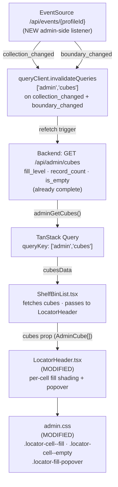

# Phase 10: Shelf Fill-Overview — Research

**Researched:** 2026-06-02
**Domain:** React frontend — fill shading, SSE invalidation, inline popover
**Confidence:** HIGH

---

<user_constraints>
## User Constraints (from CONTEXT.md)

### Locked Decisions

- **D-01:** Continuous BLUE-saturation gradient, not yellow. Empty = CUBE-05 desaturated state (`--gruvax-cell-empty`, gray + dashed border). Fuller cubes get progressively deeper IKEA-blue saturation. Yellow is reserved for active/changed/lit/LED state and the existing edited-bin highlight. Downstream agents must NOT revert this to yellow.
- **D-02:** Continuous gradient, not discrete buckets. Map `fill_level` to a continuous blue shade via `color-mix`/opacity; do not quantize into low/med/high steps. Must be glanceable at `--gruvax-cell-size-sm` (28px).
- **D-03:** Cap fill at full (clamp `fill_level` to 1.0 visually). Over-capacity renders identically to exactly-full. No distinct over-capacity border, texture, or off-palette color.
- **D-04:** Invalidate `['admin','cubes']` on BOTH `collection_changed` AND `boundary_changed`. Both must reshade live with no page reload.
- **D-05:** Tap-to-reveal exact count on each mini-cube (touch/no-hover context).
- **D-06:** Inline Nordic-Grid popover/tooltip, self-contained in `LocatorHeader`, NOT scroll-to/highlight of the bin card. Dismiss on tap-away. DM Mono for numeric data.

### Claude's Discretion

- Exact CSS technique for the blue gradient (`color-mix` vs. layered opacity vs. computed `--fill` custom property), and the precise shade ramp endpoints — as long as it consumes design tokens (never hardcoded hex) and empty/full are clearly distinct at 28px.
- Popover positioning, anchor, and dismiss mechanics (tap-away, escape, re-tap).
- Whether the popover shows `%`, `record_count`, or both — D-06 suggests both; final exact string is open.

### Deferred Ideas (OUT OF SCOPE)

- Over-capacity surfacing in the glance view (distinct visual for `fill_level > 1.0`).
- Tap-cube → jump to bin card (scroll-to/highlight alternative to D-06's popover).
</user_constraints>

---

<phase_requirements>
## Phase Requirements

| ID | Description | Research Support |
|----|-------------|------------------|
| UX-01 | Admin ShelfBinList `LocatorHeader` mini 4×4 Kallax shows per-cube fill/occupancy at a glance (`is_empty` / `fill_level` from `GET /api/admin/cubes`) instead of uniform dim tiles, honoring the CUBE-05 empty-cube desaturated state. Success criteria: (1) token-only, no hardcoded hex; (2) fill updates live after sync without page reload; (3) empty vs. full visually distinct at a glance on the 7" kiosk display. | Backend already returns `fill_level` and `record_count`; `AdminCube` type needs `record_count` added; SSE gap confirmed and wiring location identified; `color-mix` technique verified as Chromium 111+ native; design tokens confirmed for all required states. |
</phase_requirements>

---

## Summary

Phase 10 is a focused frontend visualization phase — no backend work is required for fill data. The `GET /api/admin/cubes` endpoint already returns `fill_level` (0.0–1.0+) and `record_count` per cube (confirmed at `cubes.py:211,214`). The work is three self-contained changes: (1) add `record_count` to the `AdminCube` TypeScript type and remove the stale `last_label`/`last_catalog` fields, (2) add fill shading and the tap-to-reveal popover to `LocatorHeader.tsx`, and (3) wire SSE invalidation of `['admin','cubes']` to a new or extended admin-route SSE listener.

The most important architectural finding is that **the admin route has no SSE consumer today**. `KioskView.tsx` owns the single `EventSource` connection (kiosk route only). `AdminShell.tsx` only polls the session endpoint. There is no `useAdminSse` hook, no SSE listener mounted on any admin route, and no `collection_changed` or `boundary_changed` handler anywhere in the admin subtree. The D-04 "find the SSE listener mounted on the admin route" direction from CONTEXT.md resolves to: **it does not exist — the planner must decide where to add it**. The two architecturally sound options are (a) a `useEffect` in `ShelfBinList.tsx` that opens a second `EventSource` on the same per-profile channel, listening only for `collection_changed` and `boundary_changed` and invalidating `['admin','cubes']`, or (b) a standalone `useAdminSse` hook mounted at `AdminShell` level (persistent across admin navigation).

The CSS fill technique is straightforward: a `--fill` CSS custom property set inline on each cell, consumed by `color-mix(in srgb, var(--gruvax-blue) calc(var(--fill) * 70%), var(--gruvax-cell-dim))`. `color-mix` is natively supported in Chromium 111+ with no polyfill needed. All required design tokens exist in `design/gruvax-design-tokens.css` — no new tokens are needed for this phase.

The tap-to-reveal popover must use `useState` for the active-cell index and `position: absolute` within a wrapper container (not a portal), satisfying D-06's "self-contained in LocatorHeader" constraint. The `locator-mini-grid` container needs `position: relative` to anchor the popover.

**Primary recommendation:** Wire SSE via a `useEffect` in `ShelfBinList.tsx` (scoped, simple, co-located with the query it invalidates) rather than at `AdminShell` level (persistent, but adds complexity to the shell that already manages session polling). Include `useAdminSse` as a named custom hook inside or alongside `ShelfBinList.tsx` for clean extraction.

---

## Architectural Responsibility Map

| Capability | Primary Tier | Secondary Tier | Rationale |
|------------|-------------|----------------|-----------|
| Fill data (computation) | API / Backend | — | Already complete: `cubes.py` divides `count_records_in_bin()` by `nominal_capacity` to produce `fill_level` |
| Fill shading (render) | Frontend (React + CSS) | — | CSS custom property `--fill` + `color-mix` in `admin.css`; driven by React inline style |
| SSE invalidation wiring | Frontend (React) | — | New `useEffect` / hook opening a second `EventSource` on the admin route, invalidating `['admin','cubes']` |
| Tap-to-reveal popover | Frontend (React + CSS) | — | `useState` in `LocatorHeader`; `position: absolute` popover inside the mini-grid container |
| `AdminCube` type update | Frontend (TypeScript) | — | `frontend/src/api/types.ts` — add `record_count`, remove stale `last_label`/`last_catalog` |

---

## Standard Stack

### Core (this phase touches no new library dependencies)

All work is vanilla React + TypeScript + CSS custom properties + existing TanStack Query infrastructure. No new packages are installed. [VERIFIED: codebase grep confirms no SSE library used; `color-mix` is a CSS native feature]

| Library | Version | Purpose | Why Standard |
|---------|---------|---------|--------------|
| React | 19.2.6 (already installed) | Component state for popover | Codebase standard |
| @tanstack/react-query | 5.100.11 (already installed) | `useQueryClient().invalidateQueries` for live refresh | Codebase SSE-invalidation idiom |
| CSS `color-mix()` | native (Chromium 111+) | Continuous fill gradient | Single paint operation, token-driven, no polyfill |
| Native `EventSource` | Web API | Admin SSE listener | Same pattern as `KioskView.tsx:332` |

### Alternatives Considered

| Instead of | Could Use | Tradeoff |
|------------|-----------|----------|
| `color-mix()` gradient | Opacity overlay (`rgba`) | `color-mix` is a single declarative expression; opacity overlay requires a stacked pseudo-element or wrapper div |
| `color-mix()` gradient | `background-image: linear-gradient` interpolated from token hex values | Requires hardcoded hex values to construct gradient endpoints — violates token-only constraint |
| SSE in `ShelfBinList.tsx` | SSE hook at `AdminShell` level | Shell-level is persistent across admin navigation (more cache hits); component-level is simpler and easier to test in isolation. Either is valid. |

**Installation:** None. This phase adds no new npm dependencies.

---

## Package Legitimacy Audit

No new packages are installed in this phase. This section is not applicable.

---

## Architecture Patterns

### System Architecture Diagram



### Recommended Project Structure

No new directories needed. Changes confined to:

```
frontend/src/
├── api/
│   └── types.ts                    # AdminCube type update (record_count, remove stale fields)
├── routes/admin/
│   ├── LocatorHeader.tsx           # fill shading + popover (main component work)
│   ├── ShelfBinList.tsx            # pass cubes prop + new SSE invalidation
│   └── admin.css                   # new CSS classes for fill + popover
```

### Pattern 1: CSS `--fill` Custom Property + `color-mix`

**What:** Set `--fill: <clamped 0..1>` as an inline style on each cell; the CSS class reads it via `color-mix`.
**When to use:** Any time a fill level from a data source needs to drive a continuous color ramp while staying within the token system.

```css
/* Source: 10-UI-SPEC.md § Fill gradient technique */
.locator-cell--fill {
  background: color-mix(
    in srgb,
    var(--gruvax-blue) calc(var(--fill, 0) * 70%),
    var(--gruvax-cell-dim)
  );
  border: 1.5px solid var(--gruvax-cell-dim-border);
  transition: background var(--gruvax-duration-base) var(--gruvax-ease-standard);
}
```

```tsx
// Source: 10-UI-SPEC.md § Component Inventory — LocatorHeader changes
// Cell render in LocatorHeader.tsx
const fillLevel = Math.min(cube?.fill_level ?? 0, 1)
const isEmpty = cube?.is_empty ?? false
const isEdited = r === row && c === col && row !== -1

const cellClass = isEdited
  ? 'locator-cell locator-cell--lit'
  : isEmpty
    ? 'locator-cell locator-cell--empty'
    : 'locator-cell locator-cell--fill'

const cellStyle = (!isEdited && !isEmpty)
  ? { '--fill': fillLevel } as React.CSSProperties
  : undefined
```

### Pattern 2: Admin-Side SSE Invalidation Hook

**What:** A `useEffect` that opens a second `EventSource` on the same per-profile URL as `KioskView`, but only subscribes to the two events relevant to the admin cubes query.
**When to use:** Any admin route that needs live updates from backend events without coupling to the kiosk's full SSE consumer.

```tsx
// Source: KioskView.tsx:332 pattern, adapted for admin
// Place inside ShelfBinList.tsx or extract as useAdminSse() hook

import { useQueryClient } from '@tanstack/react-query'
import { useEffect } from 'react'
import { useSessionStore } from '../../state/sessionStore'

function useAdminCubesInvalidation() {
  const queryClient = useQueryClient()

  useEffect(() => {
    const profileId = useSessionStore.getState().boundProfileId
    if (!profileId) return

    const es = new EventSource(`/api/events/${profileId}`)

    es.addEventListener('collection_changed', () => {
      void queryClient.invalidateQueries({ queryKey: ['admin', 'cubes'] })
    })

    es.addEventListener('boundary_changed', () => {
      void queryClient.invalidateQueries({ queryKey: ['admin', 'cubes'] })
    })

    return () => es.close()
  }, [queryClient])
}
```

**Key difference from KioskView SSE:** This listener calls `es.close()` in its cleanup (unlike KioskView which deliberately does not — see KioskView Pitfall 4 comment). The admin listener is intentionally short-lived: it opens when `ShelfBinList` mounts and closes when it unmounts. It does not need auto-reconnect or the kiosk's full event vocabulary.

### Pattern 3: Tap-to-Reveal Popover (State Machine)

**What:** Single `useState<number | null>` holding the active cell index (row×4+col), or null when no popover is shown. Dismiss on tap-away via a document `pointerdown` listener.
**When to use:** Any touch-primary inline disclosure panel that must be self-contained within a fixed-size container.

```tsx
// Source: 10-UI-SPEC.md § Interaction Contract
const [activeIdx, setActiveIdx] = useState<number | null>(null)

// On cell tap:
const idx = r * COLS + c
setActiveIdx(prev => prev === idx ? null : idx)

// Dismiss on tap-away:
useEffect(() => {
  if (activeIdx === null) return
  function handleTapAway(e: PointerEvent) {
    if (!(e.target as Element).closest('.locator-mini-grid-wrap')) {
      setActiveIdx(null)
    }
  }
  document.addEventListener('pointerdown', handleTapAway)
  return () => document.removeEventListener('pointerdown', handleTapAway)
}, [activeIdx])

// Dismiss on Escape:
useEffect(() => {
  if (activeIdx === null) return
  function handleKey(e: KeyboardEvent) {
    if (e.key === 'Escape') setActiveIdx(null)
  }
  document.addEventListener('keydown', handleKey)
  return () => document.removeEventListener('keydown', handleKey)
}, [activeIdx])
```

**Popover positioning:** Use `position: absolute` on the popover, placed inside the mini-grid container. Flip above/below based on row index (rows 2–3 flip to above). No portal needed — self-contained per D-06.

### Anti-Patterns to Avoid

- **Hardcoded hex in CSS or inline styles:** Use `var(--gruvax-blue)` etc. — never `#0051A2`. The token-only constraint is enforced by CLAUDE.md and is UX-01 success criterion 1.
- **Yellow for fill:** `--gruvax-yellow` / `--gruvax-cell-lit` are reserved for active/edited/LED state. Yellow for fill would collide with the `.locator-cell--lit` edited-bin highlight already present in `LocatorHeader`.
- **Invalidating `['admin','cubes']` inside the KioskView SSE handler:** The D-08 comment in KioskView explicitly separates kiosk and admin keys. Do not add admin invalidation there.
- **`es.close()` in the KioskView SSE cleanup path for the new listener:** The new admin listener is separate from KioskView's `EventSource`. Each has its own lifecycle — the admin one correctly closes on unmount.
- **Using `hover` pseudo-class for the popover trigger:** The kiosk is touch-primary. No hover state is expected. Use `onClick`/`onPointerDown` for the tap affordance, not `:hover`.
- **Portal for the popover:** D-06 requires "self-contained in LocatorHeader." A portal would break that. Use `position: absolute` within a `position: relative` grid wrapper.

---

## Don't Hand-Roll

| Problem | Don't Build | Use Instead | Why |
|---------|-------------|-------------|-----|
| Continuous color gradient from a data value | Custom lerp function over hex RGB | CSS `color-mix(in srgb, ...)` | Browser-native, single declaration, integrates with CSS custom properties |
| SSE event subscription | Custom fetch-loop or WebSocket wrapper | Native `EventSource` (same pattern as KioskView.tsx:332) | Already proven in the codebase; handles reconnect natively |
| Query cache invalidation on SSE | Custom state sync mechanism | `queryClient.invalidateQueries` (TanStack Query) | Already the codebase's live-update idiom; staleTime and background-refetch handle the rest |

---

## Critical Codebase Findings

### Finding 1: Admin Route Has No SSE Listener (CONFIRMED)

**What was found:** Grepping all admin route files (`AdminShell.tsx`, `ShelfBinList.tsx`, `CubesGrid.tsx`, `BinWidthEditor.tsx`, `Settings.tsx`, `HistoryView.tsx`, `Wizard.tsx`, all others) for `EventSource`, `collection_changed`, `boundary_changed`, and `useAdminSse` returned zero results. [VERIFIED: codebase grep]

`AdminShell.tsx` contains only session polling (`setInterval` calling `adminGetSession()` every 30s) — no SSE consumer. There is no global admin SSE hook.

**Implication for D-04:** The admin-route SSE listener described in CONTEXT.md D-04 as "wherever it is mounted" does not currently exist. The planner must add it. The recommended location is `ShelfBinList.tsx` (a scoped `useEffect` / `useAdminCubesInvalidation` hook that opens on mount and closes on unmount). An alternative is at `AdminShell` level (persistent, survives admin route navigation), but that adds complexity to the shell.

### Finding 2: `AdminCube` Type Is Stale (CONFIRMED)

**What was found:** `frontend/src/api/types.ts:299-310` — `AdminCube` currently has:
- `last_label: string` — stale field, not returned by backend
- `last_catalog: string` — stale field, not returned by backend
- `fill_level: number` — correct, present
- `record_count: number` — **missing from the type** (but backend returns it at `cubes.py:211`)

[VERIFIED: codebase read — types.ts:299-310, cubes.py:211]

**Fix:** Remove `last_label` and `last_catalog`; add `record_count: number`. Check for any references to `last_label`/`last_catalog` on `AdminCube` elsewhere in the codebase before removing.

### Finding 3: Backend Already Returns `record_count` (CONFIRMED)

`src/gruvax/api/admin/cubes.py:211-214` — the `get_admin_cubes` endpoint sets `cube["record_count"] = count` for non-empty cubes and `cube["record_count"] = 0` for empty cubes. This is already in production. No backend work is needed. [VERIFIED: codebase read]

### Finding 4: All Required Design Tokens Exist (CONFIRMED)

`design/gruvax-design-tokens.css` contains all tokens required by the UI-SPEC fill shading and popover: [VERIFIED: codebase read]
- `--gruvax-cell-empty` (#F2F2F2), `--gruvax-cell-empty-border` (#DDDDDD) — CUBE-05 empty state
- `--gruvax-cell-dim` (#D8E8F5), `--gruvax-cell-dim-border` (#B8D0E8) — dim base for fill
- `--gruvax-blue` (#0051A2), `--gruvax-blue-dark` (#003D7A) — fill ramp targets
- `--gruvax-cell-size-sm` (28px), `--gruvax-cell-gap-sm` (4px) — mini-grid geometry
- `--gruvax-duration-base` (250ms), `--gruvax-ease-standard` — transition tokens
- `--gruvax-z-overlay` (20) — popover z-index
- `--gruvax-shadow-md`, `--gruvax-radius-md`, `--gruvax-font-mono`, `--gruvax-font-ui` — popover styling
- `--gruvax-space-2` (8px), `--gruvax-space-3` (12px) — popover padding
- `--gruvax-text-primary`, `--gruvax-text-secondary`, `--gruvax-text-muted` — popover text colors
- `--gruvax-text-mono` (14px), `--gruvax-text-caption` (12px) — popover type scale

No new design tokens need to be created for this phase.

### Finding 5: `LocatorHeader` Existing CSS Block Location (CONFIRMED)

`frontend/src/routes/admin/admin.css:1608-1653` — the Phase 5 LocatorHeader CSS block. New classes (`.locator-cell--fill`, `.locator-cell--empty`, `.locator-fill-popover`, etc.) must be appended directly after line 1653. [VERIFIED: codebase read]

### Finding 6: `ShelfGrid.tsx` Fill Pattern (CONFIRMED)

`frontend/src/routes/kiosk/ShelfGrid.tsx:30-31` — `fillLevels?: Map<string, number>` prop, resolved per cell at `ShelfGrid.tsx:110-111` as `fillLevels?.get(cubeKey)`. The `LocatorHeader` implementation should mirror this: receive `cubes?: AdminCube[]`, build a `Map<string, AdminCube>` keyed by `"row-col"`, look up per cell. [VERIFIED: codebase read]

### Finding 7: SSE Event Pattern from KioskView (CONFIRMED)

The `KioskView.tsx:360-384` `boundary_changed` handler and `KioskView.tsx:424-452` `collection_changed` handler are the canonical reference patterns for SSE event wiring. The admin handler needs only the `invalidateQueries` calls, without the kiosk-specific re-locate, shimmer, or new-record-count logic. [VERIFIED: codebase read]

### Finding 8: `staleTime` on the Admin Cubes Query

`ShelfBinList.tsx:86` — `staleTime: 60_000` (60 seconds). After SSE invalidation fires `queryClient.invalidateQueries({ queryKey: ['admin', 'cubes'] })`, TanStack Query will refetch immediately regardless of staleTime (invalidation overrides staleTime). This is correct behavior — no change needed. [VERIFIED: codebase read]

### Finding 9: `locator-cell--lit` Must Take Priority Over Fill

The existing lit (edited-bin yellow) state is applied by class `locator-cell--lit` (CSS: `background: var(--gruvax-cell-lit)`). In the modified `LocatorHeader`, the conditional class logic must ensure `locator-cell--lit` takes precedence and the `--fill` inline style is not applied when the cell is the edited bin. The render logic: if `isEdited` → `locator-cell--lit`; else if `isEmpty` → `locator-cell--empty`; else → `locator-cell--fill` with `style={{ '--fill': fillLevel }}`. These three states are mutually exclusive. [VERIFIED: codebase read — LocatorHeader.tsx:49-55]

### Finding 10: `last_label`/`last_catalog` Usage on `AdminCube`

Before removing `last_label` and `last_catalog` from `AdminCube`, check all references. The stale fields originated from the CubeBoundaryEdit type, not from the GET /api/admin/cubes response (which only returns `first_label`, `first_catalog`). A grep confirms: `last_label` and `last_catalog` are present on `CubeBoundaryEdit` and `AdminCubeBoundary` (the per-cube boundary editor type), but the `AdminCube` interface (lines 300-311) is the only place they appear on the cubes-list response type. Removing them from `AdminCube` does not affect `CubeBoundaryEdit` or `AdminCubeBoundary`. [VERIFIED: codebase read — types.ts:188-210, 317-326]

---

## Common Pitfalls

### Pitfall 1: Two `EventSource` Connections to the Same URL

**What goes wrong:** If both `KioskView` and the new admin SSE listener open `EventSource` for the same `profileId`, the browser holds two connections to `/api/events/{profileId}`. This is valid (the server broadcasts to all subscribers), but if the admin route and kiosk route are simultaneously mounted (not possible in this SPA — they are on different URL paths), it would double-trigger per-event handling.

**Why it happens:** The admin and kiosk routes use the same per-profile SSE channel. The app's routing means only one is ever mounted at a time, so this is not a real problem.

**How to avoid:** No special action needed. Document the intended behavior: the admin SSE listener is scoped to `ShelfBinList` mount/unmount, so it only exists when the admin route is active.

**Warning signs:** Two `EventSource` instances visible in DevTools → Network tab for the same URL while admin is open.

### Pitfall 2: `color-mix` with `calc()` Percent Syntax in Some Browsers

**What goes wrong:** `color-mix(in srgb, var(--gruvax-blue) calc(var(--fill) * 70%), ...)` — the `calc()` inside a color-mix percentage is supported in Chromium 111+ but may not work in older browser versions.

**Why it happens:** The `calc()` percent argument in `color-mix` was added to the CSS spec and browser implementations at slightly different times.

**How to avoid:** The kiosk target is Chromium from Raspberry Pi OS Trixie (Debian 13) — this is Chromium 120+ at minimum, well above 111. No polyfill needed. [VERIFIED: 10-UI-SPEC.md states "Chromium 111+ is the kiosk target; no polyfill needed"]

**Warning signs:** Gray cells instead of gradient cells in a non-Chromium browser. Irrelevant for the kiosk target.

### Pitfall 3: Popover Clipped by `overflow: hidden` on Ancestor

**What goes wrong:** If `.locator-header`, `.sbl-locator`, or `.sbl-screen` has `overflow: hidden`, an absolutely-positioned popover anchored inside `.locator-mini-grid-wrap` will be clipped.

**Why it happens:** `position: absolute` is contained by the nearest `position: relative` ancestor, but `overflow: hidden` on any ancestor clips the visual output.

**How to avoid:** Wrap `.locator-mini-grid` in a `position: relative` container with no `overflow: hidden`. Inspect `.sbl-locator` (admin.css:3002) to confirm it has neither. If clipping occurs, use `overflow: visible` on the wrapper.

**Warning signs:** Popover is cut off at the top or bottom of the locator header area.

### Pitfall 4: SSE Listener References Stale `boundProfileId`

**What goes wrong:** If the `useEffect` in the new admin listener captures `boundProfileId` from a stale closure (React state at mount time), it may open an `EventSource` for a `null` profileId or fail to reopen after profile switch.

**Why it happens:** React hooks close over state values at render time.

**How to avoid:** Use `useSessionStore.getState().boundProfileId` (Zustand `.getState()` call-time access) inside the `useEffect` body, not as a reactive dependency. This mirrors the pattern in KioskView.tsx:326. [VERIFIED: KioskView.tsx:326 pattern]

**Warning signs:** EventSource opens to `/api/events/null`, triggering a 404 or 422.

### Pitfall 5: `ShelfBinList` Receives `cubesData` but `cubes prop` Not Passed to `LocatorHeader`

**What goes wrong:** `ShelfBinList` already fetches `['admin','cubes']` and stores it in `cubesData`. The current `LocatorHeader` call at line 195-202 does not pass the cubes. If the planner adds a `cubes` prop to `LocatorHeader` but forgets to wire it from `cubesData.cubes`, the fill shading renders nothing.

**How to avoid:** Explicitly wire `cubes={cubesData?.cubes ?? []}` in the `LocatorHeader` call in `ShelfBinList`. The `cubesData` is already in scope at the render site. Filter to the current `unitId` either inside `LocatorHeader` (simpler) or in `ShelfBinList` before passing (more explicit).

### Pitfall 6: Popover `aria-live` Racing with Fill Transition

**What goes wrong:** Marking the popover container as `aria-live="polite"` means every fill level update triggers a screen reader announcement if the popover is open during a refetch.

**How to avoid:** Apply `aria-live="polite"` only to the popover element itself (the tap-revealed disclosure), not to the fill cells. Fill cell state changes are communicated via `aria-label` on each cell, not via live regions.

---

## Code Examples

### Fill State Logic (per cell in LocatorHeader render loop)

```tsx
// Source: 10-UI-SPEC.md § Component Inventory, KioskView.tsx SSE pattern
const cubeMap = useMemo(() => {
  const m = new Map<string, AdminCube>()
  cubes?.forEach(c => {
    if (c.unit_id === unitId) m.set(`${c.row}-${c.col}`, c)
  })
  return m
}, [cubes, unitId])

// Inside cell render (r, c loop):
const cube = cubeMap.get(`${r}-${c}`)
const isEdited = r === row && c === col && row !== -1
const isEmpty = cube?.is_empty ?? false
const fillLevel = Math.min(cube?.fill_level ?? 0, 1)

const cellClass = isEdited
  ? 'locator-cell locator-cell--lit'
  : isEmpty
    ? 'locator-cell locator-cell--empty'
    : 'locator-cell locator-cell--fill'

const cellStyle = (!isEdited && !isEmpty)
  ? { '--fill': fillLevel } as React.CSSProperties
  : undefined
```

### Popover Content Format

```tsx
// Source: 10-UI-SPEC.md § Interaction Contract + CONTEXT.md D-06
function popoverContent(cube: AdminCube | undefined, binId: string): string {
  if (!cube || cube.is_empty) return `${binId} · Empty bin`
  const pct = Math.round(Math.min(cube.fill_level, 1) * 100)
  return `${binId} · ${cube.record_count} records · ${pct}%`
}
// binId derived from: shelfLetter(unitId) + (row * 4 + col + 1)
// Example: shelfLetter(1) = "A", row=0, col=0 → "A1"
// Example: shelfLetter(1) = "A", row=0, col=3 → "A4"
```

### CSS Classes to Add (append after admin.css line 1653)

```css
/* Source: 10-UI-SPEC.md § New CSS classes */

/* Fill shading — continuous blue gradient driven by --fill custom property */
.locator-cell--fill {
  background: color-mix(
    in srgb,
    var(--gruvax-blue) calc(var(--fill, 0) * 70%),
    var(--gruvax-cell-dim)
  );
  border: 1.5px solid var(--gruvax-cell-dim-border);
  transition: background var(--gruvax-duration-base) var(--gruvax-ease-standard);
}

/* Empty cube — CUBE-05 desaturated state */
.locator-cell--empty {
  background: var(--gruvax-cell-empty);
  border: 1.5px dashed var(--gruvax-cell-empty-border);
}

/* Interactive cell tap affordance (touch-primary — no hover) */
.locator-cell-btn {
  cursor: pointer;
  background: inherit;
  border: inherit;
  border-radius: inherit;
  padding: 0;
  width: var(--gruvax-cell-size-sm);
  height: var(--gruvax-cell-size-sm);
}

/* Grid wrapper — establishes position: relative for absolute popover */
.locator-mini-grid-wrap {
  position: relative;
}

/* Popover */
.locator-fill-popover {
  position: absolute;
  z-index: var(--gruvax-z-overlay);
  background: var(--gruvax-white);
  border: 1.5px solid var(--gruvax-border);
  border-radius: var(--gruvax-radius-md);
  box-shadow: var(--gruvax-shadow-md);
  padding: var(--gruvax-space-3) var(--gruvax-space-2);
  min-width: 120px;
  pointer-events: auto;
  white-space: nowrap;
}

.locator-fill-popover-id {
  font-family: var(--gruvax-font-mono);
  font-size: var(--gruvax-text-mono);
  font-weight: 400;
  color: var(--gruvax-text-primary);
  line-height: var(--gruvax-leading-normal);
  display: block;
}

.locator-fill-popover-data {
  font-family: var(--gruvax-font-mono);
  font-size: var(--gruvax-text-mono);
  font-weight: 400;
  color: var(--gruvax-text-secondary);
  line-height: var(--gruvax-leading-normal);
  display: block;
}

.locator-fill-popover-empty {
  font-family: var(--gruvax-font-ui);
  font-size: var(--gruvax-text-caption);
  font-weight: 400;
  color: var(--gruvax-text-muted);
  line-height: var(--gruvax-leading-normal);
  display: block;
}
```

### `AdminCube` Type Correction

```ts
// Source: frontend/src/api/types.ts:299-310 — current (stale)
// File: frontend/src/api/types.ts

/** One cube row from GET /api/admin/cubes. */
export interface AdminCube {
  unit_id: number
  row: number
  col: number
  first_label: string
  first_catalog: string
  // REMOVE: last_label: string   — not returned by GET /api/admin/cubes
  // REMOVE: last_catalog: string — not returned by GET /api/admin/cubes
  is_empty: boolean
  fill_level: number       // 0.0–1.0+ fraction of nominal capacity
  record_count: number     // ADD — raw count for popover display (cubes.py:211)
}
```

---

## State of the Art

| Old Approach | Current Approach | When Changed | Impact |
|--------------|------------------|--------------|--------|
| Discrete "low/med/high" fill buckets | Continuous `color-mix` gradient via CSS custom property | Phase 10 (new) | UX-01 SC 3 — empty vs. full visually distinct, no quantization artifacts |
| `LocatorHeader` purely display (no interaction) | Each cell is an interactive button with `aria-label` + tap-to-reveal popover | Phase 10 (new) | D-05/D-06 |
| No admin-side SSE invalidation | `useAdminCubesInvalidation` hook invalidates `['admin','cubes']` on both events | Phase 10 (new) | D-04 / UX-01 SC 2 |

**No deprecated approaches in use for this phase.**

---

## Assumptions Log

> All claims in this research were verified against the live codebase or the approved UI-SPEC/CONTEXT.md documents. No unverified training-data assumptions.

| # | Claim | Section | Risk if Wrong |
|---|-------|---------|---------------|
| A1 | `color-mix(in srgb, ..., calc(var(--fill) * 70%))` percent-via-calc syntax is supported in Chromium 111+ | Standard Stack | Fill renders gray on kiosk; fallback to `opacity` overlay |

**The table above is nearly empty:** the critical implementation details (backend response shape, type staleness, SSE architecture gap, token availability, CSS block location) were all verified by reading the live codebase.

---

## Open Questions

1. **SSE listener location: `ShelfBinList` vs `AdminShell`?**
   - What we know: Admin route currently has no SSE consumer. Both options are technically valid.
   - What's unclear: Whether the planner wants fill shading to refresh in real-time on *other* admin routes (e.g., `CubesGrid`) — those don't show fill shading today, so ShelfBinList-scoped is sufficient for Phase 10.
   - Recommendation: Scope to `ShelfBinList` for Phase 10. Extract to `AdminShell` in a future phase if other admin routes need live updates.

2. **`last_label`/`last_catalog` removal: any other consumers?**
   - What we know: `AdminCube.last_label` and `last_catalog` exist in the type file. `CubeBoundaryEdit` and `AdminCubeBoundary` (separate types) also have these fields — those are untouched.
   - What's unclear: Whether any TSX file reads `cube.last_label` or `cube.last_catalog` from an `AdminCube`-typed variable (vs. `AdminCubeBoundary`-typed).
   - Recommendation: Planner should add a `grep` task as Wave 0 work: `grep -rn "last_label\|last_catalog" frontend/src/routes/admin/` and confirm no `AdminCube`-typed variable uses them before the type edit.

---

## Environment Availability

Step 2.6: SKIPPED (no external dependencies — this is a pure frontend code change with no new tools, services, or runtimes).

---

## Validation Architecture

### Test Framework

| Property | Value |
|----------|-------|
| Framework | Vitest 4.1.7 + @testing-library/react 16.3.2 + jsdom |
| Config file | `frontend/vite.config.ts` (test block at bottom) |
| Setup file | `frontend/src/test-setup.ts` (imports `@testing-library/jest-dom`) |
| Quick run command | `npm --prefix frontend run test` |
| Full suite command | `npm --prefix frontend run test` (no watch mode in CI — `vitest run`) |

### Phase Requirements → Test Map

| Req ID | Behavior | Test Type | Automated Command | File Exists? |
|--------|----------|-----------|-------------------|-------------|
| UX-01 SC 1 | `LocatorHeader` renders `.locator-cell--fill` class with `--fill` style for non-empty cubes; `.locator-cell--empty` for empty cubes; no hardcoded hex in rendered output | unit (render) | `npm --prefix frontend run test -- LocatorHeader` | ❌ Wave 0 |
| UX-01 SC 1 | Lit cell (`row/col` match) renders `.locator-cell--lit` regardless of fill data — priority is correct | unit (render) | `npm --prefix frontend run test -- LocatorHeader` | ❌ Wave 0 |
| UX-01 SC 2 | `collection_changed` SSE event → `['admin','cubes']` query is invalidated | unit (SSE) | `npm --prefix frontend run test -- ShelfBinList` | ❌ Wave 0 |
| UX-01 SC 2 | `boundary_changed` SSE event → `['admin','cubes']` query is invalidated | unit (SSE) | `npm --prefix frontend run test -- ShelfBinList` | ❌ Wave 0 |
| UX-01 SC 3 | Empty cube (`is_empty: true`) and full cube (`fill_level: 1.0`) render visually distinct classes | unit (render) | `npm --prefix frontend run test -- LocatorHeader` | ❌ Wave 0 |
| D-05/D-06 | Tap on a mini-cell → popover appears; tap-away → popover dismisses | unit (interaction) | `npm --prefix frontend run test -- LocatorHeader` | ❌ Wave 0 |
| D-06 | Popover content for non-empty cube shows `{binId} · {N} records · {P}%` format | unit (render) | `npm --prefix frontend run test -- LocatorHeader` | ❌ Wave 0 |
| D-06 | Popover content for empty cube shows `{binId} · Empty bin` | unit (render) | `npm --prefix frontend run test -- LocatorHeader` | ❌ Wave 0 |
| D-03 | `fill_level = 1.5` renders same `--fill` value as `fill_level = 1.0` (clamp) | unit (render) | `npm --prefix frontend run test -- LocatorHeader` | ❌ Wave 0 |

### Test Patterns from Existing Codebase

The codebase's test idiom (from `ShelfGrid.test.tsx`, `KioskView.EventSource.test.tsx`) is:

1. **Component render tests** — `render(<Component />)` + `container.querySelectorAll(selector)` + `expect(cell).toHaveStyle(...)` or `expect(cell).toHaveClass(...)` — from `@testing-library/react`.
2. **SSE tests** — `MockEventSource` pattern (stub `vi.stubGlobal('EventSource', MockEventSource)`) + `act(async () => es.dispatchEvent('event_name', payload))` + `vi.spyOn(qc, 'invalidateQueries')` to assert the correct key was invalidated.
3. **Inline style assertions** — `expect(cell).toHaveStyle('--fill: 0.75')` for the CSS custom property (note: jsdom does not evaluate `color-mix`, but the custom property value can be asserted directly).

### Sampling Rate

- **Per task commit:** `npm --prefix frontend run test -- LocatorHeader` (fast, scoped to the modified component)
- **Per wave merge:** `npm --prefix frontend run test` (full Vitest suite)
- **Phase gate:** Full suite green before `/gsd:verify-work`

### Wave 0 Gaps

- [ ] `frontend/src/routes/admin/LocatorHeader.test.tsx` — covers all UX-01, D-03, D-05, D-06 test cases above (9 test cases)
- [ ] `frontend/src/routes/admin/ShelfBinList.sse.test.tsx` (or extend existing `ShelfBinList.test.tsx` if one is added) — covers UX-01 SC 2 SSE invalidation (2 test cases using `MockEventSource`)

*(Existing test infrastructure is fully sufficient — no new framework install needed. `MockEventSource` pattern from `KioskView.EventSource.test.tsx` can be copied verbatim into the new `ShelfBinList.sse.test.tsx`.)*

---

## Security Domain

This phase adds no authentication changes, no new endpoints, no user input that reaches the server, and no new data storage. The popover displays server-returned `record_count` and `fill_level` — these are admin-authenticated read-only fields. No ASVS categories are newly applicable.

`security_enforcement` is not explicitly `false` in `.planning/config.json`, so this section is included for completeness.

| ASVS Category | Applies | Rationale |
|---------------|---------|-----------|
| V2 Authentication | No | No auth changes; admin PIN gate unchanged |
| V3 Session Management | No | No session changes |
| V4 Access Control | No | `GET /api/admin/cubes` already behind `require_admin` |
| V5 Input Validation | No | No new user input reaches the server |
| V6 Cryptography | No | No cryptographic operations |

---

## Sources

### Primary (HIGH confidence — codebase reads)

- `frontend/src/routes/admin/LocatorHeader.tsx:1-64` — current component (non-interactive, 64 lines)
- `frontend/src/routes/admin/ShelfBinList.tsx:1-276` — host component; `['admin','cubes']` query key at line 84
- `frontend/src/routes/kiosk/KioskView.tsx:332, 360-384, 424-452` — SSE creation and event handler patterns
- `frontend/src/routes/admin/AdminShell.tsx:1-319` — confirmed: no EventSource, no SSE listener
- `frontend/src/api/types.ts:299-310` — stale `AdminCube` type (missing `record_count`, has stale `last_label`/`last_catalog`)
- `src/gruvax/api/admin/cubes.py:166-218` — backend endpoint; `record_count` returned at line 211/214
- `design/gruvax-design-tokens.css:1-212` — all required tokens confirmed
- `frontend/src/routes/admin/admin.css:1608-1653` — existing LocatorHeader CSS block; new classes append after line 1653
- `frontend/src/routes/kiosk/ShelfGrid.tsx:28-32, 110-111` — `fillLevels` prop pattern to mirror
- `.planning/phases/10-shelf-fill-overview/10-CONTEXT.md` — locked decisions D-01..D-06
- `.planning/phases/10-shelf-fill-overview/10-UI-SPEC.md` — approved visual and interaction contract

### Secondary (MEDIUM confidence — referenced docs)

- `frontend/src/routes/kiosk/KioskView.EventSource.test.tsx` — MockEventSource test pattern; confirmed as the correct test idiom for SSE wiring tests

---

## Metadata

**Confidence breakdown:**

| Area | Level | Reason |
|------|-------|--------|
| Standard Stack | HIGH | All libraries already in package.json; no new dependencies |
| Architecture (SSE gap) | HIGH | Confirmed by grepping entire admin routes directory — zero EventSource references |
| Architecture (fill rendering) | HIGH | Token existence and CSS technique confirmed from spec + tokens file |
| Pitfalls | HIGH | Based on codebase patterns (KioskView stale-closure pitfall, existing D-08 separation comment) |
| Type staleness | HIGH | Confirmed directly from types.ts and cubes.py side by side |

**Research date:** 2026-06-02
**Valid until:** This phase's RESEARCH.md is stable until the codebase changes — no external dependencies to expire.
