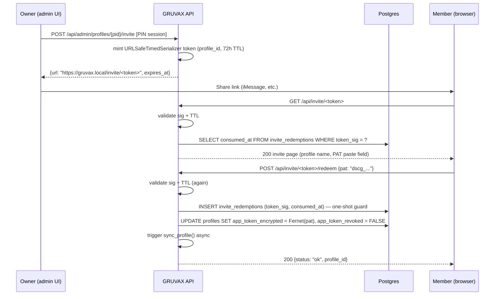
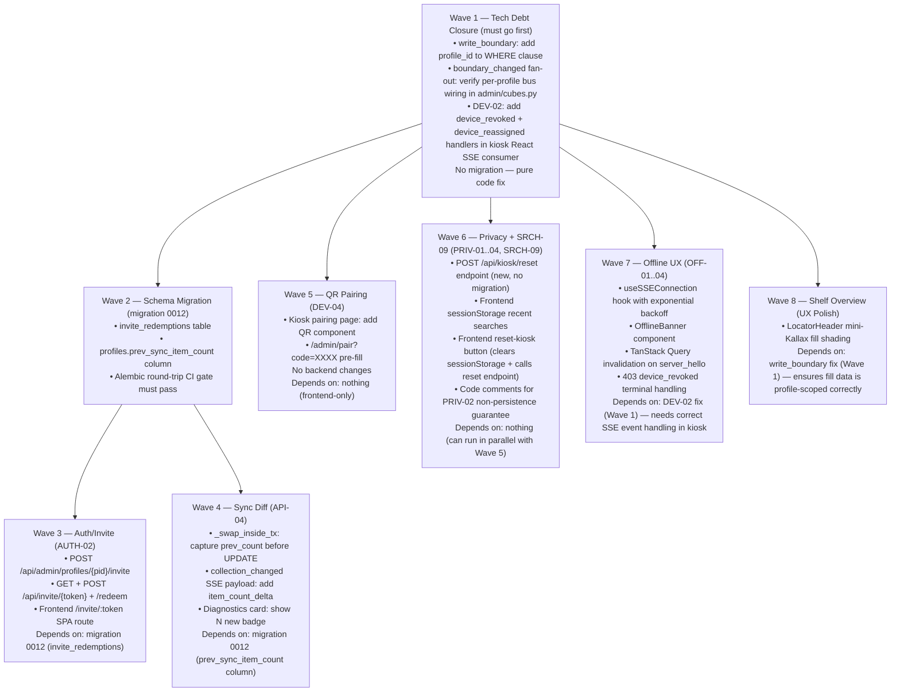

# Architecture Research — GRUVAX v2.1 Integration

**Domain:** v2.1 Resilience + Privacy + UX polish — integrating new capabilities into a shipped Python/FastAPI + React vinyl-locator kiosk.
**Researched:** 2026-05-30
**Scope:** Subsequent-milestone integration analysis; DO NOT re-research the existing v2.0 architecture — integrate WITH it.
**Confidence:** HIGH on integration points (verified against live source: `src/gruvax/`, `migrations/`). HIGH on migration sequencing (migration files read directly). MEDIUM on frontend offline/reconnect patterns (React ecosystem, verified against known TanStack Query SSE patterns).

---

## How v2.1 Lands on the Existing Architecture

Migration head is `0011` (`devices` + `pairing_codes`). Per-profile registries
(cache / event-bus / state) are keyed by `profile_id`. The SSE channel is
`GET /api/events/{profile_id}` — cross-profile leakage impossible by construction.
`sync_profile()` is a staging-swap (advisory lock + `COPY` + atomic swap). The
`write_boundary()` query in `db/queries.py` has a known missing `profile_id` in
its `WHERE` clause (tech debt DEV-02 / write_boundary scoping).

---

## Component Map — What Changes in v2.1

```mermaid
flowchart TD
    subgraph EXISTING["Existing (v2.0 — unchanged)"]
        PC[profile_collection table]
        PROF[profiles table]
        DEV[devices + pairing_codes tables]
        SYNC[sync/profile_sync.py\nstaging-swap]
        SSE[api/events.py\n/api/events/{profile_id}]
        BUS[events/bus.py\nper-profile EventBus registry]
        BOUND[db/queries.py write_boundary\n⚠ missing profile_id WHERE]
    end

    subgraph NEW21["New in v2.1"]
        INV[invite_tokens table\nmigration 0012]
        DELTA[profile_collection.prev_count\nOR separate sync_snapshots table\nmigration 0012 or 0013]
        QRCODE[QR encode on /api/devices/pairing-codes\nno new table]
        RSEARCH[recently-searched\nclient-side session storage only]
        OFFUX[Offline/reconnect UX\nfrontend only — no new backend]
        PRIV[Privacy hardening\nno new tables — query text never stored]
    end

    subgraph DEBT["Tech Debt — Must Close First"]
        D02[DEV-02: SSE device_revoked/device_reassigned\nkiosk not listening yet]
        WB[write_boundary WHERE += AND profile_id = %s\nmust land before multi-profile boundary UI]
        BFANOUT[boundary_changed fan-out\ndefault-profile-only → all-profile fan-out]
    end

    DEBT --> EXISTING
    NEW21 --> EXISTING
```

---

## 1. AUTH-02 — Invite Token Self-Connect PAT

### Decision: Signed Stateless Token (not a new table)

Use `itsdangerous.URLSafeTimedSerializer` (already an indirect dep via
`SessionMiddleware`) to mint a signed, time-limited invite URL. The token
encodes `{profile_id, created_by}` and has a configurable TTL (recommended: 72 h).
No new table is needed for the common path.

**Rationale vs. a DB table:**
- A DB table for invite tokens adds a migration, a cleanup job, and a poll
  loop. For household scale (1–4 invites ever), the stateless token wins on
  simplicity.
- The one genuine advantage of a DB table — server-side revocation before TTL
  expiry — is not needed here: if the owner fat-fingers an invite they can
  issue a new profile or reset the PAT; the old link expires in 72 h.
- `itsdangerous` is already present (it signs the `SessionMiddleware` cookie);
  no new package needed.

**One exception: consumed-at guard.** To prevent the same invite link from being
used twice (member reloads the page, pastes it again), store a short-lived
one-shot `consumed_at` record in a minimal `invite_redemptions(token_sig TEXT PK,
consumed_at TIMESTAMPTZ NOT NULL)` table with a TTL-based cleanup. This is
**migration 0012**.

### Integration Points

| Component | Change | Type |
|-----------|--------|------|
| `gruvax.invite_redemptions` | New table — PK is the token signature (first 32 chars of HMAC), `consumed_at TIMESTAMPTZ` | **New (migration 0012)** |
| `POST /api/admin/profiles/{profile_id}/invite` | PIN-gated; mint `URLSafeTimedSerializer` token; return `{url, expires_at}` | **New endpoint** |
| `GET /api/invite/{token}` | **Public** — validate sig + TTL + consumed_at; render invite-redeem page (SPA route) | **New endpoint** |
| `POST /api/invite/{token}/redeem` | Accept PAT from body; decrypt-store via Fernet; mark `invite_redemptions.consumed_at`; trigger sync | **New endpoint** |
| Frontend `/invite/:token` route | Public SPA page — no PIN required; shows profile name, PAT paste field, submit | **New SPA route** |

### Data Flow



### Migration Impact (head = 0011 → 0012)

```python
# migration 0012 — invite_redemptions
CREATE TABLE gruvax.invite_redemptions (
    token_sig   TEXT        PRIMARY KEY,  -- first 32 chars of HMAC signature
    consumed_at TIMESTAMPTZ NOT NULL DEFAULT NOW()
)
# Add index on consumed_at for TTL cleanup:
CREATE INDEX ix_invite_redemptions_consumed_at ON gruvax.invite_redemptions (consumed_at)
```

No changes to `profiles`, `devices`, or `pairing_codes`. The cleanup job (delete
rows older than 72 h + grace) can be a startup sweep, not a background loop.

---

## 2. DEV-04 — QR Code Pairing (alongside 4-digit PIN)

### Decision: Encode invite URL in QR; reuse existing pairing_codes + bind flow entirely

The QR code encodes the URL `https://gruvax.local/admin/pair?code=XXXX` (or
whatever the server's LAN address is). The admin scans it on their phone, which
opens the browser to the same admin bind page they'd use to type the 4-digit code.
**No new table, no new bind endpoint, no parallel code path.**

The only changes are:

1. `POST /api/devices/pairing-codes` response already returns `{code, expires_at}`.
   The kiosk frontend calls this, receives the code, and now **also renders a QR
   image** from it. Library: `qrcode` (Python, server-side) or a frontend JS
   library (`qrcode` npm package, tiny, ~17 KB). **Recommend frontend** — the kiosk
   already renders the 4-digit code; adding a QR canvas next to it is a pure React
   component, no API change.

2. The admin bind page on `/admin/pair` reads the `?code` query param and
   pre-fills the code input. Admin scans, browser opens, code is pre-filled, admin
   hits "Bind". Same atomic `POST /api/admin/devices/bind` as today.

### Integration Points

| Component | Change | Type |
|-----------|--------|------|
| Kiosk pairing page (React) | Add `<QRCode value={pairUrl} />` next to 4-digit display | **Frontend only** |
| `/admin/pair?code=XXXX` route | Accept `code` query param; pre-fill the code input | **Frontend only** |
| `POST /api/devices/pairing-codes` | No change to response shape | **Unchanged** |
| `POST /api/admin/devices/bind` | No change | **Unchanged** |

No migration. No new backend code.

---

## 3. API-04 — Collection Diff ("N new records since last sync")

### Decision: Store item count delta in profiles table (no new table)

The swap in `_swap_inside_tx()` already writes `last_sync_item_count` to
`profiles`. Add one column: `prev_sync_item_count BIGINT`. Before the swap's
`UPDATE profiles`, capture the current `last_sync_item_count` and write it into
`prev_sync_item_count`. The diff is `last_sync_item_count - prev_sync_item_count`.

**Why not a separate snapshot table?**
- The diff metric is a scalar: "N new since last sync." A scalar column in
  `profiles` is the right fit. A table would be appropriate only if we needed
  per-record-level diff (which releases were added/removed), which v2.1 does not
  require (that's a future milestone if ever).
- The staging-swap already operates on the full collection. Computing a set diff
  would require keeping the old rows alive during the swap — that changes the
  atomic-swap semantics in a non-trivial way. A scalar count is zero cost.

### Migration Impact (head = 0011 → 0013 or combined with 0012)

```python
# Can be combined with 0012 or a standalone 0013
ALTER TABLE gruvax.profiles ADD COLUMN prev_sync_item_count BIGINT
```

### Integration Points

| Component | Change | Type |
|-----------|--------|------|
| `gruvax.profiles` | Add `prev_sync_item_count BIGINT` column | **Modified (migration)** |
| `_swap_inside_tx()` in `sync/profile_sync.py` | Before UPDATE, SELECT current `last_sync_item_count` → write into `prev_sync_item_count`; or fold into single UPDATE with CASE | **Modified** |
| `GET /api/admin/profiles/{id}` or diagnostics | Return `{last_sync_item_count, prev_sync_item_count, diff: last - prev}` | **Modified** |
| Diagnostics card (React) | Show "↑ N new records" badge on the profile card after sync | **Frontend modified** |
| `collection_changed` SSE payload | Add `item_count_delta: int` to the event payload | **Modified** |

### Data Flow Change in `_swap_inside_tx`

```python
# Before UPDATE profiles (inside the transaction)
async with conn.cursor() as cur:
    await cur.execute(
        "SELECT last_sync_item_count FROM gruvax.profiles WHERE id = %s::uuid",
        (profile_id,)
    )
    row = await cur.fetchone()
    prev_count = row[0] if row and row[0] is not None else 0

# Then in the UPDATE:
"UPDATE gruvax.profiles SET "
"    prev_sync_item_count = last_sync_item_count, "
"    last_sync_item_count = %s, "
"    ... "
```

---

## 4. SRCH-09 — Recently-Pulled List

### Decision: Client-side session storage only; zero backend changes

Store `sessionStorage.recentSearches` (array of `{release_id, title, artist, ts}`)
in the browser. Limit to 10 entries. Evict on tab/window close (session storage
is tab-scoped). Show as a chip list below the search input when the input is
empty.

**Why not server-side?**
- PRIV-01 (session-only history, no server-side query text persistence) directly
  prohibits server storage of search history.
- The profile is already bound per-device; the kiosk has one user at a time. No
  cross-device sharing of recent searches is needed.

### Integration Points

None on the backend. Frontend only:
- New `useRecentSearches` Zustand slice (or `sessionStorage` hook).
- `SearchInput` component renders recent chips when empty.
- `sessionStorage` cleared on kiosk "Reset kiosk" action (PRIV-04).

---

## 5. DEV-02 Tech Debt — SSE Immediacy for Device Switch / Revoke

### The Problem

The kiosk's SSE subscriber (`GET /api/events/{profile_id}`) already receives
`device_revoked` and `device_reassigned` events — the server publishes them in
`admin/devices.py` after `conn.commit()`. But the **kiosk React frontend is not
listening for those event types yet** (DEV-02 audit finding). When the admin
revokes or reassigns a device, the kiosk continues showing the bound profile until
a page reload.

### Fix

The kiosk SSE consumer in React (`useSSE` hook or TanStack Query's SSE
integration) already subscribes to `collection_changed` and `boundary_changed`.
Add handlers for `device_revoked` and `device_reassigned`:

- `device_revoked` → clear browse-binding cookie, navigate to `/pair` page,
  show "Your device has been revoked" toast.
- `device_reassigned` → reload session (`GET /api/session`), re-bind to new
  profile, show "Profile updated" toast.

**Backend change:** None. The server already publishes both events. The gap is
purely frontend.

**Boundary fan-out fix (also DEV-02):** The `boundary_changed` fan-out in
`_refresh_profile_caches()` correctly publishes to the bound profile's bus.
However, the `admin/cubes.py` `put_cube_boundary` handler may call `get_event_bus`
(the deprecated singleton dep) instead of the per-profile bus. Verify this wiring
and fix it to use `event_bus_registry[profile_id]`.

### Write_boundary Profile Scoping (DEV-02 companion)

`write_boundary()` in `db/queries.py` issues:
```sql
UPDATE gruvax.cube_boundaries
SET first_label = %s, first_catalog = %s, is_empty = %s
WHERE unit_id = %s AND row = %s AND col = %s
```
The WHERE clause is missing `AND profile_id = %s::uuid`. On a single-profile
deployment this is safe (only one profile's boundaries exist). On a
multi-profile deployment an admin editing profile A's boundaries could
accidentally modify profile B's cube if the (unit_id, row, col) triple collides
— which it will, because every profile can have the same physical cube layout.

**Fix:** Add `profile_id` parameter to `write_boundary()` signature; add
`AND profile_id = %s::uuid` to the WHERE clause. Propagate through all callers
in `admin/cubes.py` (single-boundary PUT, bulk write, revert, cut insert).

**No migration needed** — the column already exists (migration 0010). This is
pure Python change.

---

## 6. write_boundary Must Land Before Multi-Profile Boundary UI

The tech debt in `write_boundary` MUST be closed before any multi-profile
boundary-editing UI ships. If two profiles share the same physical unit layout
(which is the designed use case: members each have their own Kallax), the
unscoped UPDATE would corrupt whichever profile is not currently being edited.

**Dependency chain:**
```
write_boundary profile_id scoping (tech debt)
  → safe for multi-profile boundary editing
      → any boundary UI that operates in a multi-profile context
          → UI polish features that use boundaries (shelf-overview, mini-Kallax fill)
```

---

## 7. OFF-01..04 — Offline / Reconnect UX

### Backend: No Changes

The SSE channel already emits `server_shutdown` on SIGTERM. The health endpoint
`GET /api/health` is the reconnect probe. No new backend work.

### Frontend: Pure React + TanStack Query Pattern

The standard pattern for SSE reconnect with TanStack Query:

1. **Connection state tracker** — `useSSEConnection` hook wraps the EventSource.
   Tracks `{status: 'connected' | 'reconnecting' | 'disconnected', retryCount}`.
   On `error` event from EventSource: status → `reconnecting`, start exponential
   backoff (1s, 2s, 4s, 8s, cap at 30s).

2. **Offline banner (OFF-01)** — Show when `status === 'reconnecting'` or
   `'disconnected'`. Full-width banner above the search UI. "Reconnecting..." with
   a spinner. Do not block search (OFF-02: search still works against cached data).

3. **Disable only network-dependent inputs (OFF-02)** — Syncing disabled. Admin
   sync-now button disabled. Search itself remains active (local cache).

4. **Reconnect success indicator (OFF-04)** — When EventSource reconnects and
   receives `server_hello`, briefly flash a "Reconnected" success toast (2 s),
   then invalidate all TanStack Query keys to force a fresh fetch.

5. **Query stale-time for offline** — TanStack Query `staleTime: Infinity` for
   search results while disconnected. On reconnect, set `staleTime: 0` + call
   `queryClient.invalidateQueries()`.

### Integration Points

| Component | Change | Type |
|-----------|--------|------|
| `useSSEConnection` hook | New React hook; wraps EventSource; exponential backoff | **New frontend** |
| `useOfflineBanner` | Zustand slice or derived from hook | **New frontend** |
| `OfflineBanner` component | Full-width banner; design-token styled | **New frontend** |
| TanStack Query `queryClient` | Invalidate on `server_hello` | **Modified frontend** |
| `/api/health` | Already exists; poll on reconnect attempts | **Unchanged** |
| `server_hello` SSE event | Already emitted; kiosk must handle it | **Frontend: add handler** |

### SSE Reconnect Interaction with `get_bus_for_profile`

On reconnect the browser establishes a new SSE connection to
`/api/events/{profile_id}`. The `get_bus_for_profile` dependency runs again:
it calls `resolve_profile_from_request` which checks the fingerprint cookie.
If the device was revoked during the offline window, the reconnect will receive
a `403 device_revoked` — the `useSSEConnection` hook should handle this 403 as a
terminal state (show "Device revoked" instead of retrying).

---

## 8. PRIV-01..04 — Privacy

### Backend Changes (minimal)

| Requirement | Current State | Action |
|-------------|--------------|--------|
| PRIV-01: session-only history | `record_stats` stores `release_id` + counts, NOT query text. Already compliant. | No change |
| PRIV-02: no server-side query text | `search_collection()` in `db/queries.py` does not persist `q`. Already compliant. | Verify in code review; add inline comment to prevent future regression |
| PRIV-03: aggregate-only stats | `record_stats` is aggregate (counts, no text). Already compliant. | No change |
| PRIV-04: no-PIN reset-kiosk | `POST /api/kiosk/reset` — clears the browse-binding cookie; does NOT require a PIN (kiosk-facing) | **New public endpoint** |

### PRIV-04 New Endpoint

```python
# POST /api/kiosk/reset  (no PIN required — kiosk-facing, clears browse cookie)
# Clears the browse-binding cookie so the kiosk reverts to the profile picker.
# Does NOT revoke the device (admin action); does NOT clear the fingerprint cookie.
# Idempotent.
```

Frontend: The "Reset kiosk" button on the kiosk (accessible without PIN) calls
this endpoint, clears `sessionStorage.recentSearches` (SRCH-09), and navigates
to `/` (profile picker or search depending on device state).

---

## 9. Shelf-Overview Mini-Kallax Fill (UX Polish)

### Already Available

`GET /api/admin/cubes` returns all cubes with `is_empty` and fill-level data.
No new endpoint needed. The `LocatorHeader` mini 4×4 grid just needs to consume
this data and render fill/occupancy shading per cell using the design-token
`is_empty` / `fill_level` cell states.

### Integration Points

| Component | Change | Type |
|-----------|--------|------|
| `GET /api/admin/cubes` | Already exists; returns `is_empty`, fill data | **Unchanged** |
| `LocatorHeader` (React) | Add mini 4×4 Kallax with per-cube fill shading | **Modified frontend** |
| Design tokens | `is_empty`, `fill_level` states already in `gruvax-design-tokens.css` | **Unchanged** |

---

## 10. Migration Plan (head = 0011 → forward)

```
0011 (shipped) — devices + pairing_codes
  ↓
0012 — invite_redemptions table + profiles.prev_sync_item_count
       (combine into one migration to reduce round-trips)
       Tables: CREATE gruvax.invite_redemptions
               ALTER gruvax.profiles ADD COLUMN prev_sync_item_count BIGINT
  ↓
(no further schema changes for the v2.1 feature set)
```

All other v2.1 features (QR pairing, offline UX, privacy, recently-pulled,
shelf-overview) are code-only or frontend-only changes.

Alembic round-trip invariant: `upgrade head → downgrade base → upgrade head`
must remain clean. Migration 0012 downgrade: `DROP TABLE invite_redemptions` +
`ALTER profiles DROP COLUMN prev_sync_item_count`.

---

## 11. Build Order — Dependency-Aware

The dependency chain enforces this sequencing:



### Wave 1 must be first because:
- `write_boundary` without `profile_id` scoping is a data-integrity risk on
  multi-profile deployments. Any UI that enables multi-profile boundary editing
  (Waves 3, 4, 8) depends on this being closed.
- The kiosk's missing `device_revoked` / `device_reassigned` SSE handlers mean
  the offline UX (Wave 7) can't correctly handle the terminal revoke case without
  Wave 1's event wiring in place.

### Waves 5, 6, F are independent of each other and of the schema migration:
- QR is frontend-only; can be developed in parallel with any schema work.
- Privacy / SRCH-09 is mostly frontend; PRIV-04's new endpoint has no migration.

---

## 12. New vs Modified Components — Summary

### New Components

| Component | Type | Migration? |
|-----------|------|-----------|
| `gruvax.invite_redemptions` table | DB (migration 0012) | Yes |
| `profiles.prev_sync_item_count` column | DB (migration 0012) | Yes |
| `POST /api/admin/profiles/{pid}/invite` | Backend endpoint | No |
| `GET /api/invite/{token}` | Backend endpoint (public) | No |
| `POST /api/invite/{token}/redeem` | Backend endpoint (public) | No |
| `POST /api/kiosk/reset` | Backend endpoint (public, no PIN) | No |
| `/invite/:token` SPA route | Frontend route | No |
| `useSSEConnection` hook | Frontend hook | No |
| `OfflineBanner` component | Frontend component | No |
| `useRecentSearches` hook / Zustand slice | Frontend | No |
| `<QRCode>` in kiosk pairing page | Frontend component | No |

### Modified Components

| Component | Change | Risk |
|-----------|--------|------|
| `write_boundary()` in `db/queries.py` | Add `profile_id` to WHERE | LOW — isolated to one function; all callers updated simultaneously |
| `_swap_inside_tx()` in `sync/profile_sync.py` | Capture `prev_count` before UPDATE | LOW — inside an existing transaction |
| `_refresh_profile_caches()` in `sync/profile_sync.py` | Add `item_count_delta` to `collection_changed` event payload | LOW |
| `admin/cubes.py` handlers | Propagate `profile_id` to `write_boundary()` callers | LOW — pure parameter addition |
| `admin/devices.py` revoke/reinstate | Already publishes `device_revoked`; verify it uses per-profile bus | LOW |
| Kiosk SSE consumer (React) | Add `device_revoked` / `device_reassigned` handlers | LOW — additive event handling |
| `LocatorHeader` (React) | Add mini 4×4 fill shading | LOW |
| Diagnostics card (React) | Show `item_count_delta` badge | LOW |
| `collection_changed` SSE event payload | Add `item_count_delta` field | LOW — additive, backward-compatible |

---

## 13. Pitfalls Specific to v2.1 Integration

### P1 — Invite Token Replay Without Consumed-At Guard
**Risk:** Member submits the redeem form twice (browser double-submit, slow connection).
**Mitigation:** `invite_redemptions` table with `token_sig` PRIMARY KEY. The second
INSERT will fail with a unique-key error; the handler catches it and returns
`409 Conflict` with `{type: "invite_already_redeemed"}`. Frontend disables the
submit button on first click.

### P2 — PAT Passed in Request Body Over LAN HTTP
**Risk:** Invite redeem POST sends the member's PAT in the request body. On a home
LAN without TLS, this is plaintext. Since this is a home-LAN-only deployment, the
risk is bounded; but note it.
**Mitigation:** Document in the runbook. If the deployment ever exposes the API
over the internet, this endpoint requires TLS.

### P3 — QR Code Encodes the Server's Local Address
**Risk:** `gruvax.local` (mDNS) may not resolve on all phone browsers (Android + some
corporate DNS setups have mDNS issues).
**Mitigation:** The QR URL should use the server's LAN IP fallback. Expose a
`GRUVAX_EXTERNAL_BASE_URL` env var (default: derived from request `Host` header)
that the pairing-code endpoint uses to construct the QR URL. This is a one-liner
config change.

### P4 — SSE Reconnect Racing the Profile Registry Startup
**Risk:** On server restart, a kiosk that immediately reconnects may hit
`get_bus_for_profile` before the profile registry is populated (503 "registry not
ready"). The kiosk's exponential backoff handles this, but the first reconnect
attempt will always fail fast with 503 — that's correct behavior, not a bug.
**Mitigation:** Document expected 503 on first reconnect after restart; the
backoff loop recovers within a few seconds.

### P5 — write_boundary Caller Audit
**Risk:** There are multiple callers in `admin/cubes.py` (single PUT, bulk write,
revert handler, cut-insert). Missing even one caller leaves a data-integrity gap.
**Mitigation:** Grep-verify all call sites before the Wave 1 PR merges:
```bash
grep -rn "write_boundary" src/gruvax/
```
There should be exactly as many callers as there are admin write paths. Each must
pass `profile_id` from the resolved session.

### P6 — Offline Banner Hidden by Kiosk Fullscreen
**Risk:** A full-page `position: fixed` offline banner may be obscured by the kiosk's
fullscreen Chromium if the banner z-index conflicts with GSAP animation layers.
**Mitigation:** Set `z-index: 9999` on the offline banner. Use the design-token
`--gruvax-blue` background with white text (AAA contrast). Test in kiosk mode on
the Pi.

---

## Sources

- `src/gruvax/sync/profile_sync.py` — staging-swap implementation (read 2026-05-30)
- `src/gruvax/api/events.py` — per-profile SSE channel (read 2026-05-30)
- `src/gruvax/api/deps.py` — `resolve_profile_from_request`, per-profile deps (read 2026-05-30)
- `src/gruvax/api/devices.py` — pairing-code generation (read 2026-05-30)
- `src/gruvax/api/admin/devices.py` — bind / revoke / reinstate (read 2026-05-30)
- `src/gruvax/api/admin/cubes.py` — boundary write callers (read 2026-05-30)
- `src/gruvax/db/queries.py` — `write_boundary()` (confirmed missing `profile_id` in WHERE, read 2026-05-30)
- `migrations/versions/0011_devices_and_pairing_codes.py` — current schema head (read 2026-05-30)
- `migrations/versions/0009_v2_profiles_and_collection_cache.py` — profiles + profile_collection (read 2026-05-30)
- `.planning/PROJECT.md` — v2.1 scope, tech debt inventory (read 2026-05-30)
- `docs/ARCHITECTURE.md` — existing v2.0 architecture reference (read 2026-05-30)
- itsdangerous docs — `URLSafeTimedSerializer` — HIGH confidence (already in dep tree)
- TanStack Query SSE patterns — MEDIUM confidence (standard React community pattern)
