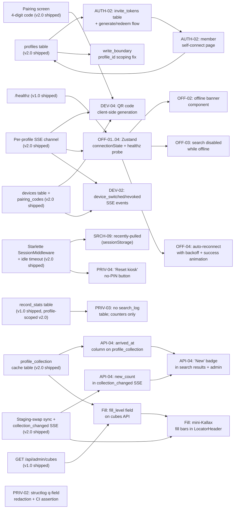

# Feature Research — GRUVAX v2.1 (Resilience + Privacy + UX Polish)

**Domain:** Subsequent milestone for a shipped home-LAN touchscreen kiosk + REST API for locating vinyl records across IKEA Kallax shelving. Adds household-member self-connect, dual-mode device pairing, collection diff, search history privacy, offline resilience, and shelf fill-overview to an already-shipped multi-profile v2.0 system.
**Researched:** 2026-05-30
**Confidence:** HIGH on privacy patterns and pairing UX (well-established categories); MEDIUM on invite-token specifics for this use-case shape (small home-LAN system, not a SaaS invite flow); HIGH on offline kiosk resilience (standard patterns).

---

## How to Read This Document

This document covers ONLY the new v2.1 features. Every existing shipped capability (search, cube highlight, boundaries, profiles, PAT sync, devices, pairing via 4-digit code, SSE, LED contract, observability) is taken as given context, not re-researched.

Features are organized by the requirement cluster they belong to. Within each cluster: table stakes, differentiators, and anti-features. Complexity uses S/M/L:

- **S (Small)** — hours to two days; one component, minimal schema change
- **M (Medium)** — two days to a week; one or two endpoints + UI surface + possibly a small schema addition
- **L (Large)** — multi-component, cross-cutting, schema + backend + frontend + tests

Dependencies on existing GRUVAX capabilities are flagged inline.

---

## Cluster 1 — AUTH-02: Per-Profile Self-Connect PAT via Invite Token

**Goal:** Let the owner send a household member a one-time link. The member opens it, pastes their own discogsography PAT, and their profile is connected without the owner ever handling the token.

### How Invite-Token "Connect Your Account" Flows Work

The canonical pattern (backed by auth libraries including SuperTokens, Logto, and standard RFC 8693 practice):

1. **Owner generates invite.** Admin calls a protected endpoint; backend mints a cryptographically random opaque token, stores only its hash (never plaintext) alongside `profile_id`, `purpose = "pat_connect"`, `expires_at`, and `used_at = NULL`. Returns the full token once, embedded in a URL.
2. **Owner shares the URL.** Via any channel (text, AirDrop, email). URL is human-copyable but not guessable.
3. **Member opens the URL.** App resolves the token (hash lookup), validates: not used, not expired, correct purpose. If invalid — shows a clear error, no silent failure.
4. **Member pastes their PAT.** Owner never sees this value. The app accepts it, validates it against discogsography (calls the collection API with the token to confirm scope), then Fernet-encrypts it into `profiles.app_token_encrypted` and marks the invite token `used_at = now()`.
5. **Owner sees the profile go green.** The profile's status in the admin panel updates to "connected"; the member has no further login to manage in GRUVAX.
6. **Revocation.** Invite tokens can be revoked (deleted) before use. PATs themselves can be rotated later — this is a separate action (profile reconnect, which can reuse the invite-token mechanism).

Key design invariants:
- Token is **single-use** — consumed the moment the PAT is submitted. Clicking the link a second time shows "this invite has already been used."
- Token has a **short expiry** — 24–72 hours is the industry norm (long enough to not be annoying; short enough that a forwarded link doesn't become a permanent backdoor). 48 hours recommended for this use case.
- Token encodes **purpose** — cannot be misused to perform a password reset or other action; the backend checks `purpose`.
- The URL contains **only the token** — no profile ID, no member name, no identifying data in the URL path (links get logged and forwarded).
- **No member account in GRUVAX** — the member is not a GRUVAX user. The invite flow is purely "deposit your PAT into this profile slot." GRUVAX stays single-admin-PIN.

### Table Stakes

| Feature | Why Expected | Complexity | Notes / Dependencies |
|---------|--------------|------------|----------------------|
| Owner generates a per-profile invite link from admin | The whole point of AUTH-02. Without it, the owner must handle the PAT themselves, which is the security problem being solved. | **S** | Depends on: `profiles` table (v2.0 shipped). New: `invite_tokens` table (profile_id, token_hash, expires_at, used_at, purpose). Admin UI: one "Generate invite link" button per profile. |
| Link is single-use and time-limited | Industry baseline for invite flows; a reusable link is a permanent credential backdoor. | **S** | Backend: check `used_at IS NULL AND expires_at > now()` on every redemption. Mark `used_at` atomically on success. |
| Member-facing "connect your collection" page | Member needs a clear, low-friction place to paste their PAT after clicking the link. | **M** | Public (no admin PIN required) route, gated only by a valid invite token. Shows: profile display name ("Connect to Robert's collection"), a text field for the PAT, and a "Connect" button. No GRUVAX account needed. |
| PAT validation against discogsography before storing | Storing a bad token causes silent sync failures. Validate before committing. | **S** | Call discogsography's `GET /api/user/collection?limit=1` with the supplied token. 401/403 → reject with clear error message. 200 → proceed to store. Depends on: the discogsography HTTP API client (v2.0 shipped). |
| Token stored Fernet-encrypted, plaintext never logged | Already the v2.0 pattern for owner-entered PATs. Member self-connect must follow the same invariant. | **S** | Same code path as the admin's "connect profile" form — just the submission surface changes. |
| Clear error states: expired, already used, invalid | If a member opens a stale or reused link, they need to know why and what to do next ("Ask the owner for a new invite link"). | **S** | Three distinct backend 4xx responses; frontend renders each with a plain-language message. |
| Admin can revoke an unused invite | Owner changes mind, or token was sent to the wrong contact. | **S** | DELETE on the token row; no cascade needed (it was never used). Admin UI: "Revoke invite" next to "Copy link" on the profile card. |
| Admin sees invite status per profile | "Pending invite" vs. "No invite" vs. "Connected" — the owner needs to know the current state at a glance. | **S** | Profile card shows one of: Connected (PAT stored), Invite pending (token exists, unused, not expired), Invite expired (token exists, expired, unused — offer to regenerate), Not connected (no token, no PAT). |

### Differentiators

| Feature | Value Proposition | Complexity | Notes |
|---------|-------------------|------------|-------|
| One-click "Regenerate invite" if expired | The owner doesn't have to revoke + generate; expiry auto-degrades to "expired" state and regenerate replaces it. | **S** | Backend: soft-delete old token, insert new one. Frontend: "Invite expired — regenerate?" prompt on the profile card. |
| Invite link copyable from admin with one tap | Kiosk admin may be on mobile; no keyboard. One-tap copy is the difference between "done" and "fiddly." | **S** | `navigator.clipboard.writeText()` with a toast confirmation. Nordic Grid design: LED yellow flash on the copy button. |
| Member confirmation page shows profile name, not profile ID | Member needs reassurance they're connecting to the right person's collection, not a UUID. | **S** | The connect page shows `profile.display_name` resolved from the token — confirms correct destination without leaking anything structural. |

### Anti-Features

| Feature | Why Tempting | Why Problematic | Alternative |
|---------|--------------|-----------------|-------------|
| Owner manually enters the member's PAT on their behalf | "Simpler" — owner already knows how to add a PAT from v2.0 admin. | Defeats the privacy goal entirely. The owner sees and handles the member's token. | Invite-token flow. |
| Email delivery of invite link from within GRUVAX | "Automate the share step." | Adds SMTP configuration, credential management, and deliverability complexity to a home-LAN app. A home LAN kiosk has no business sending email. | Owner copies the link and sends it via their existing messaging channel (iMessage, Signal, etc.). |
| Multi-use invite link with a counter | "What if I want to share with multiple people using one link?" | Invite links are per-profile — one profile = one member's PAT. Multi-use semantics don't map to this model. | Generate one invite per profile. |
| GRUVAX account creation for members | Members "logging into" GRUVAX. | Requires auth infrastructure (registration, password, session, per-member sessions) that this app deliberately does not have. | Members connect a PAT to a profile; they interact with the kiosk anonymously (no GRUVAX login). |
| OAuth2 device authorization grant | "Proper solution" — deferred to v2.2. | Requires round-trip browser auth against discogsography's OAuth stack, which must be ready for it. v2.1 ships before that. | Invite-token + PAT paste is the right-size v2.1 solution. |

---

## Cluster 2 — DEV-04: QR-Code RPi Pairing Alongside 4-Digit PIN

**Goal:** The kiosk pairing screen shows BOTH a QR code (scan on phone → opens admin bind page prefilled) AND the existing 4-digit code, so the admin can use whichever is faster.

### How QR + PIN Dual-Mode Pairing Works

The canonical pattern from kiosk and device-pairing UX (Clockify kiosk, BRM2.0, Wavetec kiosk systems):

- The QR encodes **a URL**, not raw data. The URL is the admin bind page with the pairing code pre-filled as a query parameter: `https://gruvax.local/admin/devices/pair?code=1234`. The phone's browser opens this directly — the admin taps "Confirm" without typing anything.
- The 4-digit code is the **fallback**. If the phone's camera isn't available, the admin types the code into the admin UI manually. Same code, different input path.
- Both paths **call the same pairing endpoint** (`POST /api/admin/devices/pair`) with the same 4-digit code. The QR is purely a URL shortcut, not a different auth mechanism.
- The QR **regenerates when the 4-digit code regenerates** (both have the same 5-minute TTL per the v2.0 design). They are always in sync because the QR encodes the current code.
- **No QR-specific backend** is needed. The QR is generated client-side (or edge-rendered) from the current code string.

### Table Stakes

| Feature | Why Expected | Complexity | Notes / Dependencies |
|---------|--------------|------------|----------------------|
| QR code displayed on pairing screen alongside 4-digit code | The v2.0 pairing screen shows only the 4-digit code; DEV-04 adds the QR as a second input path. | **S** | Depends on: existing pairing screen (v2.0 shipped), existing `pairing_codes` table and TTL (v2.0 shipped). New: QR generation library on the frontend. `qrcode` (npm) or `react-qr-code` — both are small (<10 KB), client-side, no server call needed. |
| QR encodes the admin bind URL with code prefilled | The QR must be actionable — scanning it should immediately open the bind page, not require the admin to do anything else. | **S** | URL format: `http://{server_host}/admin/devices/pair?code={current_4_digit_code}`. Host must be the LAN hostname the admin's phone will resolve. Injected from backend config (already exists as `GRUVAX_HOST` or similar env var). |
| QR regenerates when the 4-digit code auto-rolls | If the code TTL lapses and a new code is issued, the QR must update too. Otherwise the QR becomes stale while the numeric code is correct. | **S** | Both are derived from the same SSE event: `pairing_code_refreshed`. The SSE channel for the kiosk (v2.0 shipped) already carries this event; the QR re-renders from the updated code. No extra backend work. |
| PIN typed fallback still works unchanged | Regression risk: the QR addition must not disturb the existing 4-digit flow. | **S** | No backend change. Frontend: QR is additive to the pairing screen layout. |
| Clear visual hierarchy: QR primary, code secondary | On a 7" touchscreen, the QR and 4-digit code compete for attention. The QR is the faster path on mobile; it should be larger. | **S** | Nordic Grid design: QR takes the upper two-thirds, 4-digit code in smaller text below. "Or enter code manually:" label separates them. |

### Differentiators

| Feature | Value Proposition | Complexity | Notes |
|---------|-------------------|------------|-------|
| Admin phone auto-fills the bind form | Scanning the QR removes all typing from the admin's phone. On a small phone keyboard near a shelf, this is a meaningful friction reduction. | **S** | Falls out of the URL-encodes-code design — `?code=1234` populates the form field via URL search params on mount. |
| "Scan to pair" instructional label on kiosk | First-time users don't know QR codes can do this. A single short label ("Scan with your phone camera") removes ambiguity. | **S** | Static copy addition. Nordic Grid: Space Grotesk sentence-case, dim/secondary color. |

### Anti-Features

| Feature | Why Tempting | Why Problematic | Alternative |
|---------|--------------|-----------------|-------------|
| Deep-link / custom scheme QR (`gruvax://pair?code=...`) | "Native app feel." | GRUVAX is a web app. Custom schemes require OS-registered apps; Chromium in kiosk mode doesn't register schemes. | HTTP URL QR — opens in the admin's browser directly. |
| QR replaces the 4-digit code entirely | "Simpler UI." | A household member without a camera-capable device, or someone in a dark room, needs the typed fallback. Both must coexist. | Keep both as designed. |
| QR encodes raw data (not a URL) | "Smaller QR." | Requires a GRUVAX-specific scanner app or custom handler. An HTTPS URL is universally scannable with any phone camera. | URL-encoded QR. |
| Dynamic QR with server-issued image | "Guaranteed freshness." | Adds a round-trip; client-side generation from the current code is already fresh and requires no server involvement. | Client-side generation from the SSE-delivered current code. |

---

## Cluster 3 — API-04: Collection Diff Highlighting ("N New Records Since Last Sync")

**Goal:** Surface to the user how many (and which) records appeared in their collection since the previous sync, per profile.

### How "What's New" Surfaces Are Typically Presented

Reference patterns from Roon, Plex, Discogs apps, and library systems:

- **Count badge:** The most universal entry point — a numeric badge ("14 new") on the collection or profile card. Low-friction; never intrusive.
- **"New" tag on records in results:** When a record that arrived in the last sync appears in search results, it gets a subtle "New" badge (often a dot or a short text label). Helps the owner find what they just added.
- **"What's new" list view:** A dedicated list of records sorted by `added_to_collection_at` descending, showing the most recent sync window. Not a diff in the git sense — just records whose `added_to_collection_at` is after `profiles.last_sync_at` of the *previous* sync.
- **Per-sync modal or toast:** After a successful sync, show "Sync complete — 14 new records added." Dismissible. On the kiosk, this is the SSE-delivered `collection_changed` event.

For GRUVAX specifically: the local `profile_collection` cache already stores a snapshot of the collection. Diff = records present in the new sync that were not in the previous snapshot. The backend can compute this during the staging-swap (v2.0 ships advisory lock + `COPY` + atomic swap) and emit the count alongside the `collection_changed` SSE event.

### Table Stakes

| Feature | Why Expected | Complexity | Notes / Dependencies |
|---------|--------------|------------|----------------------|
| "N new records" count emitted with `collection_changed` SSE event | The kiosk already consumes `collection_changed` (v2.0 Phase 5). Extending it with a `new_count` field is zero-breaking-change. | **S** | Depends on: staging-swap sync (v2.0 shipped), `collection_changed` SSE (v2.0 shipped). New: during the swap, compute `COUNT(*)` of records in the staging table not in the current live table. Emit as `{type: "collection_changed", profile_id: "...", new_count: 14}`. |
| Count badge on profile card in admin | Admin sees at a glance that a sync brought new records. | **S** | Frontend: profile card in `/admin/profiles` shows a yellow badge ("14 new") when `new_count > 0`. Badge clears on next visit or manual dismiss. |
| "New" tag on records in search results | When a newly-synced record appears in a search result, indicate it is new. | **M** | Depends on: `profile_collection` cache table (v2.0 shipped). New: add `arrived_at` column to `profile_collection` (timestamp when the row was inserted during the swap). Records where `arrived_at > profiles.last_sync_at` (previous) get a "New" tag in the API response and frontend renders a badge. Alembic migration required. |
| "What's new" list on the admin diagnostics page | Owner wants to see the full list of what arrived. | **M** | New endpoint: `GET /api/admin/profiles/{id}/new-records?since={timestamp}`. Returns records from `profile_collection` where `arrived_at` is within the last sync window. Frontend: table on the diagnostics card, sorted by `arrived_at` desc. |

### Differentiators

| Feature | Value Proposition | Complexity | Notes |
|---------|-------------------|------------|-------|
| Toast/banner on kiosk after sync shows new-record count | "14 new records synced" displayed briefly on the kiosk — tangible feedback that the nightly sync did something. | **S** | The kiosk already handles `collection_changed` SSE. Extend: if `new_count > 0`, show a 4-second toast "14 new records added to your collection." Nordic Grid: yellow text on blue bar. |
| "New" badge visible on kiosk results too (not admin only) | The kiosk user who pulls a newly-arrived record gets a "New" tag — a small moment of delight. | **S** | Extend `/api/search` response: include `is_new: bool` field per result (computed from `arrived_at`). Frontend: small "NEW" label in Space Grotesk on the result row. Fades after 30 days. |

### Anti-Features

| Feature | Why Tempting | Why Problematic | Alternative |
|---------|--------------|-----------------|-------------|
| Full per-record diff view (added vs removed) | "Show me exactly what changed." | Removed records are expected (Discogs wantlist removals, sales) and relatively rare; surfacing them prominently creates anxiety rather than value. | Show only additions. If owner wants to see removals, they know what they sold. |
| Persistent per-record "seen/unseen" new state | "Mark as seen" per new record. | Requires storing read state server-side per profile. Adds a table. The natural signal is recency (`arrived_at`); after 30 days, it's no longer "new." | Time-bounded `is_new` flag (`arrived_at` within N days). Configurable threshold. |
| Push notification to admin's phone when sync completes | "Tell me immediately." | GRUVAX is a home LAN app; the sync runs at 3 AM. A push notification at 3 AM is hostile. | In-app: toast on next kiosk visit + count badge in admin. |

---

## Cluster 4 — SRCH-09: Recently-Pulled List

**Goal:** The kiosk shows the owner's recent searches / locations so they can re-find a record without re-typing.

Note: this was deferred from v1.0 and partially scoped there. The v1.0 FEATURES.md recommended session-storage, client-side-only. The v2.1 scope must decide server-side vs. client-side given the multi-profile and multi-device context that now exists.

### Table Stakes

| Feature | Why Expected | Complexity | Notes / Dependencies |
|---------|--------------|------------|----------------------|
| Last ~10 records the user located, shown on the kiosk home screen or search panel | "I was just looking for that Miles Davis album" — high-frequency repeat-locate use case. | **S** | Depends on: profile binding (v2.0 shipped). The kiosk knows its bound profile. Recently-pulled list is stored in `sessionStorage` keyed by profile ID. Cleared when the tab/browser session ends or when "Reset kiosk" is pressed (PRIV-04). Client-side only. |
| Tap a recent result to re-locate | One-tap re-find; the record goes back through the locate flow and highlights the cube. | **S** | Tap triggers the same `/api/locate` call as a normal search result. No special endpoint needed. |
| List cleared on session end / idle timeout | Privacy: the next user of the kiosk should not see who was searched before. | **S** | `sessionStorage` cleared automatically on tab close. Explicit clear: on idle-timeout logout (existing v2.0 session timeout). On "Reset kiosk" (PRIV-04 below). |

### Differentiators

| Feature | Value Proposition | Complexity | Notes |
|---------|-------------------|------------|-------|
| Recently-pulled persisted per-device across sessions (optional opt-in) | Owner at their personal kiosk might want yesterday's pulls to survive a browser restart. | **M** | If opt-in is desired: server-side `recent_pulls` table (profile_id, device_id, release_id[], updated_at). Populated by a lightweight `POST /api/recent-pulls` on each locate. Returned by the kiosk's profile bootstrap call. Adds schema + endpoint; worth it only if the owner explicitly wants cross-session persistence. Default: session-only. Depends on: `devices` table (v2.0 shipped). |
| Show cover art thumbnail next to recent result | Discogs/Roon pattern — visual recognition is faster than text scanning. | **M** | Requires cover art URL from discogsography or Discogs CDN. discogsography already stores release data; check if `cover_image` URL is available in the `profile_collection` cache. If yes: add to the recent result card. If not: text-only is fine. |

### Anti-Features

| Feature | Why Tempting | Why Problematic | Alternative |
|---------|--------------|-----------------|-------------|
| Server-side recently-pulled *by default* (always on) | "Multi-device consistency." | Creates a per-user query history on the server, which conflicts with PRIV-01..03 (no server-side query text persistence). | Client-side session storage by default. Server-side only as an explicit opt-in with clear disclosure. |
| Shared "what's being searched on the kiosk" feed visible to others | "Household awareness." | Visitor privacy — a houseguest's searches shouldn't be visible to the owner. | Never cross-profile or cross-session history. |

---

## Cluster 5 — OFF-01..04: Offline / Reconnect UX

**Goal:** When the kiosk loses the backend (LAN outage, FastAPI restart, Docker Compose recreation), it shows a clear offline state, degrades gracefully, and reconnects automatically. No manual intervention required.

### What Good Kiosk Offline UX Looks Like

From kiosk industry best practices (Wavetec, AVIXA, KIOSK Information Systems) and Porteus Kiosk privacy research:

- **Immediate detection** via SSE connection drop. The browser's EventSource API emits an error event within a few seconds of the connection closing. No need to poll.
- **Degraded mode, not dead mode.** The kiosk should remain visually alive: show what it last knew (the grid, any prior search result), but disable search input and show a clear status banner. "GRUVAX offline — reconnecting" is better than a blank screen or an unhandled error.
- **Exponential backoff reconnect**, capped at ~30s. Standard: 1s → 2s → 5s → 10s → 30s. The SSE spec's `retry` field handles this, but Chromium's EventSource respects it; a custom reconnect loop with Zustand gives more control.
- **Reconnect success UX.** When the backend comes back, the banner should fade and search should re-enable with a brief visual confirmation. Snapping silently back to normal is confusing — a momentary "Back online" confirmation reassures the user.
- **No stale-result problems.** When the backend returns, invalidate any cached search results (TanStack Query `invalidateQueries`) so the first post-reconnect search is fresh.

### Table Stakes (OFF-01..04)

| Feature | Req ID | Why Expected | Complexity | Notes / Dependencies |
|---------|--------|--------------|------------|----------------------|
| Offline detection via SSE drop + /healthz fallback | OFF-01 | SSE is the primary connection; healthz is the fallback probe when SSE is closed. Together they detect all realistic outage scenarios (service restart, network drop, Docker down). | **S** | Depends on: SSE channel (v2.0 shipped), `/healthz` endpoint (v1.0 shipped). New: Zustand store tracks `connectionState: "online" | "offline" | "reconnecting"`. On SSE error event → transition to "offline", begin healthz polling at 5s intervals. On healthz 200 → transition to "reconnecting" (SSE re-establishing), then "online" when SSE reconnects. |
| Offline banner on kiosk | OFF-02 | Industry table-stakes for kiosks in any environment. Silent failure is a product defect. | **S** | A persistent banner strips from the bottom (does not cover the cube grid — owner may need to see the last result). Nordic Grid: IKEA blue background, white text "GRUVAX offline — reconnecting…", LED yellow pulse dot. Dismissing the banner is not allowed (it re-appears while offline). |
| Search disabled while offline (graceful degradation) | OFF-03 | Submitting a search while offline produces a failed request and an error state. Better to disable cleanly. | **S** | Search input: `disabled` attribute when `connectionState !== "online"`. Placeholder text changes to "Search unavailable — reconnecting…". The last locate result (cube highlight) remains visible — the user can still look at the shelf while the system reconnects. |
| Auto-reconnect with exponential backoff; success animation | OFF-04 | An unattended kiosk must not require a human to press F5. Reconnect is fully automatic. | **S** | Reconnect loop in Zustand + useEffect: healthz probe at 5s → 10s → 30s → 30s (cap). On success: SSE re-opens, banner fades out over 500ms ("Back online" briefly, then gone). TanStack Query invalidateQueries on reconnect so next search is fresh. |

### Differentiators

| Feature | Value Proposition | Complexity | Notes |
|---------|-------------------|------------|-------|
| Last-known cube highlight persists during offline | If the owner found a record, then the backend went down, the cube highlight stays visible so they can still walk to the shelf. | **S** | Already the case if state is in Zustand — the highlight is local UI state, not re-fetched during offline. Verify: on SSE drop, do not clear the locate result. Explicit decision, not a free side effect. |
| Offline banner shows elapsed time ("Offline for 2m 15s") | Operator context — if they're debugging, knowing how long it's been offline matters. | **S** | A small elapsed counter in the banner. Start the timer when offline state is entered. Nordic Grid: DM Mono font for the elapsed counter (numerical display). |
| Backend restart detection (distinguishes "service restarted" from "long outage") | A Docker Compose restart takes 5–15 seconds; treating it identically to a 30-minute outage causes a full backoff cycle. | **S** | On first successful healthz 200 after offline, check if the SSE connection re-establishes within 3s. If yes: short reconnect — no full backoff reset needed. If not: continue backoff. |

### Anti-Features

| Feature | Why Tempting | Why Problematic | Alternative |
|---------|--------------|-----------------|-------------|
| Full offline-first PWA (all 3K records cached in browser) | "Works without the server." | Boundary data is the product's truth. Stale boundaries = wrong cube highlighted. Serving stale locate results is worse than serving no results. | Degraded mode: show last result, disable new searches. |
| Service worker cache for search results | Flagged as a v1.x RECONSIDER in the v1.0 FEATURES.md. | Same stale-boundary problem. Cache a result from an hour ago, serve it offline, but the owner moved 200 records in a reshuffle — the cache actively misleads. | No search result caching. The offline banner and last-result persistence is the right size. |
| Manual "try again" button | "Give the user control." | An unattended kiosk cannot be expected to be button-pressed. And the automatic reconnect already retries — a manual button creates UI clutter alongside the automatic retry. | Auto-reconnect only. |
| WebSocket instead of SSE for offline detection | "More reliable." | SSE drop-detection is equivalent for this use case. WebSocket would require backend changes; SSE is already v2.0 infrastructure. | Keep SSE as designed. |

---

## Cluster 6 — PRIV-01..04: Privacy

**Goal:** GRUVAX should not accumulate personal data about who searched what. Queries are session-local. Aggregate stats are the only server-side persistence about usage. Anyone can reset the kiosk without needing the admin PIN.

### Why This Matters for a Home-LAN Kiosk

Even in a household, a visitor (friend, family member) searching a kiosk has a reasonable expectation that their queries don't persist for the owner to review later. Porteus Kiosk (the reference kiosk OS) treats this as a non-negotiable default: history is never kept, caches are cleared on restart, RAM-only for temp data.

The v1.0 FEATURES.md already recognized this (Category 9: "aggregate-only stats, per-session history"). PRIV-01..04 formalize it.

### Table Stakes (PRIV-01..04)

| Feature | Req ID | Why Expected | Complexity | Notes / Dependencies |
|---------|--------|--------------|------------|----------------------|
| Search history is session-only; cleared on session end | PRIV-01 | A houseguest's searches should not outlive their visit. Industry standard for shared-device kiosks. | **S** | All search history (recently-pulled list, SRCH-09) lives in `sessionStorage`. Cleared automatically when the browser tab/session ends or idle-timeout fires. Existing v2.0 idle-timeout mechanism handles the timeout case. |
| No server-side persistence of query text | PRIV-02 | Query text (what the user typed) must never be stored in Postgres, structlog output, or any persistent log. | **S** | Backend: structlog request logging must not log the `q` parameter from `/api/search`. Add a `log_sanitizer` that redacts `q` from request body/params before logging. CI: add a test that asserts the `q` field does not appear in structured log output for a search request. Verify: Postgres slow-query log does not capture the full query text (use `log_min_duration_statement = -1` or at minimum confirm query params aren't logged at statement level). |
| Aggregate-only record stats (no per-query logging) | PRIV-03 | Record-level search counts ("this record was found 12 times") are safe aggregate data — they don't reveal who searched. Full query-log rows (timestamp + query text + session ID) are surveillance data. | **S** | The `record_stats` table (v1.0 shipped, profile-scoped in v2.0) increments a counter per `release_id` on each locate call. This is the only server-side persistence of usage. No `search_log` table. |
| "Reset kiosk" button — clear session without admin PIN | PRIV-04 | A visitor who wants to clear their session should be able to do so without asking the owner to enter the admin PIN. | **S** | A visible, always-accessible button on the kiosk UI ("Reset / Clear session" or a simple X/return-to-home icon). Pressing it: clears `sessionStorage` (recently-pulled, any pending search state), returns to the home/idle screen, does not log out the profile binding (the kiosk remains bound to its profile — this is a session clear, not an unbind). Nordic Grid: prominent but not alarming; secondary button style. Requires NO auth — this is intentional. |

### Differentiators

| Feature | Value Proposition | Complexity | Notes |
|---------|-------------------|------------|-------|
| Idle-timeout reset also clears session state | The idle-timeout (existing v2.0 feature) currently logs out admin. Extending it to also clear `sessionStorage` means every session is self-cleaning without a user action. | **S** | On idle-timeout event: clear `sessionStorage`, return to home state. Two-line code addition to the existing timeout handler. |
| Structlog `q` field redaction is enforced in CI | Privacy guarantees that aren't tested drift over time. A CI assertion that no `q` appears in log output is a regression guard. | **S** | pytest: capture log output of a test search call, assert the query string is not present. Small but high-value for long-term trust. |
| Admin can see *which records* were most-located (not who located them) | Useful collection insight — "Blue Note is the most-used label" — without any per-user surveillance. | **S** | `GET /api/admin/stats/top-records` returns `record_stats` rows sorted by count desc. This already exists from v1.0; PRIV-03 just confirms the boundary: only this, nothing richer. |

### Anti-Features

| Feature | Why Tempting | Why Problematic | Alternative |
|---------|--------------|-----------------|-------------|
| Full search log (timestamp + query + session ID) | "Analytics for the owner." | Creates a record of who searched what and when, which is surveillance even in a home. The owner does not need this and visitors do not consent to it. | Aggregate per-record counts only. |
| Persistent per-session identity (cookie tied to a person) | "Remember this visitor." | Visitors are anonymous by design. A persistent cookie creates a cross-session profile even if the owner never reads it. | Session cookie only (already the case with `SessionMiddleware`). |
| "Clear searches" requiring admin PIN | "Security." | This defeats the purpose of PRIV-04 — a visitor can't ask the owner to come clear their session (awkward). The reset clears only the client-side session; it's harmless without PIN. | No-PIN kiosk reset. |
| Logging search latency WITH the query string | "Correlate slow queries to the search term." | Log slow queries with a hash of the query or without the query text entirely. Latency data doesn't need the text. | Log `q_hash = sha256(q)[:8]` for correlation; never log raw `q`. |

---

## Cluster 7 — Shelf-Overview Mini-Kallax Fill (ex-999.1)

**Goal:** The `LocatorHeader` component's mini 4×4 shows per-cube `is_empty`/`fill_level` from `GET /api/admin/cubes`, giving the owner a quick occupancy overview.

This was in the backlog as 999.1 and is promoted to v2.1. It is primarily a UX polish addition.

### Table Stakes

| Feature | Why Expected | Complexity | Notes / Dependencies |
|---------|--------------|------------|----------------------|
| `fill_level` field on `GET /api/admin/cubes` response | The API must return enough data for the frontend to render occupancy. Currently `GET /api/admin/cubes` returns boundary data. Adding `fill_level` (0.0–1.0 computed from `profile_collection` count within the cube's label/catalog range) and `is_empty` (bool) is additive and non-breaking. | **S** | Depends on: cube boundary + `profile_collection` cache (v2.0 shipped). New: backend computes `fill_level` by querying how many `profile_collection` rows fall within each cube's boundary range. Relatively simple range count query; already analogous to the positioning algorithm. |
| Mini-Kallax grid in `LocatorHeader` renders cube fill state | A dim fill bar (Nordic Grid token: filled = lit-yellow, partial = dim blue, empty = muted) inside each mini cube gives at-a-glance occupancy. | **S** | Frontend: `LocatorHeader` (v1.0 shipped as part of the kiosk layout). Each mini-cube cell renders a fill bar using the `fill_level` float. Uses existing cell-state tokens (dim / lit / empty from the design spec). |
| Fill state updates after sync | After a nightly sync, fill levels may change if new records arrived. The kiosk already invalidates on `collection_changed` SSE — fill data should be re-fetched as part of the same invalidation. | **S** | TanStack Query: the `GET /api/admin/cubes` query key is invalidated by the same `collection_changed` handler that invalidates search. No extra SSE events needed. |

### Differentiators

| Feature | Value Proposition | Complexity | Notes |
|---------|-------------------|------------|-------|
| Fill bar animates on page load (LED physics easing) | The Nordic Grid design spec calls for lit-state spring-on. A 200ms spring animation on the fill bars on mount is on-spec and adds polish. | **S** | GSAP `from({scaleX: 0})` on each fill bar, staggered by 20ms per cube. Total animation budget ~650ms. |
| Cube fill shown in the admin boundary editor too | When editing boundaries, knowing the current fill of adjacent cubes helps the owner decide where to move cut points. | **S** | Reuse the same `fill_level` data from `GET /api/admin/cubes`; render a small fill indicator next to each cube row in the boundary editor. |

### Anti-Features

| Feature | Why Tempting | Why Problematic | Alternative |
|---------|--------------|-----------------|-------------|
| Per-record list inside the mini-cube | "Show me what's in cube 7 from the header." | The header is a navigation overview, not a detail view. Per-record detail belongs in the main search results or a dedicated cube-tap drawer. | Mini-cube shows fill level only; tap → navigate to the search/locate view for that cube. |
| Real-time fill update on every search | "Watch the fill update as I browse." | Fill level changes only when records are added/removed (sync events). Real-time per-search update is wasted computation. | Update on `collection_changed` SSE, not on every search. |

---

## Cluster 8 — v2.0 Tech Debt Closure (DEV-02 + write_boundary scoping)

**Goal:** Close two carried-forward items from the v2.0 audit: (1) SSE immediacy for kiosk device switch/revoke events; (2) `profile_id` in the `write_boundary` WHERE clause before multi-profile boundary editing ships.

### Table Stakes

| Feature | Why Expected | Complexity | Notes / Dependencies |
|---------|--------------|------------|----------------------|
| DEV-02: Kiosk receives SSE event when its device record is switched or revoked, and responds immediately | Currently the kiosk learns about device profile changes only on next page load. An admin who reassigns or revokes a device expects the kiosk to react within seconds. | **M** | Backend: add `device_switched` and `device_revoked` SSE event types to the per-device SSE channel. Emit on `PUT /api/admin/devices/{id}/profile` and `DELETE /api/admin/devices/{id}`. Kiosk frontend: handle `device_switched` → reload the profile binding and refresh; handle `device_revoked` → show "This device has been unlinked" state. |
| write_boundary profile scoping: `WHERE profile_id = ?` on all boundary write paths | An admin editing a boundary for profile A must not be able to write into profile B's boundary rows. The missing WHERE clause is a latent multi-profile safety gap. | **S** | Backend: audit all `UPDATE`/`INSERT`/`DELETE` on `cube_boundaries` and `segments` to confirm `profile_id = :current_profile_id` is in every WHERE. Fix any missing. Add an integration test that asserts a boundary write for profile A returns 403 (or silently no-ops) if the session is profile B. |

---

## Feature Dependencies (v2.1 New Features)

### Dependency Notes

- **AUTH-02 is self-contained.** It needs `profiles` (shipped) and a new `invite_tokens` table. No other v2.1 feature depends on it. Can be phased independently.
- **DEV-04 is almost free** — the QR is purely a frontend addition derived from the existing pairing code. The only gotcha is ensuring `GRUVAX_HOST` is injectable into the URL at runtime (not hardcoded).
- **API-04's `arrived_at` column is a dependency for the "New" badge.** The column is simple (add to `profile_collection` via Alembic migration), but it must land before the badge feature. The `new_count` SSE extension and the `arrived_at` column are the two API-04 backend pieces.
- **OFF-01..04 are tightly coupled to each other** and should ship as a unit. Shipping the offline banner without the reconnect backoff leaves the kiosk stuck in "offline" if the backend comes back quickly.
- **PRIV-01 (session-only history) and PRIV-04 (kiosk reset) are coupled** to SRCH-09 (recently-pulled). If recently-pulled ships, the reset button must clear it. These should be in the same phase.
- **PRIV-02 (log sanitization) and PRIV-03 (no search_log)** are backend-only and can ship in any phase before the v2.1 milestone closes.
- **Fill-level** depends on `profile_collection` (v2.0 shipped) and is independent of all other v2.1 features.
- **DEV-02 tech debt** touches the SSE channel and device management; it should land alongside or before any further device UX work.

---

## MVP Definition for v2.1

### Must Ship (completes the milestone)

- [ ] **AUTH-02 invite-token flow** — owner generates link, member pastes PAT, profile connects. Without this, household member onboarding requires the owner to handle the token. Core goal of the milestone.
- [ ] **DEV-04 QR + PIN on pairing screen** — removes the "type on a phone near a shelf" friction from device pairing. Small, high-value.
- [ ] **API-04 new-record count badge** — "N new records" after sync closes a feedback gap that currently leaves the owner wondering if sync did anything. The `arrived_at` column and the `new_count` SSE extension are the backend; the badge is the frontend.
- [ ] **SRCH-09 recently-pulled + PRIV-04 kiosk reset** — these ship together (the reset clears the recently-pulled list).
- [ ] **OFF-01..04 offline / reconnect UX** — all four requirements are one coherent feature. The kiosk is permanently deployed; offline resilience is operational table-stakes.
- [ ] **PRIV-01..03 privacy** — log sanitization and the no-search-log invariant should ship before the milestone closes. They are backend-only, low-complexity, and high-trust-value.
- [ ] **Fill-level in mini-Kallax** — small polish feature, ships alongside the cubes API extension.
- [ ] **DEV-02 + write_boundary scoping** — tech debt closure; must ship before v2.1 milestone is marked done.

### Defer to v2.2 or Backlog

- [ ] **Recently-pulled with server-side persistence (opt-in)** — only if the owner explicitly requests cross-session persistence after v2.1 ships.
- [ ] **"What's new" list view on admin diagnostics** — the count badge is enough for v2.1; the full list view can follow.
- [ ] **OAuth2 device authorization grant (AUTH-01)** — explicitly deferred to v2.2 per PROJECT.md.

---

## Feature Prioritization Matrix (v2.1 New Features)

| Feature | User Value | Implementation Cost | Priority |
|---------|------------|---------------------|----------|
| AUTH-02 invite-token flow | HIGH | MEDIUM | **P1** |
| DEV-04 QR code on pairing screen | MEDIUM | LOW | **P1** |
| OFF-01..04 offline/reconnect UX | HIGH | LOW–MEDIUM | **P1** |
| PRIV-04 no-PIN kiosk reset | HIGH | LOW | **P1** |
| PRIV-01..03 log sanitization + no search_log | HIGH (trust) | LOW | **P1** |
| API-04 new-record count + arrived_at column | MEDIUM | LOW–MEDIUM | **P1** |
| SRCH-09 recently-pulled list | MEDIUM | LOW | **P1** |
| DEV-02 SSE device switch/revoke | MEDIUM | MEDIUM | **P1** (tech debt) |
| write_boundary profile_id scoping fix | HIGH (safety) | LOW | **P1** (tech debt) |
| Fill-level mini-Kallax | LOW–MEDIUM | LOW | **P2** |
| "What's new" full list on diagnostics | LOW | MEDIUM | **P2** |
| "New" badge on kiosk search results | LOW | LOW | **P2** |
| Invite regenerate one-click | MEDIUM | LOW | **P2** |
| Recently-pulled server-side opt-in | LOW | MEDIUM | **P3** |
| AUTH-01 OAuth2 device grant | HIGH (future) | LARGE | **Deferred** |

---

## Sources

### Invite token / auth flow patterns
- [SuperTokens — How to Create an Invite-Only Auth Flow](https://supertokens.com/blog/how-to-create-an-invite-only-auth-flow) — single-use token mechanics, admin-triggers-invite pattern — MEDIUM confidence (SaaS context, adapted for home-LAN shape)
- [Logto — Invite Organization Members](https://docs.logto.io/end-user-flows/organization-experience/invite-organization-members) — invite link + one-time token pattern — MEDIUM
- [Duende — Token Expiration & Refresh Best Practices](https://duendesoftware.com/learn/best-practices-managing-token-expiration-refresh-revocation-in-web-apis) — expiry and revocation invariants — HIGH
- [Curity — OAuth Token Revocation](https://curity.io/resources/learn/oauth-revoke/) — store only hash, revocation via DB state — HIGH
- [AppMaster — Transactional Email Token Flows](https://appmaster.io/blog/transactional-email-flows-tokens-expiration-deliverability) — single-use, purpose-scoped, opaque token pattern — MEDIUM

### QR + PIN device pairing
- [QR Tiger — Device Pairing with QR Codes](https://www.qrcode-tiger.com/device-pairing-with-qr-codes) — QR encodes URL, PIN as fallback — MEDIUM
- [BRM2.0 — Pairing Devices with Kiosk Security Enabled](https://brm2.bikerentalmanager.com/support/solutions/articles/42000076178-pairing-devices-with-kiosk-security-enabled) — combined QR + PIN pattern in practice — MEDIUM
- [Clockify Help — Kiosk Clock-in Authentication](https://clockify.me/help/track-time-and-expenses/pin) — QR and PIN as parallel paths to the same endpoint — HIGH

### Offline kiosk UX
- [Wavetec — Best Practices for Kiosk Installations in Low-Connectivity Zones](https://www.wavetec.com/blog/best-practices-of-kiosk-installations-in-low-connectivity-zones/) — degraded mode, auto-sync, operator alerts — MEDIUM
- [AVIXA Xchange — Kiosk UX/UI Design Checklist](https://xchange.avixa.org/posts/kiosk-ux-ui-design-checklist) — offline feedback, visual alive-ness — MEDIUM
- [KIOSK Information Systems — Kiosk UI Design](https://kiosk.com/kiosk-ui/) — reconnect UX principles — MEDIUM
- [Porteus Kiosk](https://porteus-kiosk.org/) — session-only, RAM-only, never-persist-history kiosk pattern — HIGH (reference kiosk OS)

### Privacy patterns
- [Auth0 — Secure Browser Storage](https://auth0.com/blog/secure-browser-storage-the-facts/) — sessionStorage scope and clearance — HIGH
- [KioskGroup — Memory & Privacy](https://support.kioskgroup.com/article/752-memory-privacy) — session clearing on idle/reload — HIGH
- [KioskGroup — Clear Cookies & Session Storage on Content Refresh](https://support.kioskgroup.com/article/997-clear-cookies-session-storage-on-content-refresh) — kiosk session hygiene — HIGH
- [Wavetec — Security and Privacy Considerations in Self-Service Kiosks](https://www.wavetec.com/blog/security-and-privacy-considerations-in-self-service-kiosks/) — auto-logout, session clear, no persistent PII — HIGH

### Collection diff / "what's new"
- No direct prior art found for music library "N new records since sync" as a standalone UX pattern. Inference from: Roon "Recently Added" (well-known pattern), Plex "Recently Added" library section, Discogs app "recent additions" in collection view. Confidence: MEDIUM (analogous domain; implementation pattern is clear even without a canonical reference).

### Existing v2.1 context
- [GRUVAX PROJECT.md](/.planning/PROJECT.md) — v2.1 milestone scope, tech debt items, deferred features — HIGH
- [GRUVAX v1.0 FEATURES.md](/.planning/research/FEATURES.md) — prior research, category 6 (offline), category 9 (privacy), SRCH-09 deferred — HIGH (this document)

---

*Feature research for: GRUVAX v2.1 — Resilience + Privacy + UX Polish (subsequent milestone)*
*Researched: 2026-05-30*
