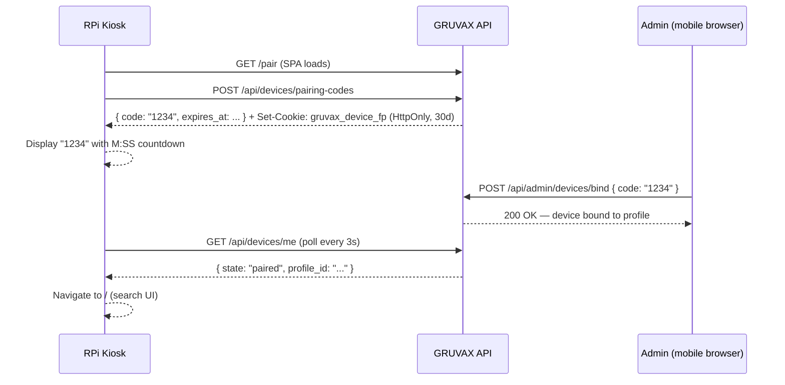

# GRUVAX Kiosk — Provisioning Guide

This directory contains the provisioning artifacts for the GRUVAX kiosk running
on Raspberry Pi OS Trixie with Wayland/labwc and Chromium.

## Files

| File | Purpose |
|------|---------|
| `start-kiosk.sh` | Chromium kiosk launcher — full Wayland flag set + persistent user-data-dir |
| `gruvax-kiosk.service` | systemd `--user` unit — supervises Chromium with `Restart=always` |

---

## Install Steps

### 1. Copy the launcher script

```bash
mkdir -p ~/.config/gruvax
cp start-kiosk.sh ~/.config/gruvax/start-kiosk.sh
chmod +x ~/.config/gruvax/start-kiosk.sh
```

### 2. Install the systemd unit

```bash
mkdir -p ~/.config/systemd/user
cp gruvax-kiosk.service ~/.config/systemd/user/gruvax-kiosk.service
systemctl --user daemon-reload
systemctl --user enable gruvax-kiosk.service
systemctl --user start gruvax-kiosk.service
```

### 3. Verify the service is running

```bash
systemctl --user status gruvax-kiosk.service
journalctl --user -u gruvax-kiosk.service -f
```

Chromium will launch at `http://gruvax.lan/pair` in kiosk mode. The kiosk
restarts automatically if Chromium crashes (`Restart=always`, `RestartSec=3`).

---

## Configuration

The launcher reads two environment variables (both optional):

| Variable | Default | Purpose |
|----------|---------|---------|
| `GRUVAX_URL` | `http://gruvax.lan/pair` | URL Chromium opens at launch |
| `USER_DATA_DIR` | `~/.local/share/gruvax-kiosk` | Chromium profile directory |

Override them in the systemd unit or in the shell environment if needed:

```ini
# In ~/.config/systemd/user/gruvax-kiosk.service [Service] section:
Environment=GRUVAX_URL=http://192.168.1.100:8000/pair
Environment=USER_DATA_DIR=/home/pi/.local/share/gruvax-kiosk
```

---

## Persistent Storage Requirement

> **Critical — read before deploying.**

The fingerprint cookie that identifies this kiosk has `max_age = 30 days`. This means
Chromium writes it to disk. However, **Chromium only persists cookies if the
`--user-data-dir` is on a persistent filesystem**.

If `--user-data-dir` points to `/tmp` or any `tmpfs` mount, the cookie is written to
RAM and lost on every reboot — the kiosk re-enters the pairing flow every time.

The default path `~/.local/share/gruvax-kiosk` is inside the Pi user's home directory
on the SD card, which is persistent. **Do not change it to a tmpfs location.**

To confirm your SD card is mounted at `/home/pi`:

```bash
df -h /home/pi
# Should show /dev/mmcblk0p2 or similar — NOT tmpfs
```

---

## How Pairing Works



After pairing, the fingerprint cookie persists across reboots because it is stored in
the SD-card user-data-dir with an explicit `max_age`. The kiosk loads the bound-profile
search UI directly on next boot without re-pairing.

---

## Manual Reboot Smoke Test

This test verifies the full DEV-01 reboot-persistence contract on real hardware.
Run it after initial provisioning and after any OS update.

**Estimated duration: under 30 seconds end-to-end.**

### Steps

1. **Pair the kiosk** — follow the pairing flow: the kiosk shows a 4-digit code;
   open the admin UI on your mobile browser, navigate to Admin → Devices, tap
   "ADD DEVICE", enter the 4-digit code. The kiosk auto-navigates to the search UI.

2. **Confirm the session** — on the kiosk, run a test search to confirm it returns
   results for the bound profile.

3. **Reboot** — from the Pi terminal:
   ```bash
   sudo reboot
   ```

4. **Stopwatch** — start timing. The Pi should:
   - POST to boot
   - labwc session start
   - systemd unit launch Chromium
   - Chromium open `http://gruvax.lan/pair`
   - Fingerprint cookie is read from disk → `GET /api/devices/me` returns `state=paired`
   - Chromium redirects to `/` (search UI) — **without re-pairing**

5. **Pass criterion** — the search UI loads with the bound profile, no pairing screen
   shown, within **30 seconds** of the Pi appearing back on the network. If the pairing
   screen appears instead, the fingerprint cookie was not persisted (check that
   `USER_DATA_DIR` is not on tmpfs — see "Persistent Storage Requirement" above).

### Troubleshooting

| Symptom | Likely Cause | Fix |
|---------|-------------|-----|
| Pairing screen after reboot | `USER_DATA_DIR` on tmpfs | Change path to SD card location |
| "Restore tabs?" dialog | `exit_type` not patched | Re-run `start-kiosk.sh` manually once |
| Chromium not starting | Service not enabled | `systemctl --user enable gruvax-kiosk.service` |
| Black screen after boot | Wayland session not ready | Check `After=graphical-session.target` in unit |
| Cookie lost after 30 days | Expected — max_age expired | Re-pair; contact admin to bind again |

---

## Chromium Flags Reference

| Flag | Purpose |
|------|---------|
| `--kiosk` | Full-screen, no address bar, no chrome |
| `--noerrdialogs` | Suppress crash dialogs (paired with exit_type patch) |
| `--disable-infobars` | No "Chromium is being controlled by automation" bar |
| `--no-first-run` | Skip first-run wizard |
| `--password-store=basic` | Avoids keyring unlock dialog on boot under labwc |
| `--ozone-platform=wayland` | Force Wayland rendering (default on Pi 5 Trixie) |
| `--user-data-dir=...` | Persistent profile dir — cookie storage |
| `--app=...` | Open as a frameless app window at the given URL |
