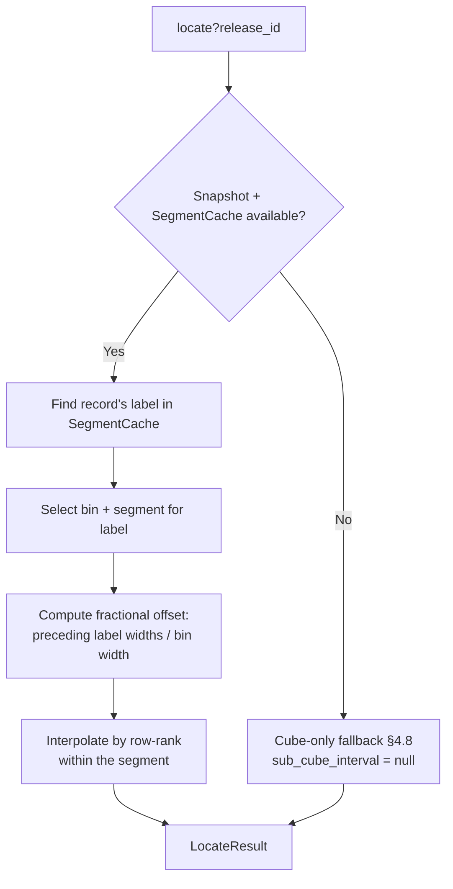
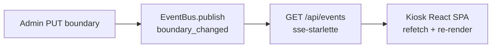
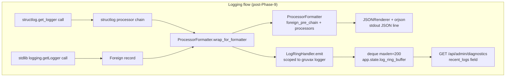
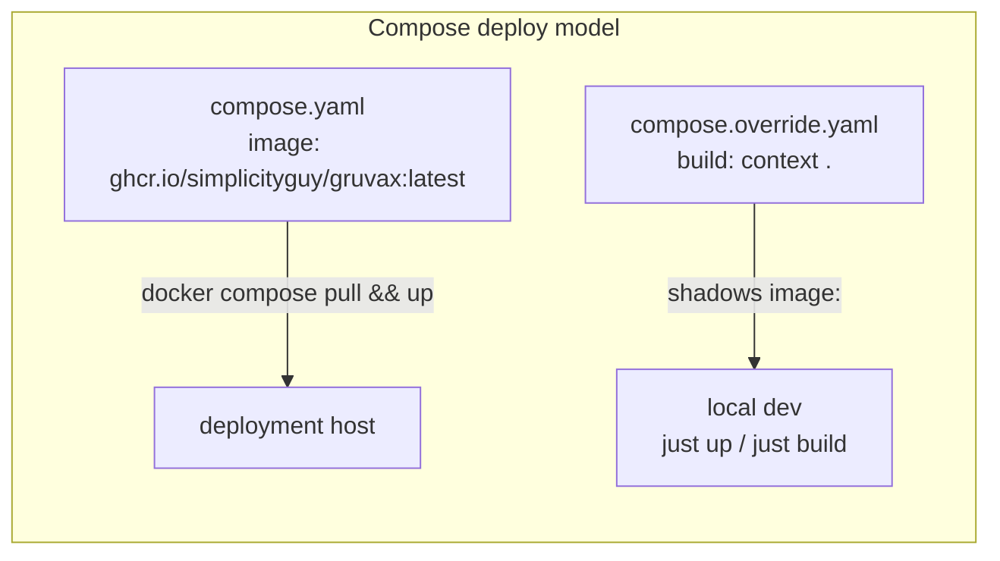
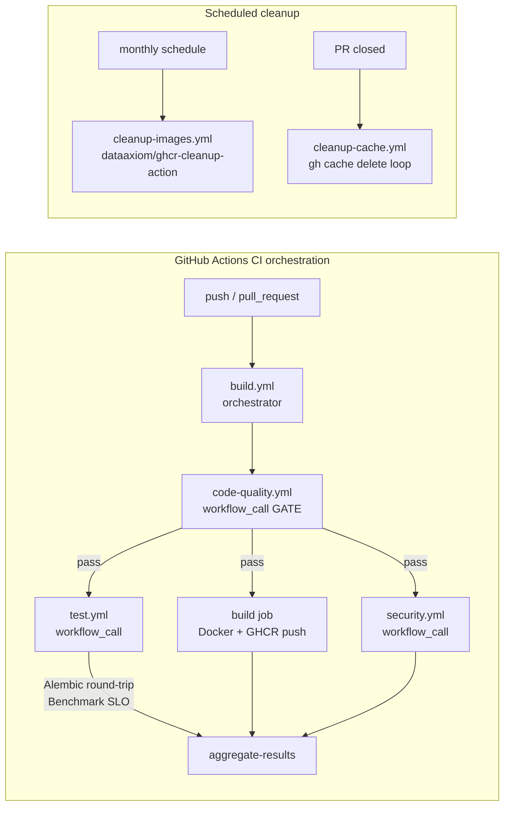
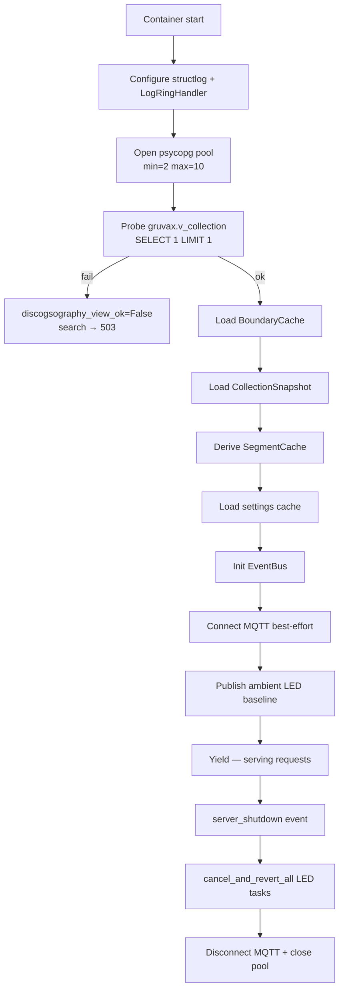

# GRUVAX Architecture

Canonical Phase 1–8 design reference. This document describes the system as built and
deployed; it is verified against the live codebase (`src/gruvax/`, `migrations/`). The
planning trail lives in [`.planning/`](../.planning/).

---

## 1. Data Model

### Schemas

| Schema | Owner | Purpose |
|--------|-------|---------|
| `gruvax` | GRUVAX | Owned schema — boundary data, sessions, settings, counters |
| `gruvax_dev` / `discogsography` | discogsography | Upstream collection data (read-only) |

### Tables in `gruvax`

| Table | Purpose |
|-------|---------|
| `units` | Physical Kallax unit registry (id, label, position) |
| `cube_boundaries` | Per-cube cut-point row: `unit_id`, `row`, `col`, `first_label`, `first_catalog`, `is_empty` (Phase 5 migration 0005 dropped `last_*` columns — now derived) |
| `segment_overrides` | Optional admin-configured physical-width fractions per label-segment per bin (Phase 5) |
| `boundary_history` | Append-only audit log of every boundary mutation; `change_set_id` groups batch operations; one-tap undo works per change-set |
| `admin_sessions` | PIN-gated session tokens (Starlette `SessionMiddleware`; expires by `expires_at`) |
| `settings` | Key/value LED and system settings (colors, brightness, TTL, nominal capacity, idle threshold) |
| `idempotency_keys` | Short-lived keys for wizard bulk-commit idempotency |
| `record_stats` | Durable per-`release_id` search and selection counters (no query text stored) |

### View Contract

```sql
-- gruvax.v_collection (migration 0002)
-- Read-only contract over discogsography's collection tables.
-- ONLY contact surface with upstream data (DEP-02).
CREATE VIEW gruvax.v_collection AS
  SELECT release_id, artist, title, label, catalog_number, synced_at
  FROM <discogsography_schema>.releases
  JOIN <discogsography_schema>.collection_items USING (release_id);
```

`gruvax.v_collection(release_id, artist, title, label, catalog_number, synced_at)` is the
single seam between GRUVAX and discogsography. GRUVAX holds a read-only grant; any upstream
schema change that breaks this view is surfaced at startup via the v_collection probe (see
Deploy below) and degrades search to a 503 rather than crashing.

---

## 2. API Surface

All routes are under the `/api` prefix. The `StaticFiles` SPA mount is registered last so
it does not intercept API paths (Pitfall 3 — router registration order).

### Public endpoints

| Method | Path | Purpose |
|--------|------|---------|
| `GET` | `/api/search` | Full-text + trigram + catalog-number-boosted search (`?q=&limit=`) |
| `GET` | `/api/locate` | Position estimate for a release (`?release_id=`) → `LocateResult` |
| `GET` | `/api/units` | Unit + cube grid configuration |
| `GET` | `/api/cubes` | All cubes with boundary data |
| `GET` | `/api/cubes/{unit_id}/{row}/{col}` | Single cube boundary |
| `POST` | `/api/illuminate` | LED fan-out via MQTT (`IlluminateRequest` payload) |
| `GET` | `/api/events` | SSE stream — kiosk subscribes here for realtime updates |
| `GET` | `/api/health` | Per-subsystem reachability + sync staleness |
| `GET` | `/api/version` | Git SHA + build timestamp |

### Admin endpoints (PIN-gated — `POST /api/admin/login` required)

| Method | Path | Purpose |
|--------|------|---------|
| `POST` | `/api/admin/login` | Exchange PIN for signed session cookie |
| `POST` | `/api/admin/logout` | Invalidate session |
| `GET` | `/api/admin/session` | Check session validity |
| `GET` | `/api/admin/cubes` | List all cubes (admin view) |
| `GET` | `/api/admin/cubes/{u}/{r}/{c}/boundary` | Get single cube boundary |
| `PUT` | `/api/admin/cubes/{u}/{r}/{c}/boundary` | Update single cube boundary |
| `POST` | `/api/admin/cubes/validate` | Validate a proposed boundary set |
| `POST` | `/api/admin/cubes/suggest` | Suggest label/catalog autocomplete |
| `POST` | `/api/admin/cubes/bulk` | Wizard bulk-commit (idempotent via key) |
| `GET` | `/api/admin/cubes/{u}/{r}/{c}/segments` | Segment view for a cube |
| `PUT` | `/api/admin/cubes/{u}/{r}/{c}/cut` | Set/update a cut point |
| `POST` | `/api/admin/cubes/{u}/{r}/{c}/overrides` | Set label-segment width overrides |
| `POST` | `/api/admin/cubes/insert-cut` | Insert a new cut point within a cube |
| `GET` | `/api/admin/history` | Boundary change log |
| `POST` | `/api/admin/history/{change_set_id}/revert` | Undo a change set |
| `GET` | `/api/admin/settings` | Get LED + system settings |
| `PUT` | `/api/admin/settings` | Update settings |
| `POST` | `/api/admin/settings/pin` | Change admin PIN (hashed with Argon2id) |
| `POST` | `/api/admin/editing` | Broadcast `admin_editing` SSE event |
| `GET` | `/api/admin/labels` | List unique labels (for autocomplete) |
| `GET` | `/api/admin/labels/{label}/catalogs` | List catalog numbers for a label |
| `GET` | `/api/admin/export/boundaries.yaml` | Download current boundaries as YAML |
| `GET` | `/api/admin/export/settings.yaml` | Download current settings as YAML |
| `POST` | `/api/admin/import/boundaries` | Import boundaries from YAML (`?dry_run=true` for preview) |
| `POST` | `/api/admin/import/settings` | Import settings from YAML |
| `POST` | `/api/admin/leds/off` | Send all-LEDs-off to MQTT (clears retained messages) |
| `POST` | `/api/admin/leds/diagnostic` | Send diagnostic pattern over MQTT |
| `GET` | `/api/admin/diagnostics` | In-memory log ring + slow-query ring + pool stats |
| `POST` | `/api/admin/diagnostics/reset-stats` | Reset `record_stats` counters |

---

## 3. Position Estimation

Record location is **computed**, not stored per record. The deterministic shelf ordering
(alphabetical by label, then catalog number within label) means the boundary table alone
is enough to locate any record.

### Two-level segment-aware interpolation (Phase 5)



**Estimation steps:**

1. Look up the record's `(label, catalog_number)` in the `CollectionSnapshot` (loaded at startup from `gruvax.v_collection`).
2. The `SegmentCache` (derived from `BoundaryCache` + `CollectionSnapshot` + `segment_overrides`) maps each label to a bin and a contiguous segment within that bin.
3. The fractional position is computed from the label's rank within the segment, weighted by optional `segment_overrides` physical widths.
4. Interpolation within the label uses the record's rank among same-label records by catalog sort key (Strategy C token-stream parser — zero external dependency, fully deterministic).

**Fallback:** If `CollectionSnapshot` is empty or the label has no segment data, the estimator falls back to the §4.8 cube-only result: `primary_cube` is set, `sub_cube_interval` is `null`, confidence is 0.30.

### LocateResult contract

```python
LocateResult(
    primary_cube,       # (unit_id, row, col)
    label_span,         # list of (unit_id, row, col) — cubes the label occupies
    sub_cube_interval,  # {start, end, crosses_boundary, next_cube} | null
    confidence,         # float 0.0–1.0
    generated_at,       # UTC timestamp
    estimator_version,  # "index-v1" | "cube-only-v1"
)
```

---

## 4. LED Contract

The LED illumination path is a publish-only MQTT fan-out from the GRUVAX API. The hardware
side (ESP32 firmware + WS2812B strips) is a later milestone; the contract is locked in v1.

### Topic structure

```
gruvax/v1/leds/illuminate/{unit}/{row}/{col}   — highlight a single cube
gruvax/v1/leds/span/{unit}/{row}/{col}         — secondary label-span highlight
gruvax/v1/leds/sub/{unit}/{row}/{col}          — sub-cube position bar
gruvax/v1/leds/all-off                         — clear all LEDs (retained, empty payload)
gruvax/v1/leds/diagnostic                      — diagnostic scan pattern
```

All payloads are Pydantic-validated JSON. The broker is `eclipse-mosquitto` on an internal
Compose network only (port 1883 is not exposed to the LAN in v1).

### MQTT protocol settings

- MQTT 5 with `message_expiry_interval` on all illuminate/span/sub messages (TTL controls how long a stale highlight persists if the subscriber is offline and reconnects).
- Retained `all-off` uses an empty payload (`b""`) to clear Mosquitto's retained store (MQTT protocol; `retain=True` + empty payload = delete retained).

### HighlightRegistry

An in-process `HighlightRegistry` (app-scoped, Phase 6) tracks active highlight tasks.
Each illuminate request schedules a TTL revert: after the configured `idle_ttl_seconds`,
the registry publishes an all-off payload for that cube to prevent stale highlights
after the kiosk idles.

---

## 5. Realtime

The kiosk subscribes to the SSE stream once on page load. It does not poll.

### SSE endpoint

`GET /api/events` — long-lived HTTP/1.1 streaming response via `sse-starlette`.

### Event types

| Event | Payload | Kiosk action |
|-------|---------|--------------|
| `server_hello` | `{version}` | Confirms connection; resets backoff |
| `boundary_changed` | `{unit_id, row, col, change_set_id}` | Refetch boundaries, re-render grid |
| `admin_editing` | `{unit_id, row, col}` | Show "admin is editing" indicator on the cube |
| `server_shutdown` | `{}` | Begin exponential backoff reconnect cycle |

The `EventBus` (app-scoped async queue, Phase 4) decouples publishers (admin routes) from
the SSE stream. Admin writes call `event_bus.publish(...)` without awaiting subscriber
drain; the stream yields events as they arrive.



---

## 6. Observability

### /api/health subsystems

`GET /api/health` returns a structured JSON body with per-subsystem status:

| Field | Source | Healthy value |
|-------|--------|---------------|
| `db_ok` | psycopg pool liveness probe | `true` |
| `discogsography_view_ok` | v_collection startup probe | `true` |
| `mqtt_ok` | aiomqtt connection state | `true` (degraded when MQTT is offline; other subsystems unaffected) |
| `sync_age_seconds` | Background refresh task (60 s cadence) from `v_collection.synced_at` | Recent float; `null` if discogsography is not syncing |
| `version` | Git SHA + build timestamp | string |

### In-memory ring buffers (reset on restart)



| Ring | Size | Content |
|------|------|---------|
| `app.state.log_ring_buffer` | 200 entries | JSON log records from the `gruvax` logger (structlog + stdlib bridge) |
| `app.state.slow_query_ring` | 50 entries | Requests that exceeded the p95 SLO threshold |

Both rings are in-process memory and reset on container restart. They are not persisted.

### /api/admin/diagnostics

Returns:
- `recent_logs` — last N entries from the log ring
- `slow_queries` — last N entries from the slow-query ring
- `pool_stats` — psycopg pool connection counts
- `top_searched` — `record_stats` top-searched releases (durable, survives restart)
- `phantom_count` — releases in `record_stats` not found in `v_collection`

---

## 7. Deploy

### Compose services



| Service | Production image | Dev override |
|---------|-----------------|--------------|
| `api` | `ghcr.io/simplicityguy/gruvax:latest` | Built locally from `Dockerfile` |
| `mosquitto` | `eclipse-mosquitto:latest` | Same |
| `gruvax-dev-pg` | `postgres:18` | Dev-only; not in production Compose |

The API container:
- Runs as non-root user `gruvax` (created in Dockerfile at build time).
- On startup: opens the psycopg pool, probes `gruvax.v_collection`, loads `BoundaryCache` + `CollectionSnapshot` + `SegmentCache` + `settings`, starts the sync-age background refresh task, and connects to Mosquitto (best-effort — degraded mode if MQTT is offline).
- Serves the React SPA as `StaticFiles` from `/static` (built into the image at build time via a multi-stage Dockerfile frontend stage).
- Runs Alembic migrations via `docker-entrypoint.sh` before Uvicorn starts (`python -m alembic upgrade head`).

### GHCR pull-based deploy (Phase 9)

Production uses the pre-built image from GitHub Container Registry. No build step on the
deployment host:

```bash
# On the deployment host — pull latest and restart
docker compose pull
docker compose up -d
```

The image is built and pushed by the `build.yml` CI orchestration on every push to `main`.

### CI orchestration



`code-quality.yml` is the GATE step: it runs Ruff, mypy `--strict`, and pre-commit checks.
`test.yml` runs the full pytest suite, the Alembic round-trip (`upgrade head → downgrade
base → upgrade head`), and the p95 SLO benchmark gate against synthetic data.

### Startup sequence and lifespan



### Environment variables

Key runtime configuration (full list in `.env.example`):

| Variable | Purpose |
|----------|---------|
| `GRUVAX_DB_HOST` | Postgres hostname from inside the container |
| `GRUVAX_DB_USER` | Postgres user (`gruvax`) |
| `GRUVAX_DB_PASSWORD` | Postgres password |
| `GRUVAX_DB_NAME` | Database name |
| `OBSERVED_DISCOGSOGRAPHY_SCHEMA` | Schema name holding collection source tables |
| `SESSION_SECRET` | Secret key for Starlette `SessionMiddleware` (signed cookies) |
| `ADMIN_PIN_HASH` | Argon2id hash of the admin PIN (set via `gruvax-set-pin` CLI) |
| `MQTT_HOST` / `MQTT_PORT` | Mosquitto broker address |
| `LOG_LEVEL` | `structlog` log level (default: `INFO`) |

---

## See Also

- [`.planning/PROJECT.md`](../.planning/PROJECT.md) — Core Value, requirements, key decisions
- [`docs/runbook-fresh-host.md`](runbook-fresh-host.md) — First-time deployment on a new host
- [`design/gruvax-design-language.md`](../design/gruvax-design-language.md) — Nordic Grid design spec
- [`migrations/`](../migrations/versions/) — Alembic migration history (schema source of truth)
